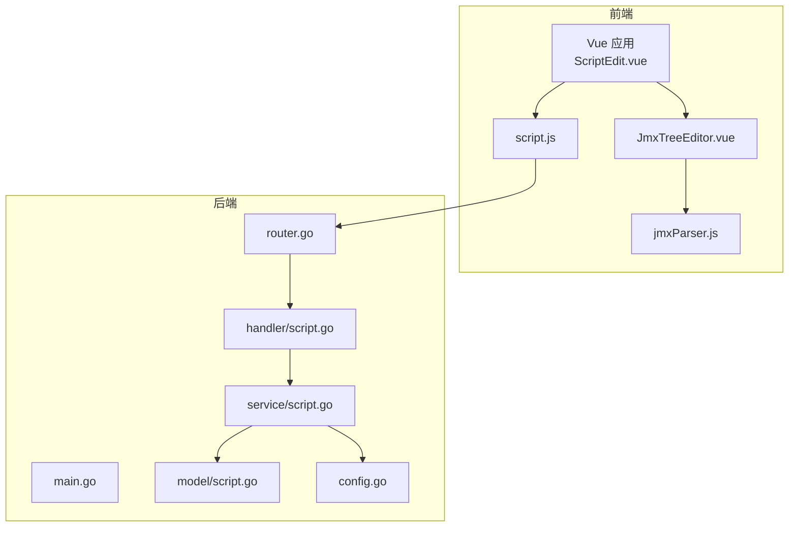
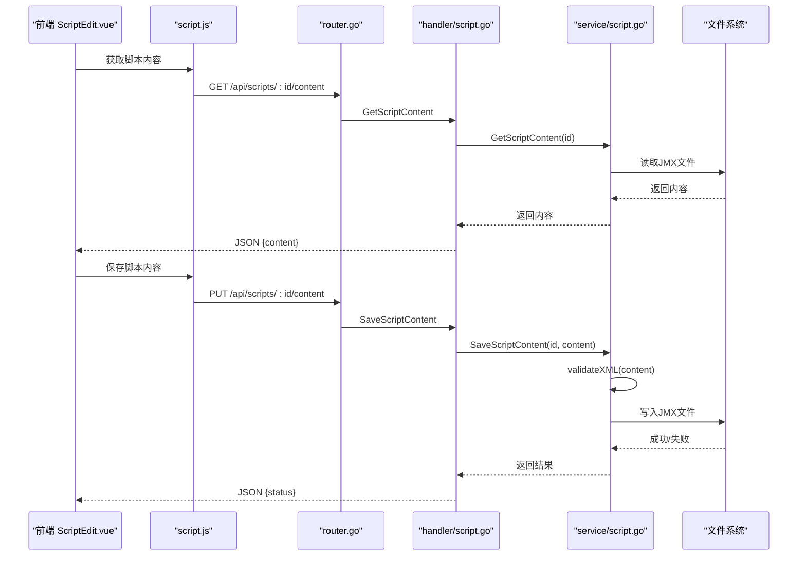
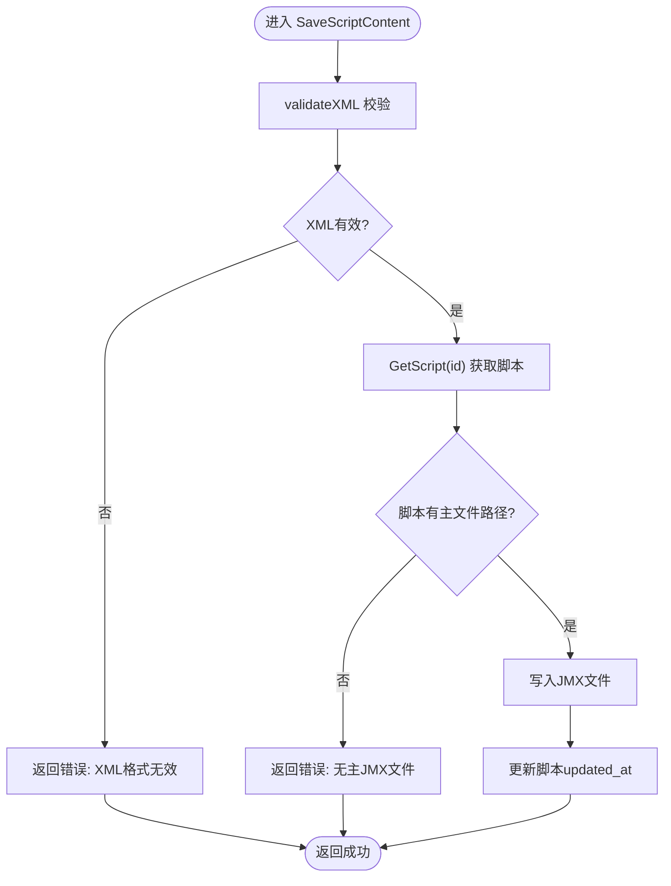
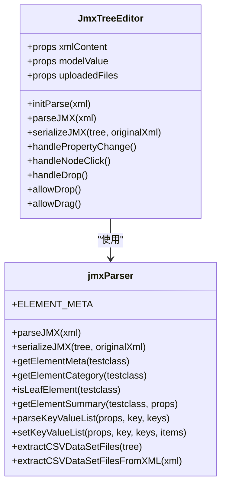
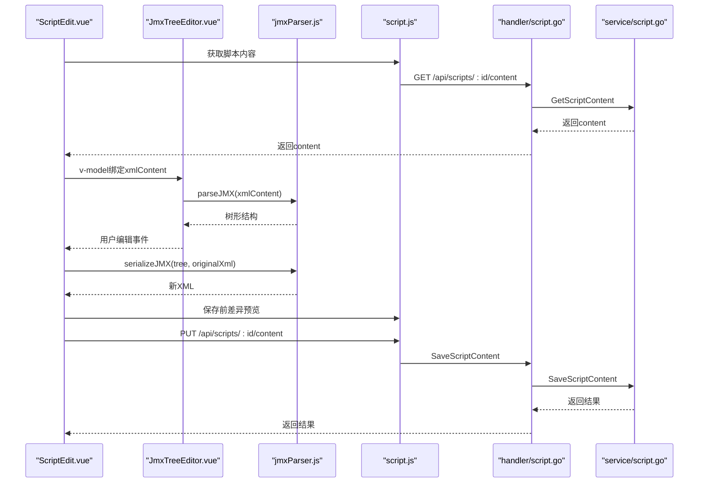
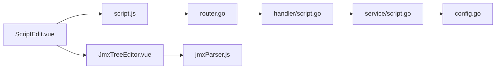

# JMX内容编辑

<cite>
**本文引用的文件**
- [main.go](file://main.go)
- [router.go](file://internal/router/router.go)
- [script.go](file://internal/handler/script.go)
- [script.go](file://internal/service/script.go)
- [script.js](file://web/src/api/script.js)
- [ScriptEdit.vue](file://web/src/views/ScriptEdit.vue)
- [JmxTreeEditor.vue](file://web/src/components/JmxTreeEditor.vue)
- [jmxParser.js](file://web/src/utils/jmxParser.js)
- [config.go](file://config/config.go)
- [script.go](file://internal/model/script.go)
</cite>

## 目录
1. [简介](#简介)
2. [项目结构](#项目结构)
3. [核心组件](#核心组件)
4. [架构总览](#架构总览)
5. [详细组件分析](#详细组件分析)
6. [依赖分析](#依赖分析)
7. [性能考量](#性能考量)
8. [故障排查指南](#故障排查指南)
9. [结论](#结论)
10. [附录](#附录)

## 简介
本文件围绕JMX内容编辑功能进行系统性技术文档梳理，重点覆盖：
- JMX文件内容读取(GetScriptContent)与保存(SaveScriptContent)机制
- XML格式验证(validateXML、IsValidXML)的实现原理与错误处理策略
- JMX文件的DOM解析与树形编辑器实现思路
- 前端JMX Tree Editor组件的功能特性与交互
- JMX格式化保存与回退机制
- XML解析器工作原理（命名空间、属性提取、节点遍历）
- 安全考虑（恶意内容过滤与格式验证）
- 完整API接口规范、前端组件使用示例与后端服务集成方案

## 项目结构
后端采用Go语言，前端采用Vue3 + Element Plus + Monaco Editor，通过Gin框架提供REST API；JMX编辑能力由前端JMX Tree Editor与后端解析/序列化工具共同完成。

图表来源
- [main.go:28-66](file://main.go#L28-L66)
- [router.go:14-112](file://internal/router/router.go#L14-L112)
- [script.go:196-238](file://internal/handler/script.go#L196-L238)
- [script.go:229-280](file://internal/service/script.go#L229-L280)
- [script.js:38-46](file://web/src/api/script.js#L38-L46)
- [ScriptEdit.vue:76-87](file://web/src/views/ScriptEdit.vue#L76-L87)
- [JmxTreeEditor.vue:1-120](file://web/src/components/JmxTreeEditor.vue#L1-L120)
- [jmxParser.js:1216-1285](file://web/src/utils/jmxParser.js#L1216-L1285)

章节来源
- [main.go:1-83](file://main.go#L1-L83)
- [router.go:14-112](file://internal/router/router.go#L14-L112)

## 核心组件
- 后端API层：提供脚本列表、创建、下载、获取/保存JMX内容、文件上传/删除等接口
- 业务服务层：负责JMX内容读取/保存、XML格式校验、文件存储与脚本关联
- 前端页面层：ScriptEdit.vue承载可视化编辑与XML源码编辑双模式，内置历史回退与差异预览
- 前端组件层：JmxTreeEditor.vue提供树形结构展示与属性编辑，jmxParser.js提供JMX解析/序列化与元数据定义
- 配置层：config.go提供服务端口、目录、JMeter路径等配置

章节来源
- [script.go:37-108](file://internal/handler/script.go#L37-L108)
- [script.go:229-280](file://internal/service/script.go#L229-L280)
- [script.js:3-74](file://web/src/api/script.js#L3-L74)
- [ScriptEdit.vue:1-80](file://web/src/views/ScriptEdit.vue#L1-L80)
- [JmxTreeEditor.vue:1-120](file://web/src/components/JmxTreeEditor.vue#L1-L120)
- [jmxParser.js:11-790](file://web/src/utils/jmxParser.js#L11-L790)
- [config.go:10-39](file://config/config.go#L10-L39)

## 架构总览
JMX内容编辑遵循“前端可视化/源码编辑 + 后端解析/校验/持久化”的分层设计。前端通过API与后端交互，后端负责安全校验与文件落盘，前端负责UI与用户体验。

图表来源
- [script.js:38-46](file://web/src/api/script.js#L38-L46)
- [router.go:20-36](file://internal/router/router.go#L20-L36)
- [script.go:196-238](file://internal/handler/script.go#L196-L238)
- [script.go:229-280](file://internal/service/script.go#L229-L280)

## 详细组件分析

### 后端：JMX内容读取与保存
- GetScriptContent
  - 作用：读取脚本主JMX文件内容并返回给前端
  - 实现要点：校验脚本存在与主文件路径，读取文件内容，返回字符串
- SaveScriptContent
  - 作用：保存JMX内容到文件，并进行XML格式校验
  - 实现要点：validateXML校验，写入文件，更新脚本更新时间

图表来源
- [script.go:251-280](file://internal/service/script.go#L251-L280)
- [script.go:282-297](file://internal/service/script.go#L282-L297)

章节来源
- [script.go:196-238](file://internal/handler/script.go#L196-L238)
- [script.go:229-280](file://internal/service/script.go#L229-L280)

### XML格式验证与错误处理
- validateXML
  - 原理：使用xml.Decoder逐令牌遍历，遇到EOF视为有效，否则返回错误
  - 适用场景：保存前的快速有效性检查
- IsValidXML
  - 原理：与validateXML类似，但返回布尔值，便于前端即时反馈
  - 适用场景：编辑器切换模式或属性变更时的轻量校验

章节来源
- [script.go:282-297](file://internal/service/script.go#L282-L297)
- [script.go:527-539](file://internal/service/script.go#L527-L539)

### 前端：JMX Tree Editor组件
- 功能特性
  - 树形展示：基于Element Plus Tree组件，支持节点展开/折叠、搜索过滤
  - 属性编辑：根据ELEMENT_META定义渲染不同类型的表单项（字符串、数值、布尔、选择、文本域、键值对列表、线程调度配置、字符串列表）
  - 交互操作：节点拖拽排序、上下移动、新增子/前后插入、复制、启用/禁用、删除
  - 原始XML回退：当元素类型无元数据定义时，显示原始XML文本框
- 数据流
  - 初始化：接收xmlContent或modelValue，调用parseJMX解析为树形结构
  - 编辑：属性变更触发handlePropertyChange，更新本地树节点
  - 序列化：通过serializeJMX将树结构回写到XML字符串，供保存

图表来源
- [JmxTreeEditor.vue:599-755](file://web/src/components/JmxTreeEditor.vue#L599-L755)
- [jmxParser.js:11-790](file://web/src/utils/jmxParser.js#L11-L790)
- [jmxParser.js:1216-1285](file://web/src/utils/jmxParser.js#L1216-L1285)
- [jmxParser.js:1728-1756](file://web/src/utils/jmxParser.js#L1728-L1756)

章节来源
- [JmxTreeEditor.vue:1-2400](file://web/src/components/JmxTreeEditor.vue#L1-L2400)
- [jmxParser.js:11-1949](file://web/src/utils/jmxParser.js#L11-L1949)

### 前端：ScriptEdit.vue页面与编辑流程
- 双编辑模式
  - 可视化编辑：JmxTreeEditor
  - XML源码编辑：Monaco Editor
- 历史回退与差异预览
  - 历史栈：记录编辑快照，支持撤销/重做
  - 差异预览：保存前对比原始与当前内容，展示差异统计与差异编辑器
- 文件面板
  - 关联文件管理：列出JMX与数据文件，支持上传、删除、标记引用状态
  - CSV引用检测：从XML中提取CSVDataSet引用文件名，提示缺失文件

图表来源
- [ScriptEdit.vue:535-704](file://web/src/views/ScriptEdit.vue#L535-L704)
- [JmxTreeEditor.vue:674-704](file://web/src/components/JmxTreeEditor.vue#L674-L704)
- [jmxParser.js:1728-1756](file://web/src/utils/jmxParser.js#L1728-L1756)
- [script.js:38-46](file://web/src/api/script.js#L38-L46)
- [script.go:215-238](file://internal/handler/script.go#L215-L238)
- [script.go:251-280](file://internal/service/script.go#L251-L280)

章节来源
- [ScriptEdit.vue:1-1592](file://web/src/views/ScriptEdit.vue#L1-L1592)
- [script.js:3-74](file://web/src/api/script.js#L3-L74)

### XML解析器工作原理
- DOM解析与校验
  - parseJMX：使用DOMParser解析XML，校验根元素为jmeterTestPlan，查找根hashTree，递归解析hashTree结构，生成树形节点数组
  - serializeJMX：基于原始XML文档结构，增量更新元素属性，重建hashTree子树，再序列化为字符串
- 属性提取与节点遍历
  - 支持stringProp/intProp/boolProp/longProp/floatProp/doubleProp等属性标签
  - elementProp与collectionProp的递归解析，支持嵌套对象与数组
  - 特殊处理：HTTPSampler的body属性（postBodyRaw与Arguments结构）
- 元数据驱动
  - ELEMENT_META定义各JMeter元素的标签、图标、摘要、属性定义与类型
  - 根据元数据渲染表单控件，支持键值对列表、线程调度配置、字符串列表等复杂类型

章节来源
- [jmxParser.js:1216-1285](file://web/src/utils/jmxParser.js#L1216-L1285)
- [jmxParser.js:1496-1720](file://web/src/utils/jmxParser.js#L1496-L1720)
- [jmxParser.js:1728-1756](file://web/src/utils/jmxParser.js#L1728-L1756)
- [jmxParser.js:11-790](file://web/src/utils/jmxParser.js#L11-L790)

### 安全考虑与恶意内容过滤
- 输入校验
  - 后端：保存前validateXML校验，避免非法XML写入
  - 前端：切换模式与属性变更时使用IsValidXML进行轻量校验
- 文件上传安全
  - 上传文件类型限制与大小限制
  - 文件名清理，防止路径穿越
- 命名空间与属性提取
  - 解析器严格依据JMeter XML结构，避免注入与越权
  - 对未知元素采用安全降级（原始XML显示）

章节来源
- [script.go:16-35](file://internal/handler/script.go#L16-L35)
- [script.go:240-302](file://internal/handler/script.go#L240-L302)
- [script.go:282-297](file://internal/service/script.go#L282-L297)
- [jmxParser.js:1216-1285](file://web/src/utils/jmxParser.js#L1216-L1285)

## 依赖分析
- 前后端接口契约
  - GET /api/scripts/:id/content -> 返回{content:string}
  - PUT /api/scripts/:id/content -> 请求体{content:string}
- 前端依赖
  - script.js封装API调用
  - ScriptEdit.vue协调编辑器与API
  - JmxTreeEditor.vue与jmxParser.js协作完成解析/序列化
- 配置与部署
  - config.go提供服务端口与目录配置
  - main.go初始化配置、数据库、路由与服务启动

图表来源
- [script.js:3-74](file://web/src/api/script.js#L3-L74)
- [router.go:14-112](file://internal/router/router.go#L14-112)
- [script.go:196-238](file://internal/handler/script.go#L196-L238)
- [script.go:229-280](file://internal/service/script.go#L229-L280)
- [config.go:43-84](file://config/config.go#L43-L84)
- [ScriptEdit.vue:76-87](file://web/src/views/ScriptEdit.vue#L76-L87)
- [JmxTreeEditor.vue:1-120](file://web/src/components/JmxTreeEditor.vue#L1-L120)
- [jmxParser.js:1216-1285](file://web/src/utils/jmxParser.js#L1216-L1285)

章节来源
- [script.js:3-74](file://web/src/api/script.js#L3-L74)
- [router.go:14-112](file://internal/router/router.go#L14-112)
- [config.go:43-84](file://config/config.go#L43-L84)

## 性能考量
- 前端
  - parseJMX/serializeJMX在大型JMX文件上可能产生较高CPU与内存开销，建议在大文件场景下：
    - 限制一次性编辑范围（按线程组拆分）
    - 使用Monaco Editor的增量更新与差异对比
    - 合理使用历史栈长度与防抖策略
- 后端
  - validateXML为线性扫描，适合中小规模JMX；对超大文件可考虑分块校验或异步任务
  - 文件I/O为瓶颈，建议结合文件系统缓存与合理的目录结构

## 故障排查指南
- 保存失败
  - 检查validateXML错误信息（XML格式无效）
  - 确认脚本主文件路径存在且可写
- 解析失败
  - parseJMX抛出“XML解析错误”或“无效的JMX文件”，检查XML结构与根元素
- 前端切换模式报错
  - 确保当前内容为合法XML，使用IsValidXML先行校验
- 文件上传异常
  - 检查文件类型与大小限制，确认文件名清理逻辑生效

章节来源
- [script.go:251-280](file://internal/service/script.go#L251-L280)
- [jmxParser.js:1216-1285](file://web/src/utils/jmxParser.js#L1216-L1285)
- [script.go:16-35](file://internal/handler/script.go#L16-L35)

## 结论
本项目通过前后端协同实现了JMX内容的读取、校验、可视化编辑与保存。后端提供可靠的XML格式校验与文件落盘，前端提供直观的树形编辑体验与差异预览。通过元数据驱动的表单渲染与增量序列化，既保证了编辑效率，也确保了JMX结构的正确性与安全性。

## 附录

### API接口规范
- 获取脚本内容
  - 方法：GET
  - 路径：/api/scripts/:id/content
  - 响应：{content: string}
- 保存脚本内容
  - 方法：PUT
  - 路径：/api/scripts/:id/content
  - 请求体：{content: string}
  - 响应：{status: string}

章节来源
- [script.js:38-46](file://web/src/api/script.js#L38-L46)
- [script.go:196-238](file://internal/handler/script.go#L196-L238)

### 前端组件使用示例
- ScriptEdit.vue
  - 双编辑模式：可视化编辑与XML源码编辑
  - 历史回退：撤销/重做，支持防抖与历史栈长度限制
  - 差异预览：保存前对比原始与当前内容
- JmxTreeEditor.vue
  - 树形展示与属性编辑
  - 节点拖拽、上下移动、新增/删除、启用/禁用
  - 元数据驱动的表单渲染与原始XML回退

章节来源
- [ScriptEdit.vue:1-1592](file://web/src/views/ScriptEdit.vue#L1-L1592)
- [JmxTreeEditor.vue:1-2400](file://web/src/components/JmxTreeEditor.vue#L1-L2400)

### 后端服务集成方案
- 路由注册：router.go中已注册脚本相关路由
- 配置加载：config.go提供默认配置与加载逻辑
- 服务启动：main.go中初始化配置、数据库、路由并启动HTTP服务

章节来源
- [router.go:14-112](file://internal/router/router.go#L14-112)
- [config.go:43-84](file://config/config.go#L43-L84)
- [main.go:28-66](file://main.go#L28-66)