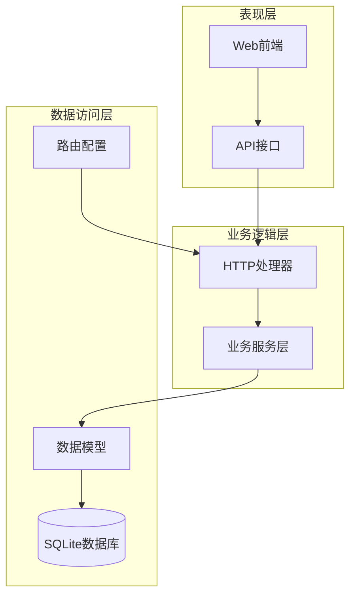
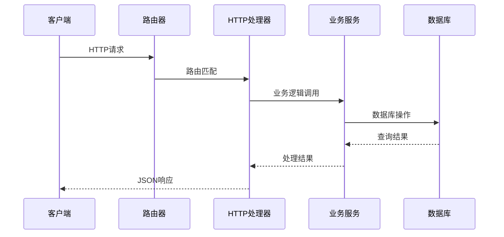
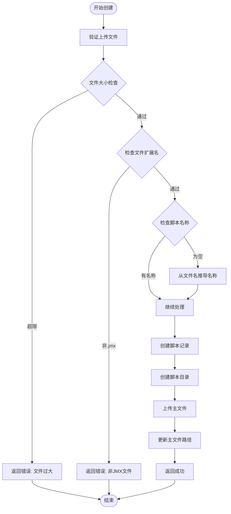
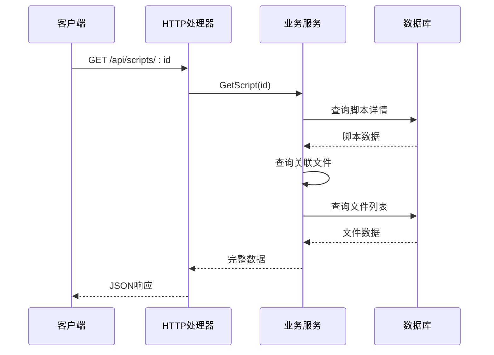
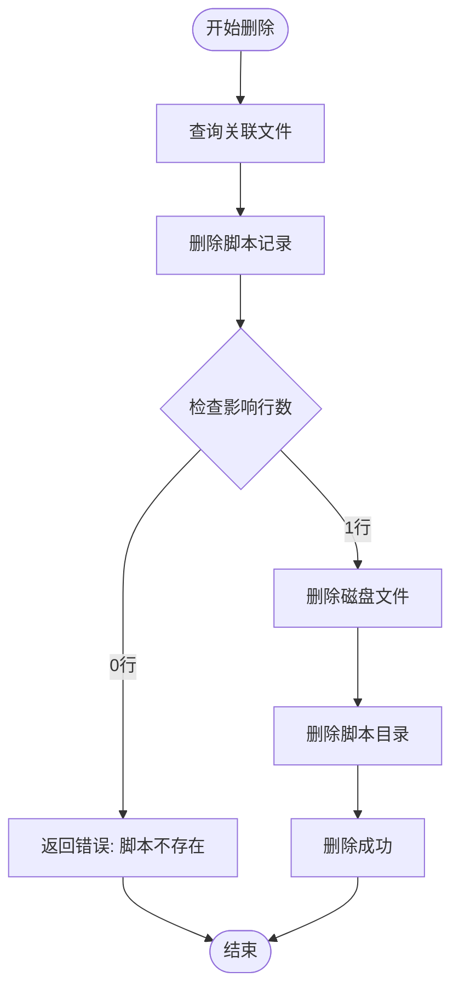
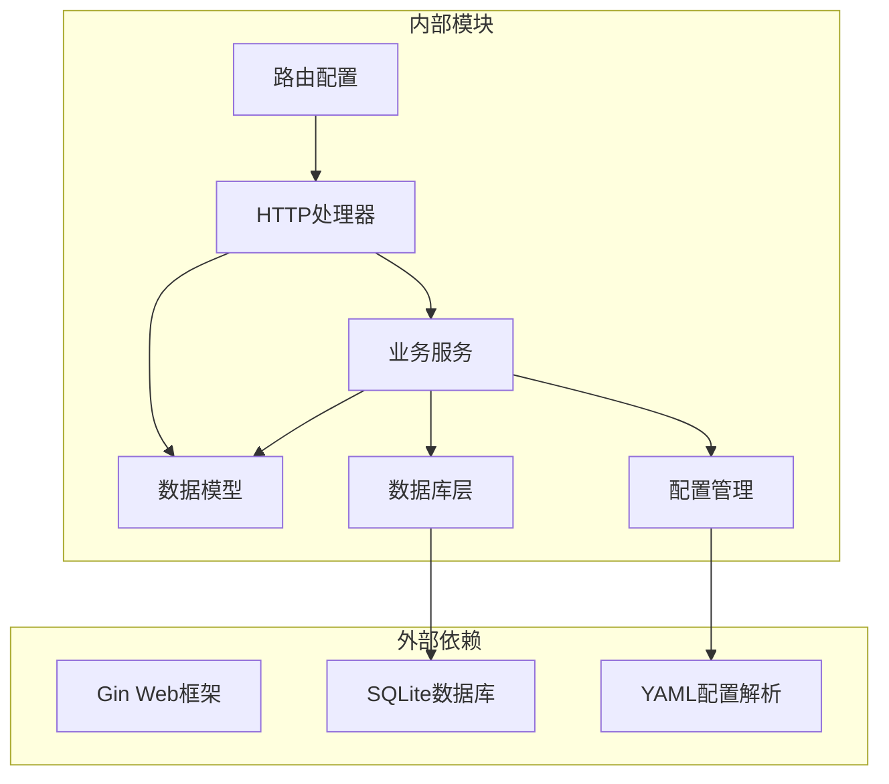

# 脚本CRUD操作

<cite>
**本文档引用的文件**
- [internal/handler/script.go](file://internal/handler/script.go)
- [internal/service/script.go](file://internal/service/script.go)
- [internal/model/script.go](file://internal/model/script.go)
- [internal/router/router.go](file://internal/router/router.go)
- [internal/database/db.go](file://internal/database/db.go)
- [internal/model/response.go](file://internal/model/response.go)
- [config/config.go](file://config/config.go)
- [config.yaml](file://config.yaml)
- [web/src/api/script.js](file://web/src/api/script.js)
- [web/src/views/ScriptList.vue](file://web/src/views/ScriptList.vue)
</cite>

## 目录
1. [简介](#简介)
2. [项目结构](#项目结构)
3. [核心组件](#核心组件)
4. [架构概览](#架构概览)
5. [详细组件分析](#详细组件分析)
6. [依赖关系分析](#依赖关系分析)
7. [性能考虑](#性能考虑)
8. [故障排除指南](#故障排除指南)
9. [结论](#结论)
10. [附录](#附录)

## 简介

本文档详细说明了JMeter Admin系统中脚本CRUD操作的完整实现，包括创建(Create)、读取(Retrieve)、更新(Update)、删除(Delete)四个核心操作。系统基于Go语言开发，采用SQLite作为数据存储，支持脚本文件的上传、管理和执行。

## 项目结构

系统采用典型的三层架构设计，主要分为以下层次：



**图表来源**
- [internal/handler/script.go:1-327](file://internal/handler/script.go#L1-L327)
- [internal/service/script.go:1-540](file://internal/service/script.go#L1-L540)
- [internal/router/router.go:14-129](file://internal/router/router.go#L14-L129)

**章节来源**
- [internal/handler/script.go:1-327](file://internal/handler/script.go#L1-L327)
- [internal/service/script.go:1-540](file://internal/service/script.go#L1-L540)
- [internal/router/router.go:14-129](file://internal/router/router.go#L14-L129)

## 核心组件

系统的核心组件包括：

### 数据模型
- **Script**: 脚本基本信息模型，包含ID、名称、描述、文件路径等字段
- **ScriptFile**: 脚本文件关联模型，管理脚本相关的所有文件

### 业务服务
- **ListScripts**: 分页查询脚本列表，支持关键词搜索
- **CreateScript**: 创建新脚本记录并生成目录结构
- **GetScript**: 获取单个脚本详情
- **UpdateScript**: 更新脚本信息
- **DeleteScript**: 删除脚本及其关联资源

### HTTP处理器
- **ListScripts**: 处理分页查询请求
- **CreateScript**: 处理脚本创建请求
- **GetScript**: 处理单条查询请求
- **UpdateScript**: 处理更新请求
- **DeleteScript**: 处理删除请求

**章节来源**
- [internal/model/script.go:1-23](file://internal/model/script.go#L1-L23)
- [internal/service/script.go:18-83](file://internal/service/script.go#L18-L83)
- [internal/handler/script.go:37-194](file://internal/handler/script.go#L37-L194)

## 架构概览

系统采用RESTful API设计，所有脚本操作通过统一的路由前缀`/api/scripts`进行访问：



**图表来源**
- [internal/router/router.go:24-36](file://internal/router/router.go#L24-L36)
- [internal/handler/script.go:37-194](file://internal/handler/script.go#L37-L194)
- [internal/service/script.go:18-83](file://internal/service/script.go#L18-L83)

## 详细组件分析

### ListScripts 分页查询功能

ListScripts实现了完整的分页查询功能，支持关键词模糊搜索和排序规则：

#### API接口规范
- **URL**: `/api/scripts`
- **方法**: GET
- **参数**:
  - `page`: 页码，默认1
  - `page_size`: 每页大小，默认10
  - `keyword`: 模糊搜索关键词

#### SQL查询实现
```sql
-- 总数查询
SELECT COUNT(*) FROM scripts s WHERE s.name LIKE ?

-- 列表查询
SELECT s.id, s.name, s.description, s.file_path, 
       COALESCE((SELECT sf.file_name FROM script_files sf WHERE sf.script_id = s.id AND sf.file_type = 'jmx' ORDER BY sf.created_at DESC LIMIT 1), '') AS file_name,
       (SELECT COUNT(*) FROM script_files sf_count WHERE sf_count.script_id = s.id) AS file_count,
       s.created_at, s.updated_at
FROM scripts s ORDER BY s.created_at DESC LIMIT ? OFFSET ?
```

#### 错误处理机制
- 参数验证：确保page和page_size为正数
- SQL注入防护：使用参数化查询，避免字符串拼接
- 模糊搜索：使用LIKE操作符配合通配符%

#### 返回值格式
```json
{
  "code": 0,
  "message": "success",
  "data": {
    "total": 100,
    "list": [
      {
        "id": 1,
        "name": "测试脚本",
        "description": "性能测试脚本",
        "file_path": "",
        "file_name": "demo.jmx",
        "file_count": 3,
        "created_at": "2024-01-01 12:00:00",
        "updated_at": "2024-01-01 12:00:00"
      }
    ]
  }
}
```

**章节来源**
- [internal/handler/script.go:37-50](file://internal/handler/script.go#L37-L50)
- [internal/service/script.go:18-83](file://internal/service/script.go#L18-L83)

### CreateScript 脚本创建流程

CreateScript负责创建新的脚本记录并自动生成脚本目录结构：

#### API接口规范
- **URL**: `/api/scripts`
- **方法**: POST
- **内容类型**: multipart/form-data
- **表单字段**:
  - `name`: 脚本名称（可选）
  - `description`: 脚本描述（可选）
  - `file`: .jmx主文件（必需）

#### 创建流程图


**图表来源**
- [internal/handler/script.go:52-108](file://internal/handler/script.go#L52-L108)
- [internal/service/script.go:85-116](file://internal/service/script.go#L85-L116)

#### 目录结构生成
系统为每个脚本创建独立的存储目录：
```
./uploads/
└── {script_id}/
    ├── {original_filename}.jmx
    └── [其他关联文件...]
```

#### 错误处理策略
- 文件大小限制：单文件不超过100MB，总和不超过500MB
- 路径穿越防护：使用安全文件名清理函数
- 原子性保证：创建失败时自动回滚数据库记录

**章节来源**
- [internal/handler/script.go:52-108](file://internal/handler/script.go#L52-L108)
- [internal/service/script.go:85-116](file://internal/service/script.go#L85-L116)

### GetScript 单条查询实现

GetScript提供脚本的详细信息查询，包括关联文件列表：

#### API接口规范
- **URL**: `/api/scripts/:id`
- **方法**: GET
- **路径参数**: `id` - 脚本ID

#### 查询流程


**图表来源**
- [internal/handler/script.go:127-152](file://internal/handler/script.go#L127-L152)
- [internal/service/script.go:118-134](file://internal/service/script.go#L118-L134)

#### 返回数据结构
```json
{
  "code": 0,
  "message": "success",
  "data": {
    "script": {
      "id": 1,
      "name": "测试脚本",
      "description": "性能测试脚本",
      "file_path": "./uploads/1/demo.jmx",
      "file_name": "demo.jmx",
      "file_count": 3,
      "created_at": "2024-01-01 12:00:00",
      "updated_at": "2024-01-01 12:00:00"
    },
    "files": [
      {
        "id": 1,
        "script_id": 1,
        "file_name": "demo.jmx",
        "file_path": "./uploads/1/demo.jmx",
        "file_type": "jmx",
        "created_at": "2024-01-01 12:00:00",
        "updated_at": "2024-01-01 12:00:00"
      }
    ]
  }
}
```

**章节来源**
- [internal/handler/script.go:127-152](file://internal/handler/script.go#L127-L152)
- [internal/service/script.go:118-134](file://internal/service/script.go#L118-L134)

### UpdateScript 字段更新机制

UpdateScript提供脚本信息的更新功能，包含时间戳更新策略：

#### API接口规范
- **URL**: `/api/scripts/:id`
- **方法**: PUT
- **路径参数**: `id` - 脚本ID
- **请求体**: JSON对象
  ```json
  {
    "name": "新名称",
    "description": "新描述"
  }
  ```

#### 更新策略
- **字段更新**: 支持名称和描述字段的更新
- **时间戳策略**: 自动更新`updated_at`字段为当前时间
- **原子性**: 使用单条SQL语句完成更新操作

#### 错误处理
- ID验证：确保ID为有效数字
- 存在性检查：如果脚本不存在，返回相应错误
- 参数绑定：使用Gin框架的参数验证机制

**章节来源**
- [internal/handler/script.go:154-178](file://internal/handler/script.go#L154-L178)
- [internal/service/script.go:157-177](file://internal/service/script.go#L157-L177)

### DeleteScript 级联删除逻辑

DeleteScript实现了完整的级联删除机制，确保数据一致性：

#### API接口规范
- **URL**: `/api/scripts/:id`
- **方法**: DELETE
- **路径参数**: `id` - 脚本ID

#### 级联删除流程


**图表来源**
- [internal/handler/script.go:180-194](file://internal/handler/script.go#L180-L194)
- [internal/service/script.go:179-227](file://internal/service/script.go#L179-L227)

#### 删除策略
- **数据库层面**: 使用外键约束的CASCADE删除
- **文件系统层面**: 删除所有关联文件和脚本目录
- **原子性**: 删除失败时记录错误但不中断整体流程

#### 安全措施
- **文件路径验证**: 确保删除的文件属于目标脚本
- **权限检查**: 验证用户对脚本的删除权限
- **日志记录**: 记录删除操作的详细信息

**章节来源**
- [internal/handler/script.go:180-194](file://internal/handler/script.go#L180-L194)
- [internal/service/script.go:179-227](file://internal/service/script.go#L179-L227)

## 依赖关系分析

系统采用清晰的依赖层次结构：



**图表来源**
- [internal/handler/script.go:3-14](file://internal/handler/script.go#L3-L14)
- [internal/service/script.go:3-16](file://internal/service/script.go#L3-L16)
- [internal/router/router.go:3-12](file://internal/router/router.go#L3-L12)

### 关键依赖关系

1. **路由到处理器**: 路由器将HTTP请求映射到相应的处理器函数
2. **处理器到服务**: HTTP处理器调用业务服务层执行具体逻辑
3. **服务到数据库**: 业务服务通过数据库层访问SQLite数据库
4. **配置到文件系统**: 配置模块管理文件系统路径和存储位置

**章节来源**
- [internal/router/router.go:24-36](file://internal/router/router.go#L24-L36)
- [internal/handler/script.go:37-194](file://internal/handler/script.go#L37-L194)
- [internal/service/script.go:1-16](file://internal/service/script.go#L1-L16)

## 性能考虑

### 数据库优化
- **索引策略**: 在`script_files.script_id`上建立索引，提高查询性能
- **查询优化**: 使用LIMIT和OFFSET实现高效的分页查询
- **连接池**: SQLite默认支持连接池，适合高并发场景

### 文件系统优化
- **目录结构**: 采用扁平化的目录结构，减少文件系统层级
- **缓存策略**: 对常用查询结果进行内存缓存
- **异步处理**: 大文件上传采用异步处理机制

### 网络传输优化
- **压缩传输**: 对大文件采用压缩传输
- **断点续传**: 支持大文件的断点续传功能
- **并发控制**: 限制同时上传的文件数量

## 故障排除指南

### 常见错误及解决方案

#### 文件上传失败
**问题**: 上传的文件超过大小限制
**原因**: 单文件超过100MB或总和超过500MB
**解决方案**: 
- 检查文件大小限制
- 分割大文件或使用压缩技术
- 调整配置文件中的大小限制

#### 路径穿越攻击防护
**问题**: 文件名包含路径遍历字符
**解决方案**:
- 系统已内置路径清理函数
- 确保上传文件名经过安全处理
- 定期检查上传目录的安全性

#### 数据库连接问题
**问题**: SQLite数据库连接失败
**解决方案**:
- 检查数据库文件权限
- 验证数据库文件完整性
- 确认磁盘空间充足

**章节来源**
- [internal/handler/script.go:22-35](file://internal/handler/script.go#L22-L35)
- [internal/service/script.go:180-227](file://internal/service/script.go#L180-L227)

## 结论

JMeter Admin系统的脚本CRUD操作实现了完整的功能覆盖，具有以下特点：

1. **安全性**: 内置多种安全防护机制，包括SQL注入防护、路径穿越防护等
2. **可靠性**: 采用事务性和原子性设计，确保数据一致性
3. **可扩展性**: 模块化设计便于功能扩展和维护
4. **易用性**: 提供完整的API接口和前端集成

系统通过合理的架构设计和完善的错误处理机制，为用户提供了一个稳定可靠的脚本管理平台。

## 附录

### API接口完整列表

| 接口 | 方法 | URL | 功能 |
|------|------|-----|------|
| 列表查询 | GET | `/api/scripts` | 分页查询脚本列表 |
| 创建脚本 | POST | `/api/scripts` | 创建新脚本 |
| 获取详情 | GET | `/api/scripts/:id` | 获取脚本详情 |
| 更新脚本 | PUT | `/api/scripts/:id` | 更新脚本信息 |
| 删除脚本 | DELETE | `/api/scripts/:id` | 删除脚本 |
| 下载脚本 | GET | `/api/scripts/:id/download` | 下载主文件 |
| 获取内容 | GET | `/api/scripts/:id/content` | 获取JMX内容 |
| 保存内容 | PUT | `/api/scripts/:id/content` | 保存JMX内容 |
| 上传文件 | POST | `/api/scripts/:id/files` | 上传关联文件 |
| 删除文件 | DELETE | `/api/scripts/:id/files/:fileId` | 删除关联文件 |

### 配置文件说明

系统使用YAML格式的配置文件，主要配置项包括：

- **server.port**: HTTP服务监听端口（默认8080）
- **dirs.data**: SQLite数据库文件存储目录（默认./data）
- **dirs.uploads**: 脚本文件上传目录（默认./uploads）
- **dirs.results**: 执行结果存储目录（默认./results）

**章节来源**
- [config/config.go:10-41](file://config/config.go#L10-L41)
- [config.yaml:1-26](file://config.yaml#L1-L26)