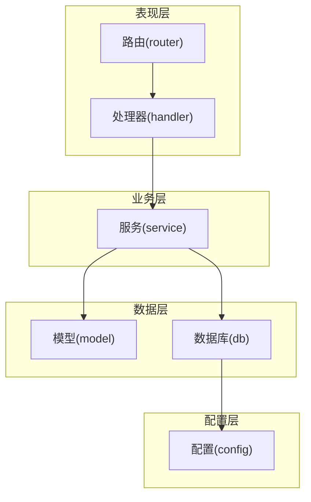
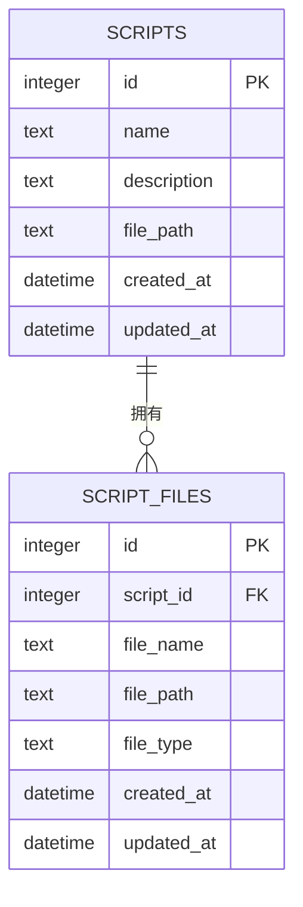
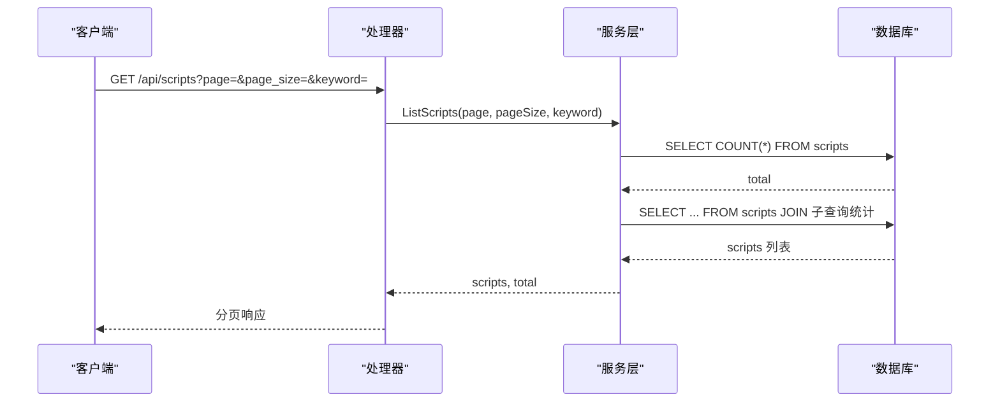
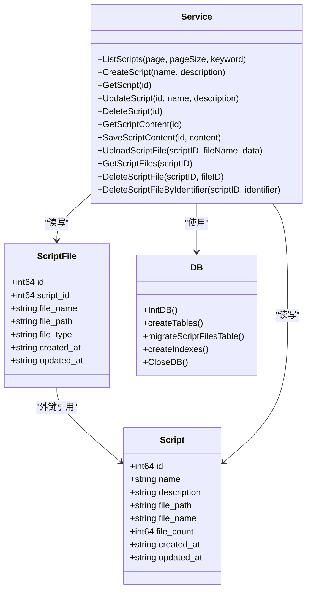

# 脚本数据模型

<cite>
**本文引用的文件**
- [internal/model/script.go](file://internal/model/script.go)
- [internal/service/script.go](file://internal/service/script.go)
- [internal/handler/script.go](file://internal/handler/script.go)
- [internal/database/db.go](file://internal/database/db.go)
- [internal/router/router.go](file://internal/router/router.go)
- [internal/model/response.go](file://internal/model/response.go)
- [config/config.go](file://config/config.go)
</cite>

## 目录
1. [简介](#简介)
2. [项目结构](#项目结构)
3. [核心组件](#核心组件)
4. [架构概览](#架构概览)
5. [详细组件分析](#详细组件分析)
6. [依赖分析](#依赖分析)
7. [性能考量](#性能考量)
8. [故障排查指南](#故障排查指南)
9. [结论](#结论)
10. [附录](#附录)

## 简介
本文件聚焦于“脚本数据模型”的设计与实现，围绕 scripts 表与 script_files 表展开，系统性说明：
- 字段定义与业务语义
- 外键关系与级联删除策略
- 索引设计与性能优化
- 数据访问模式（关联查询、聚合统计、分页）
- ER 关系图与实体间一对多映射
- 数据迁移、备份恢复与完整性保障
- 与业务需求的对应关系与扩展性设计

## 项目结构
该系统采用分层架构：路由层负责HTTP接口编排，处理器层处理请求与响应封装，服务层实现业务逻辑，数据库层负责SQLite初始化、表结构与索引维护，模型层定义数据结构。

图表来源
- [internal/router/router.go:14-112](file://internal/router/router.go#L14-L112)
- [internal/handler/script.go:1-327](file://internal/handler/script.go#L1-L327)
- [internal/service/script.go:1-540](file://internal/service/script.go#L1-L540)
- [internal/database/db.go:15-196](file://internal/database/db.go#L15-L196)
- [config/config.go:41-113](file://config/config.go#L41-L113)

章节来源
- [internal/router/router.go:14-112](file://internal/router/router.go#L14-L112)
- [internal/handler/script.go:1-327](file://internal/handler/script.go#L1-L327)
- [internal/service/script.go:1-540](file://internal/service/script.go#L1-L540)
- [internal/database/db.go:15-196](file://internal/database/db.go#L15-L196)
- [config/config.go:41-113](file://config/config.go#L41-L113)

## 核心组件
- 模型层：定义脚本与脚本文件的数据结构，用于序列化/反序列化与数据库映射。
- 服务层：实现脚本与文件的增删改查、分页、聚合统计、文件上传/下载、XML校验等业务逻辑。
- 数据库层：初始化SQLite、创建表与索引、执行迁移、关闭连接。
- 路由与处理器：暴露REST API，绑定参数与验证，调用服务层并返回统一响应格式。

章节来源
- [internal/model/script.go:3-22](file://internal/model/script.go#L3-L22)
- [internal/service/script.go:18-83](file://internal/service/script.go#L18-L83)
- [internal/database/db.go:36-124](file://internal/database/db.go#L36-L124)
- [internal/handler/script.go:37-327](file://internal/handler/script.go#L37-L327)

## 架构概览
脚本数据模型的核心是“脚本”与“脚本文件”的一对多关系：一个脚本可拥有多个文件（主JMX文件与附属资源文件）。系统通过外键约束与级联删除策略确保数据一致性；通过索引提升查询性能；通过迁移机制平滑演进表结构。

图表来源
- [internal/database/db.go:38-64](file://internal/database/db.go#L38-L64)
- [internal/model/script.go:3-22](file://internal/model/script.go#L3-L22)

## 详细组件分析

### 数据表设计与字段语义

#### scripts 表
- 字段
  - id：自增主键
  - name：脚本名称（非空）
  - description：描述（可空）
  - file_path：主JMX文件的绝对路径（用于快速定位主文件）
  - created_at / updated_at：时间戳
- 约束
  - 主键约束（自增）
  - name、file_path 非空
- 业务含义
  - 记录脚本元信息与主文件路径，便于快速下载与编辑
  - file_path 由上传JMX文件时自动维护

章节来源
- [internal/database/db.go:38-46](file://internal/database/db.go#L38-L46)
- [internal/model/script.go:3-12](file://internal/model/script.go#L3-L12)
- [internal/service/script.go:350-356](file://internal/service/script.go#L350-L356)

#### script_files 表
- 字段
  - id：自增主键
  - script_id：外键，指向 scripts.id
  - file_name：文件名
  - file_path：文件在磁盘上的绝对路径
  - file_type：文件类型（jmx/csv/json/txt/properties/xml/yaml/jar/other）
  - created_at / updated_at：时间戳
- 约束
  - 主键约束（自增）
  - 外键约束：ON DELETE CASCADE（见下节）
- 业务含义
  - 存储脚本关联的所有文件及其类型，支持多文件管理
  - file_type 用于区分主JMX与附属资源文件

章节来源
- [internal/database/db.go:52-64](file://internal/database/db.go#L52-L64)
- [internal/model/script.go:14-22](file://internal/model/script.go#L14-L22)
- [internal/service/script.go:362-384](file://internal/service/script.go#L362-L384)

### 外键关系与级联删除策略
- 外键定义
  - script_files.script_id 引用 scripts.id
- 级联删除
  - 在创建 script_files 表时显式声明：ON DELETE CASCADE
  - 删除 scripts 记录时，script_files 中对应记录会被自动清理
- 业务影响
  - 删除脚本即删除其全部文件记录，避免悬挂数据
  - 上传文件时无需手动维护文件记录的生命周期

章节来源
- [internal/database/db.go:60](file://internal/database/db.go#L60)
- [internal/service/script.go:197-227](file://internal/service/script.go#L197-L227)

### 数据库索引设计与性能优化
- 已创建索引
  - idx_executions_script_id：加速 executions 表按脚本ID查询
  - idx_executions_status：加速按状态查询
  - idx_executions_created_at：按时间倒序排序
  - idx_script_files_script_id：加速按脚本ID查询文件列表
- 性能考量
  - script_files 表按 script_id 排序查询，适合分页展示
  - scripts 列表查询中使用 created_at 倒序，结合分页LIMIT/OFFSET
  - 模糊搜索 keyword 使用 LIKE，建议在高并发场景评估全文检索或更高效匹配策略

章节来源
- [internal/database/db.go:174-189](file://internal/database/db.go#L174-L189)
- [internal/service/script.go:18-83](file://internal/service/script.go#L18-L83)

### 数据访问模式

#### 分页查询（脚本列表）
- 查询逻辑
  - 支持 keyword 模糊搜索（按 name）
  - 聚合统计：COUNT(*) 获取总数
  - 关联查询：子查询获取最近一次JMX文件名，统计文件数量
  - 排序：按 created_at 倒序
  - 分页：LIMIT pageSize OFFSET (page-1)*pageSize
- 返回结构
  - 包含 total 与 list 的分页响应

图表来源
- [internal/handler/script.go:37-50](file://internal/handler/script.go#L37-L50)
- [internal/service/script.go:18-83](file://internal/service/script.go#L18-L83)

章节来源
- [internal/handler/script.go:37-50](file://internal/handler/script.go#L37-L50)
- [internal/service/script.go:18-83](file://internal/service/script.go#L18-L83)

#### 关联查询（脚本详情）
- 查询逻辑
  - 获取脚本基本信息
  - 获取该脚本关联的所有文件列表（按创建时间倒序）
- 返回结构
  - 同时返回 script 与 files

章节来源
- [internal/handler/script.go:127-152](file://internal/handler/script.go#L127-L152)
- [internal/service/script.go:491-525](file://internal/service/script.go#L491-L525)

#### 聚合统计（文件数量）
- 查询逻辑
  - 使用子查询统计每个脚本的文件数量
  - 使用 COALESCE 获取最近一次JMX文件名
- 性能建议
  - 若脚本数量大，可考虑在 scripts 表新增 file_count 字段并由服务层维护，减少子查询开销

章节来源
- [internal/service/script.go:44-83](file://internal/service/script.go#L44-L83)

#### 文件上传与主文件维护
- 流程
  - 上传文件写入磁盘与 script_files 表
  - 若文件类型为 jmx，更新 scripts.file_path
- 错误回滚
  - 写入磁盘失败时回滚已写入的文件记录

章节来源
- [internal/service/script.go:299-359](file://internal/service/script.go#L299-L359)

#### 文件删除（支持ID或文件名）
- 流程
  - 支持按ID或文件名删除
  - 删除数据库记录后删除磁盘文件
  - 若删除的是主JMX文件，清空 scripts.file_path

章节来源
- [internal/service/script.go:386-489](file://internal/service/script.go#L386-L489)

### API 与数据模型映射
- 路由与处理器
  - 列表、创建、详情、更新、删除、下载、内容读取/保存、文件上传/删除
- 统一响应
  - 成功与失败均返回统一结构，分页响应包含 total 与 list

章节来源
- [internal/router/router.go:20-75](file://internal/router/router.go#L20-L75)
- [internal/handler/script.go:37-327](file://internal/handler/script.go#L37-L327)
- [internal/model/response.go:14-45](file://internal/model/response.go#L14-L45)

## 依赖分析

图表来源
- [internal/model/script.go:3-22](file://internal/model/script.go#L3-L22)
- [internal/database/db.go:36-124](file://internal/database/db.go#L36-L124)
- [internal/service/script.go:18-540](file://internal/service/script.go#L18-L540)

章节来源
- [internal/model/script.go:3-22](file://internal/model/script.go#L3-L22)
- [internal/database/db.go:36-124](file://internal/database/db.go#L36-L124)
- [internal/service/script.go:18-540](file://internal/service/script.go#L18-L540)

## 性能考量
- 查询性能
  - script_files.script_id 上的索引支持按脚本ID高效查询
  - scripts 列表按 created_at 倒序，结合分页LIMIT/OFFSET
- 写入性能
  - SQLite写入顺序：磁盘写入 -> 数据库插入 -> 主JMX文件路径更新
  - 大批量上传建议控制单次请求文件数量与总大小
- 缓存与聚合
  - 可考虑在 scripts 表增加 file_count 字段，由服务层维护，减少子查询
- 并发与锁
  - SQLite在高并发写入场景可能成为瓶颈，建议评估分库或引入更高性能存储

[本节为通用性能建议，不直接分析具体文件]

## 故障排查指南
- 数据库初始化失败
  - 检查数据目录权限与路径配置
  - 确认 SQLite 驱动可用
- 表创建/索引失败
  - 检查数据库连接与权限
  - 确认迁移脚本未被阻断
- 删除脚本后文件仍存在
  - 确认外键级联删除生效
  - 检查删除流程是否正确执行
- 文件上传失败
  - 检查磁盘空间与目录权限
  - 确认文件类型识别与命名安全处理
- 下载/读取JMX失败
  - 检查 scripts.file_path 是否正确更新
  - 确认文件存在且可读

章节来源
- [internal/database/db.go:15-34](file://internal/database/db.go#L15-L34)
- [internal/service/script.go:179-227](file://internal/service/script.go#L179-L227)
- [internal/service/script.go:299-359](file://internal/service/script.go#L299-L359)
- [internal/service/script.go:136-155](file://internal/service/script.go#L136-L155)

## 结论
脚本数据模型通过清晰的表结构、外键约束与索引设计，实现了脚本与其文件的一对多管理，并提供了完善的增删改查与分页聚合能力。通过迁移机制与统一响应格式，系统具备良好的可维护性与扩展性。建议在高并发场景下进一步优化聚合统计与写入路径，并评估存储层升级以满足更大规模的业务需求。

[本节为总结性内容，不直接分析具体文件]

## 附录

### 数据模型与业务需求对应关系
- 脚本元信息与主文件路径：支撑脚本的快速下载与编辑
- 多文件管理：支持JMX与CSV、配置、报告等资源文件的统一管理
- 分页与搜索：满足脚本列表的高效浏览与检索
- 完整性保障：外键级联删除与磁盘文件同步删除，避免数据漂移

章节来源
- [internal/model/script.go:3-22](file://internal/model/script.go#L3-L22)
- [internal/service/script.go:18-83](file://internal/service/script.go#L18-L83)
- [internal/service/script.go:179-227](file://internal/service/script.go#L179-L227)

### 数据迁移策略
- 初始化阶段
  - 创建 scripts、script_files、slaves、executions 表
  - 添加索引
- 运行期迁移
  - executions 表：动态添加 duration、remarks 列
  - script_files 表：动态添加 updated_at 列
  - slaves 表：动态添加 last_check_time 列
- 迁移幂等
  - 通过查询 pragma_table_info 判断列是否存在，避免重复添加

章节来源
- [internal/database/db.go:36-124](file://internal/database/db.go#L36-L124)
- [internal/database/db.go:126-171](file://internal/database/db.go#L126-L171)

### 备份与恢复方案
- 备份
  - 直接复制 SQLite 数据库文件（jmeter-admin.db）进行备份
  - 建议在应用停止或数据库空闲时执行备份
- 恢复
  - 停止服务，替换数据库文件，启动服务
- 注意事项
  - 确保备份文件包含 uploads 目录下的脚本文件，以便恢复后文件可用
  - 恢复后检查 scripts.file_path 与磁盘路径一致性

[本节为通用方案说明，不直接分析具体文件]

### 数据完整性保证措施
- 外键约束与级联删除：删除脚本自动清理文件记录
- 事务与回滚：上传失败时回滚磁盘写入
- 参数校验与安全：文件名清理、大小限制、类型识别
- 时间戳维护：created_at/updated_at 自动更新

章节来源
- [internal/database/db.go:60](file://internal/database/db.go#L60)
- [internal/service/script.go:340-348](file://internal/service/script.go#L340-L348)
- [internal/handler/script.go:22-35](file://internal/handler/script.go#L22-L35)