# 脚本文件管理

<cite>
**本文档引用的文件**
- [internal/handler/script.go](file://internal/handler/script.go)
- [internal/service/script.go](file://internal/service/script.go)
- [internal/model/script.go](file://internal/model/script.go)
- [internal/router/router.go](file://internal/router/router.go)
- [internal/database/db.go](file://internal/database/db.go)
- [config/config.go](file://config/config.go)
- [web/src/api/script.js](file://web/src/api/script.js)
- [web/src/components/FileUpload.vue](file://web/src/components/FileUpload.vue)
- [web/src/utils/jmxParser.js](file://web/src/utils/jmxParser.js)
</cite>

## 目录
1. [简介](#简介)
2. [项目结构](#项目结构)
3. [核心组件](#核心组件)
4. [架构概览](#架构概览)
5. [详细组件分析](#详细组件分析)
6. [依赖关系分析](#依赖关系分析)
7. [性能考虑](#性能考虑)
8. [故障排除指南](#故障排除指南)
9. [结论](#结论)
10. [附录](#附录)

## 简介

脚本文件管理系统是JMeter管理平台的核心功能模块，负责管理JMeter脚本及其相关附件文件的完整生命周期。该系统提供了完整的文件上传、存储、管理和查询功能，特别针对JMX主文件的特殊处理需求进行了优化设计。

系统采用分层架构设计，通过清晰的职责分离实现了高内聚低耦合的代码组织。主要功能包括：
- 脚本文件的上传和存储
- 文件类型智能识别和分类
- JMX主文件的特殊处理逻辑
- 文件删除和清理机制
- 文件列表查询和管理
- 前端交互和用户体验优化

## 项目结构

脚本文件管理功能分布在以下关键目录中：

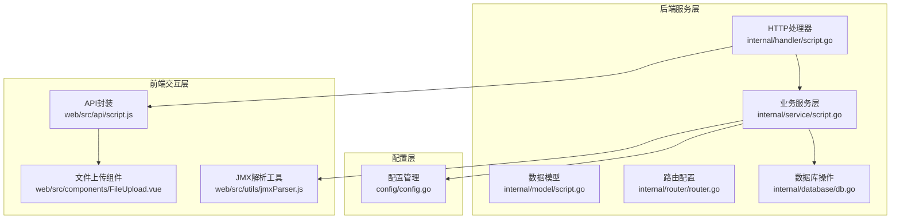

**图表来源**
- [internal/handler/script.go:1-327](file://internal/handler/script.go#L1-L327)
- [internal/service/script.go:1-540](file://internal/service/script.go#L1-L540)
- [internal/router/router.go:1-129](file://internal/router/router.go#L1-L129)

**章节来源**
- [internal/handler/script.go:1-327](file://internal/handler/script.go#L1-L327)
- [internal/service/script.go:1-540](file://internal/service/script.go#L1-L540)
- [internal/router/router.go:1-129](file://internal/router/router.go#L1-L129)

## 核心组件

### 数据模型设计

系统采用简洁而强大的数据模型设计，主要包含两个核心实体：

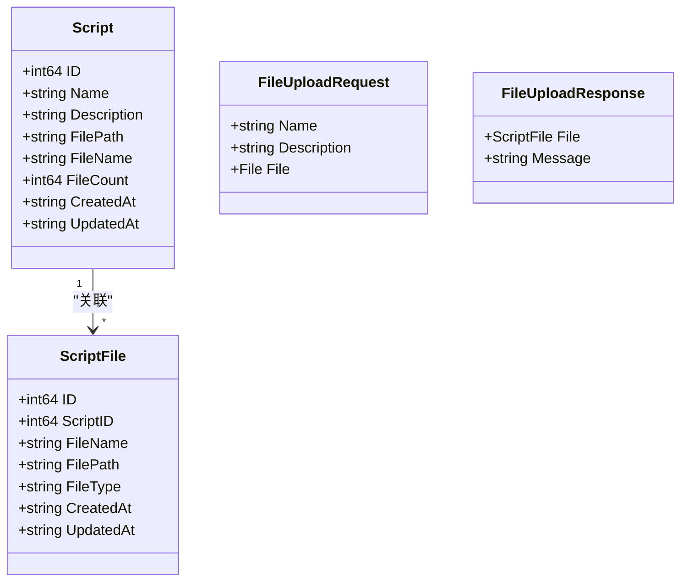

**图表来源**
- [internal/model/script.go:3-22](file://internal/model/script.go#L3-L22)

### 文件类型分类系统

系统实现了智能的文件类型识别机制，支持多种JMeter相关文件格式：

| 文件扩展名 | 类型标识 | 描述 | 支持状态 |
|------------|----------|------|----------|
| .jmx | jmx | JMeter测试脚本主文件 | ✅ 主文件处理 |
| .csv | csv | CSV数据文件 | ✅ 支持 |
| .json | json | JSON配置文件 | ✅ 支持 |
| .txt | txt | 文本文件 | ✅ 支持 |
| .properties | properties | Java属性文件 | ✅ 支持 |
| .xml | xml | XML配置文件 | ✅ 支持 |
| .yaml, .yml | yaml | YAML配置文件 | ✅ 支持 |
| .jar | jar | Java库文件 | ✅ 支持 |
| 其他 | other | 其他文件类型 | ✅ 通用处理 |

**章节来源**
- [internal/service/script.go:361-384](file://internal/service/script.go#L361-L384)

## 架构概览

脚本文件管理采用经典的三层架构模式，实现了清晰的职责分离：

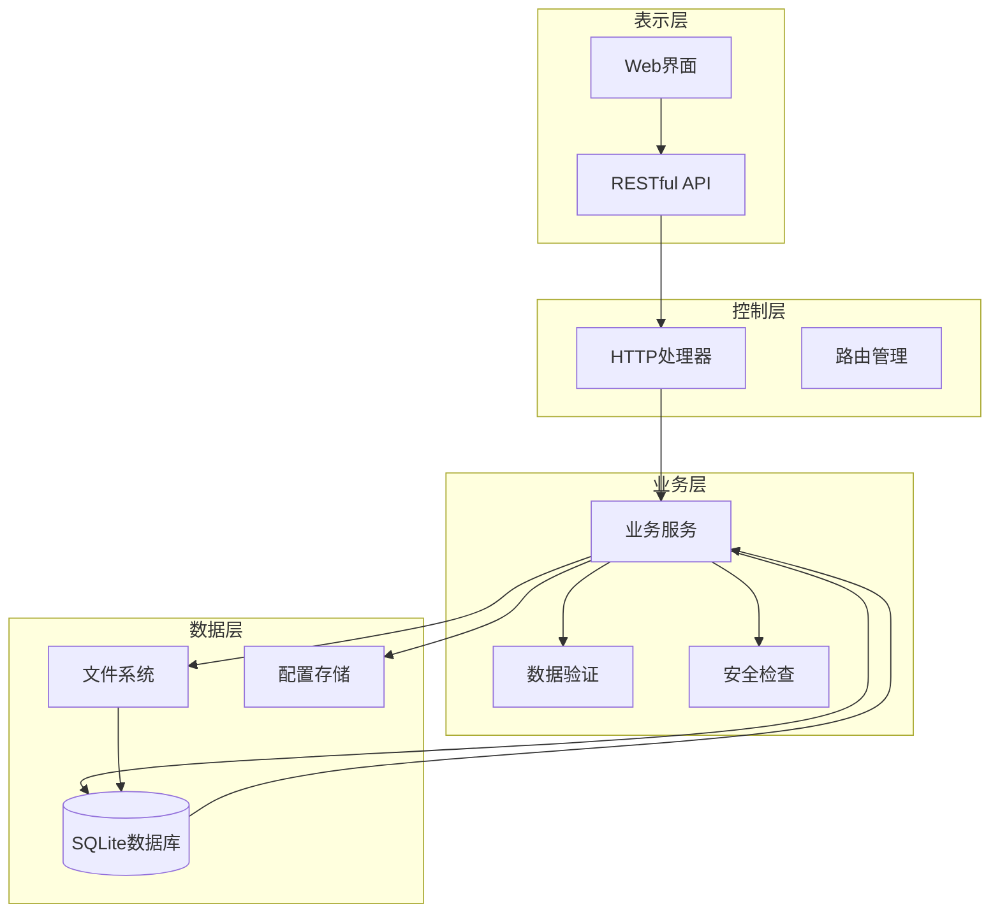

**图表来源**
- [internal/handler/script.go:1-327](file://internal/handler/script.go#L1-L327)
- [internal/service/script.go:1-540](file://internal/service/script.go#L1-L540)
- [internal/router/router.go:14-129](file://internal/router/router.go#L14-L129)

## 详细组件分析

### UploadScriptFile 文件上传流程

文件上传流程是整个系统的核心，涉及多个步骤的安全检查和数据处理：

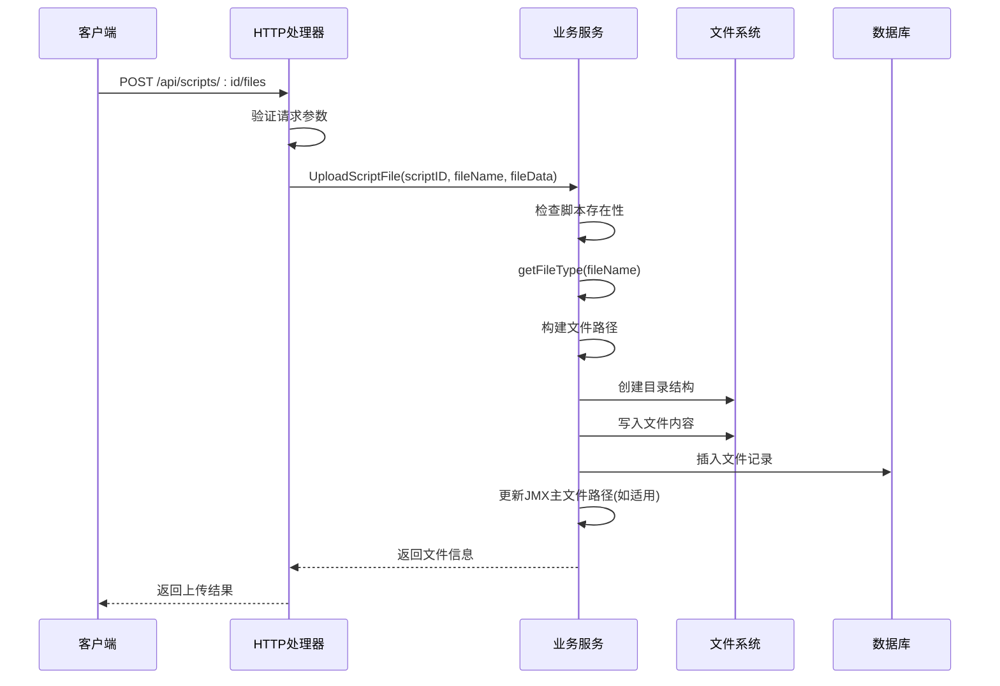

**图表来源**
- [internal/handler/script.go:240-302](file://internal/handler/script.go#L240-L302)
- [internal/service/script.go:299-359](file://internal/service/script.go#L299-L359)

#### 文件类型识别机制

`getFileType`函数实现了智能的文件类型判断逻辑：

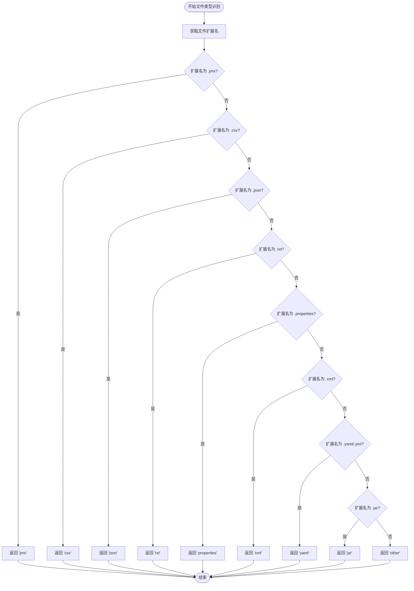

**图表来源**
- [internal/service/script.go:361-384](file://internal/service/script.go#L361-L384)

**章节来源**
- [internal/service/script.go:299-384](file://internal/service/script.go#L299-L384)

### 目录结构创建机制

系统采用层次化的目录结构来组织文件存储：

```
uploads/
├── 1/
│   ├── demo.jmx
│   ├── data.csv
│   └── config.properties
├── 2/
│   ├── test.jmx
│   └── payload.json
└── 3/
    └── script.jmx
```

每个脚本ID对应一个独立的目录，确保文件隔离和便于管理。

**章节来源**
- [internal/service/script.go:109-115](file://internal/service/script.go#L109-L115)
- [internal/service/script.go:314-322](file://internal/service/script.go#L314-L322)

### 文件写入和数据库记录

文件写入过程包含完整的错误处理和回滚机制：

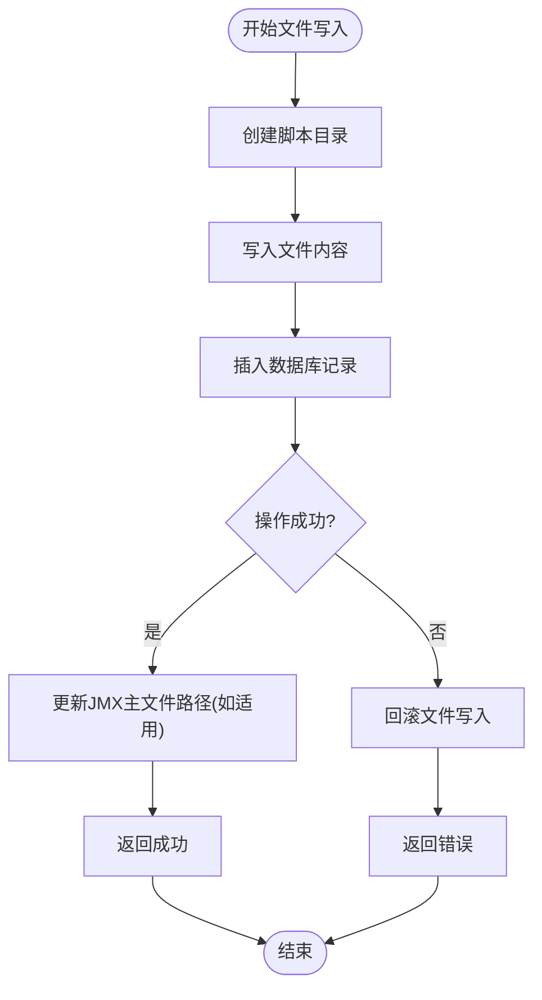

**图表来源**
- [internal/service/script.go:319-358](file://internal/service/script.go#L319-L358)

**章节来源**
- [internal/service/script.go:319-358](file://internal/service/script.go#L319-L358)

### 文件类型分类系统详解

系统支持的文件类型分类如下：

#### JMX主文件处理
- **特殊标识**: `jmx`
- **处理逻辑**: 自动更新脚本表的`file_path`字段
- **关联关系**: 维护脚本与主文件的一对一关系

#### 数据文件支持
- **CSV文件**: `.csv` - 用于测试数据
- **JSON文件**: `.json` - 用于配置和数据
- **TXT文件**: `.txt` - 通用文本文件

#### 配置文件支持
- **Properties文件**: `.properties` - Java属性配置
- **XML文件**: `.xml` - 配置和数据交换
- **YAML文件**: `.yaml, .yml` - 现代配置格式

#### 其他文件类型
- **JAR文件**: `.jar` - Java库文件
- **其他类型**: 统一标记为`other`

**章节来源**
- [internal/service/script.go:361-384](file://internal/service/script.go#L361-L384)

### 文件删除功能

系统提供了灵活的文件删除机制，支持多种删除方式：

#### DeleteScriptFile 按ID删除
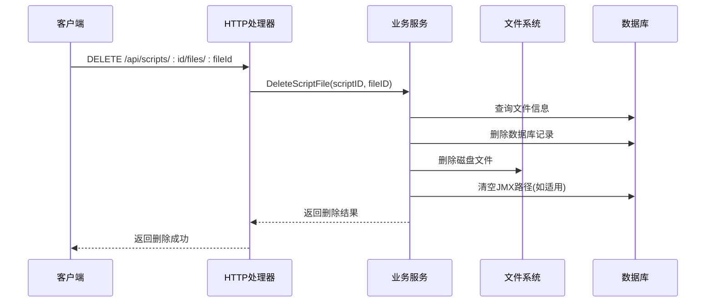

**图表来源**
- [internal/handler/script.go:304-326](file://internal/handler/script.go#L304-L326)
- [internal/service/script.go:386-432](file://internal/service/script.go#L386-L432)

#### DeleteScriptFileByIdentifier 智能删除
支持按ID或文件名进行删除，提供更好的用户体验：

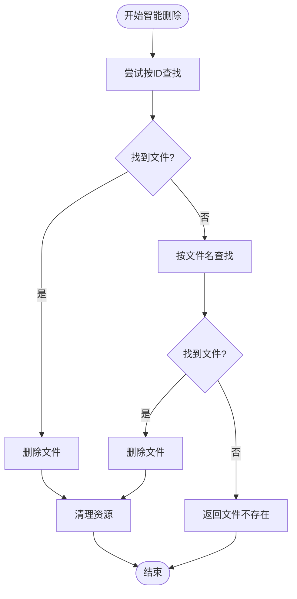

**图表来源**
- [internal/service/script.go:434-489](file://internal/service/script.go#L434-L489)

**章节来源**
- [internal/service/script.go:386-489](file://internal/service/script.go#L386-L489)

### 文件列表查询

`GetScriptFiles`函数提供了完整的文件列表查询功能：

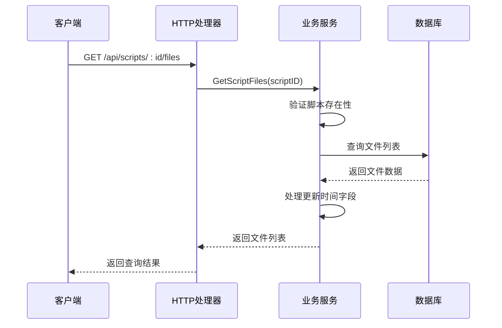

**图表来源**
- [internal/handler/script.go:141-151](file://internal/handler/script.go#L141-L151)
- [internal/service/script.go:491-525](file://internal/service/script.go#L491-L525)

**章节来源**
- [internal/service/script.go:491-525](file://internal/service/script.go#L491-L525)

### JMX主文件特殊处理逻辑

JMX主文件在系统中有特殊的处理逻辑，确保脚本的完整性和一致性：

#### file_path字段自动更新
当上传新的JMX文件时，系统会自动更新脚本记录中的`file_path`字段：

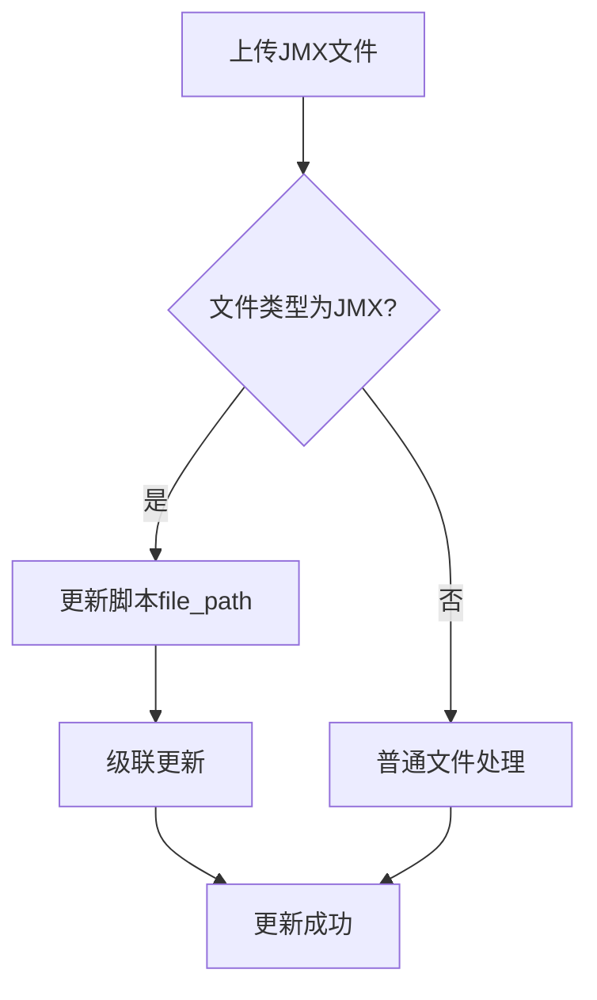

**图表来源**
- [internal/service/script.go:350-356](file://internal/service/script.go#L350-L356)

#### 关联关系维护
系统通过外键约束确保数据完整性：
- `script_files.script_id` 引用 `scripts.id`
- 删除脚本时自动删除关联文件
- 删除文件时自动清理主文件路径

**章节来源**
- [internal/service/script.go:350-356](file://internal/service/script.go#L350-L356)
- [internal/database/db.go:51-61](file://internal/database/db.go#L51-L61)

## 依赖关系分析

系统采用模块化设计，各组件之间的依赖关系清晰明确：

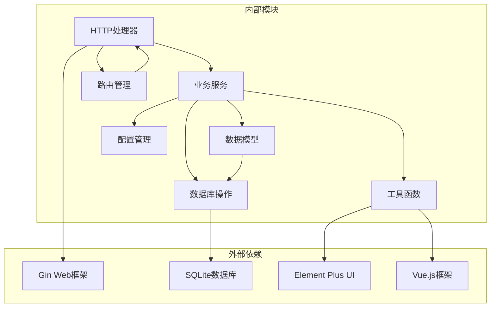

**图表来源**
- [internal/handler/script.go:3-14](file://internal/handler/script.go#L3-L14)
- [internal/service/script.go:3-16](file://internal/service/script.go#L3-L16)

### 数据库表结构

系统使用SQLite作为数据存储，主要表结构如下：

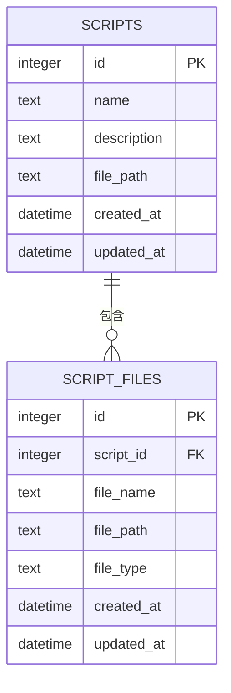

**图表来源**
- [internal/database/db.go:37-61](file://internal/database/db.go#L37-L61)

**章节来源**
- [internal/database/db.go:36-124](file://internal/database/db.go#L36-L124)

## 性能考虑

### 存储性能优化

1. **目录结构优化**: 每个脚本使用独立目录，避免单目录下大量文件导致的性能问题
2. **文件类型缓存**: 对常见文件类型的识别结果进行缓存
3. **批量操作**: 支持多文件上传，减少网络往返开销

### 数据库性能优化

1. **索引策略**: 在`script_id`上建立索引，加速文件查询
2. **事务处理**: 批量操作使用事务，确保数据一致性和性能
3. **连接池**: 使用SQLite连接池管理数据库连接

### 安全性能考虑

1. **文件大小限制**: 单文件100MB，总大小500MB限制
2. **路径遍历防护**: 严格的文件名清理机制
3. **权限控制**: 文件系统权限设置为0755

## 故障排除指南

### 常见问题及解决方案

#### 文件上传失败
**症状**: 上传文件时报错
**可能原因**:
- 文件大小超过限制
- 文件类型不受支持
- 目录权限不足
- 数据库连接异常

**解决步骤**:
1. 检查文件大小是否超过100MB限制
2. 验证文件扩展名是否在支持列表中
3. 确认uploads目录具有写入权限
4. 检查数据库连接状态

#### 文件删除失败
**症状**: 删除文件后仍可查询到
**可能原因**:
- 文件ID或文件名不正确
- 权限不足
- 数据库事务未提交

**解决步骤**:
1. 使用正确的文件ID或文件名
2. 检查用户权限
3. 确认数据库事务状态

#### JMX文件处理异常
**症状**: JMX文件无法正常处理
**可能原因**:
- XML格式不正确
- 文件损坏
- 编码问题

**解决步骤**:
1. 验证XML格式的有效性
2. 检查文件完整性
3. 确认文件编码格式

**章节来源**
- [internal/service/script.go:282-297](file://internal/service/script.go#L282-L297)
- [internal/service/script.go:423-431](file://internal/service/script.go#L423-L431)

## 结论

脚本文件管理系统通过精心设计的架构和完善的机制，为JMeter脚本管理提供了全面的解决方案。系统的主要优势包括：

1. **完整的生命周期管理**: 从创建到删除的全流程覆盖
2. **智能文件类型识别**: 支持多种JMeter相关文件格式
3. **安全可靠的存储机制**: 多层安全防护和错误处理
4. **灵活的查询和管理功能**: 支持多种查询方式和管理操作
5. **良好的扩展性**: 模块化设计便于功能扩展

系统在保证功能完整性的同时，也充分考虑了性能和安全性，为用户提供了一个稳定可靠的脚本文件管理平台。

## 附录

### API接口说明

#### 脚本管理接口
- `GET /api/scripts` - 获取脚本列表
- `POST /api/scripts` - 创建脚本
- `GET /api/scripts/:id` - 获取脚本详情
- `PUT /api/scripts/:id` - 更新脚本
- `DELETE /api/scripts/:id` - 删除脚本

#### 文件管理接口
- `POST /api/scripts/:id/files` - 上传文件
- `DELETE /api/scripts/:id/files/:fileId` - 删除文件
- `GET /api/scripts/:id/files` - 获取文件列表
- `GET /api/scripts/:id/download` - 下载脚本文件

#### 内容管理接口
- `GET /api/scripts/:id/content` - 获取脚本内容
- `PUT /api/scripts/:id/content` - 保存脚本内容

### 最佳实践建议

1. **文件命名规范**: 使用有意义的文件名，避免特殊字符
2. **版本控制**: 对重要脚本文件进行版本管理
3. **定期清理**: 定期清理不再使用的脚本文件
4. **备份策略**: 重要脚本文件应定期备份
5. **监控告警**: 建立文件存储空间监控机制

### 错误处理策略

系统实现了多层次的错误处理机制：
- 输入参数验证
- 文件类型和大小检查
- 文件系统权限验证
- 数据库事务回滚
- 用户友好的错误提示

这些机制确保了系统的稳定性和可靠性，为用户提供了良好的使用体验。