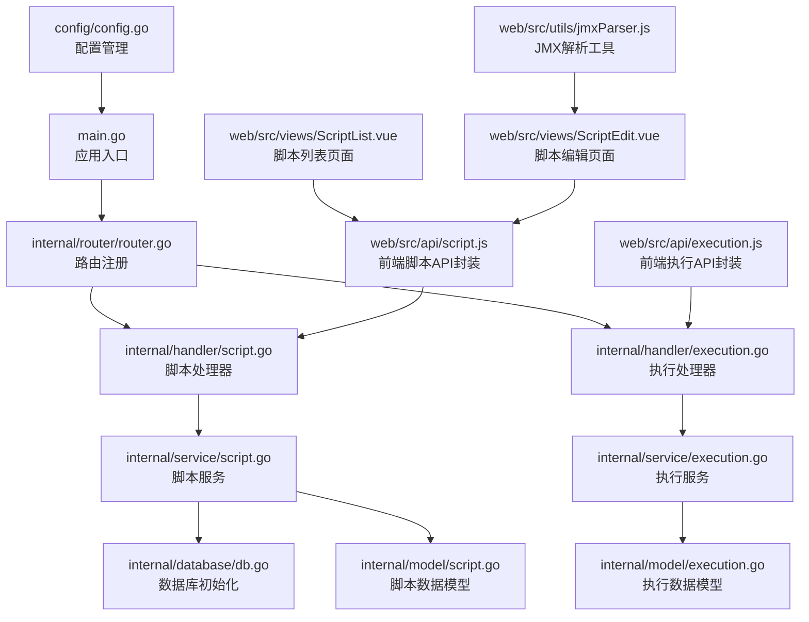
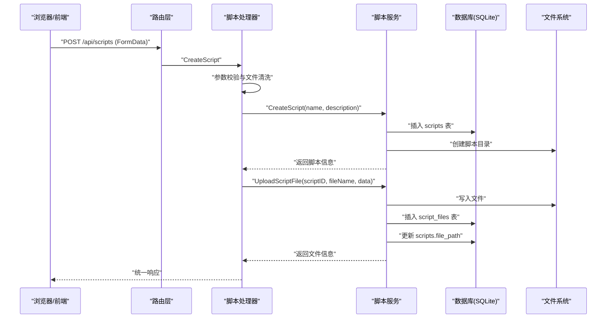
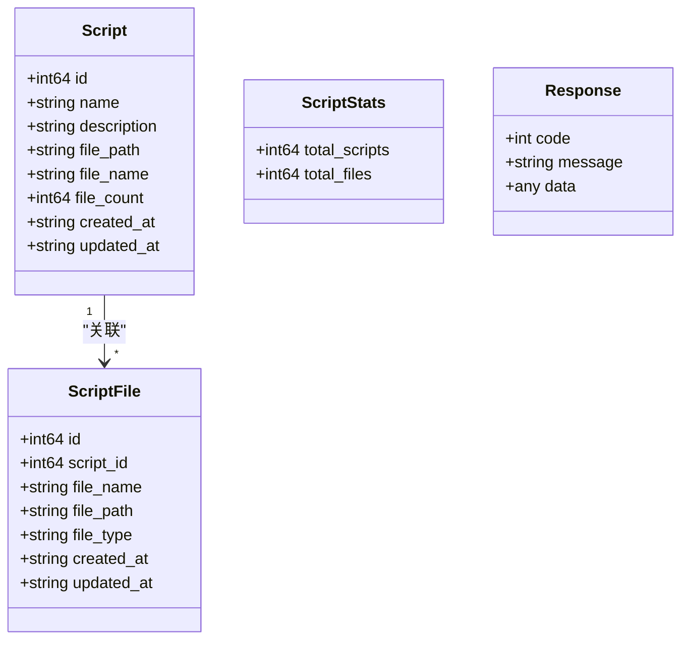
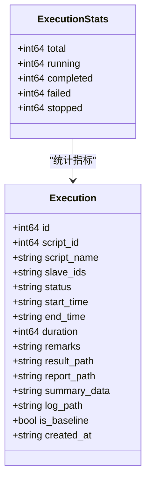
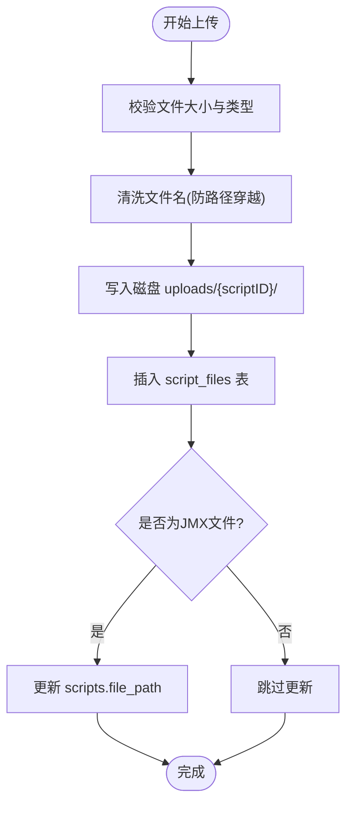
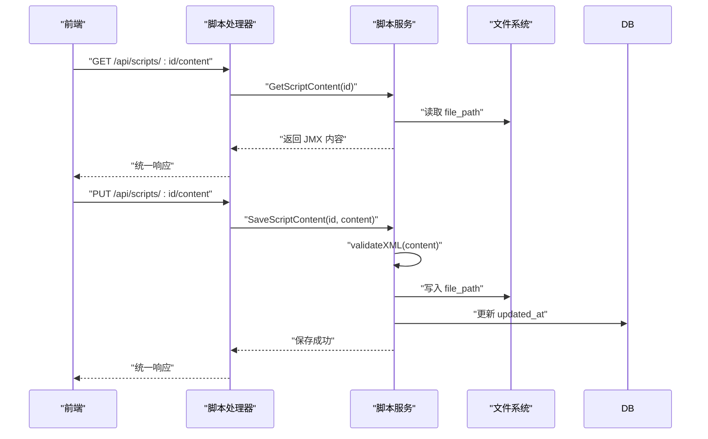
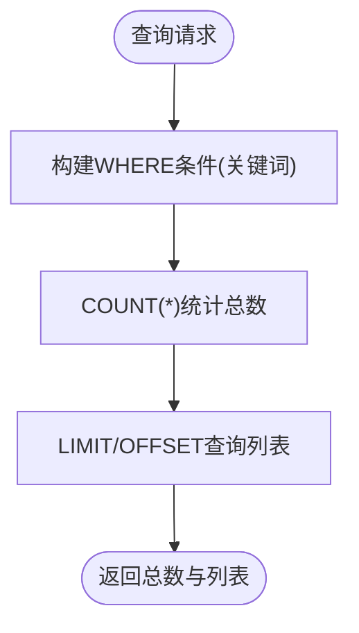
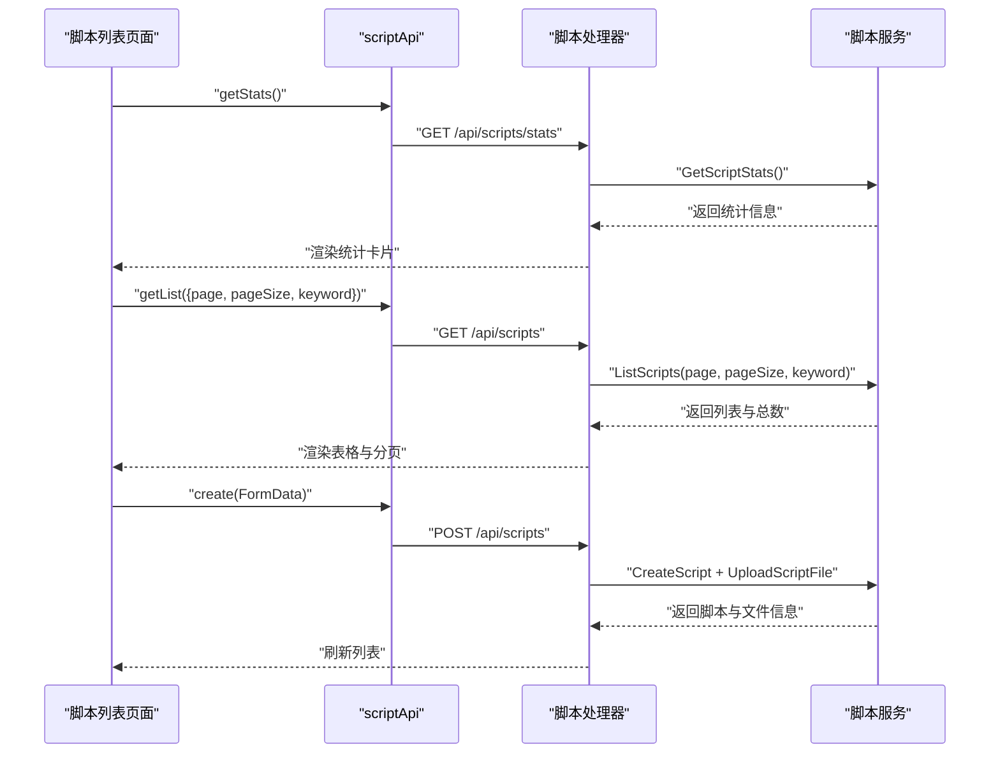
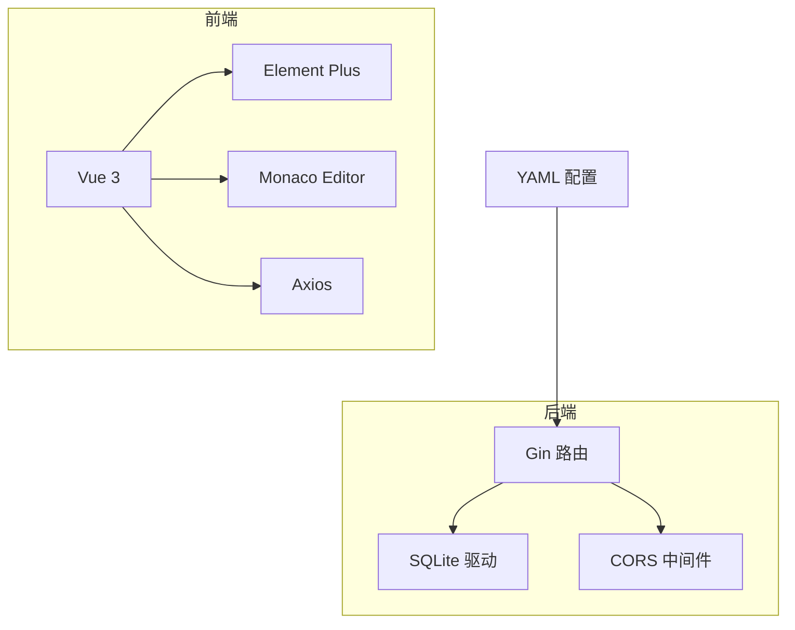

# 脚本管理系统

<cite>
**本文档引用的文件**
- [main.go](file://main.go)
- [router.go](file://internal/router/router.go)
- [script.go](file://internal/handler/script.go)
- [script.go](file://internal/service/script.go)
- [script.go](file://internal/model/script.go)
- [execution.go](file://internal/handler/execution.go)
- [execution.go](file://internal/service/execution.go)
- [execution.go](file://internal/model/execution.go)
- [response.go](file://internal/model/response.go)
- [db.go](file://internal/database/db.go)
- [config.go](file://config/config.go)
- [script.js](file://web/src/api/script.js)
- [execution.js](file://web/src/api/execution.js)
- [ScriptList.vue](file://web/src/views/ScriptList.vue)
- [ScriptEdit.vue](file://web/src/views/ScriptEdit.vue)
- [jmxParser.js](file://web/src/utils/jmxParser.js)
- [README.md](file://README.md)
</cite>

## 目录
1. [简介](#简介)
2. [项目结构](#项目结构)
3. [核心组件](#核心组件)
4. [架构总览](#架构总览)
5. [详细组件分析](#详细组件分析)
6. [依赖关系分析](#依赖关系分析)
7. [性能考虑](#性能考虑)
8. [故障排除指南](#故障排除指南)
9. [结论](#结论)
10. [附录](#附录)

## 简介
本项目是一个基于 Go (Gin) + Vue 3 的单文件部署 JMeter 分布式压测管理平台，专注于脚本管理功能。系统提供脚本的创建、查询、更新、删除操作，支持 JMX 文件的上传、存储与管理，具备 JMX 文件的 XML 格式验证与内容编辑能力。脚本与附件文件之间通过数据库建立关联关系，支持分页查询、模糊搜索以及文件类型识别。系统还包含脚本生命周期管理、文件清理和错误处理策略，并提供完整的 API 接口规范与前端交互示例。

**更新** 新增完整的统计系统功能，包括脚本数量、文件数量、运行中脚本数、执行记录数等统计指标，以及并发API调用优化，显著提升用户体验和系统性能。

## 项目结构
后端采用分层架构：入口程序负责初始化配置、数据库与路由；路由层定义 API；处理器层负责请求参数校验与响应封装；服务层实现业务逻辑；模型层定义数据结构；数据库层负责 SQLite 初始化与迁移。

**图表来源**
- [main.go:28-66](file://main.go#L28-L66)
- [router.go:14-138](file://internal/router/router.go#L14-L138)
- [script.go:1-427](file://internal/handler/script.go#L1-L427)
- [execution.go:103-157](file://internal/handler/execution.go#L103-L157)
- [script.go:1-732](file://internal/service/script.go#L1-L732)
- [execution.go:1011-1037](file://internal/service/execution.go#L1011-L1037)
- [db.go:15-34](file://internal/database/db.go#L15-L34)
- [script.go:1-47](file://internal/model/script.go#L1-L47)
- [execution.go:1-56](file://internal/model/execution.go#L1-L56)
- [config.go:41-84](file://config/config.go#L41-L84)
- [script.js:1-99](file://web/src/api/script.js#L1-L99)
- [execution.js:1-93](file://web/src/api/execution.js#L1-L93)
- [ScriptList.vue:1-973](file://web/src/views/ScriptList.vue#L1-L973)
- [ScriptEdit.vue:1-1592](file://web/src/views/ScriptEdit.vue#L1-L1592)
- [jmxParser.js:1-800](file://web/src/utils/jmxParser.js#L1-L800)

**章节来源**
- [main.go:28-66](file://main.go#L28-L66)
- [router.go:14-138](file://internal/router/router.go#L14-L138)
- [config.go:41-84](file://config/config.go#L41-L84)

## 核心组件
- 应用入口与初始化：加载配置、创建必要目录、初始化数据库、清理陈旧执行记录、启动心跳检测、设置路由并启动服务。
- 路由与中间件：统一设置 CORS，注册脚本、Slave、执行、配置等 API 路由组。
- 脚本处理器：负责参数校验、文件安全清洗、调用服务层并返回统一响应格式。
- 脚本服务：实现脚本 CRUD、文件上传与删除、JMX 内容读取与保存、XML 校验、分页与模糊搜索、文件类型识别等。
- 执行处理器：提供执行统计、实时指标、错误分析等高级功能。
- 执行服务：实现执行记录管理、状态跟踪、性能指标计算等。
- 数据模型：定义脚本、执行记录、统计数据等数据结构。
- 数据库：SQLite 初始化、表结构创建与迁移、索引创建。
- 前端集成：API 封装、脚本列表与编辑页面、JMX 解析与可视化编辑。

**更新** 新增统计系统组件，包括脚本统计和执行统计功能，支持并发API调用优化，提供实时数据展示。

**章节来源**
- [main.go:28-66](file://main.go#L28-L66)
- [router.go:14-138](file://internal/router/router.go#L14-L138)
- [script.go:1-427](file://internal/handler/script.go#L1-L427)
- [execution.go:103-157](file://internal/handler/execution.go#L103-L157)
- [script.go:1-732](file://internal/service/script.go#L1-L732)
- [execution.go:1011-1037](file://internal/service/execution.go#L1011-L1037)
- [script.go:1-47](file://internal/model/script.go#L1-L47)
- [execution.go:1-56](file://internal/model/execution.go#L1-L56)
- [db.go:36-124](file://internal/database/db.go#L36-L124)

## 架构总览
系统采用前后端分离架构，后端提供 RESTful API，前端通过 Axios 封装的 API 与后端交互。JMX 文件作为脚本主文件，支持上传、下载、内容编辑与保存。附件文件（CSV、JSON、Properties 等）与脚本建立关联，支持批量上传与删除。

**图表来源**
- [router.go:24-41](file://internal/router/router.go#L24-L41)
- [script.go:62-118](file://internal/handler/script.go#L62-L118)
- [script.go:101-118](file://internal/service/script.go#L101-L118)
- [script.go:491-551](file://internal/service/script.go#L491-L551)
- [db.go:37-49](file://internal/database/db.go#L37-L49)

## 详细组件分析

### 脚本管理 API 设计
- 列表查询：支持分页与关键词模糊搜索，返回脚本列表及总数。
- 创建脚本：接收表单数据，校验主 JMX 文件，创建脚本记录并上传主文件。
- 获取详情：返回脚本基本信息与关联文件列表。
- 更新脚本：更新脚本名称与描述。
- 删除脚本：删除脚本记录、关联文件记录与磁盘文件，清理脚本目录。
- 下载主文件：返回主 JMX 文件的下载。
- 获取/保存 JMX 内容：读取与保存 JMX XML 内容，保存前进行 XML 格式校验。
- 上传/删除附件：支持多文件上传，限制单文件与总大小，按文件 ID 或文件名删除。
- **新增** 获取脚本统计：返回脚本总数和文件总数统计信息。

**图表来源**
- [script.go:3-22](file://internal/model/script.go#L3-L22)
- [script.go:43-47](file://internal/model/script.go#L43-L47)
- [response.go:3-7](file://internal/model/response.go#L3-L7)

**章节来源**
- [router.go:24-41](file://internal/router/router.go#L24-L41)
- [script.go:37-118](file://internal/handler/script.go#L37-L118)
- [script.go:18-83](file://internal/service/script.go#L18-L83)
- [script.go:85-177](file://internal/service/script.go#L85-L177)
- [script.go:179-227](file://internal/service/script.go#L179-L227)
- [script.go:136-155](file://internal/service/script.go#L136-L155)
- [script.go:229-280](file://internal/service/script.go#L229-L280)
- [script.go:299-359](file://internal/service/script.go#L299-L359)
- [script.go:386-432](file://internal/service/script.go#L386-L432)
- [script.go:87-99](file://internal/service/script.go#L87-L99)

### 执行统计 API 设计
**新增** 系统提供完整的执行统计功能，包括：
- 获取执行统计：返回执行总数、运行中数量、已完成数量、失败数量等统计信息。
- 实时指标：提供执行过程中的实时性能指标。
- 错误分析：支持执行错误的分析与趋势展示。
- 并发优化：前端采用 Promise.all 并发调用多个统计API，提升页面加载性能。

**图表来源**
- [execution.go:1011-1018](file://internal/service/execution.go#L1011-L1018)
- [execution.go:3-25](file://internal/model/execution.go#L3-L25)

**章节来源**
- [router.go:55-75](file://internal/router/router.go#L55-L75)
- [execution.go:112-121](file://internal/handler/execution.go#L112-L121)
- [execution.go:1020-1037](file://internal/service/execution.go#L1020-L1037)
- [execution.go:1011-1018](file://internal/service/execution.go#L1011-L1018)

### 文件上传与存储机制
- 文件安全清洗：防止路径穿越攻击，清理文件名中的路径分隔符。
- 上传限制：单文件最大 100MB，总大小不超过 500MB。
- 存储策略：上传文件保存至 uploads/{scriptID}/ 目录，数据库记录包含文件名、路径、类型与时间戳。
- 文件类型识别：根据扩展名识别 jmx、csv、json、txt、properties、xml、yaml/yml、jar 等类型。
- 删除策略：删除脚本时同时删除数据库记录与磁盘文件；删除附件时同样清理数据库与磁盘。

**图表来源**
- [script.go:16-21](file://internal/handler/script.go#L16-L21)
- [script.go:22-35](file://internal/handler/script.go#L22-L35)
- [script.go:240-302](file://internal/handler/script.go#L240-L302)
- [script.go:299-359](file://internal/service/script.go#L299-L359)
- [script.go:361-384](file://internal/service/script.go#L361-L384)

**章节来源**
- [script.go:16-21](file://internal/handler/script.go#L16-L21)
- [script.go:22-35](file://internal/handler/script.go#L22-L35)
- [script.go:240-302](file://internal/handler/script.go#L240-L302)
- [script.go:299-359](file://internal/service/script.go#L299-L359)
- [script.go:361-384](file://internal/service/script.go#L361-L384)

### JMX 文件 XML 格式验证与内容编辑
- XML 校验：在保存 JMX 内容前进行 XML 格式有效性校验，确保内容可解析。
- 内容读取与保存：提供获取与保存 JMX 内容的接口，保存时更新脚本的 updated_at 时间。
- 前端编辑：支持可视化树形编辑与 XML 源码编辑双模式，内置差异预览与历史记录。

**图表来源**
- [script.go:226-268](file://internal/handler/script.go#L226-L268)
- [script.go:229-280](file://internal/service/script.go#L229-L280)
- [script.go:282-297](file://internal/service/script.go#L282-L297)

**章节来源**
- [script.go:226-268](file://internal/handler/script.go#L226-L268)
- [script.go:229-280](file://internal/service/script.go#L229-L280)
- [script.go:282-297](file://internal/service/script.go#L282-L297)

### 分页查询、模糊搜索与文件类型识别
- 分页查询：服务层实现分页逻辑，支持按名称模糊搜索，返回总数与列表。
- 模糊搜索：关键词匹配使用 LIKE 查询，避免全表扫描。
- 文件类型识别：根据扩展名映射文件类型，便于前端展示与管理。

**图表来源**
- [script.go:18-83](file://internal/service/script.go#L18-L83)

**章节来源**
- [script.go:18-83](file://internal/service/script.go#L18-L83)
- [script.go:361-384](file://internal/service/script.go#L361-L384)

### 脚本生命周期管理与文件清理
- 生命周期：创建脚本 -> 上传主文件 -> 关联附件 -> 执行测试 -> 删除脚本。
- 文件清理：删除脚本时清理数据库记录、磁盘文件与脚本目录；删除附件时清理对应记录与文件。
- 错误处理：对文件不存在、权限不足、磁盘写入失败等情况进行错误记录与返回。

**章节来源**
- [script.go:179-227](file://internal/service/script.go#L179-L227)
- [script.go:386-432](file://internal/service/script.go#L386-L432)

### 前端交互与 API 使用示例
- 列表与搜索：前端通过 scriptApi.getList 支持分页与关键词搜索。
- 创建脚本：使用 FormData 上传主 JMX 文件与描述信息。
- 编辑与保存：支持可视化编辑与 XML 源码编辑，保存前进行差异预览。
- 附件管理：支持 CSV、JSON、Properties 等文件上传与删除。
- **新增** 统计展示：前端采用 Promise.all 并发调用脚本统计和执行统计 API，提供实时数据展示。

**图表来源**
- [script.js:4-7](file://web/src/api/script.js#L4-L7)
- [ScriptList.vue:353-371](file://web/src/views/ScriptList.vue#L353-L371)
- [script.js:9-26](file://web/src/api/script.js#L9-L26)
- [script.go:37-118](file://internal/handler/script.go#L37-L118)
- [script.go:18-83](file://internal/service/script.go#L18-L83)

**章节来源**
- [script.js:1-99](file://web/src/api/script.js#L1-L99)
- [execution.js:1-93](file://web/src/api/execution.js#L1-L93)
- [ScriptList.vue:353-371](file://web/src/views/ScriptList.vue#L353-L371)
- [ScriptEdit.vue:535-568](file://web/src/views/ScriptEdit.vue#L535-L568)

### 并发API调用优化
**新增** 前端采用 Promise.all 并发调用多个统计API，显著提升页面加载性能：
- 脚本统计：获取总脚本数和总文件数
- 执行统计：获取执行总数和运行中数量
- 并发执行：两个API同时发起请求，减少等待时间
- 错误处理：即使某个API失败，其他API的结果仍然可用

**章节来源**
- [ScriptList.vue:357-371](file://web/src/views/ScriptList.vue#L357-L371)

## 依赖关系分析
- 后端依赖：Gin 路由框架、SQLite 驱动、CORS 中间件。
- 前端依赖：Vue 3、Element Plus、Monaco Editor、Axios。
- 配置依赖：YAML 配置文件，支持端口、JMeter 路径、目录结构等配置项。
- 数据库依赖：SQLite，自动创建表与索引，支持迁移。

**图表来源**
- [router.go:14-138](file://internal/router/router.go#L14-L138)
- [config.go:41-84](file://config/config.go#L41-L84)

**章节来源**
- [router.go:14-138](file://internal/router/router.go#L14-L138)
- [config.go:41-84](file://config/config.go#L41-L84)

## 性能考虑
- 数据库索引：为 executions 与 script_files 表创建索引，提升查询性能。
- 分页与模糊搜索：使用 LIMIT/OFFSET 与 LIKE 查询，避免全表扫描。
- 文件大小限制：单文件与总大小限制，防止内存与磁盘压力过大。
- 时区设置：统一设置为 Asia/Shanghai，避免时间字段跨时区问题。
- 前端编辑：Monaco Editor 支持大文件编辑与差异对比，减少不必要的重绘。
- **新增** 并发API调用：前端采用 Promise.all 并发执行多个统计API，提升页面响应速度。

[本节为通用性能建议，不直接分析具体文件]

## 故障排除指南
- 数据库初始化失败：检查 SQLite 驱动与数据目录权限，确认数据库文件可创建。
- 脚本删除失败：检查脚本目录与文件是否存在，确认删除流程是否正确执行。
- JMX 校验失败：检查 XML 格式是否有效，确保保存前通过 validateXML 校验。
- 文件上传失败：确认文件大小未超过限制，检查 uploads 目录权限。
- 前端 API 调用异常：检查路由配置与 CORS 设置，确认前端与后端端口一致。
- **新增** 统计数据异常：检查数据库连接状态，确认统计查询语句执行正常。

**章节来源**
- [db.go:15-34](file://internal/database/db.go#L15-L34)
- [script.go:179-227](file://internal/service/script.go#L179-L227)
- [script.go:282-297](file://internal/service/script.go#L282-L297)
- [script.go:16-21](file://internal/handler/script.go#L16-L21)

## 结论
脚本管理系统提供了完善的脚本生命周期管理能力，涵盖创建、查询、更新、删除、文件上传与存储、JMX 内容编辑与校验等功能。系统采用 SQLite 作为数据存储，结合前后端分离架构，实现了高效的脚本管理与分布式压测执行支持。通过合理的分页、模糊搜索与文件类型识别机制，提升了用户体验与系统性能。

**更新** 新增的统计系统功能进一步增强了平台的监控与分析能力，包括脚本数量、文件数量、运行中脚本数、执行记录数等关键指标的实时展示，配合并发API调用优化，显著提升了用户界面的响应速度和数据展示效果。建议在生产环境中关注文件大小限制、数据库索引与备份策略，确保系统的稳定性与可靠性。

[本节为总结性内容，不直接分析具体文件]

## 附录

### API 接口规范
- 脚本管理
  - GET /api/scripts?page=1&page_size=10&keyword=xxx：分页查询脚本列表
  - GET /api/scripts/stats：获取脚本统计信息（总脚本数、总文件数）
  - POST /api/scripts：创建脚本（FormData：name、description、file）
  - GET /api/scripts/:id：获取脚本详情
  - PUT /api/scripts/:id：更新脚本（JSON：name、description）
  - DELETE /api/scripts/:id：删除脚本
  - GET /api/scripts/:id/download：下载主脚本
  - GET /api/scripts/:id/content：获取 JMX 内容
  - PUT /api/scripts/:id/content：保存 JMX 内容（JSON：content）
  - POST /api/scripts/:id/files：上传附件（FormData：files[]）
  - DELETE /api/scripts/:id/files/:fileId：删除附件（支持按文件 ID 或文件名）
- **新增** 执行统计
  - GET /api/executions/stats：获取执行统计信息（总执行数、运行中数等）

**章节来源**
- [router.go:24-41](file://internal/router/router.go#L24-L41)
- [router.go:55-75](file://internal/router/router.go#L55-L75)
- [README.md:122-138](file://README.md#L122-L138)

### 数据库表结构
- scripts：脚本表，包含主键、名称、描述、主 JMX 文件路径、创建与更新时间。
- script_files：脚本附件表，包含主键、关联脚本 ID、文件名、文件路径、文件类型、创建与更新时间。
- slaves：Slave 节点表，包含主键、名称、主机地址、端口、状态、最后检测时间、创建时间。
- executions：执行记录表，包含主键、关联脚本 ID、脚本名称、Slave ID 列表、状态、开始与结束时间、执行时长、备注、结果与报告路径、汇总数据、日志路径、创建时间。
- **新增** script_versions：脚本版本表，包含主键、关联脚本 ID、版本号、内容、内容哈希、变更摘要、创建时间。

**章节来源**
- [db.go:37-129](file://internal/database/db.go#L37-L129)
- [db.go:243-260](file://internal/database/db.go#L243-L260)
- [README.md:175-230](file://README.md#L175-L230)

### 前端组件与工具
- scriptApi：封装脚本相关的 API 调用，包括列表、创建、详情、更新、删除、内容获取与保存、文件上传与删除、下载、统计等。
- executionApi：封装执行相关的 API 调用，包括统计、列表、详情、实时指标、错误分析等。
- ScriptList.vue：脚本列表页面，支持搜索、分页、上传、下载、执行与删除，新增统计概览卡片。
- ScriptEdit.vue：脚本编辑页面，支持可视化树形编辑与 XML 源码编辑，差异预览与历史记录。
- jmxParser.js：JMX 解析与序列化工具，提供元素元数据定义与解析函数。

**章节来源**
- [script.js:1-99](file://web/src/api/script.js#L1-L99)
- [execution.js:1-93](file://web/src/api/execution.js#L1-L93)
- [ScriptList.vue:1-973](file://web/src/views/ScriptList.vue#L1-L973)
- [ScriptEdit.vue:1-1592](file://web/src/views/ScriptEdit.vue#L1-L1592)
- [jmxParser.js:1-800](file://web/src/utils/jmxParser.js#L1-L800)