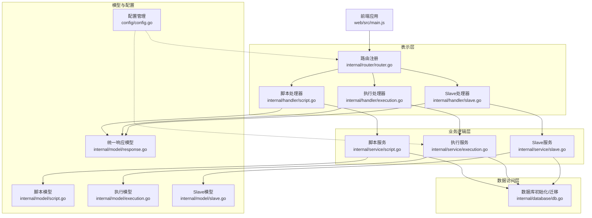
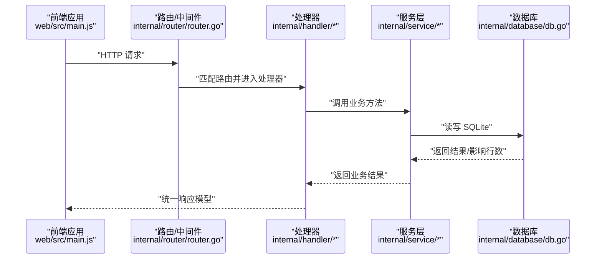
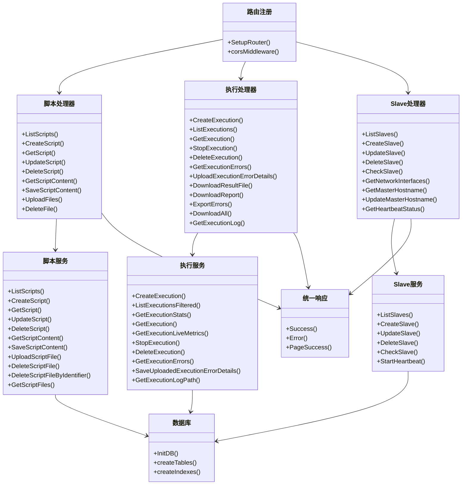
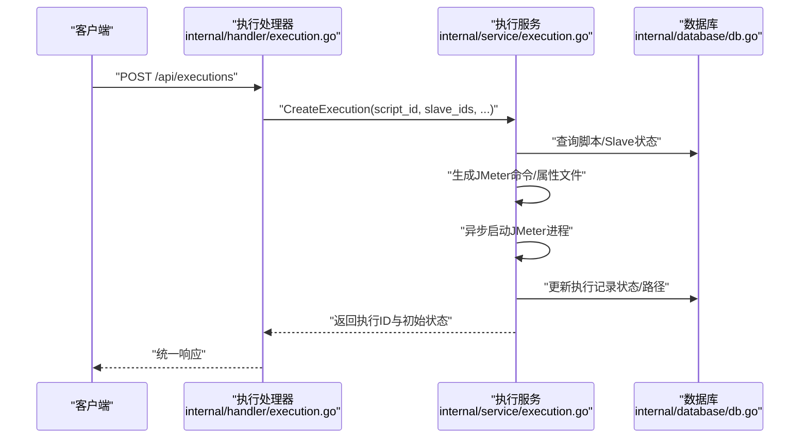
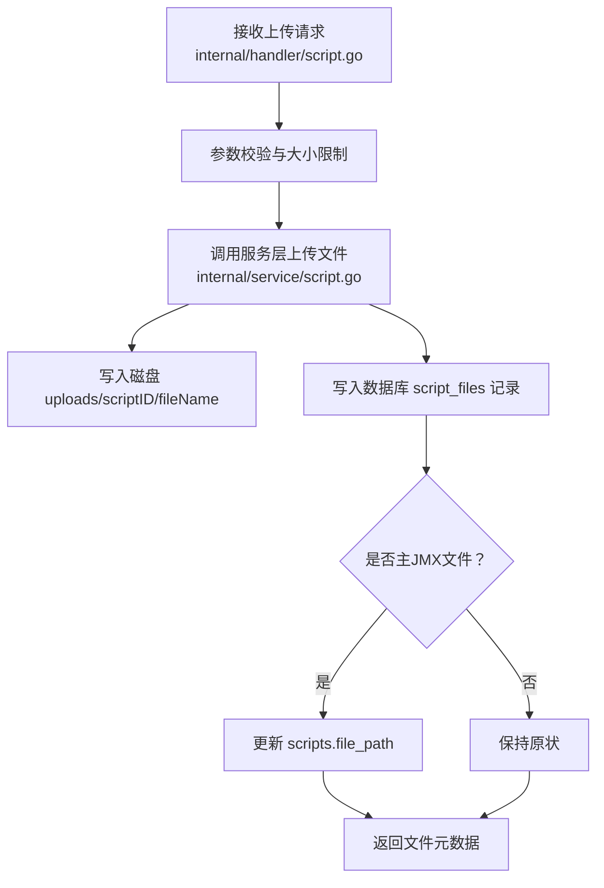
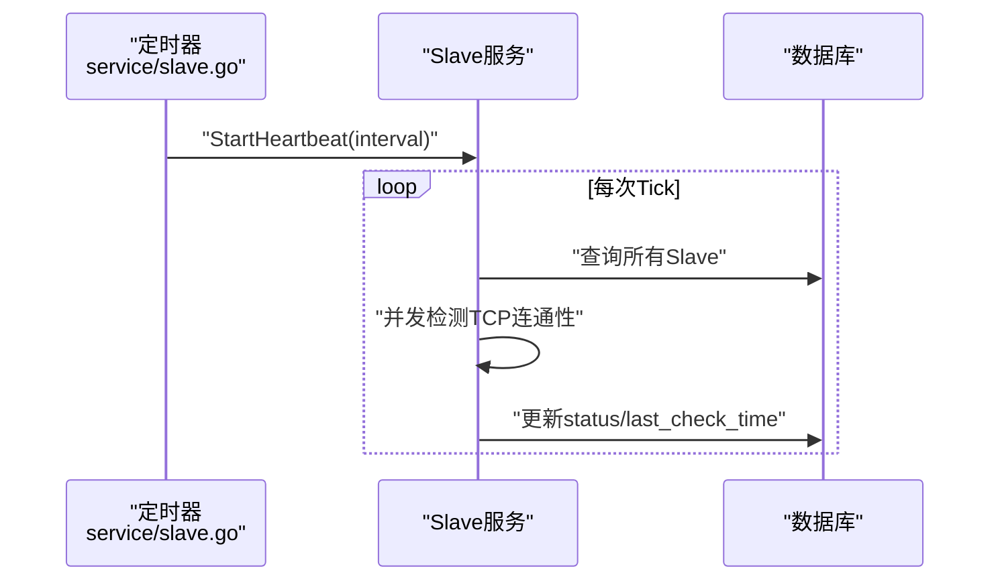
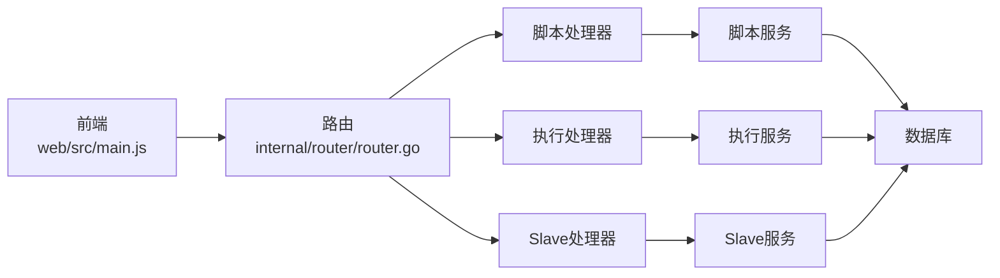

# 分层架构设计

<cite>
**本文引用的文件**
- [main.go](file://main.go)
- [router.go](file://internal/router/router.go)
- [script.go](file://internal/handler/script.go)
- [execution.go](file://internal/handler/execution.go)
- [slave.go](file://internal/handler/slave.go)
- [script.go](file://internal/service/script.go)
- [execution.go](file://internal/service/execution.go)
- [slave.go](file://internal/service/slave.go)
- [db.go](file://internal/database/db.go)
- [config.go](file://config/config.go)
- [response.go](file://internal/model/response.go)
- [script.go](file://internal/model/script.go)
- [execution.go](file://internal/model/execution.go)
- [slave.go](file://internal/model/slave.go)
- [main.js](file://web/src/main.js)
</cite>

## 目录
1. [简介](#简介)
2. [项目结构](#项目结构)
3. [核心组件](#核心组件)
4. [架构总览](#架构总览)
5. [详细组件分析](#详细组件分析)
6. [依赖分析](#依赖分析)
7. [性能考虑](#性能考虑)
8. [故障排查指南](#故障排查指南)
9. [结论](#结论)

## 简介
本文件面向JMeter Admin项目，系统化阐述其分层架构设计与实现细节。项目采用经典的三层架构（表示层/业务逻辑层/数据访问层），结合MVC模式在Web端的实践，明确各层职责、边界与交互方式；同时说明中间件在跨层协调中的作用（日志、错误处理、认证授权等）。文档通过图示与代码片段路径帮助读者快速理解数据在各层之间的流转过程。

## 项目结构
项目采用Go模块化组织，前端使用Vue 3 + Element Plus，后端以Gin为核心构建HTTP服务，内部按领域功能划分为：
- 表示层（Controller）：位于internal/router与internal/handler，负责HTTP路由与请求/响应编解码
- 业务逻辑层（Service）：位于internal/service，封装核心业务规则与流程控制
- 数据访问层（Repository/DAO）：位于internal/database，封装SQLite访问与表结构维护
- 模型层（Model）：位于internal/model，定义数据结构与统一响应模型
- 配置与入口：config与main.go负责配置加载、目录准备、数据库初始化与服务启动

**图表来源**
- [router.go:14-112](file://internal/router/router.go#L14-L112)
- [script.go:37-50](file://internal/handler/script.go#L37-L50)
- [execution.go:38-53](file://internal/handler/execution.go#L38-L53)
- [slave.go:16-24](file://internal/handler/slave.go#L16-L24)
- [script.go:18-83](file://internal/service/script.go#L18-L83)
- [execution.go:103-180](file://internal/service/execution.go#L103-L180)
- [slave.go:15-41](file://internal/service/slave.go#L15-L41)
- [db.go:15-34](file://internal/database/db.go#L15-L34)
- [response.go:3-46](file://internal/model/response.go#L3-L46)
- [config.go:43-84](file://config/config.go#L43-L84)
- [main.go:28-66](file://main.go#L28-L66)
- [main.js:1-23](file://web/src/main.js#L1-L23)

**章节来源**
- [main.go:28-66](file://main.go#L28-L66)
- [router.go:14-112](file://internal/router/router.go#L14-L112)
- [config.go:43-84](file://config/config.go#L43-L84)

## 核心组件
- 路由与中间件：Gin路由组划分API域，内置CORS中间件，静态资源服务与前端回退策略
- 处理器（Handler）：对HTTP请求进行参数解析、权限校验、调用服务层并返回统一响应模型
- 服务（Service）：封装业务规则、外部进程（JMeter）调度、结果聚合与持久化
- 数据库（Database）：SQLite初始化、表结构创建与迁移、索引维护
- 模型（Model）：领域实体与统一响应结构，便于前后端契约一致
- 配置（Config）：服务端口、JMeter路径、Slave心跳间隔、目录结构等

**章节来源**
- [router.go:14-129](file://internal/router/router.go#L14-L129)
- [script.go:37-108](file://internal/handler/script.go#L37-L108)
- [execution.go:38-168](file://internal/handler/execution.go#L38-L168)
- [slave.go:16-95](file://internal/handler/slave.go#L16-L95)
- [script.go:18-116](file://internal/service/script.go#L18-L116)
- [execution.go:103-180](file://internal/service/execution.go#L103-L180)
- [slave.go:15-41](file://internal/service/slave.go#L15-L41)
- [db.go:15-124](file://internal/database/db.go#L15-L124)
- [response.go:3-46](file://internal/model/response.go#L3-L46)
- [config.go:43-113](file://config/config.go#L43-L113)

## 架构总览
下图展示了请求从浏览器到数据库的完整链路，以及各层职责与依赖方向：

**图表来源**
- [router.go:14-112](file://internal/router/router.go#L14-L112)
- [script.go:37-50](file://internal/handler/script.go#L37-L50)
- [execution.go:38-53](file://internal/handler/execution.go#L38-L53)
- [slave.go:16-24](file://internal/handler/slave.go#L16-L24)
- [script.go:18-83](file://internal/service/script.go#L18-L83)
- [execution.go:103-180](file://internal/service/execution.go#L103-L180)
- [slave.go:15-41](file://internal/service/slave.go#L15-L41)
- [db.go:15-34](file://internal/database/db.go#L15-L34)

## 详细组件分析

### MVC 在项目中的实现
- Model（模型）：internal/model下的实体与统一响应模型，承载数据结构与契约
- View（视图）：web/src下的Vue组件与页面，负责UI渲染与用户交互
- Controller（控制器）：internal/router/router.go与internal/handler/*，负责路由匹配、请求解析、调用服务层并返回响应

**图表来源**
- [router.go:14-112](file://internal/router/router.go#L14-L112)
- [script.go:37-327](file://internal/handler/script.go#L37-L327)
- [execution.go:38-729](file://internal/handler/execution.go#L38-L729)
- [slave.go:16-236](file://internal/handler/slave.go#L16-L236)
- [script.go:18-540](file://internal/service/script.go#L18-L540)
- [execution.go:103-800](file://internal/service/execution.go#L103-L800)
- [slave.go:15-220](file://internal/service/slave.go#L15-L220)
- [db.go:15-124](file://internal/database/db.go#L15-L124)
- [response.go:3-46](file://internal/model/response.go#L3-L46)

**章节来源**
- [router.go:14-112](file://internal/router/router.go#L14-L112)
- [script.go:37-108](file://internal/handler/script.go#L37-L108)
- [execution.go:38-168](file://internal/handler/execution.go#L38-L168)
- [slave.go:16-95](file://internal/handler/slave.go#L16-L95)
- [response.go:3-46](file://internal/model/response.go#L3-L46)

### 分层职责与边界
- 表示层（Controller）
  - 负责HTTP路由、CORS、静态资源、前端回退、参数校验与错误处理
  - 将请求转交给对应处理器，再由处理器调用服务层
- 业务逻辑层（Service）
  - 脚本管理：增删改查、文件上传/下载、JMX内容读写与校验
  - 执行管理：创建执行、分布式/本地模式调度、JTL解析、报告生成、错误明细收集
  - Slave管理：增删改查、连通性检测、心跳监控
- 数据访问层（Database）
  - SQLite初始化、表结构创建与迁移、索引维护
  - 提供统一的DB连接与事务能力
- 模型层（Model）
  - 统一响应模型（成功/失败/分页）
  - 领域模型（脚本、执行、Slave）

**章节来源**
- [router.go:14-129](file://internal/router/router.go#L14-L129)
- [script.go:18-116](file://internal/service/script.go#L18-L116)
- [execution.go:103-180](file://internal/service/execution.go#L103-L180)
- [slave.go:15-41](file://internal/service/slave.go#L15-L41)
- [db.go:15-124](file://internal/database/db.go#L15-L124)
- [response.go:3-46](file://internal/model/response.go#L3-L46)

### 中间件与横切关注点
- CORS中间件：允许跨域请求，简化前后端联调
- 日志记录：服务启动、执行命令、错误明细上传、心跳检测均输出日志
- 错误处理：统一响应模型，处理器捕获异常并返回标准错误结构
- 认证授权：当前版本未实现鉴权中间件，建议在路由层增加鉴权拦截器

**章节来源**
- [router.go:114-129](file://internal/router/router.go#L114-L129)
- [execution.go:369-463](file://internal/service/execution.go#L369-L463)
- [slave.go:159-220](file://internal/service/slave.go#L159-L220)
- [response.go:3-46](file://internal/model/response.go#L3-L46)

### 关键流程示例

#### 创建并执行脚本（含分布式与本地模式）

**图表来源**
- [execution.go:38-53](file://internal/handler/execution.go#L38-L53)
- [execution.go:103-180](file://internal/service/execution.go#L103-L180)
- [db.go:15-34](file://internal/database/db.go#L15-L34)

**章节来源**
- [execution.go:38-53](file://internal/handler/execution.go#L38-L53)
- [execution.go:103-180](file://internal/service/execution.go#L103-L180)

#### 脚本文件上传与关联

**图表来源**
- [script.go:240-302](file://internal/handler/script.go#L240-L302)
- [script.go:299-359](file://internal/service/script.go#L299-L359)
- [db.go:36-64](file://internal/database/db.go#L36-L64)

**章节来源**
- [script.go:240-302](file://internal/handler/script.go#L240-L302)
- [script.go:299-359](file://internal/service/script.go#L299-L359)

#### Slave心跳检测与状态更新

**图表来源**
- [slave.go:159-220](file://internal/service/slave.go#L159-L220)
- [db.go:15-34](file://internal/database/db.go#L15-L34)

**章节来源**
- [slave.go:159-220](file://internal/service/slave.go#L159-L220)

## 依赖分析
- 层内高内聚：各层内部职责清晰，处理器仅做编排，服务层封装业务，数据库专注数据
- 层间低耦合：通过统一响应模型与领域模型解耦，处理器与服务层通过函数接口交互
- 外部依赖：Gin（HTTP）、SQLite（存储）、JMeter（测试执行）

**图表来源**
- [main.js:1-23](file://web/src/main.js#L1-L23)
- [router.go:14-112](file://internal/router/router.go#L14-L112)
- [script.go:37-108](file://internal/handler/script.go#L37-L108)
- [execution.go:38-168](file://internal/handler/execution.go#L38-L168)
- [slave.go:16-95](file://internal/handler/slave.go#L16-L95)
- [script.go:18-116](file://internal/service/script.go#L18-L116)
- [execution.go:103-180](file://internal/service/execution.go#L103-L180)
- [slave.go:15-41](file://internal/service/slave.go#L15-L41)
- [db.go:15-34](file://internal/database/db.go#L15-L34)

**章节来源**
- [router.go:14-112](file://internal/router/router.go#L14-L112)
- [script.go:18-116](file://internal/service/script.go#L18-L116)
- [execution.go:103-180](file://internal/service/execution.go#L103-L180)
- [slave.go:15-41](file://internal/service/slave.go#L15-L41)
- [db.go:15-34](file://internal/database/db.go#L15-L34)

## 性能考虑
- 并发与异步：执行服务通过goroutine与WaitGroup并发执行本地与远程JMeter命令，并在完成后合并结果与生成报告
- I/O优化：文件下载采用流式传输，CSV导出与ZIP打包按需生成
- 内存管理：动态计算JVM堆参数，避免过度占用系统内存
- 数据库索引：针对高频查询字段建立索引，降低分页与过滤查询成本

**章节来源**
- [execution.go:369-463](file://internal/service/execution.go#L369-L463)
- [execution.go:211-358](file://internal/handler/execution.go#L211-L358)
- [execution.go:420-553](file://internal/handler/execution.go#L420-L553)
- [db.go:173-189](file://internal/database/db.go#L173-L189)

## 故障排查指南
- 启动失败：检查配置加载与目录创建，确认数据库初始化成功
- 执行失败：查看执行日志文件，定位JMeter命令参数与环境变量问题
- 文件上传失败：检查文件大小限制、路径穿越防护与磁盘写入权限
- Slave离线：检查心跳间隔、网络连通性与端口开放情况

**章节来源**
- [main.go:28-66](file://main.go#L28-L66)
- [execution.go:555-708](file://internal/handler/execution.go#L555-L708)
- [slave.go:97-122](file://internal/handler/slave.go#L97-L122)
- [slave.go:159-220](file://internal/service/slave.go#L159-L220)

## 结论
JMeter Admin采用清晰的分层架构与MVC模式，配合Gin路由与SQLite存储，实现了脚本管理、执行调度与报告生成的完整闭环。通过统一响应模型与中间件机制，系统在可维护性与扩展性方面具备良好基础。建议后续增强鉴权中间件、引入缓存与限流策略，并完善监控与告警体系以提升生产可用性。