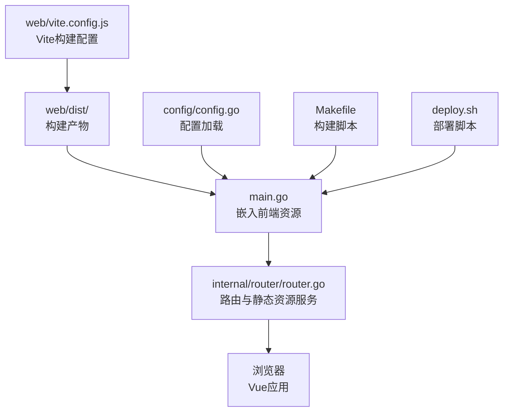
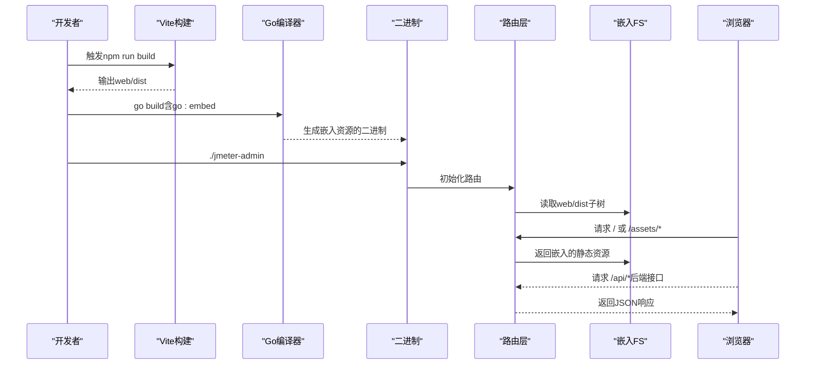
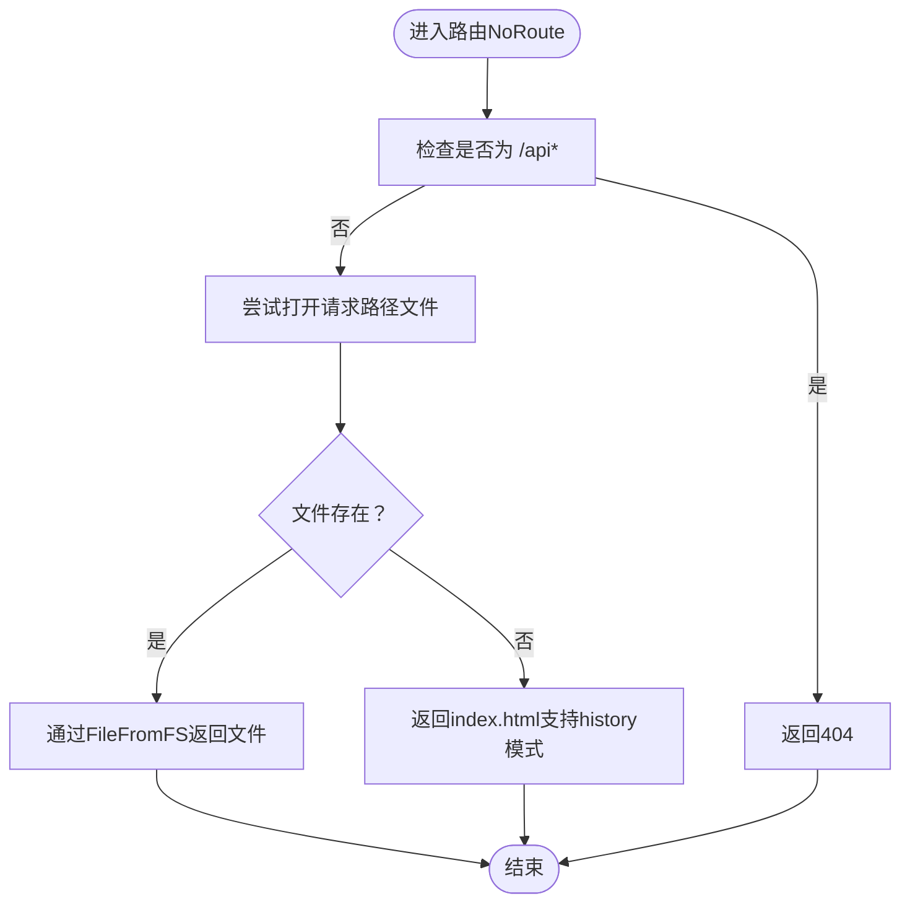
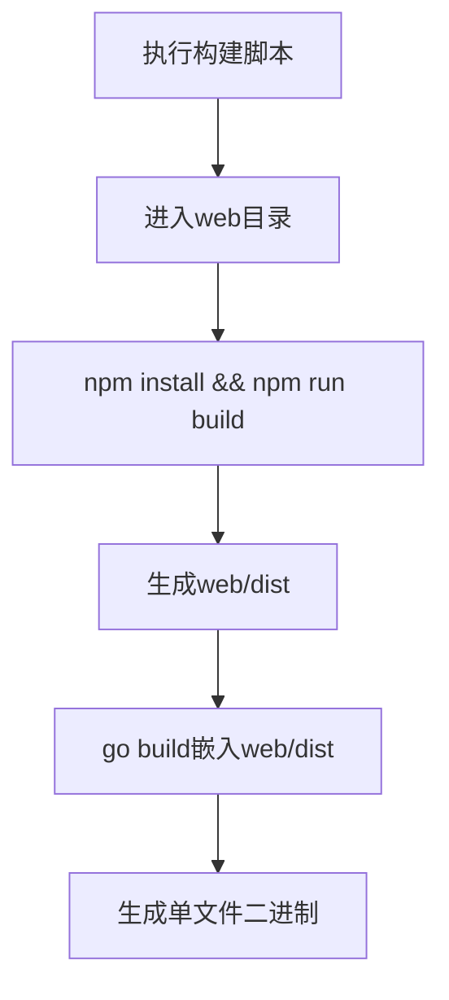
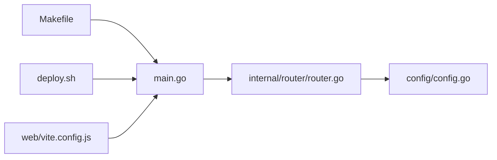

# 嵌入式资源架构

<cite>
**本文引用的文件**
- [main.go](file://main.go)
- [router.go](file://internal/router/router.go)
- [config.go](file://config/config.go)
- [vite.config.js](file://web/vite.config.js)
- [package.json](file://web/package.json)
- [Makefile](file://Makefile)
- [deploy.sh](file://deploy.sh)
- [index.html](file://web/dist/index.html)
- [config.yaml](file://config.yaml)
</cite>

## 目录
1. [简介](#简介)
2. [项目结构](#项目结构)
3. [核心组件](#核心组件)
4. [架构总览](#架构总览)
5. [组件详解](#组件详解)
6. [依赖关系分析](#依赖关系分析)
7. [性能考量](#性能考量)
8. [故障排除指南](#故障排除指南)
9. [结论](#结论)
10. [附录](#附录)

## 简介
本文件面向JMeter Admin项目的“嵌入式资源架构”，系统性阐述前端静态资源如何以go:embed方式打包进Go二进制文件，并在运行时作为静态资源提供给浏览器。文档覆盖以下主题：
- go:embed指令的使用与资源打包策略
- 前端Vite构建与资源嵌入的自动化流程
- 资源访问机制（静态文件服务、Vue Router历史模式回退）
- 版本控制与缓存策略建议
- 资源更新与热部署的考虑
- 架构优势（单文件部署、减少外部依赖）
- 最佳实践与故障排除

## 项目结构
JMeter Admin采用“前端Vite构建 + Go后端嵌入”的一体化架构：
- 前端位于web/目录，使用Vite进行构建，输出至web/dist
- 后端在main.go中通过go:embed将web/dist整体嵌入为embed.FS
- 路由层在internal/router/router.go中将嵌入的前端资源映射为静态文件服务，并处理Vue Router的history模式回退

**图示来源**
- [main.go:16-17](file://main.go#L16-L17)
- [router.go:80-109](file://internal/router/router.go#L80-L109)
- [vite.config.js:30-33](file://web/vite.config.js#L30-L33)
- [config.go:43-84](file://config/config.go#L43-L84)
- [Makefile:4-12](file://Makefile#L4-L12)
- [deploy.sh:48-92](file://deploy.sh#L48-L92)

**章节来源**
- [main.go:16-17](file://main.go#L16-L17)
- [router.go:80-109](file://internal/router/router.go#L80-L109)
- [vite.config.js:30-33](file://web/vite.config.js#L30-L33)
- [config.go:43-84](file://config/config.go#L43-L84)
- [Makefile:4-12](file://Makefile#L4-L12)
- [deploy.sh:48-92](file://deploy.sh#L48-L92)

## 核心组件
- 嵌入式前端资源
  - 在main.go中声明并嵌入web/dist目录，类型为embed.FS
  - 该FS在运行时被路由层转换为http.FS供文件系统接口使用
- 路由与静态资源服务
  - 在router.go中，将嵌入的FS子树映射为静态文件服务
  - 提供/api前缀的REST接口与/JMeter报告静态目录
  - 对于非API路由，回退到前端index.html，支持Vue Router history模式
- 配置系统
  - config.go负责加载config.yaml，包含服务端口、JMeter路径、目录配置等
- 构建与部署
  - Makefile与deploy.sh分别提供本地与服务器侧的一键构建与部署流程

**章节来源**
- [main.go:16-17](file://main.go#L16-L17)
- [router.go:80-109](file://internal/router/router.go#L80-L109)
- [config.go:43-84](file://config/config.go#L43-L84)
- [Makefile:4-12](file://Makefile#L4-L12)
- [deploy.sh:48-92](file://deploy.sh#L48-L92)

## 架构总览
下图展示从构建到运行时的资源流向与交互：

**图示来源**
- [vite.config.js:30-33](file://web/vite.config.js#L30-L33)
- [Makefile:4-12](file://Makefile#L4-L12)
- [main.go:16-17](file://main.go#L16-L17)
- [router.go:80-109](file://internal/router/router.go#L80-L109)

## 组件详解

### go:embed与资源打包策略
- 嵌入范围
  - 使用go:embed指令将web/dist整个目录嵌入为embed.FS
  - 在路由层通过fs.Sub提取web/dist子树，避免污染其他包内资源
- 资源访问
  - 将嵌入FS转换为http.FS，通过r.GET("/assets/*filepath")提供静态文件服务
  - 对于非API路由，NoRoute逻辑尝试打开请求路径对应文件；若不存在则回退到index.html，从而支持Vue Router history模式
- 版本控制与缓存
  - 前端构建产物包含内容指纹（如index-xxxxxx.js与index-yyyyyy.css），可利用浏览器缓存策略实现长效缓存
  - 当前端代码变更时，指纹变化促使浏览器拉取新资源，实现“零停机”更新

**图示来源**
- [router.go:92-109](file://internal/router/router.go#L92-L109)

**章节来源**
- [main.go:16-17](file://main.go#L16-L17)
- [router.go:80-109](file://internal/router/router.go#L80-L109)
- [index.html:9-10](file://web/dist/index.html#L9-L10)

### 前端Vite构建与资源嵌入自动化
- 构建配置
  - Vite将构建产物输出到web/dist，assetsDir为assets
  - 开发时通过proxy将/api与/reports转发至后端
- 自动化流程
  - Makefile提供build-frontend与build-backend目标，先构建前端再编译后端
  - deploy.sh在安装阶段自动检测并执行前端构建，确保web/dist存在后再嵌入编译
- 版本控制
  - 通过构建产物的指纹文件名实现强缓存与增量更新

**图示来源**
- [Makefile:4-12](file://Makefile#L4-L12)
- [deploy.sh:48-92](file://deploy.sh#L48-L92)
- [vite.config.js:30-33](file://web/vite.config.js#L30-L33)

**章节来源**
- [Makefile:4-12](file://Makefile#L4-L12)
- [deploy.sh:48-92](file://deploy.sh#L48-L92)
- [vite.config.js:30-33](file://web/vite.config.js#L30-L33)

### 资源访问机制与版本控制
- 静态文件服务
  - /assets/*路径映射到嵌入FS的web/dist/assets
  - /reports路径映射到配置的results目录，用于JMeter报告静态文件服务
- 路由回退
  - 非API路由回退到index.html，配合Vue Router history模式实现SPA
- 版本控制建议
  - 前端构建产物包含内容指纹，浏览器可长期缓存
  - 若需强制刷新，可在构建时引入版本号或构建时间戳字段，或通过服务端设置Cache-Control策略

**章节来源**
- [router.go:77-109](file://internal/router/router.go#L77-L109)
- [config.yaml:22-25](file://config.yaml#L22-L25)

### 资源更新与热部署考虑
- 更新策略
  - 通过重新构建前端并再次嵌入编译，实现资源更新
  - 由于前端资源随二进制发布，无需额外的静态文件服务器
- 热部署
  - 传统意义上的“热替换”在嵌入式架构下不适用
  - 建议采用蓝绿部署或滚动更新：先发布新二进制，再切换流量
- 日志与监控
  - 可结合后端日志与JMeter执行日志进行问题排查

**章节来源**
- [Makefile:4-12](file://Makefile#L4-L12)
- [deploy.sh:94-115](file://deploy.sh#L94-L115)

### 架构优势
- 单文件部署
  - 二进制包含前端资源，无需额外的静态文件服务器
- 减少外部依赖
  - 无需独立托管web/dist，简化运维与发布流程
- 一致性
  - 前后端版本绑定，避免资源版本不一致导致的问题

**章节来源**
- [main.go:16-17](file://main.go#L16-L17)
- [router.go:80-109](file://internal/router/router.go#L80-L109)

## 依赖关系分析
- main.go依赖router.go提供的SetupRouter函数，后者依赖embed.FS与配置系统
- 路由层依赖配置中的dirs配置，用于/JMeter报告静态文件服务
- 构建脚本与部署脚本确保web/dist存在并参与嵌入

**图示来源**
- [main.go:58](file://main.go#L58)
- [router.go:14](file://internal/router/router.go#L14)
- [config.go:43-84](file://config/config.go#L43-L84)
- [Makefile:4-12](file://Makefile#L4-L12)
- [deploy.sh:48-92](file://deploy.sh#L48-L92)
- [vite.config.js:30-33](file://web/vite.config.js#L30-L33)

**章节来源**
- [main.go:58](file://main.go#L58)
- [router.go:14](file://internal/router/router.go#L14)
- [config.go:43-84](file://config/config.go#L43-L84)
- [Makefile:4-12](file://Makefile#L4-L12)
- [deploy.sh:48-92](file://deploy.sh#L48-L92)
- [vite.config.js:30-33](file://web/vite.config.js#L30-L33)

## 性能考量
- 静态资源体积
  - 嵌入FS会增加二进制体积，建议启用压缩与按需加载策略
- 缓存策略
  - 利用构建产物指纹实现强缓存，降低带宽占用
- 并发访问
  - Gin默认中间件与嵌入FS的顺序读取在高并发场景下表现良好，建议结合反向代理与CDN优化

## 故障排除指南
- 前端构建失败
  - 检查Node.js与npm版本，确保网络可用
  - 使用deploy.sh的install流程自动安装依赖并构建
- 二进制缺少web/dist
  - 手动执行npm install && npm run build，或将web/dist上传至服务器
- 路由回退异常
  - 确认index.html存在且包含正确的script/link标签
  - 检查NoRoute逻辑是否正确识别/api前缀
- 静态资源404
  - 确认路由中"/assets/*filepath"映射与构建产物目录一致
- 部署与启动
  - 使用deploy.sh start启动，查看日志文件定位问题

**章节来源**
- [deploy.sh:48-92](file://deploy.sh#L48-L92)
- [deploy.sh:94-115](file://deploy.sh#L94-L115)
- [router.go:87-109](file://internal/router/router.go#L87-L109)
- [index.html:9-10](file://web/dist/index.html#L9-L10)

## 结论
JMeter Admin采用go:embed嵌入前端静态资源的架构，实现了“单文件部署、减少外部依赖”的目标。通过Vite构建与自动化脚本，前端资源被可靠地打包进二进制；路由层提供静态文件服务与Vue Router历史模式回退，保证SPA的正常运行。该架构适合中小型团队快速交付与运维，同时具备良好的扩展性与可维护性。

## 附录
- 关键配置项
  - config.yaml中的server.port、dirs.data、dirs.uploads、dirs.results等
- 常用命令
  - 本地开发：make dev
  - 构建：make build-all
  - 部署：./deploy.sh install && ./deploy.sh start

**章节来源**
- [config.yaml:5-25](file://config.yaml#L5-L25)
- [Makefile:28-38](file://Makefile#L28-L38)
- [deploy.sh:48-92](file://deploy.sh#L48-L92)