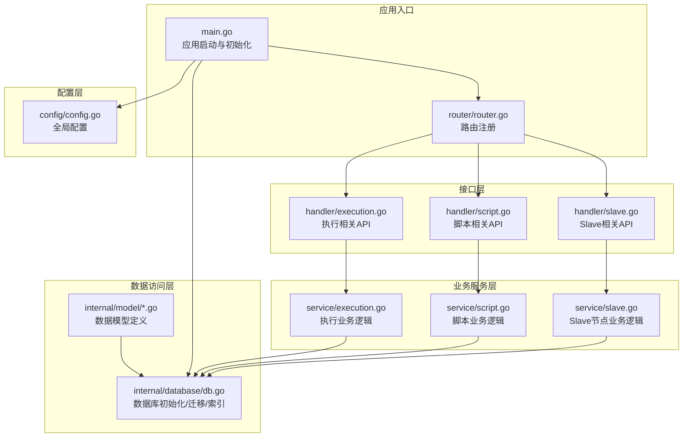
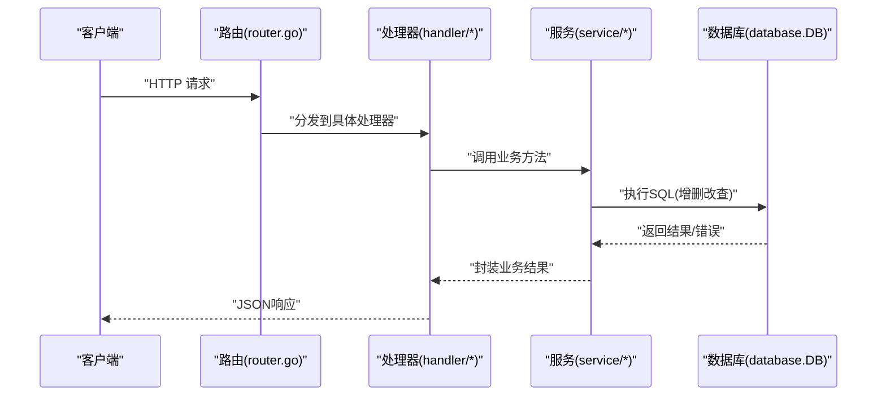
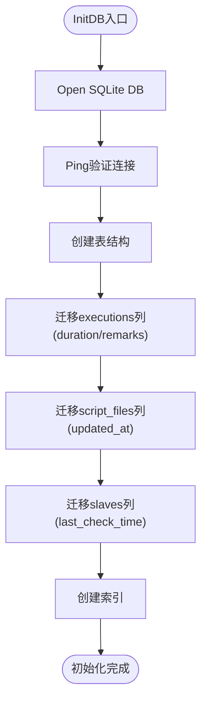
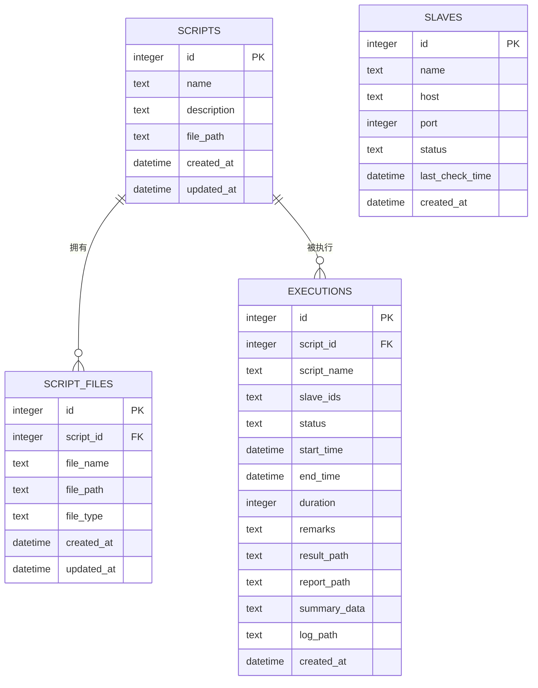
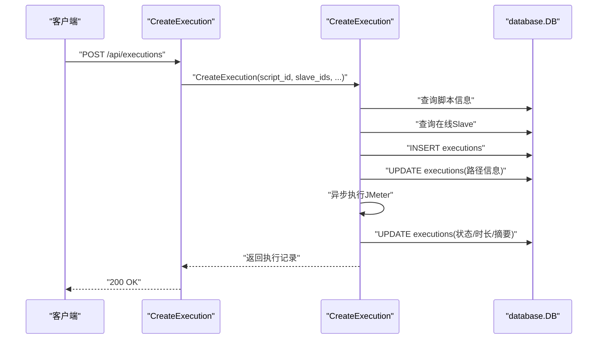
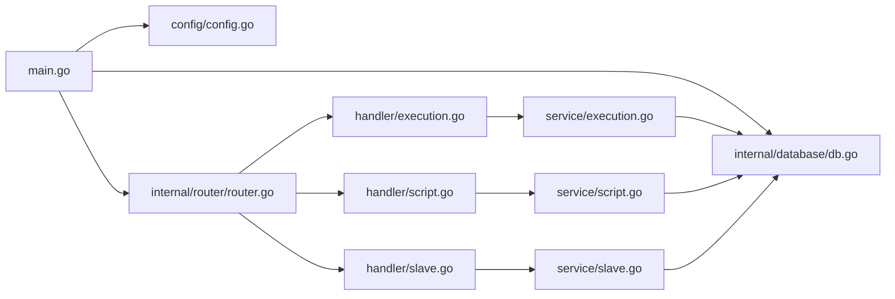

# 数据库集成架构

<cite>
**本文档引用的文件**
- [internal/database/db.go](file://internal/database/db.go)
- [internal/model/execution.go](file://internal/model/execution.go)
- [internal/model/script.go](file://internal/model/script.go)
- [internal/model/slave.go](file://internal/model/slave.go)
- [internal/service/execution.go](file://internal/service/execution.go)
- [internal/service/script.go](file://internal/service/script.go)
- [internal/service/slave.go](file://internal/service/slave.go)
- [internal/handler/execution.go](file://internal/handler/execution.go)
- [internal/handler/script.go](file://internal/handler/script.go)
- [internal/handler/slave.go](file://internal/handler/slave.go)
- [internal/router/router.go](file://internal/router/router.go)
- [config/config.go](file://config/config.go)
- [main.go](file://main.go)
</cite>

## 目录
1. [简介](#简介)
2. [项目结构](#项目结构)
3. [核心组件](#核心组件)
4. [架构概览](#架构概览)
5. [详细组件分析](#详细组件分析)
6. [依赖关系分析](#依赖关系分析)
7. [性能考量](#性能考量)
8. [故障排查指南](#故障排查指南)
9. [结论](#结论)
10. [附录](#附录)

## 简介
本文件面向JMeter Admin的数据库集成架构，重点阐述以下方面：
- SQLite作为嵌入式数据库的选择理由与集成方式
- 数据库连接管理、事务处理与并发控制机制
- ORM映射策略与数据模型到数据库表的对应关系
- 数据访问层设计（Repository模式）与数据操作封装
- 数据库初始化、迁移与版本管理策略
- 数据持久化的最佳实践（完整性约束、索引优化、查询性能）
- 数据库Schema设计与关系图

## 项目结构
JMeter Admin采用Go语言的分层架构，数据库集成位于internal/database包，配合internal/model、internal/service、internal/handler与internal/router形成清晰的数据流与职责分离。

图表来源
- [main.go:28-66](file://main.go#L28-L66)
- [internal/router/router.go:14-112](file://internal/router/router.go#L14-L112)
- [internal/database/db.go:15-34](file://internal/database/db.go#L15-L34)
- [internal/service/execution.go:104-481](file://internal/service/execution.go#L104-L481)
- [internal/service/script.go:86-116](file://internal/service/script.go#L86-L116)
- [internal/service/slave.go:44-69](file://internal/service/slave.go#L44-L69)

章节来源
- [main.go:28-66](file://main.go#L28-L66)
- [internal/router/router.go:14-112](file://internal/router/router.go#L14-L112)
- [internal/database/db.go:15-34](file://internal/database/db.go#L15-L34)

## 核心组件
- 数据库初始化与迁移：负责SQLite数据库文件创建、表结构初始化、列迁移与索引创建
- 数据模型：定义scripts、script_files、slaves、executions等实体
- 业务服务层：封装执行、脚本、Slave节点的业务逻辑，直接使用database.DB进行数据访问
- 接口层：提供REST API，调用业务服务层并返回标准响应
- 配置层：管理服务端口、JMeter路径、目录结构等

章节来源
- [internal/database/db.go:36-124](file://internal/database/db.go#L36-L124)
- [internal/model/execution.go:3-18](file://internal/model/execution.go#L3-L18)
- [internal/model/script.go:3-22](file://internal/model/script.go#L3-L22)
- [internal/model/slave.go:3-11](file://internal/model/slave.go#L3-L11)
- [internal/service/execution.go:104-481](file://internal/service/execution.go#L104-L481)
- [internal/service/script.go:86-116](file://internal/service/script.go#L86-L116)
- [internal/service/slave.go:44-69](file://internal/service/slave.go#L44-L69)
- [internal/handler/execution.go:39-53](file://internal/handler/execution.go#L39-L53)
- [internal/handler/script.go:53-108](file://internal/handler/script.go#L53-L108)
- [internal/handler/slave.go:34-48](file://internal/handler/slave.go#L34-L48)
- [config/config.go:10-39](file://config/config.go#L10-L39)

## 架构概览
JMeter Admin采用“单实例SQLite + 轻量级ORM（database/sql）”的嵌入式数据库方案。应用启动时初始化数据库，创建表与索引；业务服务通过统一的database.DB进行数据访问；接口层提供REST API；配置层集中管理路径与参数。

图表来源
- [internal/router/router.go:14-112](file://internal/router/router.go#L14-L112)
- [internal/handler/execution.go:39-53](file://internal/handler/execution.go#L39-L53)
- [internal/handler/script.go:53-108](file://internal/handler/script.go#L53-L108)
- [internal/handler/slave.go:34-48](file://internal/handler/slave.go#L34-L48)
- [internal/service/execution.go:104-481](file://internal/service/execution.go#L104-L481)
- [internal/service/script.go:86-116](file://internal/service/script.go#L86-L116)
- [internal/service/slave.go:44-69](file://internal/service/slave.go#L44-L69)
- [internal/database/db.go:15-34](file://internal/database/db.go#L15-L34)

## 详细组件分析

### 数据库初始化与迁移
- 初始化流程
  - 应用启动时根据配置确定数据目录，拼接SQLite数据库文件路径
  - 使用database/sql.Open("sqlite3", dbPath)打开数据库
  - Ping验证连接成功后，执行createTables创建表结构
  - 执行索引创建createIndexes
- 表结构与迁移
  - scripts：脚本元数据
  - script_files：脚本关联的文件（主JMX、CSV、JAR等）
  - slaves：Slave节点信息
  - executions：执行记录（包含冗余字段便于展示）
  - 迁移策略：通过pragma_table_info检查列是否存在，不存在则ALTER TABLE添加列，保证向后兼容
- 索引策略
  - executions表：script_id、status、created_at DESC
  - script_files表：script_id
  - 以上索引服务于分页查询与过滤场景

图表来源
- [internal/database/db.go:15-34](file://internal/database/db.go#L15-L34)
- [internal/database/db.go:36-124](file://internal/database/db.go#L36-L124)
- [internal/database/db.go:126-171](file://internal/database/db.go#L126-L171)
- [internal/database/db.go:173-189](file://internal/database/db.go#L173-L189)

章节来源
- [internal/database/db.go:15-34](file://internal/database/db.go#L15-L34)
- [internal/database/db.go:36-124](file://internal/database/db.go#L36-L124)
- [internal/database/db.go:126-171](file://internal/database/db.go#L126-L171)
- [internal/database/db.go:173-189](file://internal/database/db.go#L173-L189)

### 数据模型与表结构映射
- scripts
  - 字段：id、name、description、file_path、created_at、updated_at
  - 用途：脚本基本信息与主JMX文件路径
- script_files
  - 字段：id、script_id、file_name、file_path、file_type、created_at、updated_at
  - 关系：外键指向scripts.id，ON DELETE CASCADE
  - 用途：脚本关联的各类文件（JMX/CSV/JAR/其他）
- slaves
  - 字段：id、name、host、port、status、last_check_time、created_at
  - 用途：分布式Slave节点信息
- executions
  - 字段：id、script_id、script_name、slave_ids、status、start_time、end_time、duration、remarks、result_path、report_path、summary_data、log_path、created_at
  - 关系：外键指向scripts.id
  - 用途：执行记录与结果路径、统计摘要

图表来源
- [internal/database/db.go:38-98](file://internal/database/db.go#L38-L98)
- [internal/model/script.go:3-22](file://internal/model/script.go#L3-L22)
- [internal/model/script.go:14-22](file://internal/model/script.go#L14-L22)
- [internal/model/slave.go:3-11](file://internal/model/slave.go#L3-L11)
- [internal/model/execution.go:3-18](file://internal/model/execution.go#L3-L18)

章节来源
- [internal/database/db.go:38-98](file://internal/database/db.go#L38-L98)
- [internal/model/script.go:3-22](file://internal/model/script.go#L3-L22)
- [internal/model/script.go:14-22](file://internal/model/script.go#L14-L22)
- [internal/model/slave.go:3-11](file://internal/model/slave.go#L3-L11)
- [internal/model/execution.go:3-18](file://internal/model/execution.go#L3-L18)

### 数据访问层与Repository模式
- 当前实现采用轻量级ORM（database/sql），未引入第三方ORM框架
- Repository模式体现为：每个业务模块（execution/script/slave）对应一组数据访问函数，集中在service包内
- 数据访问函数直接使用database.DB，遵循“服务层封装、接口层调用”的分层原则
- 优点：简单直观、性能可控；缺点：缺乏强类型ORM的自动映射与复杂查询能力

章节来源
- [internal/service/execution.go:104-481](file://internal/service/execution.go#L104-L481)
- [internal/service/script.go:86-116](file://internal/service/script.go#L86-L116)
- [internal/service/slave.go:44-69](file://internal/service/slave.go#L44-L69)

### 事务处理与并发控制
- 事务处理
  - 代码中未显式使用Begin/Commit/Transaction API，表明当前业务以单条SQL为主
  - 对于跨多表的插入/更新（如创建执行记录后更新路径信息），建议在需要时使用显式事务以保证一致性
- 并发控制
  - database/sql默认连接池行为，未自定义连接池参数
  - 业务层未使用锁或信号量，主要依赖SQLite的串行写入特性
  - 建议：对高并发写入场景（大量执行记录）考虑连接池配置与事务封装

章节来源
- [internal/database/db.go:19-26](file://internal/database/db.go#L19-L26)
- [internal/service/execution.go:168-204](file://internal/service/execution.go#L168-L204)
- [internal/service/script.go:335-358](file://internal/service/script.go#L335-L358)

### 数据持久化最佳实践
- 完整性约束
  - 外键约束：script_files.script_id -> scripts.id（CASCADE）
  - executions.script_id -> scripts.id
  - 建议：在SQLite中启用外键检查（PRAGMA foreign_keys=ON），当前代码未显式设置
- 索引优化
  - executions表的script_id/status/created_at索引，满足分页与筛选需求
  - script_files表的script_id索引，满足按脚本查询文件列表
- 查询性能
  - 分页查询使用LIMIT/OFFSET，结合索引可获得较好性能
  - 建议：对高频查询字段增加复合索引（如executions(script_id,status)）

章节来源
- [internal/database/db.go:60-64](file://internal/database/db.go#L60-L64)
- [internal/database/db.go:97-98](file://internal/database/db.go#L97-L98)
- [internal/database/db.go:175-180](file://internal/database/db.go#L175-L180)

### 数据库初始化、迁移与版本管理
- 初始化：启动时创建数据库文件、表、索引
- 迁移：通过pragma_table_info检查列是否存在，不存在则ALTER TABLE添加
- 版本管理：当前通过列存在性检查实现向后兼容，未使用专门的迁移工具或版本号字段

章节来源
- [internal/database/db.go:126-171](file://internal/database/db.go#L126-L171)

### 执行流程与数据持久化
- 创建执行：查询脚本信息 -> 校验Slave在线 -> 插入executions记录 -> 更新路径信息 -> 异步执行JMeter -> 解析结果 -> 更新状态与摘要
- 查询执行：分页查询、按条件筛选、统计汇总
- 删除执行：删除执行记录（外键约束自动清理相关文件）

图表来源
- [internal/handler/execution.go:39-53](file://internal/handler/execution.go#L39-L53)
- [internal/service/execution.go:104-481](file://internal/service/execution.go#L104-L481)
- [internal/database/db.go:15-34](file://internal/database/db.go#L15-L34)

章节来源
- [internal/handler/execution.go:39-53](file://internal/handler/execution.go#L39-L53)
- [internal/service/execution.go:104-481](file://internal/service/execution.go#L104-L481)

### 脚本与文件管理
- 创建脚本：插入scripts记录，创建上传目录
- 上传文件：写入磁盘 -> 插入script_files记录 -> 若为JMX则更新scripts.file_path
- 删除脚本：删除scripts记录（外键CASCADE删除script_files）-> 删除磁盘文件与目录

章节来源
- [internal/service/script.go:86-116](file://internal/service/script.go#L86-L116)
- [internal/service/script.go:299-359](file://internal/service/script.go#L299-L359)
- [internal/service/script.go:179-227](file://internal/service/script.go#L179-L227)

### Slave节点管理
- 列表、创建、更新、删除
- 心跳检测：定时并发探测各Slave连通性，更新状态与最后检测时间

章节来源
- [internal/service/slave.go:15-41](file://internal/service/slave.go#L15-L41)
- [internal/service/slave.go:44-69](file://internal/service/slave.go#L44-L69)
- [internal/service/slave.go:112-157](file://internal/service/slave.go#L112-L157)
- [internal/service/slave.go:159-219](file://internal/service/slave.go#L159-L219)

## 依赖关系分析
- main.go负责加载配置、创建目录、初始化数据库、启动心跳、设置路由并启动HTTP服务
- router.go注册API路由，分发到对应的handler
- handler调用service层，service层直接使用database.DB
- database.DB为全局变量，贯穿整个应用生命周期

图表来源
- [main.go:28-66](file://main.go#L28-L66)
- [internal/router/router.go:14-112](file://internal/router/router.go#L14-L112)
- [internal/handler/execution.go:39-53](file://internal/handler/execution.go#L39-L53)
- [internal/handler/script.go:53-108](file://internal/handler/script.go#L53-L108)
- [internal/handler/slave.go:34-48](file://internal/handler/slave.go#L34-L48)
- [internal/service/execution.go:104-481](file://internal/service/execution.go#L104-L481)
- [internal/service/script.go:86-116](file://internal/service/script.go#L86-L116)
- [internal/service/slave.go:44-69](file://internal/service/slave.go#L44-L69)
- [internal/database/db.go:15-34](file://internal/database/db.go#L15-L34)

章节来源
- [main.go:28-66](file://main.go#L28-L66)
- [internal/router/router.go:14-112](file://internal/router/router.go#L14-L112)

## 性能考量
- SQLite优势
  - 无需独立服务进程，部署简单
  - 适合中小规模数据与单机场景
- 性能瓶颈
  - 写入竞争：大量并发写入可能导致锁争用
  - 查询性能：缺少复合索引与查询计划优化
- 优化建议
  - 启用外键检查与WAL模式（如需）
  - 为高频查询字段建立复合索引
  - 对批量写入使用事务包裹
  - 考虑连接池参数调优

[本节为通用指导，不直接分析具体文件]

## 故障排查指南
- 数据库连接失败
  - 检查数据目录权限与路径配置
  - 确认SQLite驱动已正确导入
- 表结构异常
  - 检查迁移逻辑是否成功执行
  - 确认索引创建语句无语法错误
- 查询性能差
  - 检查WHERE条件是否命中索引
  - 评估分页参数与排序字段
- 外键约束问题
  - 确认SQLite外键检查已启用
  - 检查删除顺序与CASCADE行为

章节来源
- [internal/database/db.go:19-26](file://internal/database/db.go#L19-L26)
- [internal/database/db.go:126-171](file://internal/database/db.go#L126-L171)
- [internal/database/db.go:173-189](file://internal/database/db.go#L173-L189)

## 结论
JMeter Admin采用SQLite嵌入式数据库，结合轻量级ORM与分层架构，实现了脚本、文件、Slave节点与执行记录的完整数据管理。通过初始化、迁移与索引策略，满足了中小规模场景下的数据持久化需求。未来可在事务封装、索引优化与连接池配置等方面进一步增强，以应对更高并发与更复杂的查询需求。

[本节为总结性内容，不直接分析具体文件]

## 附录
- 配置项说明
  - server.port：HTTP服务监听端口
  - jmeter.path：JMeter可执行文件路径
  - jmeter.master_hostname：分布式回调主机名
  - slave.heartbeat_interval：Slave心跳检测间隔（秒）
  - dirs.data/uploads/results：数据、上传、结果目录

章节来源
- [config/config.go:18-39](file://config/config.go#L18-L39)