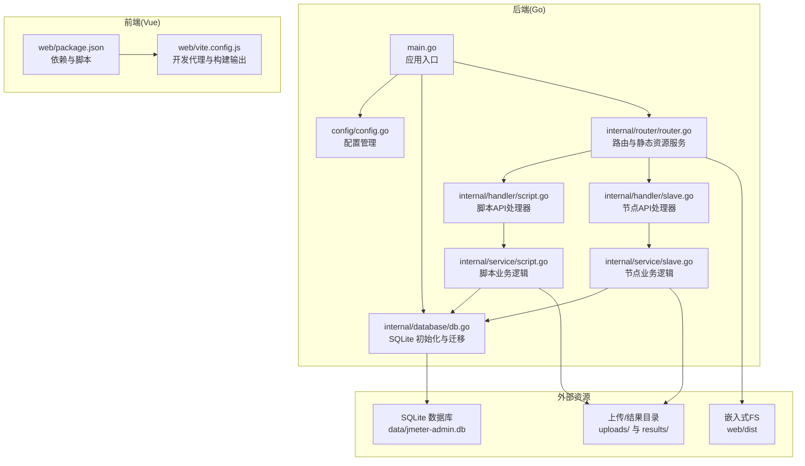
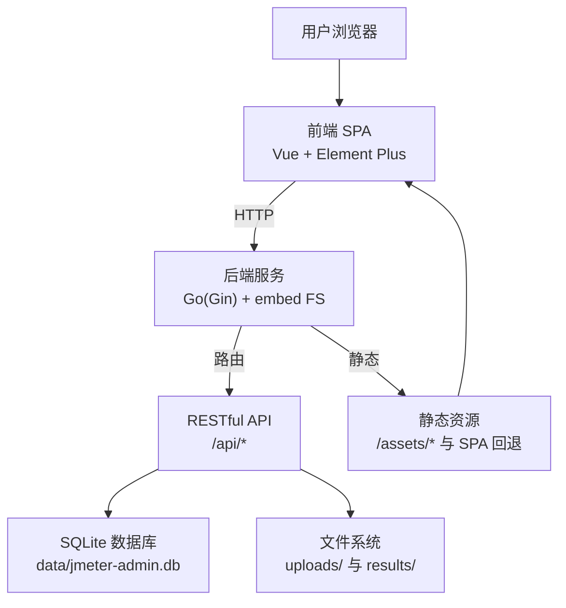
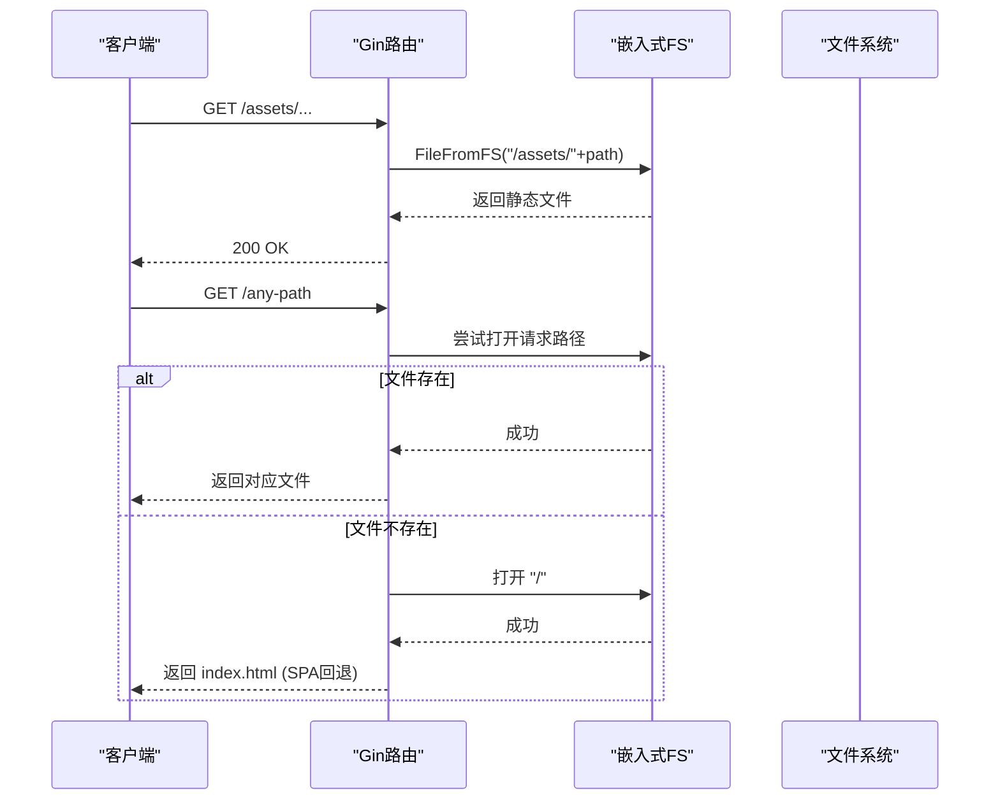
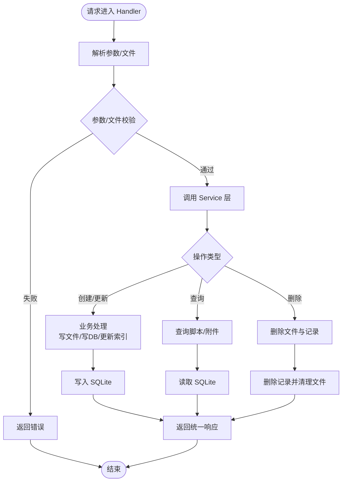
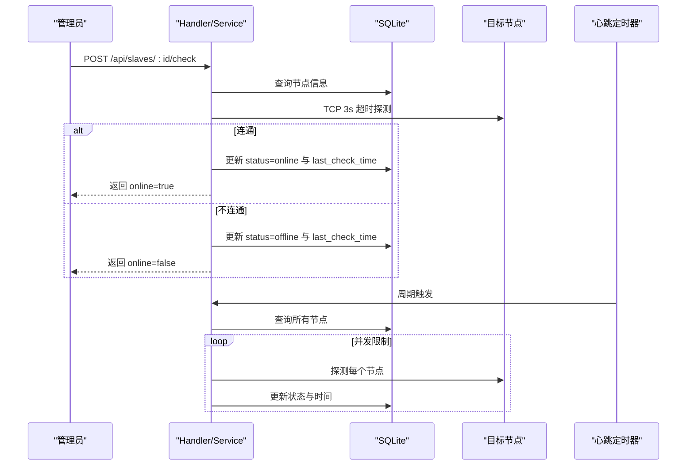
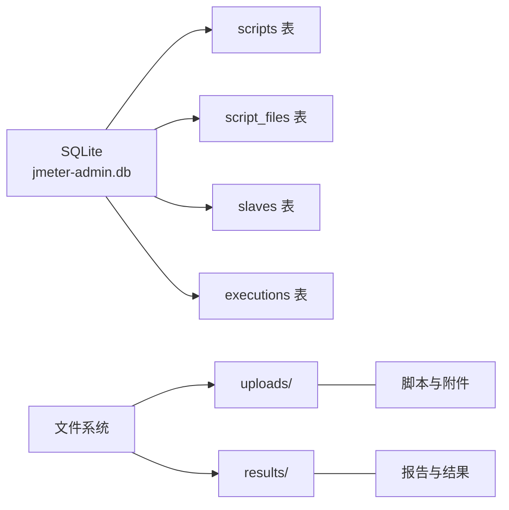
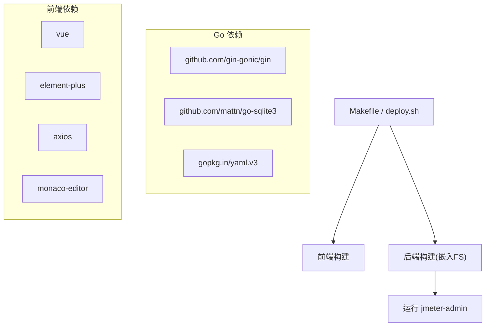

# 整体架构概览

<cite>
**本文引用的文件**
- [main.go](file://main.go)
- [go.mod](file://go.mod)
- [README.md](file://README.md)
- [config/config.go](file://config/config.go)
- [internal/router/router.go](file://internal/router/router.go)
- [internal/database/db.go](file://internal/database/db.go)
- [internal/handler/script.go](file://internal/handler/script.go)
- [internal/service/script.go](file://internal/service/script.go)
- [internal/handler/slave.go](file://internal/handler/slave.go)
- [internal/service/slave.go](file://internal/service/slave.go)
- [web/package.json](file://web/package.json)
- [web/vite.config.js](file://web/vite.config.js)
- [Makefile](file://Makefile)
- [deploy.sh](file://deploy.sh)
- [internal/model/script.go](file://internal/model/script.go)
</cite>

## 目录
1. [简介](#简介)
2. [项目结构](#项目结构)
3. [核心组件](#核心组件)
4. [架构总览](#架构总览)
5. [详细组件分析](#详细组件分析)
6. [依赖关系分析](#依赖关系分析)
7. [性能考量](#性能考量)
8. [故障排查指南](#故障排查指南)
9. [结论](#结论)
10. [附录](#附录)

## 简介
本项目是一个“单文件部署”的 JMeter 分布式压测管理平台，采用 Go（Gin）+ Vue 3（Element Plus）+ SQLite 技术栈。前端静态资源被嵌入到 Go 二进制文件中，最终生成单一可执行文件，实现零依赖部署。系统提供 JMX 脚本管理、Slave 节点管理、分布式压测执行、执行记录管理、实时日志与报告导出等能力。

## 项目结构
项目采用“后端 Go + 前端 Vue”分离架构，后端通过 Gin 提供 RESTful API，并以嵌入式文件系统的方式提供前端静态资源；前端通过 Vite 构建，开发时通过代理将 /api 请求转发至后端。

图表来源
- [main.go:28-66](file://main.go#L28-L66)
- [config/config.go:43-84](file://config/config.go#L43-L84)
- [internal/router/router.go:14-112](file://internal/router/router.go#L14-L112)
- [internal/database/db.go:15-34](file://internal/database/db.go#L15-L34)
- [web/vite.config.js:9-34](file://web/vite.config.js#L9-L34)

章节来源
- [README.md:92-120](file://README.md#L92-L120)
- [Makefile:1-39](file://Makefile#L1-L39)
- [deploy.sh:48-92](file://deploy.sh#L48-L92)

## 核心组件
- 应用入口与生命周期
  - 初始化配置、创建目录、初始化数据库、清理陈旧执行记录、启动 Slave 心跳检测、设置路由并启动 HTTP 服务。
- 配置管理
  - 默认配置、加载/保存 YAML 配置，支持服务端口、JMeter 路径、Master 主机名、Slave 心跳间隔、目录等。
- 路由与静态资源
  - 注册 /api 路由组，提供脚本、节点、执行、系统配置等 API；通过嵌入式 FS 提供前端静态资源与 SPA 回退。
- 数据层
  - SQLite 初始化与表结构迁移，包含 scripts、script_files、slaves、executions 表及索引。
- 业务服务
  - 脚本管理：列表、创建、详情、更新、删除、下载、JMX 内容读写、附件上传/删除。
  - 节点管理：列表、增删改、连通性检测、心跳状态维护。
- 前端工程
  - Vue 3 + Element Plus + Axios，Vite 开发与构建，开发代理将 /api 与 /reports 转发至后端。

章节来源
- [main.go:19-66](file://main.go#L19-L66)
- [config/config.go:43-113](file://config/config.go#L43-L113)
- [internal/router/router.go:14-112](file://internal/router/router.go#L14-L112)
- [internal/database/db.go:15-197](file://internal/database/db.go#L15-L197)
- [internal/service/script.go:18-540](file://internal/service/script.go#L18-L540)
- [internal/service/slave.go:15-220](file://internal/service/slave.go#L15-L220)
- [web/package.json:1-24](file://web/package.json#L1-L24)
- [web/vite.config.js:9-34](file://web/vite.config.js#L9-L34)

## 架构总览
系统采用“前后端分离 + 嵌入式资源”的全栈架构模式：
- 后端（Go/Gin）：提供 RESTful API，负责业务处理、数据库访问与文件系统操作。
- 前端（Vue）：SPA 应用，通过 Axios 调用 /api 接口，静态资源由后端统一提供。
- 嵌入式资源：使用 Go 1.16+ 的 embed 包将 web/dist 嵌入二进制，运行时通过 http.FS 提供静态文件与 SPA 回退。
- 数据存储：SQLite，位于 data/jmeter-admin.db，配合 uploads/results 目录存放脚本与执行结果。

图表来源
- [internal/router/router.go:77-112](file://internal/router/router.go#L77-L112)
- [internal/database/db.go:15-34](file://internal/database/db.go#L15-L34)
- [main.go:16-17](file://main.go#L16-L17)

## 详细组件分析

### 组件A：嵌入式前端资源与路由
- 设计要点
  - 使用 //go:embed 将 web/dist 整包嵌入，运行时通过 http.FS 提供静态资源。
  - /assets/* 路由直接映射到嵌入式 FS；其他未匹配路由回退到 index.html，支持 Vue Router history 模式。
  - /reports 静态文件服务指向 results 目录，用于直接访问 JMeter 报告。
- 优势
  - 单文件部署，无需额外静态服务器；前后端版本一致，减少发布复杂度。
- 注意事项
  - 前端构建产物需在构建后端前生成（Makefile 与 deploy.sh 已内置流程）。

图表来源
- [internal/router/router.go:87-109](file://internal/router/router.go#L87-L109)
- [main.go:16-17](file://main.go#L16-L17)

章节来源
- [internal/router/router.go:14-112](file://internal/router/router.go#L14-L112)
- [Makefile:4-12](file://Makefile#L4-L12)
- [deploy.sh:54-74](file://deploy.sh#L54-L74)

### 组件B：脚本管理模块（Handler → Service → Database）
- 处理器职责
  - 解析请求、参数校验、调用服务层、返回统一响应模型。
- 服务层职责
  - 业务规则：分页查询、创建脚本、读写 JMX 内容、附件上传/删除、XML 校验、目录与文件管理。
- 数据层职责
  - 表结构与索引、迁移策略、连接池与健康检查。
- 数据流
  - 用户上传 JMX → 服务层写入 uploads/{id}/ 并记录到 script_files → 更新 scripts.file_path。
  - 用户查看脚本 → 服务层查询 scripts 与 script_files → 返回聚合数据。
  - 用户下载 → 服务层返回主文件路径与文件名。

图表来源
- [internal/handler/script.go:37-108](file://internal/handler/script.go#L37-L108)
- [internal/service/script.go:85-116](file://internal/service/script.go#L85-L116)
- [internal/database/db.go:36-124](file://internal/database/db.go#L36-L124)

章节来源
- [internal/handler/script.go:37-327](file://internal/handler/script.go#L37-L327)
- [internal/service/script.go:18-540](file://internal/service/script.go#L18-L540)
- [internal/model/script.go:1-23](file://internal/model/script.go#L1-L23)
- [internal/database/db.go:15-197](file://internal/database/db.go#L15-L197)

### 组件C：Slave 节点管理与心跳检测
- 功能点
  - 列表、新增、修改、删除、连通性检测、心跳状态维护。
  - 后台定时任务并发检测所有节点，更新状态与最后检测时间。
- 并发控制
  - 使用信号量限制并发数量，避免对网络与数据库造成过大压力。
- 配置联动
  - 通过 /api/config 接口读取/更新 master_hostname，用于 JMeter RMI 回调 IP。

图表来源
- [internal/handler/slave.go:97-122](file://internal/handler/slave.go#L97-L122)
- [internal/service/slave.go:112-157](file://internal/service/slave.go#L112-L157)
- [internal/service/slave.go:159-220](file://internal/service/slave.go#L159-L220)

章节来源
- [internal/handler/slave.go:16-236](file://internal/handler/slave.go#L16-L236)
- [internal/service/slave.go:15-220](file://internal/service/slave.go#L15-L220)

### 组件D：数据库与文件系统
- 数据库
  - 初始化 SQLite，创建表与索引，执行迁移（新增列）。
- 文件系统
  - uploads/{script_id}/ 存放脚本与附件；results/ 用于存放 JMeter 报告与结果。
- 目录创建
  - 启动时自动创建 data、uploads、results 目录。

图表来源
- [internal/database/db.go:36-124](file://internal/database/db.go#L36-L124)
- [main.go:68-82](file://main.go#L68-L82)

章节来源
- [internal/database/db.go:15-197](file://internal/database/db.go#L15-L197)
- [main.go:34-38](file://main.go#L34-L38)

## 依赖关系分析
- 后端依赖
  - Gin：Web 框架与路由。
  - sqlite3：SQLite 驱动（CGO）。
  - yaml.v3：配置文件解析与序列化。
- 前端依赖
  - Vue 3、Element Plus、Vue Router、Axios、Monaco Editor 等。
- 构建与部署
  - Makefile：统一构建前端与后端，支持交叉编译与开发模式。
  - deploy.sh：一键安装依赖、编译、启动、systemd 服务安装。

图表来源
- [go.mod:5-9](file://go.mod#L5-L9)
- [web/package.json:10-22](file://web/package.json#L10-L22)
- [Makefile:4-17](file://Makefile#L4-L17)
- [deploy.sh:48-92](file://deploy.sh#L48-L92)

章节来源
- [go.mod:1-42](file://go.mod#L1-L42)
- [web/package.json:1-24](file://web/package.json#L1-L24)
- [Makefile:1-39](file://Makefile#L1-L39)
- [deploy.sh:48-92](file://deploy.sh#L48-L92)

## 性能考量
- 嵌入式资源
  - 减少静态文件分发与缓存复杂度，降低运维成本；但会增大二进制体积。
- 数据库
  - SQLite 适合中小规模数据与单实例部署；若并发高或数据量大，建议评估迁移至更高性能数据库。
- 并发与限流
  - 节点心跳检测使用信号量限制并发，避免资源争用；上传接口对单文件与总大小进行限制，防止资源滥用。
- 前后端分离
  - 前端独立构建与缓存，后端专注 API 与数据处理，便于横向扩展与容器化。

## 故障排查指南
- 常见问题
  - CGO/SQLite 编译失败：确认已安装 gcc。
  - 前端构建缓慢：使用国内镜像源或离线构建。
  - Slave 连接失败：检查 master_hostname、防火墙、RMI SSL 配置。
  - JMeter OOM：系统自动按可用内存分配堆大小。
  - SQLite 迁移报错：删除数据库文件后重启服务自动重建。
- 日志与状态
  - 后端日志输出于运行目录；可通过 deploy.sh status 查看进程与监听端口。

章节来源
- [README.md:270-312](file://README.md#L270-L312)
- [deploy.sh:117-172](file://deploy.sh#L117-L172)

## 结论
该系统通过“Go 后端 + Vue 前端 + 嵌入式资源 + SQLite”的组合，实现了轻量、易部署、功能完备的 JMeter 分布式压测管理平台。其优势在于单文件部署、前后端解耦、清晰的模块划分与良好的扩展性。适用于中小团队或单机部署场景，若需更高并发或更大规模数据，可在保持 API 兼容的前提下替换存储与引入缓存/消息队列等中间件。

## 附录
- API 一览（节选）
  - 脚本管理：列表、创建、详情、更新、删除、下载、JMX 内容读写、附件上传/删除。
  - 节点管理：列表、新增、更新、删除、连通性检测、心跳状态。
  - 执行管理：列表、统计、创建、详情、停止、实时日志、错误分析、结果下载。
  - 系统配置：网卡列表、Master 主机名读取与更新。
- 数据库表结构（节选）
  - scripts、script_files、slaves、executions，含索引与迁移字段。

章节来源
- [README.md:122-230](file://README.md#L122-L230)
- [internal/database/db.go:36-124](file://internal/database/db.go#L36-L124)