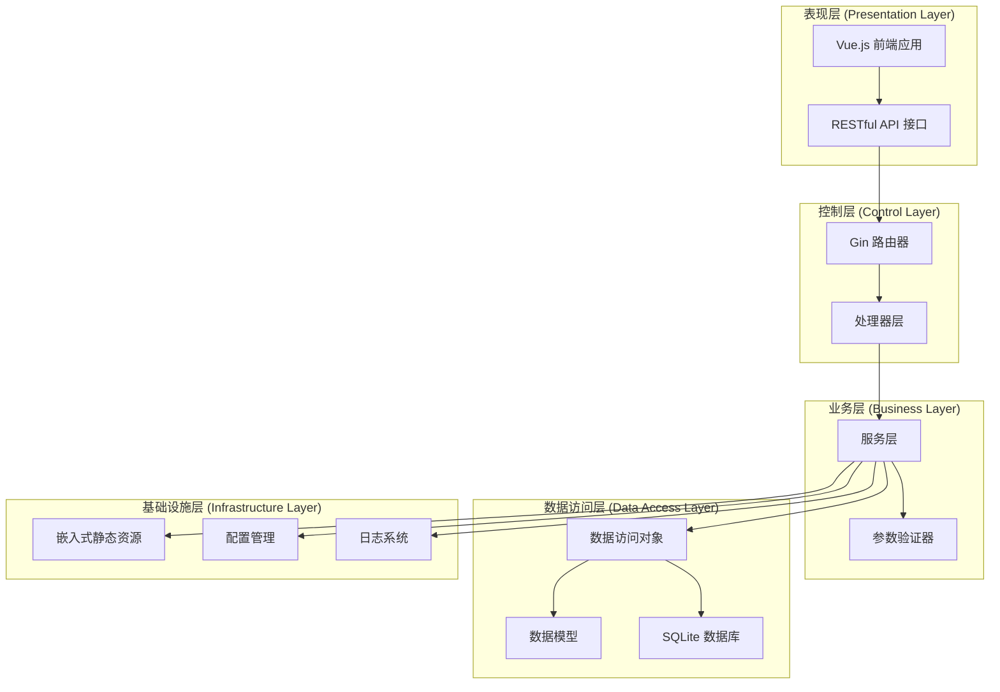
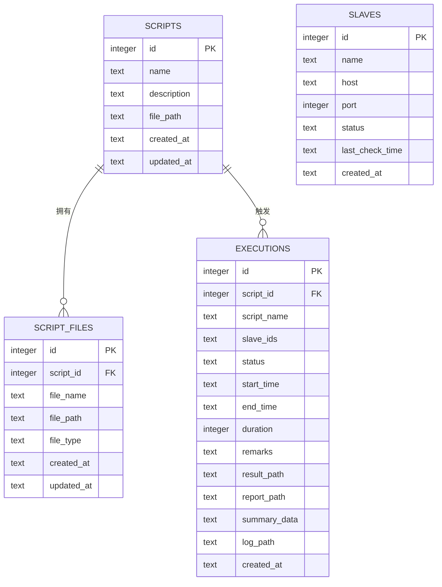
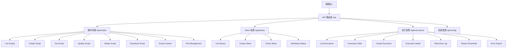
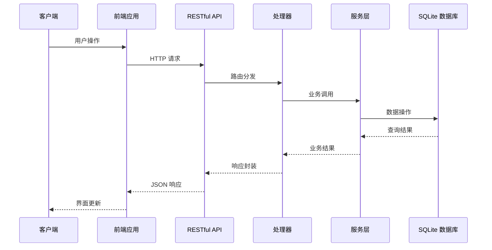
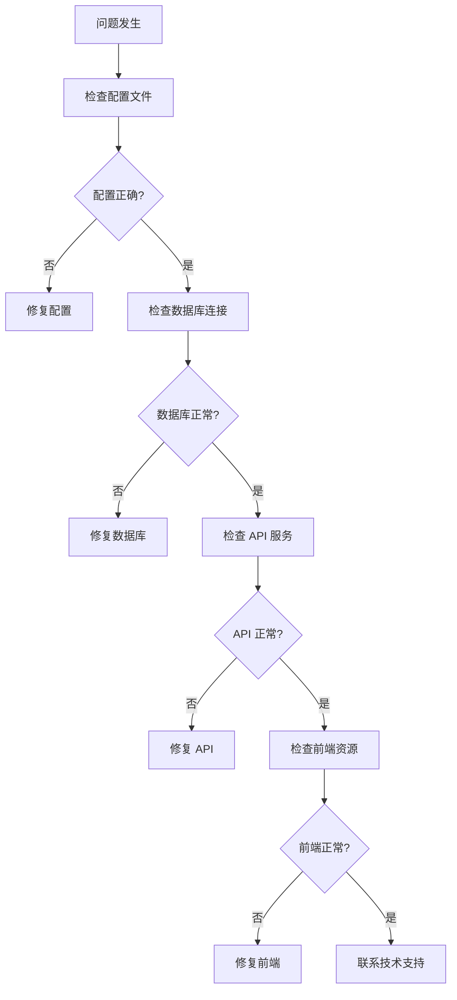

# 系统架构设计

<cite>
**本文档引用的文件**
- [main.go](file://main.go)
- [go.mod](file://go.mod)
- [config/config.go](file://config/config.go)
- [internal/router/router.go](file://internal/router/router.go)
- [internal/database/db.go](file://internal/database/db.go)
- [internal/handler/script.go](file://internal/handler/script.go)
- [internal/handler/slave.go](file://internal/handler/slave.go)
- [internal/handler/execution.go](file://internal/handler/execution.go)
- [internal/model/script.go](file://internal/model/script.go)
- [internal/model/slave.go](file://internal/model/slave.go)
- [internal/service/script.go](file://internal/service/script.go)
- [internal/service/slave.go](file://internal/service/slave.go)
- [internal/service/execution.go](file://internal/service/execution.go)
- [web/src/api/request.js](file://web/src/api/request.js)
- [web/src/router/index.js](file://web/src/router/index.js)
- [web/package.json](file://web/package.json)
- [README.md](file://README.md)
</cite>

## 更新摘要
**所做更改**
- 更新文档管理策略章节，反映架构文档现在通过README.md提供
- 完善整体架构概览，强调前后端分离设计
- 增强数据库架构说明，包含SQLite选择理由和迁移策略
- 详细化路由设计，涵盖中间件和静态资源处理
- 补充嵌入式资源架构，说明前端构建和部署流程
- 新增系统边界图和组件交互图
- 完善技术决策的权衡考虑和约束条件分析

## 目录
1. [简介](#简介)
2. [整体架构概览](#整体架构概览)
3. [分层架构设计](#分层架构设计)
4. [数据库集成架构](#数据库集成架构)
5. [路由设计架构](#路由设计架构)
6. [嵌入式资源架构](#嵌入式资源架构)
7. [系统边界与组件交互](#系统边界与组件交互)
8. [技术决策与权衡](#技术决策与权衡)
9. [性能优化策略](#性能优化策略)
10. [故障排查指南](#故障排查指南)
11. [结论](#结论)
12. [附录](#附录)

## 简介
JMeter Admin 是一个基于 Go 和 Vue.js 的单文件部署 JMeter 分布式压测管理平台。系统采用前后端分离架构，后端使用 Gin 框架提供 RESTful API，前端使用 Vue 3 + Element Plus 构建用户界面。数据库采用 SQLite 实现数据持久化，所有静态资源被嵌入到 Go 二进制文件中，最终生成单一可执行文件，实现零依赖部署。

**文档管理策略变更**：架构文档现在通过项目根目录的 README.md 提供，包含完整的系统架构说明、API 文档和部署指南。这种集中式的文档管理方式简化了文档维护，确保架构信息与代码实现保持同步。

## 整体架构概览
系统采用现代化的分层架构设计，遵循关注点分离原则，通过清晰的职责划分实现高内聚低耦合：



**图表来源**
- [main.go:28-66](file://main.go#L28-L66)
- [internal/router/router.go:14-112](file://internal/router/router.go#L14-L112)
- [internal/handler/script.go:37-108](file://internal/handler/script.go#L37-L108)
- [internal/service/script.go:18-83](file://internal/service/script.go#L18-L83)
- [internal/database/db.go:15-34](file://internal/database/db.go#L15-L34)

### 架构特性
- **前后端分离**: 前端通过 HTTP API 与后端通信，实现完全解耦
- **单文件部署**: 静态资源嵌入二进制，生成独立可执行文件
- **微服务化思维**: 每个模块职责单一，便于维护和扩展
- **无状态设计**: 通过数据库实现状态持久化，支持水平扩展

## 分层架构设计
系统采用经典的四层架构模式，每层都有明确的职责和边界：

### 表现层 (Presentation Layer)
- **职责**: 处理用户交互，渲染界面，发送请求
- **实现**: Vue.js 应用，Element Plus UI 组件库
- **特点**: 响应式设计，组件化开发，路由管理

### 控制层 (Control Layer)
- **职责**: 接收请求，参数验证，调用业务逻辑，返回响应
- **实现**: Gin 框架，中间件机制，路由分组
- **特点**: 中间件链式处理，统一错误处理，CORS 支持

### 业务层 (Business Layer)
- **职责**: 实现核心业务逻辑，协调数据访问，处理复杂业务规则
- **实现**: 服务类封装，事务管理，业务规则验证
- **特点**: 业务逻辑集中，易于测试，可复用性强

### 数据访问层 (Data Access Layer)
- **职责**: 提供数据持久化接口，抽象数据库操作
- **实现**: SQLite 驱动，SQL 查询封装，迁移管理
- **特点**: 数据库无关，支持迁移，事务支持

**章节来源**
- [internal/router/router.go:14-129](file://internal/router/router.go#L14-L129)
- [internal/handler/script.go:37-327](file://internal/handler/script.go#L37-L327)
- [internal/service/script.go:18-540](file://internal/service/script.go#L18-L540)
- [internal/database/db.go:15-197](file://internal/database/db.go#L15-L197)

## 数据库集成架构
系统采用 SQLite 作为数据存储方案，通过 gopkg.in/yaml.v3 实现配置管理。

### 数据库设计


**图表来源**
- [internal/database/db.go:36-124](file://internal/database/db.go#L36-L124)

### 数据库特性
- **零配置**: SQLite 无需单独安装，直接使用
- **单文件**: 数据库文件便于备份和迁移
- **ACID 支持**: 保证数据一致性和可靠性
- **自动迁移**: 支持表结构动态升级

### 索引优化
系统为关键查询建立索引以提升性能：
- `idx_executions_script_id`: 按脚本 ID 查询执行记录
- `idx_executions_status`: 按状态过滤执行记录
- `idx_executions_created_at`: 按时间倒序排列
- `idx_script_files_script_id`: 按脚本 ID 查询附件

**章节来源**
- [internal/database/db.go:173-189](file://internal/database/db.go#L173-L189)

## 路由设计架构
系统采用 Gin 框架的路由分组机制，实现清晰的 API 结构。

### 路由分组设计


**图表来源**
- [internal/router/router.go:20-75](file://internal/router/router.go#L20-L75)

### 中间件机制
系统实现统一的中间件处理链：

#### CORS 中间件
- 允许跨域请求
- 支持预检请求处理
- 配置响应头

#### 静态资源中间件
- `/reports`: 执行结果文件服务
- `/assets/*`: 嵌入式前端资源
- `NoRoute`: Vue Router 历史模式支持

### 错误处理机制
- 统一错误响应格式
- 状态码标准化
- 详细的错误信息

**章节来源**
- [internal/router/router.go:114-129](file://internal/router/router.go#L114-L129)

## 嵌入式资源架构
系统采用 Go 1.16+ 的 embed 包实现静态资源嵌入。

### 嵌入策略
```mermaid
graph LR
BUILD[构建阶段] --> EMBED[go:embed 嵌入]
EMBED --> BIN[二进制文件]
BIN --> RUNTIME[运行时加载]
WEB_DIST[web/dist 目录] --> EMBED
EMBED --> FRONTEND_FS[frontendFS]
FRONTEND_FS --> ASSETS_ROUTE[/assets/* 路由]
ASSETS_ROUTE --> STATIC_SERVE[静态文件服务]
```

**图表来源**
- [main.go:16-17](file://main.go#L16-L17)
- [internal/router/router.go:80-109](file://internal/router/router.go#L80-L109)

### 部署流程
1. **前端构建**: `npm run build` 生成 `web/dist` 目录
2. **资源嵌入**: 编译时将 `web/dist` 嵌入到二进制
3. **单文件生成**: 生成独立可执行文件
4. **运行部署**: 直接运行二进制文件，无需额外依赖

### 资源组织
- **静态文件**: CSS、JS、图片等
- **配置文件**: `config.yaml` 默认配置
- **上传文件**: 脚本附件和执行结果
- **报告文件**: JMeter 执行报告

**章节来源**
- [main.go:16-17](file://main.go#L16-L17)
- [internal/router/router.go:77-112](file://internal/router/router.go#L77-L112)

## 系统边界与组件交互
系统边界清晰，组件间通过明确定义的接口进行交互。

### 外部接口


**图表来源**
- [web/src/api/request.js:1-103](file://web/src/api/request.js#L1-103)
- [internal/handler/script.go:37-108](file://internal/handler/script.go#L37-L108)
- [internal/service/script.go:18-83](file://internal/service/script.go#L18-L83)

### 内部组件交互
系统内部组件通过依赖注入和接口抽象实现松耦合：

#### 处理器层
- 参数验证和转换
- 调用服务层业务逻辑
- 统一响应格式化

#### 服务层
- 业务规则实现
- 数据访问协调
- 外部工具集成

#### 数据访问层
- SQL 查询封装
- 事务管理
- 连接池管理

**章节来源**
- [internal/handler/script.go:37-327](file://internal/handler/script.go#L37-L327)
- [internal/service/script.go:18-540](file://internal/service/script.go#L18-L540)

## 技术决策与权衡
系统在技术选型上充分考虑了易用性、性能和可维护性。

### 核心技术选型
| 组件 | 技术选择 | 选择理由 |
|------|----------|----------|
| 后端框架 | Gin | 轻量级、高性能、中间件丰富 |
| 前端框架 | Vue 3 | 组件化、响应式、生态完善 |
| 数据库 | SQLite | 零配置、单文件、部署简单 |
| 静态资源 | go:embed | 单文件部署、无外部依赖 |
| 配置管理 | YAML | 人类可读、版本控制友好 |

### 架构权衡
- **性能 vs 复杂度**: 选择 SQLite 简化部署，牺牲部分性能
- **功能完整性 vs 维护成本**: 单文件部署简化运维，限制高级功能
- **开发效率 vs 生产稳定性**: 前端热重载提升开发体验
- **扩展性 vs 复杂性**: 当前设计专注单机场景，便于快速迭代

### 约束条件
- **部署要求**: 需要 Go 1.21+ 运行环境
- **数据库限制**: SQLite 不支持复杂的分布式特性
- **并发限制**: 单实例部署，无内置负载均衡
- **存储限制**: 适合中小规模数据，大数据量需考虑迁移

## 性能优化策略
系统在多个层面实施性能优化措施：

### 数据库优化
- **索引策略**: 为高频查询字段建立索引
- **查询优化**: 使用参数化查询，避免 SQL 注入
- **连接池**: 合理配置数据库连接数
- **事务管理**: 批量操作使用事务提升性能

### 缓存策略
- **内存缓存**: 热点数据缓存到内存
- **文件缓存**: 静态资源缓存到本地
- **CDN 支持**: 可扩展 CDN 加速静态资源

### 网络优化
- **SSE 实时推送**: 减少轮询开销
- **流式传输**: 大文件下载使用流式处理
- **压缩传输**: 启用 Gzip 压缩
- **连接复用**: HTTP/1.1 keep-alive

### 前端优化
- **代码分割**: 按需加载组件
- **懒加载**: 图片和路由懒加载
- **资源压缩**: 构建时代码压缩和混淆
- **缓存策略**: 浏览器缓存配置

**章节来源**
- [internal/database/db.go:173-189](file://internal/database/db.go#L173-L189)
- [internal/service/execution.go:54-101](file://internal/service/execution.go#L54-L101)

## 故障排查指南
提供系统化的故障诊断和解决流程：

### 常见问题诊断


### 配置问题
- **config.yaml 不存在**: 系统会自动生成默认配置
- **端口冲突**: 修改 server.port 配置
- **路径权限**: 确保 data、uploads、results 目录可写

### 数据库问题
- **连接失败**: 检查数据库文件权限和路径
- **迁移失败**: 删除数据库文件后重启服务
- **性能问题**: 检查索引和查询语句

### 前端问题
- **资源加载失败**: 检查 /assets/* 路由配置
- **路由跳转异常**: 确认 Vue Router 配置
- **样式丢失**: 检查构建产物完整性

**章节来源**
- [config/config.go:86-97](file://config/config.go#L86-L97)
- [internal/router/router.go:92-109](file://internal/router/router.go#L92-L109)

## 结论
JMeter Admin 通过精心设计的架构实现了功能完整性与部署便利性的平衡。分层架构确保了代码的可维护性，SQLite 数据库提供了简单可靠的持久化方案，嵌入式资源实现了真正的单文件部署。系统在保持简洁的同时，为未来的功能扩展和性能优化预留了充足空间。

## 附录
### API 接口概览
- **脚本管理**: 列表、创建、详情、更新、删除、下载、内容读写、附件上传与删除
- **Slave 管理**: 列表、创建、更新、删除、连通性检测、心跳状态
- **执行管理**: 列表、统计、创建、详情、停止、实时日志、错误分析、结果导出
- **系统配置**: 网络接口列表、Master 主机名读取与更新

### 数据模型
- **Script**: 脚本元数据和文件信息
- **ScriptFile**: 脚本附件文件
- **Slave**: Slave 节点信息
- **Execution**: 执行记录和状态

### 部署要求
- **运行环境**: Go 1.21+
- **操作系统**: Linux、Windows、macOS
- **内存要求**: 至少 512MB RAM
- **存储要求**: 至少 1GB 磁盘空间

**章节来源**
- [README.md:122-174](file://README.md#L122-L174)
- [internal/model/script.go:1-23](file://internal/model/script.go#L1-L23)
- [internal/model/slave.go:1-12](file://internal/model/slave.go#L1-L12)