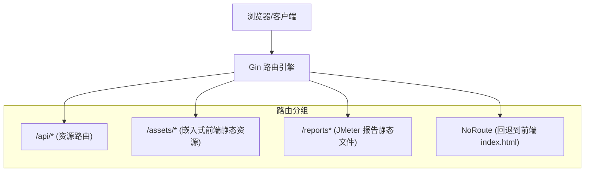
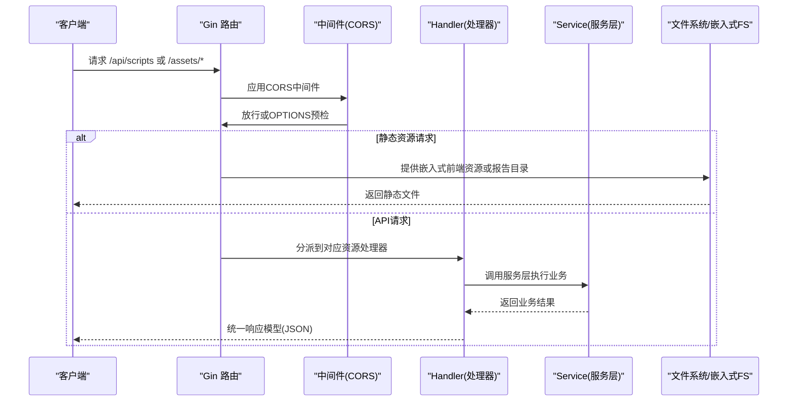
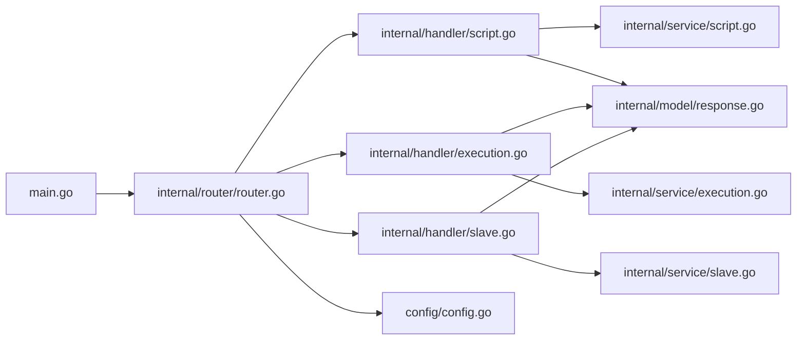

# 路由设计架构

<cite>
**本文引用的文件**   
- [main.go](file://main.go)
- [router.go](file://internal/router/router.go)
- [config.go](file://config/config.go)
- [response.go](file://internal/model/response.go)
- [script.go](file://internal/handler/script.go)
- [execution.go](file://internal/handler/execution.go)
- [slave.go](file://internal/handler/slave.go)
- [index.js](file://web/src/router/index.js)
- [vite.config.js](file://web/vite.config.js)
- [config.yaml](file://config.yaml)
</cite>

## 目录
1. [引言](#引言)
2. [项目结构](#项目结构)
3. [核心组件](#核心组件)
4. [架构总览](#架构总览)
5. [详细组件分析](#详细组件分析)
6. [依赖关系分析](#依赖关系分析)
7. [性能考量](#性能考量)
8. [故障排查指南](#故障排查指南)
9. [结论](#结论)
10. [附录](#附录)

## 引言
本文件面向JMeter Admin项目的路由设计与实现，系统性阐述RESTful API路由的设计原则、层次结构、中间件配置、静态资源服务、参数处理、URL重写与路径匹配、错误与异常处理，以及配置示例与最佳实践。目标是帮助开发者快速理解并扩展路由体系，确保前后端协作顺畅、部署与运维稳定。

## 项目结构
JMeter Admin采用Go Gin框架构建后端路由，并通过嵌入式前端资源提供SPA支持；前端使用Vite开发服务器并通过代理将/api前缀转发至后端。路由分为三类：
- 公共API路由：统一前缀/api，包含脚本、Slave、执行、系统配置等资源操作。
- 静态资源路由：嵌入式前端静态资源与JMeter报告静态文件服务。
- 错误与回退路由：NoRoute统一回退到前端入口，支持Vue Router的history模式。

图表来源
- [router.go:14-112](file://internal/router/router.go#L14-L112)

章节来源
- [router.go:14-112](file://internal/router/router.go#L14-L112)
- [main.go:57-66](file://main.go#L57-L66)

## 核心组件
- 路由装配器：负责注册中间件、分组路由、静态资源与回退逻辑。
- Handler层：每个资源的HTTP处理函数，负责参数解析、校验与调用服务层。
- 服务层：封装业务逻辑、数据库与文件系统操作。
- 配置模块：提供全局配置读取、默认值与持久化。
- 响应模型：统一的响应结构，便于前端一致处理。

章节来源
- [router.go:14-112](file://internal/router/router.go#L14-L112)
- [response.go:3-46](file://internal/model/response.go#L3-L46)
- [config.go:43-113](file://config/config.go#L43-L113)

## 架构总览
下图展示了从客户端请求到响应返回的关键流程，涵盖中间件、路由分组、处理器与静态资源服务：

图表来源
- [router.go:14-112](file://internal/router/router.go#L14-L112)
- [script.go:37-50](file://internal/handler/script.go#L37-L50)
- [execution.go:38-53](file://internal/handler/execution.go#L38-L53)
- [slave.go:16-24](file://internal/handler/slave.go#L16-L24)

## 详细组件分析

### 路由层次与分组
- 全局中间件：CORS中间件统一设置跨域头，处理OPTIONS预检。
- API路由组：统一前缀/api，细分为/scripts、/slaves、/executions、/config四个子组，覆盖资源的增删改查、文件上传下载、执行控制与统计、系统配置等。
- 静态资源：
  - 嵌入式前端静态资源：/assets/* 从嵌入式FS提供，避免外部依赖。
  - JMeter报告静态文件：/reports* 直接映射到配置的results目录，便于直接访问报告。
- 回退路由：NoRoute对非/api路径尝试打开前端文件，若不存在则返回index.html，支撑Vue Router的history模式。

章节来源
- [router.go:14-112](file://internal/router/router.go#L14-L112)

### 中间件配置与作用
- CORS中间件：设置允许来源、方法与头部，对OPTIONS请求直接返回204，减少预检开销。
- 日志记录：Gin默认日志已在生产中开启，便于追踪请求与响应。
- 请求验证：Handler层广泛使用Gin的参数绑定与校验（如ShouldBindJSON、DefaultQuery），并在失败时返回统一错误格式。

章节来源
- [router.go:114-128](file://internal/router/router.go#L114-L128)
- [script.go:56-80](file://internal/handler/script.go#L56-L80)
- [execution.go:40-44](file://internal/handler/execution.go#L40-L44)
- [slave.go:34-39](file://internal/handler/slave.go#L34-L39)

### 静态资源服务与缓存策略
- 嵌入式前端资源：通过embed.FS将web/dist打包进二进制，/assets/*映射到该FS，无需额外部署静态文件。
- 报告静态文件：/reports直接映射到results目录，便于浏览器直接访问JMeter生成的HTML报告。
- 缓存策略：当前未显式设置Cache-Control，建议在生产环境为静态资源增加合适的ETag/Cache-Control头，或通过反向代理统一缓存策略。

章节来源
- [router.go:77-90](file://internal/router/router.go#L77-L90)
- [router.go:87-109](file://internal/router/router.go#L87-L109)
- [main.go:16-17](file://main.go#L16-L17)

### 路由参数处理、URL重写与路径匹配
- 路径参数：如/scripts/:id、/executions/:id，Handler层统一解析并进行类型转换与校验。
- 查询参数：如/scripts?page&page_size&keyword，使用DefaultQuery与Query获取并做边界与默认值处理。
- URL重写：Vite开发代理将/api重写为/api（保持前缀），保证开发与生产一致性。
- 路径匹配：NoRoute优先判断是否为/api开头，若是则返回404；否则尝试打开前端文件，不存在则回退到index.html。

章节来源
- [script.go:112-116](file://internal/handler/script.go#L112-L116)
- [execution.go:56-71](file://internal/handler/execution.go#L56-L71)
- [vite.config.js:18-28](file://web/vite.config.js#L18-L28)
- [router.go:92-109](file://internal/router/router.go#L92-L109)

### 错误路由与异常处理
- 统一响应模型：Success/Error/PageSuccess封装标准响应结构，便于前端统一处理。
- 错误传播：Handler层捕获服务层错误，返回HTTP 4xx/5xx与统一错误消息。
- NoRoute：对非/api路径回退到前端，避免后端抛出未匹配错误。
- CORS预检：对OPTIONS请求直接返回204，避免跨域失败。

章节来源
- [response.go:3-46](file://internal/model/response.go#L3-L46)
- [script.go:44-47](file://internal/handler/script.go#L44-L47)
- [execution.go:48-50](file://internal/handler/execution.go#L48-L50)
- [slave.go:20-22](file://internal/handler/slave.go#L20-L22)
- [router.go:114-128](file://internal/router/router.go#L114-L128)

### API路由设计与实现要点
- 资源命名与层级：/api/scripts、/api/slaves、/api/executions、/api/config，遵循REST风格。
- CRUD与扩展操作：
  - 脚本：列表、创建、详情、更新、删除、下载、获取/保存内容、上传/删除文件。
  - Slave：列表、创建、更新、删除、连通性检查、心跳状态。
  - 执行：列表、统计、创建、详情、实时指标、停止、删除、日志流、错误导出、报告打包下载。
  - 配置：网络接口、Master主机名读取与更新。
- 参数与安全：
  - 表单上传限制与单/总大小限制，防止过大文件导致资源耗尽。
  - 文件名清洗，防止路径穿越攻击。
  - 统一的参数绑定与错误处理，提升健壮性。

章节来源
- [router.go:20-75](file://internal/router/router.go#L20-L75)
- [script.go:16-35](file://internal/handler/script.go#L16-L35)
- [script.go:240-302](file://internal/handler/script.go#L240-L302)
- [execution.go:23-27](file://internal/handler/execution.go#L23-L27)
- [execution.go:211-259](file://internal/handler/execution.go#L211-L259)
- [execution.go:261-358](file://internal/handler/execution.go#L261-L358)
- [execution.go:360-418](file://internal/handler/execution.go#L360-L418)
- [execution.go:420-480](file://internal/handler/execution.go#L420-L480)
- [slave.go:16-24](file://internal/handler/slave.go#L16-L24)
- [slave.go:97-122](file://internal/handler/slave.go#L97-L122)
- [slave.go:200-235](file://internal/handler/slave.go#L200-L235)

### 前端路由与后端协同
- 前端Vue Router使用history模式，需要后端NoRoute回退到index.html。
- Vite开发代理将/api与/reports转发到本地后端，确保开发环境与生产一致。
- SPA入口由嵌入式FS提供，无需额外静态文件部署。

章节来源
- [index.js:9-47](file://web/src/router/index.js#L9-L47)
- [vite.config.js:16-29](file://web/vite.config.js#L16-L29)
- [router.go:87-109](file://internal/router/router.go#L87-L109)

## 依赖关系分析
- main.go负责加载配置、初始化数据库、启动服务并调用路由装配器。
- router.go依赖配置模块与各handler包，装配全局中间件与路由分组。
- handler层依赖service层与model层，统一返回响应模型。
- 前端通过Vite代理与后端/api对接，静态资源由嵌入式FS提供。

图表来源
- [main.go:28-66](file://main.go#L28-L66)
- [router.go:14-112](file://internal/router/router.go#L14-L112)
- [config.go:43-113](file://config/config.go#L43-L113)

章节来源
- [main.go:28-66](file://main.go#L28-L66)
- [router.go:14-112](file://internal/router/router.go#L14-L112)

## 性能考量
- 静态资源：嵌入式FS避免了外部文件I/O，但首次启动时需要解压；建议在生产环境配合CDN或反向代理缓存。
- 文件下载：执行结果与报告采用流式传输，避免一次性加载大文件到内存。
- SSE日志：使用SSE与缓冲控制，结合超时与断开检测，降低长连接资源占用。
- CORS：预检仅一次，减少重复开销；生产环境可进一步限定来源与方法。

## 故障排查指南
- CORS问题：确认CORS中间件已启用且允许的方法与头部正确；检查浏览器开发者工具Network面板的预检请求。
- 404路由：确认请求路径是否以/api开头；非/api路径会被回退到前端，若index.html缺失会导致白屏。
- 文件上传失败：检查单文件与总大小限制、文件类型限制与路径穿越防护；查看服务端错误响应。
- 报告不可访问：确认results目录权限与路径配置正确；/reports映射是否指向有效目录。
- 配置未生效：部分配置需重启服务生效；master_hostname可通过页面动态更新并持久化。

章节来源
- [router.go:114-128](file://internal/router/router.go#L114-L128)
- [router.go:92-109](file://internal/router/router.go#L92-L109)
- [script.go:16-35](file://internal/handler/script.go#L16-L35)
- [config.go:86-97](file://config/config.go#L86-L97)

## 结论
JMeter Admin的路由设计以Gin为核心，采用清晰的分层与分组策略，结合嵌入式前端资源与报告静态文件服务，实现了前后端一体化部署与良好用户体验。通过统一的中间件、参数校验与响应模型，系统具备良好的可维护性与扩展性。建议在生产环境中补充静态资源缓存策略与更精细的CORS配置，并持续优化日志与监控能力。

## 附录

### 路由配置示例与最佳实践
- 配置文件示例：参考config.yaml，设置server.port、jmeter.master_hostname、dirs等关键项。
- 开发代理：Vite通过proxy将/api与/reports转发到本地后端，确保开发与生产一致。
- 最佳实践：
  - 明确区分公共API与静态资源，避免路径冲突。
  - 对敏感操作增加鉴权中间件（当前未实现）。
  - 为静态资源增加ETag/Cache-Control头，提升缓存命中率。
  - 在NoRoute中增加更详细的日志，便于排查前端history模式问题。

章节来源
- [config.yaml:4-26](file://config.yaml#L4-L26)
- [vite.config.js:16-29](file://web/vite.config.js#L16-L29)
- [router.go:92-109](file://internal/router/router.go#L92-L109)