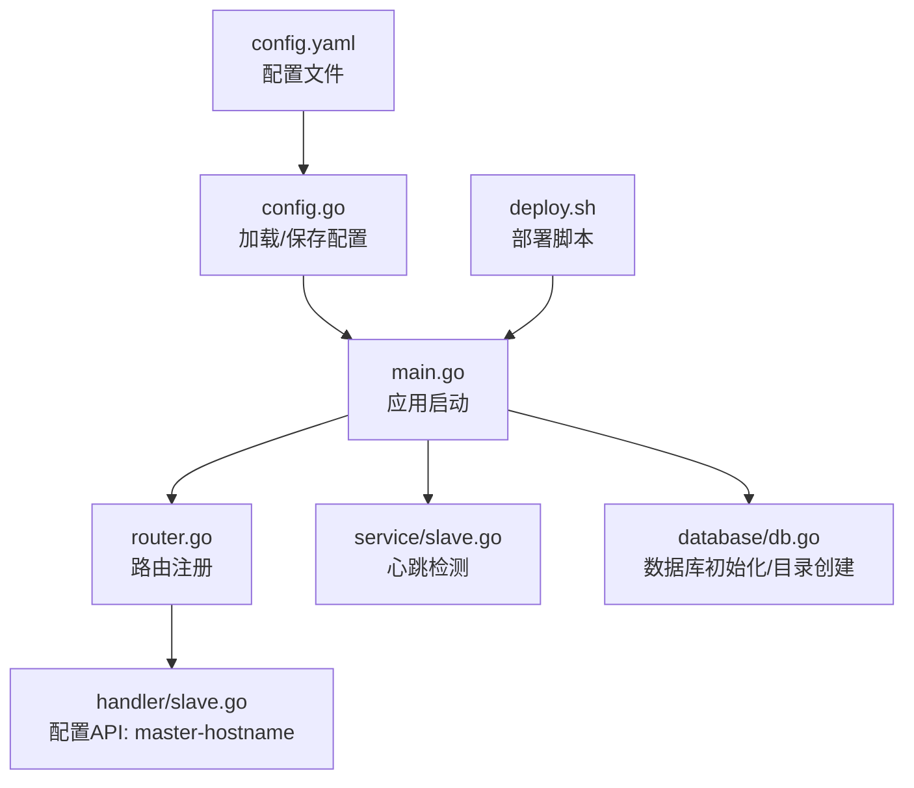
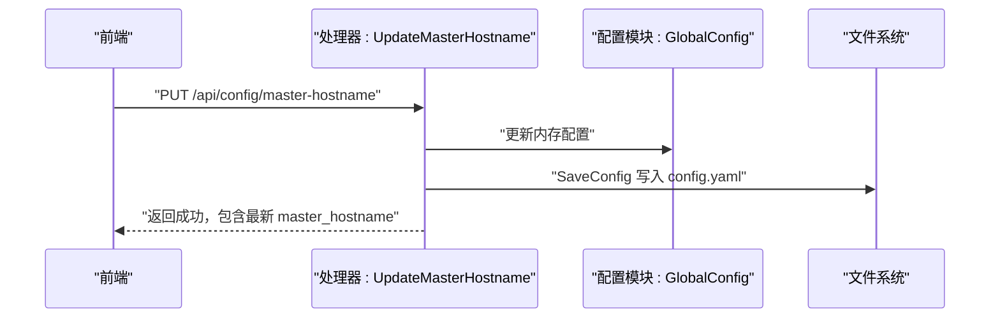
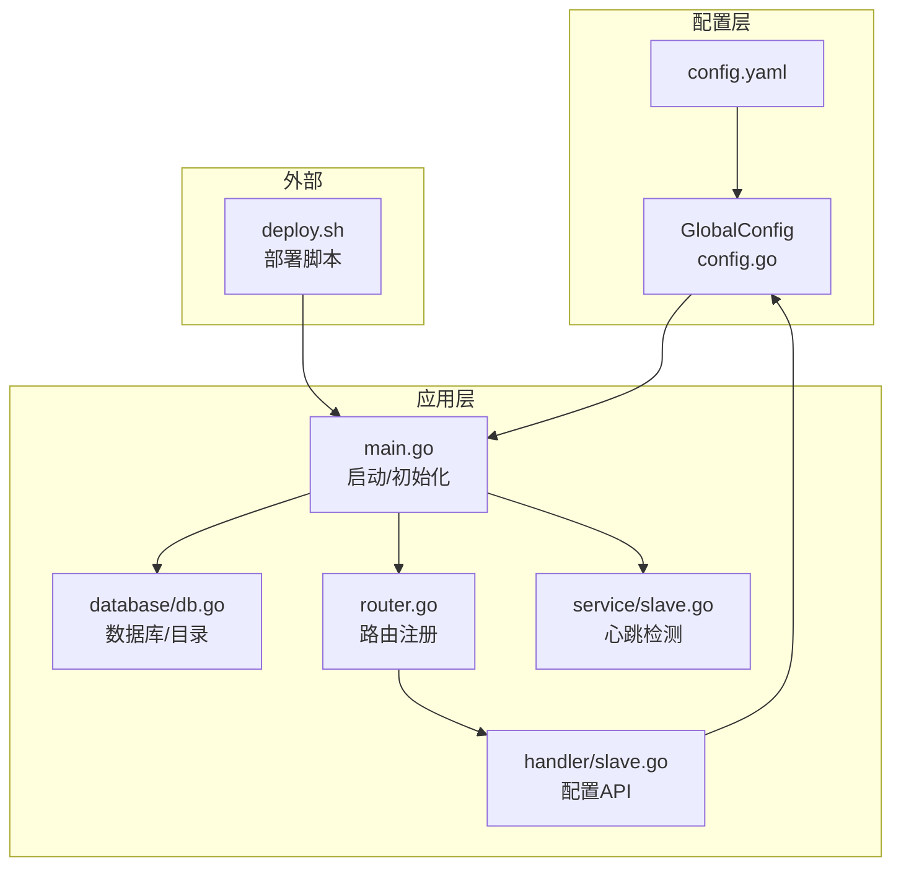
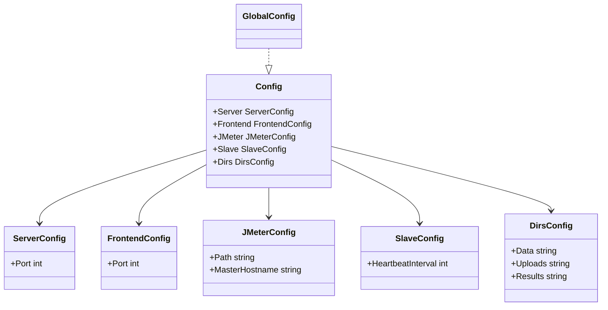
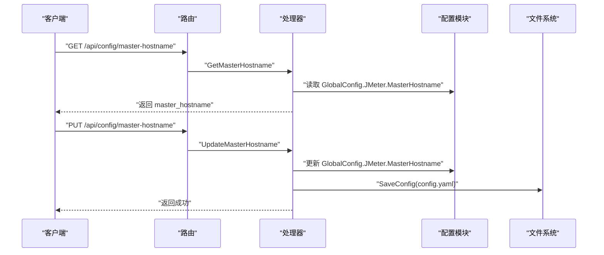
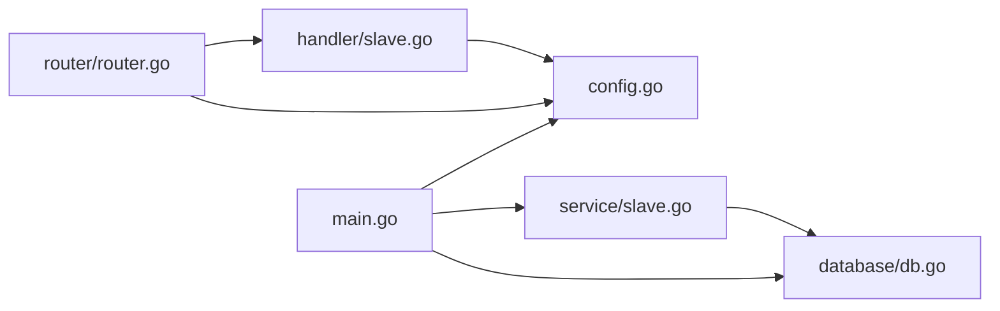

# 配置管理

<cite>
**本文引用的文件**
- [config.yaml](file://config.yaml)
- [config.go](file://config/config.go)
- [main.go](file://main.go)
- [router.go](file://internal/router/router.go)
- [slave.go（处理器）](file://internal/handler/slave.go)
- [slave.go（服务）](file://internal/service/slave.go)
- [db.go](file://internal/database/db.go)
- [deploy.sh](file://deploy.sh)
</cite>

## 目录
1. [简介](#简介)
2. [项目结构与配置位置](#项目结构与配置位置)
3. [核心配置项详解](#核心配置项详解)
4. [配置文件自动生成机制](#配置文件自动生成机制)
5. [运行时配置更新流程](#运行时配置更新流程)
6. [环境配置策略](#环境配置策略)
7. [部署脚本功能与使用](#部署脚本功能与使用)
8. [架构概览](#架构概览)
9. [详细组件分析](#详细组件分析)
10. [依赖关系分析](#依赖关系分析)
11. [性能考量](#性能考量)
12. [故障排除指南](#故障排除指南)
13. [结论](#结论)

## 简介
本文件面向JMeter Admin的配置管理，系统性说明config.yaml配置文件的结构、各配置项作用、自动生成机制、运行时更新流程、不同环境的配置策略、部署脚本功能与使用、最佳实践与安全考虑、配置验证与故障排除，以及配置热更新的限制与重启要求。

## 项目结构与配置位置
- 配置文件：config.yaml
- 配置加载与持久化：config/config.go
- 应用入口：main.go
- 路由与API：internal/router/router.go
- 配置相关API（Master主机名）：internal/handler/slave.go
- 心跳检测与Slave管理：internal/service/slave.go
- 数据库初始化与目录创建：internal/database/db.go
- 部署脚本：deploy.sh

图表来源
- [config.yaml](file://config.yaml)
- [config.go](file://config/config.go)
- [main.go](file://main.go)
- [router.go](file://internal/router/router.go)
- [slave.go（处理器）](file://internal/handler/slave.go)
- [slave.go（服务）](file://internal/service/slave.go)
- [db.go](file://internal/database/db.go)
- [deploy.sh](file://deploy.sh)

章节来源
- [config.yaml](file://config.yaml)
- [config.go](file://config/config.go)
- [main.go](file://main.go)
- [router.go](file://internal/router/router.go)
- [slave.go（处理器）](file://internal/handler/slave.go)
- [slave.go（服务）](file://internal/service/slave.go)
- [db.go](file://internal/database/db.go)
- [deploy.sh](file://deploy.sh)

## 核心配置项详解
- server.port：HTTP服务监听端口，默认8080。用于Web控制台与API访问。
- frontend.port：前端开发服务器端口（仅开发模式），默认3000。
- jmeter.path：JMeter可执行文件路径，支持PATH中的相对路径或绝对路径，默认“jmeter”。
- jmeter.master_hostname：Master节点RMI回调IP，多网卡场景必填，可在页面动态修改。
- slave.heartbeat_interval：Slave心跳检测间隔（秒），默认30。
- dirs.data：SQLite数据库文件所在目录，默认“./data”。
- dirs.uploads：脚本与附件上传目录，默认“./uploads”。
- dirs.results：执行结果与报告存储目录，默认“./results”。

章节来源
- [config.yaml](file://config.yaml)
- [config.go](file://config/config.go)

## 配置文件自动生成机制
- 首次运行时若未发现config.yaml，将按默认值生成默认配置文件并写入磁盘。
- 默认值覆盖了所有配置项，确保服务可直接启动。
- 生成的默认配置文件位于项目根目录，名称为config.yaml。

图表来源
- [config.go](file://config/config.go)

章节来源
- [config.go](file://config/config.go)

## 运行时配置更新流程
- 仅jmeter.master_hostname支持运行时更新，其他配置项需重启服务生效。
- 页面操作流程：
  1) 前端调用PUT /api/config/master-hostname提交新值。
  2) 处理器更新内存中的GlobalConfig并持久化到config.yaml。
  3) 服务端立即使用新值参与后续执行（例如RMI回调）。

图表来源
- [slave.go（处理器）](file://internal/handler/slave.go)
- [config.go](file://config/config.go)

章节来源
- [slave.go（处理器）](file://internal/handler/slave.go)
- [config.go](file://config/config.go)

## 环境配置策略
- 开发环境
  - 使用默认端口8080（server.port）与3000（frontend.port）。
  - jmeter.path建议使用绝对路径或确保PATH包含JMeter可执行文件。
  - dirs.*目录可保持默认相对路径，便于本地开发。
- 测试环境
  - server.port建议固定为8080或更高范围端口，避免冲突。
  - jmeter.master_hostname必须明确指定，确保多网卡场景下RMI回调正确。
  - dirs.results建议指向共享存储或具备备份能力的目录。
- 生产环境
  - server.port与防火墙策略配合，仅开放必要端口。
  - jmeter.master_hostname必须稳定且可解析，建议使用内网IP或域名。
  - dirs.data/ dirs.results使用独立磁盘分区，预留足够空间并开启定期备份。
  - 部署脚本install-service可将服务注册为systemd服务，实现开机自启与自动重启。

章节来源
- [config.yaml](file://config.yaml)
- [deploy.sh](file://deploy.sh)

## 部署脚本功能与使用
- install-deps：一键安装Go、Node.js、gcc、Java、JMeter，并配置国内镜像加速。
- install：编译后端并构建前端（如web/dist不存在则自动构建），输出可执行文件。
- start/stop/restart/status：服务生命周期管理，支持后台启动与日志输出。
- install-service：安装systemd服务单元，便于系统级管理。
- 首次部署推荐流程：install-deps -> source ~/.bashrc -> install -> start。

章节来源
- [deploy.sh](file://deploy.sh)

## 架构概览
配置在应用启动阶段被加载并注入到全局配置对象；部分配置项在运行时可通过API动态更新；数据库与目录在启动时初始化；路由层提供配置相关的API。

图表来源
- [config.go](file://config/config.go)
- [main.go](file://main.go)
- [router.go](file://internal/router/router.go)
- [slave.go（处理器）](file://internal/handler/slave.go)
- [slave.go（服务）](file://internal/service/slave.go)
- [db.go](file://internal/database/db.go)
- [deploy.sh](file://deploy.sh)

## 详细组件分析

### 配置模型与加载
- 结构体定义涵盖server、frontend、jmeter、slave、dirs五大部分。
- LoadConfig负责默认值设定、文件读取、YAML解析与默认配置生成。
- SaveConfig负责将当前内存配置序列化并写回文件。

图表来源
- [config.go](file://config/config.go)

章节来源
- [config.go](file://config/config.go)

### 配置API与热更新
- GET /api/config/master-hostname：返回当前master_hostname。
- PUT /api/config/master-hostname：更新master_hostname并持久化。
- 该API直接修改GlobalConfig并在保存后立即生效，无需重启。

图表来源
- [router.go](file://internal/router/router.go)
- [slave.go（处理器）](file://internal/handler/slave.go)
- [config.go](file://config/config.go)

章节来源
- [router.go](file://internal/router/router.go)
- [slave.go（处理器）](file://internal/handler/slave.go)
- [config.go](file://config/config.go)

### 心跳检测与配置联动
- 启动时根据配置的heartbeat_interval启动定时任务。
- 心跳检测对每个Slave进行TCP连通性检查，并更新状态与最后检测时间。
- 该逻辑与配置强关联，但不涉及配置文件的热更新。

图表来源
- [main.go](file://main.go)
- [slave.go（服务）](file://internal/service/slave.go)

章节来源
- [main.go](file://main.go)
- [slave.go（服务）](file://internal/service/slave.go)

## 依赖关系分析
- main.go依赖config.LoadConfig进行配置加载，并在启动时创建目录、初始化数据库、启动心跳。
- router.go依赖config.GlobalConfig.Dirs.Results提供报告静态文件服务。
- handler.slave依赖config.GlobalConfig.JMeter.MasterHostname提供配置API。
- service.slave依赖数据库进行Slave状态维护。
- database.db依赖config.GlobalConfig.Dirs.Data确定数据库文件路径。

图表来源
- [main.go](file://main.go)
- [config.go](file://config/config.go)
- [router.go](file://internal/router/router.go)
- [slave.go（处理器）](file://internal/handler/slave.go)
- [slave.go（服务）](file://internal/service/slave.go)
- [db.go](file://internal/database/db.go)

章节来源
- [main.go](file://main.go)
- [config.go](file://config/config.go)
- [router.go](file://internal/router/router.go)
- [slave.go（处理器）](file://internal/handler/slave.go)
- [slave.go（服务）](file://internal/service/slave.go)
- [db.go](file://internal/database/db.go)

## 性能考量
- 心跳检测并发控制：使用信号量限制同时检测的Slave数量，避免过度占用资源。
- 目录与数据库：首次启动自动创建所需目录，减少运行时IO错误。
- 前端资源嵌入：编译时将web/dist嵌入二进制，减少文件系统依赖。

章节来源
- [slave.go（服务）](file://internal/service/slave.go)
- [main.go](file://main.go)
- [db.go](file://internal/database/db.go)

## 故障排除指南
- 配置文件无法读取或解析
  - 现象：启动时报错提示读取/解析配置失败。
  - 排查：确认config.yaml语法正确、字段名称匹配、权限可读。
  - 触发行为：首次运行时若不存在会自动生成默认配置。
- master_hostname未设置或多网卡导致回调异常
  - 现象：Slave无法正确回连或RMI回调失败。
  - 排查：在页面通过PUT /api/config/master-hostname设置为正确的内网IP。
  - 影响：仅该配置项可热更新，无需重启。
- 心跳检测频繁失败
  - 现象：Slave状态持续offline。
  - 排查：检查网络连通性、端口是否开放、防火墙策略；调整heartbeat_interval。
- 数据库初始化失败
  - 现象：启动时报数据库打开/连接失败。
  - 排查：确认dirs.data目录存在且可写；检查SQLite驱动可用性。
- 目录创建失败
  - 现象：启动时报目录创建失败。
  - 排查：确认目标目录权限与磁盘空间充足。

章节来源
- [config.go](file://config/config.go)
- [slave.go（处理器）](file://internal/handler/slave.go)
- [slave.go（服务）](file://internal/service/slave.go)
- [db.go](file://internal/database/db.go)
- [main.go](file://main.go)

## 结论
JMeter Admin的配置管理以config.yaml为核心，采用启动时加载与默认值生成机制，确保开箱即用；除master_hostname外的配置项需重启生效，而master_hostname支持页面热更新并持久化。结合部署脚本可快速完成环境准备与服务托管。建议在生产环境严格区分目录权限与网络策略，并通过systemd实现稳定运行与自动重启。