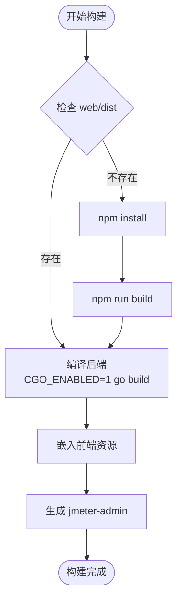
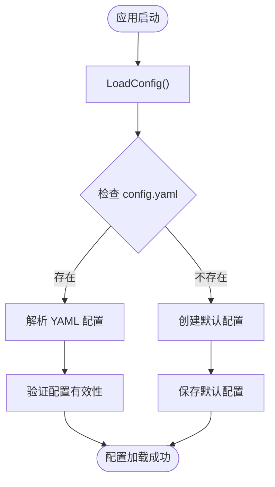

# 快速开始

<cite>
**本文引用的文件**
- [README.md](file://README.md)
- [deploy.sh](file://deploy.sh)
- [Makefile](file://Makefile)
- [go.mod](file://go.mod)
- [config.yaml](file://config.yaml)
- [main.go](file://main.go)
- [config/config.go](file://config/config.go)
- [internal/database/db.go](file://internal/database/db.go)
- [internal/router/router.go](file://internal/router/router.go)
- [web/package.json](file://web/package.json)
- [web/vite.config.js](file://web/vite.config.js)
- [web/src/api/request.js](file://web/src/api/request.js)
</cite>

## 目录
1. [简介](#简介)
2. [系统要求](#系统要求)
3. [一键部署](#一键部署)
4. [本地开发环境](#本地开发环境)
5. [编译部署方式](#编译部署方式)
6. [配置说明](#配置说明)
7. [服务管理](#服务管理)
8. [常见问题解决](#常见问题解决)
9. [故障排除指南](#故障排除指南)
10. [总结](#总结)

## 简介

JMeter Admin 是一个轻量级的 JMeter 分布式压测管理平台，采用 **Go (Gin) + Vue 3 (Element Plus) + SQLite** 技术栈开发。前端资源嵌入后端二进制文件，编译后生成单个可执行文件，实现零依赖部署。

### 核心功能
- **JMX 脚本管理** — 支持上传、可视化树形编辑、XML 源码编辑双模式
- **Slave 节点管理** — 自动心跳检测、一键连通性检查
- **分布式压测执行** — 支持单机模式与分布式模式
- **执行记录管理** — 实时日志流、错误分析、结果导出（JTL/报告/CSV）
- **Master IP 自动检测** — 多网卡环境自动识别或手动配置

## 系统要求

| 组件 | 版本 | 说明 |
|------|------|------|
| Go | >= 1.21 | 后端编译 |
| Node.js | >= 16.x | 前端构建 |
| gcc | 任意 | SQLite 编译依赖（CGO） |
| Java | >= 11 | JMeter 运行时 |
| JMeter | >= 5.6 | 压测引擎 |

## 一键部署

### 完整部署流程

```bash
# 步骤1：安装所有依赖（Go + Node.js + gcc + Java + JMeter）
./deploy.sh install-deps

# 刷新环境变量
source ~/.bashrc

# 步骤2：编译项目（前端 + 后端）
./deploy.sh install

# 步骤3：启动服务
./deploy.sh start

# 访问地址
http://your-server-ip:8080
```

### 一键部署脚本详解

#### install-deps 命令
- **功能**：一键安装所有依赖组件
- **支持的系统架构**：x86_64 (amd64)、aarch64 (arm64)
- **安装的组件**：
  - Go 1.22.2（配置 GOPROXY 代理）
  - Node.js 20.12.2 或 16.20.2（根据 glibc 版本自动选择）
  - gcc（SQLite 编译依赖）
  - Java 11（JMeter 依赖）
  - JMeter 5.6.3

#### install 命令
- **功能**：编译项目（前端 + 后端）
- **前端构建**：自动检测 web/dist 是否存在，不存在则执行 `npm install && npm run build`
- **后端构建**：使用 CGO_ENABLED=1 进行编译，嵌入前端资源
- **输出**：生成单个可执行文件 `jmeter-admin`

#### start 命令
- **功能**：后台启动服务
- **日志**：输出到 `jmeter-admin.log`
- **PID 文件**：记录到 `jmeter-admin.pid`
- **默认端口**：8080

### 首次部署最佳实践

```bash
# 方案1：完整自动化（推荐）
./deploy.sh install-deps && source ~/.bashrc && ./deploy.sh install && ./deploy.sh start

# 方案2：分步执行（便于调试）
./deploy.sh install-deps
source ~/.bashrc
./deploy.sh install
./deploy.sh start
```

**章节来源**
- [README.md:29-43](file://README.md#L29-L43)
- [deploy.sh:500-526](file://deploy.sh#L500-L526)

## 本地开发环境

### 开发模式启动

```bash
# 方式1：同时启动前后端（前端热更新）
make dev

# 方式2：分别启动
make dev-backend    # 后端 :8080
make dev-frontend   # 前端 :3000（代理 API 到 :8080）

# 访问地址
浏览器访问 http://localhost:3000
```

### 开发环境配置

#### 前端开发服务器
- **端口**：3000（可通过 FRONTEND_PORT 环境变量自定义）
- **代理配置**：将 /api 前缀代理到后端 :8080
- **热更新**：支持 Vue SFC 热重载

#### 后端开发服务器
- **端口**：8080（可通过 BACKEND_PORT 环境变量自定义）
- **CGO 支持**：启用 SQLite 编译
- **开发模式**：直接运行 Go 代码，支持热重载

### 开发工具链

```bash
# 安装前端依赖
cd web && npm install

# 启动前端开发服务器
cd web && npm run dev

# 启动后端开发服务器
CGO_ENABLED=1 go run .

# 构建生产版本
cd web && npm run build
```

**章节来源**
- [Makefile:28-39](file://Makefile#L28-L39)
- [web/vite.config.js:16-29](file://web/vite.config.js#L16-L29)
- [README.md:45-56](file://README.md#L45-L56)

## 编译部署方式

### 完整编译（推荐用于生产环境）

```bash
# 完整编译（前端 + 后端）
make build-all

# 输出文件：jmeter-admin
```

### 仅编译后端

```bash
# 仅编译后端（需先构建前端）
make build-backend

# 输出文件：jmeter-admin
```

### 交叉编译

```bash
# 交叉编译 Linux 版本
make build-linux

# 输出文件：jmeter-admin（Linux amd64）
```

### 运行方式

```bash
# 直接运行
./jmeter-admin

# 或通过 Makefile
make run
```

### 构建流程说明



**图表来源**
- [Makefile:4-12](file://Makefile#L4-L12)
- [deploy.sh:54-88](file://deploy.sh#L54-L88)

**章节来源**
- [Makefile:1-39](file://Makefile#L1-L39)
- [README.md:58-72](file://README.md#L58-L72)

## 配置说明

### 默认配置文件

首次启动时会自动生成 `config.yaml`：

```yaml
# JMeter Admin 配置文件
# 修改后需重启服务生效（master_hostname 除外，可通过页面实时修改）

# 后端服务配置
server:
  port: 8080                          # HTTP 服务监听端口

# 前端开发配置（仅开发模式使用）
frontend:
  port: 3000                          # 前端 Vite 开发服务器端口

# JMeter 配置
jmeter:
  path: "jmeter"                      # JMeter 可执行文件路径
  master_hostname: ""                 # Master 节点 IP（多网卡时必填）

# Slave 节点配置
slave:
  heartbeat_interval: 30              # 心跳检测间隔（秒）

# 数据目录配置
dirs:
  data: "./data"                      # SQLite 数据库存储目录
  uploads: "./uploads"                # 脚本和附件上传目录
  results: "./results"                # 执行结果和报告存储目录
```

### 配置文件加载机制



**图表来源**
- [config/config.go:43-84](file://config/config.go#L43-L84)
- [config/config.go:86-97](file://config/config.go#L86-L97)

### 关键配置项说明

| 配置项 | 默认值 | 说明 |
|--------|--------|------|
| server.port | 8080 | HTTP 服务监听端口 |
| jmeter.path | "jmeter" | JMeter 可执行文件路径 |
| jmeter.master_hostname | "" | Master 节点 IP（多网卡必填） |
| slave.heartbeat_interval | 30 | Slave 心跳检测间隔（秒） |
| dirs.data | "./data" | SQLite 数据库存储目录 |
| dirs.uploads | "./uploads" | 上传文件存储目录 |
| dirs.results | "./results" | 执行结果存储目录 |

**章节来源**
- [config.yaml:1-26](file://config.yaml#L1-L26)
- [config/config.go:10-39](file://config/config.go#L10-L39)

## 服务管理

### 基础服务控制

```bash
# 启动服务
./deploy.sh start

# 停止服务
./deploy.sh stop

# 重启服务
./deploy.sh restart

# 查看状态
./deploy.sh status
```

### systemd 服务集成

```bash
# 安装 systemd 服务（需要 root 权限）
sudo ./deploy.sh install-service

# 启用开机自启
sudo systemctl enable jmeter-admin

# 启动服务
sudo systemctl start jmeter-admin

# 查看状态
sudo systemctl status jmeter-admin
```

### 服务状态监控

```bash
# 查看详细状态
./deploy.sh status

# 输出示例：
# [INFO] 服务运行中 (PID: 12345)
# 
# 进程信息:
#   PID  PPID CMD %CPU %MEM
#  12345     1 ./jmeter-admin 0.1 0.2
# 
# 监听端口:
#   COMMAND   PID   USER   FD   TYPE DEVICE SIZE/OFF NODE NAME
#   jmeter-ad 12345 user   12u  IPv4 123456      0t0  TCP *:8080 (LISTEN)
```

**章节来源**
- [README.md:253-269](file://README.md#L253-L269)
- [deploy.sh:94-172](file://deploy.sh#L94-L172)
- [deploy.sh:438-478](file://deploy.sh#L438-L478)

## 常见问题解决

### 编译错误处理

#### CGO_ENABLED 相关错误
```bash
# 解决方案：安装 gcc
# Ubuntu/Debian
sudo apt-get install -y gcc build-essential

# CentOS/RHEL
sudo yum install -y gcc gcc-c++ make
```

#### Go 版本不兼容
```bash
# 检查 Go 版本
go version

# 升级到 1.21+
# 使用 deploy.sh install-deps 自动安装最新版本
```

### 前端构建问题

#### npm 镜像加速
```bash
# 使用国内 npm 镜像
npm config set registry https://registry.npmmirror.com
```

#### 依赖安装失败
```bash
# 清理缓存后重试
cd web && rm -rf node_modules package-lock.json
cd web && npm install
```

### 分布式部署问题

#### Slave 连接失败
```bash
# 检查项：
# 1. master_hostname 配置是否正确
# 2. 防火墙是否开放端口（默认 50000, 1099）
# 3. Slave 端是否禁用 RMI SSL：-Dserver.rmi.ssl.disable=true
```

#### 多网卡环境配置
```bash
# 在 config.yaml 中明确指定 master_hostname
# 或在页面「系统设置」中选择正确的网卡 IP
```

### 性能优化

#### 内存使用优化
```bash
# 系统自动根据可用内存分配 JVM 堆（80% 可用内存）
# 无需手动配置，避免 JMeter OOM
```

**章节来源**
- [README.md:270-312](file://README.md#L270-L312)
- [deploy.sh:223-436](file://deploy.sh#L223-L436)

## 故障排除指南

### 环境检查

```bash
# 检查所有依赖是否就绪
echo "Go 版本：$(go version 2>/dev/null || echo '未安装')"
echo "Node.js 版本：$(node --version 2>/dev/null || echo '未安装')"
echo "npm 版本：$(npm --version 2>/dev/null || echo '未安装')"
echo "gcc 版本：$(gcc --version 2>/dev/null | head -1 || echo '未安装')"
echo "Java 版本：$(java -version 2>&1 | head -1 || echo '未安装')"
echo "JMeter 版本：$(jmeter --version 2>/dev/null | head -1 || echo '未安装')"
```

### 数据库问题

#### SQLite 迁移失败
```bash
# 解决方案：删除数据库文件重新创建
rm -f data/jmeter-admin.db
./jmeter-admin
```

#### 数据库权限问题
```bash
# 检查目录权限
ls -la data/
chmod 755 data/
chmod 755 uploads/
chmod 755 results/
```

### 网络连接问题

#### API 请求失败
```bash
# 检查后端服务状态
./deploy.sh status

# 检查端口占用
netstat -tlnp | grep :8080

# 检查防火墙设置
sudo ufw status
```

#### 前端代理问题
```bash
# 检查 Vite 代理配置
# 在 web/vite.config.js 中确认代理目标地址
```

### 日志分析

#### 查看服务日志
```bash
# 查看最近的日志
tail -f jmeter-admin.log

# 查看错误日志
grep -i error jmeter-admin.log
```

#### 调试模式启动
```bash
# 启用详细日志
export GIN_MODE=debug
./jmeter-admin
```

**章节来源**
- [README.md:270-312](file://README.md#L270-L312)
- [main.go:68-82](file://main.go#L68-L82)

## 总结

JMeter Admin 提供了完整的分布式压测管理解决方案，具有以下特点：

### 部署优势
- **一键部署**：通过 deploy.sh 脚本实现自动化部署
- **零依赖**：编译后生成单个可执行文件
- **跨平台**：支持 Linux 和 ARM 架构
- **开发友好**：提供完整的开发环境支持

### 生产环境建议
1. 使用 `make build-all` 进行完整编译
2. 配置 systemd 服务实现自动启动
3. 设置合理的日志轮转策略
4. 定期备份 SQLite 数据库

### 开发环境建议
1. 使用 `make dev` 同时启动前后端
2. 配置合适的代理和端口映射
3. 利用热重载提高开发效率
4. 使用 Docker 进行环境隔离

通过遵循本指南，您可以在几分钟内完成 JMeter Admin 的部署和运行，开始进行高效的分布式压测管理工作。