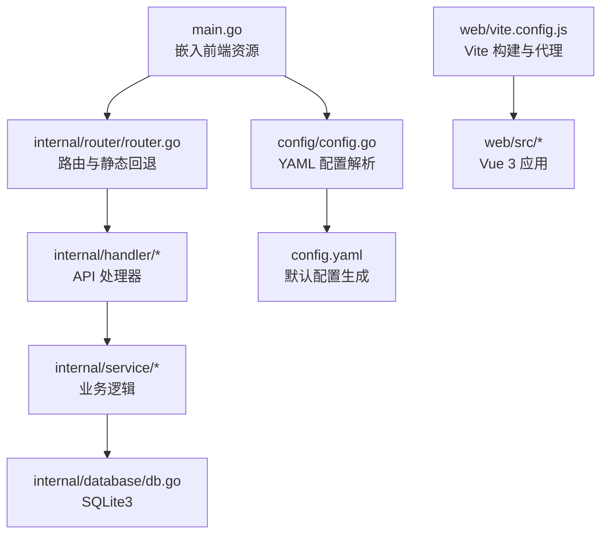
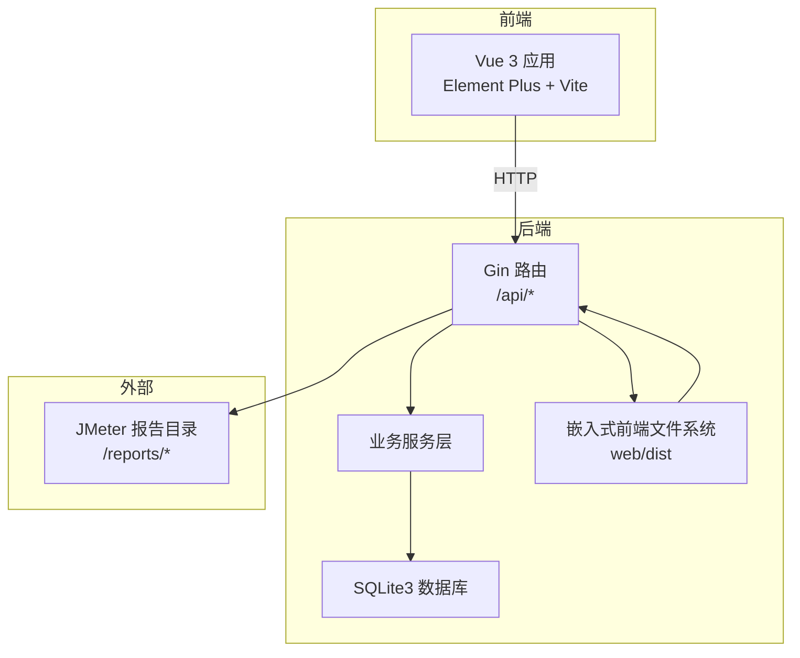
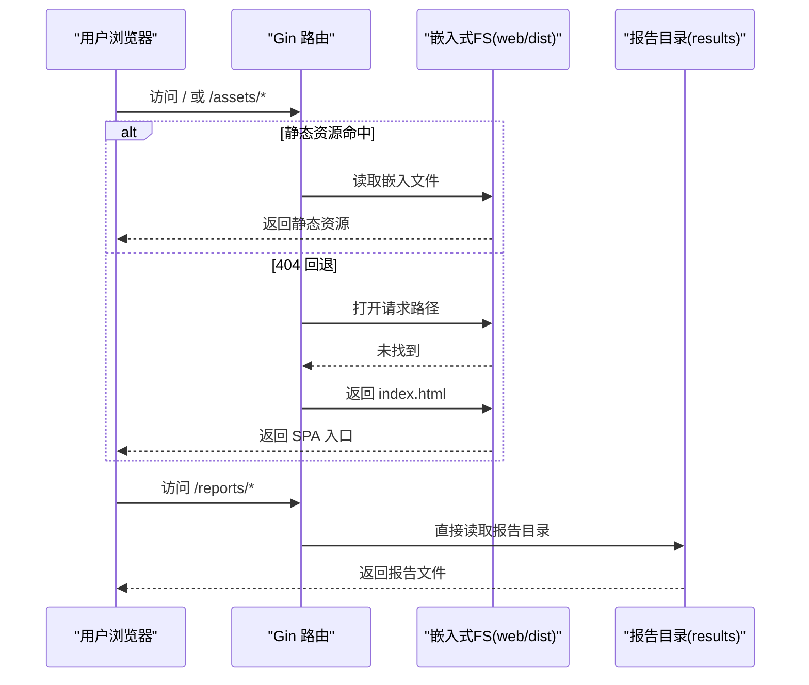
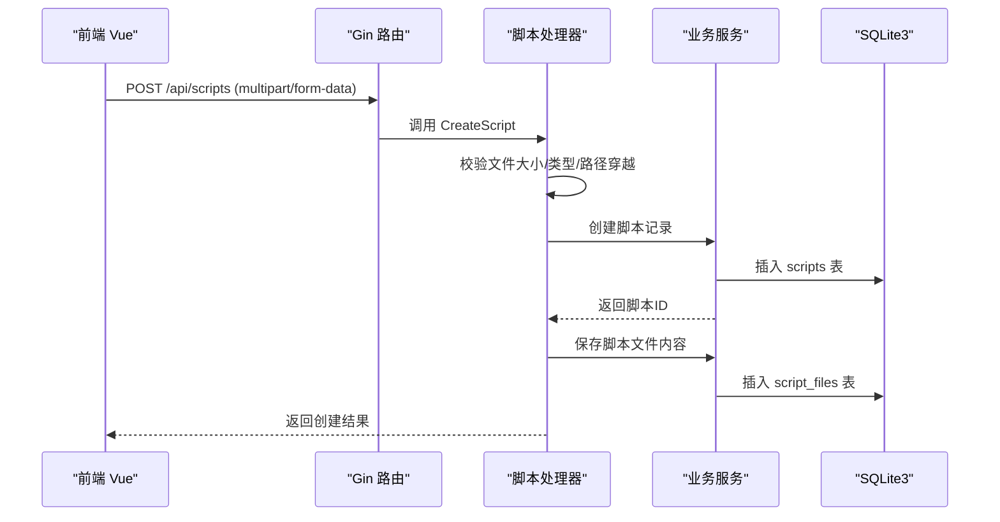
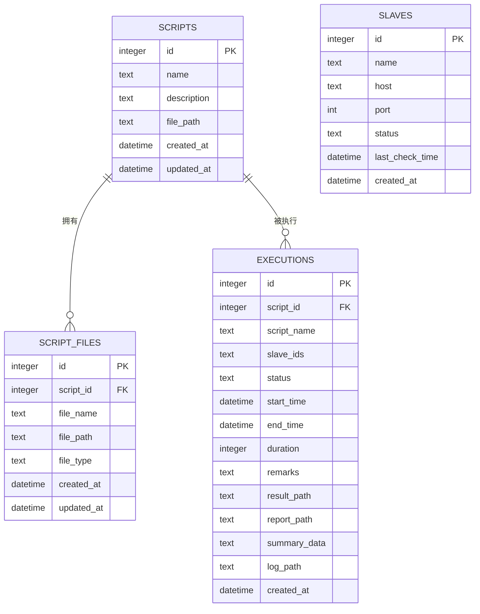
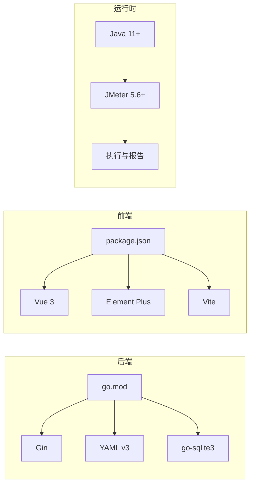

# 技术栈

<cite>
**本文引用的文件**
- [go.mod](file://go.mod)
- [main.go](file://main.go)
- [config.yaml](file://config.yaml)
- [config/config.go](file://config/config.go)
- [internal/database/db.go](file://internal/database/db.go)
- [internal/router/router.go](file://internal/router/router.go)
- [internal/handler/script.go](file://internal/handler/script.go)
- [web/package.json](file://web/package.json)
- [web/vite.config.js](file://web/vite.config.js)
- [web/src/main.js](file://web/src/main.js)
- [Makefile](file://Makefile)
- [deploy.sh](file://deploy.sh)
- [README.md](file://README.md)
</cite>

## 目录
1. [简介](#简介)
2. [项目结构](#项目结构)
3. [核心组件](#核心组件)
4. [架构总览](#架构总览)
5. [详细组件分析](#详细组件分析)
6. [依赖关系分析](#依赖关系分析)
7. [性能考量](#性能考量)
8. [故障排查指南](#故障排查指南)
9. [结论](#结论)
10. [附录](#附录)

## 简介
本项目采用“后端 Go + Web 前端”一体化架构，后端基于 Gin 1.12.0 + SQLite3 + YAML v3，前端基于 Vue 3.4.21 + Element Plus + Vite，通过 Go 的 embed 将前端静态资源嵌入二进制，实现单文件部署与零外部依赖运行。后端负责 API、数据库、JMeter 执行调度与报告静态服务；前端提供脚本管理、Slave 节点管理、执行任务管理与可视化报告浏览。

## 项目结构
项目采用模块化分层组织：
- 后端入口与嵌入资源：main.go 使用 go:embed 将 web/dist 嵌入，统一由 Gin 路由处理
- 配置管理：config.yaml + config/config.go 提供 YAML 解析与默认值
- 数据层：internal/database/db.go 基于 sqlite3 初始化数据库与表结构
- 路由与中间件：internal/router/router.go 定义 API 分组与静态资源回退
- 处理器示例：internal/handler/script.go 展示文件上传、脚本 CRUD 等典型流程
- 前端工程：web/ 下的 Vue 3 应用，Vite 构建，Element Plus UI 组件库

图表来源
- [main.go:16-17](file://main.go#L16-L17)
- [internal/router/router.go:14-112](file://internal/router/router.go#L14-L112)
- [config/config.go:43-84](file://config/config.go#L43-L84)
- [internal/database/db.go:15-34](file://internal/database/db.go#L15-L34)
- [web/vite.config.js:9-34](file://web/vite.config.js#L9-L34)

章节来源
- [README.md:92-120](file://README.md#L92-L120)
- [main.go:16-17](file://main.go#L16-L17)
- [config/config.go:43-84](file://config/config.go#L43-L84)
- [internal/database/db.go:15-34](file://internal/database/db.go#L15-L34)
- [internal/router/router.go:14-112](file://internal/router/router.go#L14-L112)
- [web/vite.config.js:9-34](file://web/vite.config.js#L9-L34)

## 核心组件
- 后端框架与版本
  - Gin 1.12.0：高性能 HTTP 框架，提供路由、中间件、上下文与 JSON 响应能力
  - go 1.26.1：编译版本，满足 embed、CGO 等特性需求
- 数据持久化
  - SQLite3：零配置、跨平台、单文件数据库，适合本项目轻量部署场景
  - github.com/mattn/go-sqlite3：CGO 驱动，支持 SQLite 功能扩展
- 配置管理
  - YAML v3：用于 config.yaml 的解析与默认配置生成
- 前端技术栈
  - Vue 3.4.21：响应式与组合式 API，提供现代前端开发体验
  - Element Plus 2.6.3：丰富的桌面端组件库
  - Vite 5.2.0：快速构建工具链，支持热更新与代理
- 嵌入式资源
  - go:embed 将 web/dist 嵌入二进制，运行时通过 Gin 提供静态文件与 SPA 回退

章节来源
- [go.mod:3-8](file://go.mod#L3-L8)
- [web/package.json:10-22](file://web/package.json#L10-L22)
- [main.go:16-17](file://main.go#L16-L17)
- [internal/router/router.go:80-109](file://internal/router/router.go#L80-L109)

## 架构总览
后端以 Gin 为核心，统一处理 API 请求与静态资源回退；SQLite3 存储元数据；前端静态资源在构建阶段打包并嵌入二进制，运行时由后端直接提供。JMeter 报告目录通过静态文件服务对外暴露，便于浏览器直接访问。

图表来源
- [internal/router/router.go:20-75](file://internal/router/router.go#L20-L75)
- [internal/router/router.go:77-109](file://internal/router/router.go#L77-L109)
- [main.go:58](file://main.go#L58)

章节来源
- [internal/router/router.go:20-112](file://internal/router/router.go#L20-L112)
- [main.go:58](file://main.go#L58)

## 详细组件分析

### 后端技术栈与选型
- Go 1.26.1
  - 优势：并发模型优秀、编译速度快、CGO 支持良好、生态成熟
  - 适用性：与 Gin、sqlite3 驱动配合稳定，适合单体服务部署
- Gin 1.12.0
  - 优势：路由清晰、中间件丰富、性能优异、生态完善
  - 适用性：本项目 API 规模适中，Gin 能够高效支撑
- SQLite3 + go-sqlite3
  - 优势：零配置、单文件、跨平台、事务支持好
  - 适用性：本项目数据体量小，无需独立数据库实例
- YAML v3
  - 优势：简洁易读、支持复杂结构、与 Go 生态契合
  - 适用性：配置项不多，YAML 明确直观

章节来源
- [go.mod:3-8](file://go.mod#L3-L8)
- [internal/database/db.go:15-34](file://internal/database/db.go#L15-L34)
- [config/config.go:43-84](file://config/config.go#L43-L84)

### 前端技术栈与选型
- Vue 3.4.21
  - 优势：组合式 API、更好的 TypeScript 支持、更小体积
  - 适用性：本项目界面以表格、表单、图表为主，Vue 3 能高效满足
- Element Plus 2.6.3
  - 优势：组件丰富、主题可定制、与 Vue 3 高度契合
  - 适用性：管理后台常用组件覆盖全面
- Vite 5.2.0
  - 优势：冷启动快、热更新快、插件生态活跃
  - 适用性：开发体验与构建效率兼顾

章节来源
- [web/package.json:10-22](file://web/package.json#L10-L22)
- [web/vite.config.js:9-34](file://web/vite.config.js#L9-L34)
- [web/src/main.js:1-23](file://web/src/main.js#L1-L23)

### 嵌入式资源与部署优势
- 实现原理
  - main.go 使用 go:embed 将 web/dist 整体嵌入二进制
  - 路由层通过 fs.Sub 提取子文件系统，并对 /assets/* 与 404 回退到前端 index.html
  - /reports/* 作为静态目录映射，直接指向 results 目录
- 部署优势
  - 单文件可执行程序，无需额外托管静态资源
  - 无外部依赖，跨平台运行稳定
  - 配合 systemd 或脚本即可实现开机自启与状态管理

图表来源
- [main.go:16-17](file://main.go#L16-L17)
- [internal/router/router.go:80-109](file://internal/router/router.go#L80-L109)

章节来源
- [main.go:16-17](file://main.go#L16-L17)
- [internal/router/router.go:77-109](file://internal/router/router.go#L77-L109)

### 关键 API 流程示例（脚本上传）
该流程展示从前端到后端、再到业务层与数据库的完整链路，体现 Gin 路由、表单解析、文件安全处理与数据库操作。

图表来源
- [internal/router/router.go:23-36](file://internal/router/router.go#L23-L36)
- [internal/handler/script.go:52-108](file://internal/handler/script.go#L52-L108)
- [internal/database/db.go:37-64](file://internal/database/db.go#L37-L64)

章节来源
- [internal/router/router.go:23-36](file://internal/router/router.go#L23-L36)
- [internal/handler/script.go:52-108](file://internal/handler/script.go#L52-L108)
- [internal/database/db.go:37-64](file://internal/database/db.go#L37-L64)

### 数据库设计与演进
- 表结构
  - scripts：脚本元信息
  - script_files：脚本附件（含外键约束）
  - slaves：Slave 节点状态
  - executions：执行记录（含冗余字段与 JSON 存储）
- 索引
  - 对 executions 的 script_id、status、created_at 建立索引，提升查询性能
- 迁移
  - 通过 PRAGMA 查询列是否存在，按需新增列，保证向后兼容

图表来源
- [internal/database/db.go:37-98](file://internal/database/db.go#L37-L98)
- [internal/database/db.go:174-188](file://internal/database/db.go#L174-L188)

章节来源
- [internal/database/db.go:37-189](file://internal/database/db.go#L37-L189)

### 配置体系
- 默认值与生成
  - 未找到 config.yaml 时，自动创建默认配置文件
  - 支持运行时读取与保存配置
- 关键配置项
  - server.port：后端监听端口
  - frontend.port：开发服务器端口（仅开发）
  - jmeter.path/master_hostname：JMeter 可执行路径与 Master 主机名
  - slave.heartbeat_interval：Slave 心跳检测间隔
  - dirs.data/uploads/results：数据、上传、结果目录

章节来源
- [config/config.go:43-112](file://config/config.go#L43-L112)
- [config.yaml:4-26](file://config.yaml#L4-L26)

### 构建与部署
- 构建流程
  - 前端构建：web 目录下 npm run build，输出至 web/dist
  - 后端构建：CGO_ENABLED=1 go build，嵌入前端资源
  - Makefile 提供快捷命令，支持 Linux 交叉编译
- 一键部署
  - deploy.sh 支持安装依赖（Go、Node.js、gcc、Java、JMeter）、编译、启动、状态查看、systemd 安装
  - 首次部署推荐 install-deps -> install -> start

章节来源
- [Makefile:4-38](file://Makefile#L4-L38)
- [deploy.sh:47-92](file://deploy.sh#L47-L92)
- [deploy.sh:174-436](file://deploy.sh#L174-L436)

## 依赖关系分析
- 后端依赖
  - Gin：Web 框架
  - sqlite3 驱动：数据库访问
  - YAML v3：配置解析
- 前端依赖
  - Vue 3、Element Plus、Vue Router、Axios、Monaco Editor
  - Vite、@vitejs/plugin-vue、Sass
- 构建与运行
  - CGO_ENABLED=1：启用 CGO 以编译 sqlite3 驱动
  - Node.js 16+：前端构建
  - Java 11+、JMeter 5.6+：运行时依赖

图表来源
- [go.mod:5-8](file://go.mod#L5-L8)
- [web/package.json:10-22](file://web/package.json#L10-L22)
- [README.md:17-26](file://README.md#L17-L26)

章节来源
- [go.mod:5-8](file://go.mod#L5-L8)
- [web/package.json:10-22](file://web/package.json#L10-L22)
- [README.md:17-26](file://README.md#L17-L26)

## 性能考量
- 后端
  - Gin 的零拷贝路由与中间件链路，适合本项目 API 规模
  - SQLite3 适用于中小规模数据与单实例部署，避免网络延迟
  - 嵌入式资源减少文件系统 IO 与静态服务开销
- 前端
  - Vite 的快速冷启动与热更新提升开发效率
  - Vue 3 的组合式 API 与 Tree-shaking 减少包体积
- 运行时
  - 单文件部署降低运维成本，减少外部依赖带来的性能与安全风险

## 故障排查指南
- 编译报错 CGO 相关
  - 现象：CGO_ENABLED 相关错误
  - 处理：安装 gcc/build-essential（参考一键部署脚本）
- 前端构建缓慢
  - 现象：npm install/build 慢
  - 处理：使用国内镜像源（脚本已内置）
- Slave 连接失败
  - 现象：心跳失败、回传数据异常
  - 处理：确认 master_hostname 正确、防火墙放行端口、Slave 禁用 RMI SSL
- JMeter OOM
  - 现象：执行过程中内存不足
  - 处理：系统自动按可用内存分配堆（约 80%），避免手动配置
- SQLite 迁移报错
  - 现象：数据库结构变更导致错误
  - 处理：删除数据库文件后重启，自动重建表结构

章节来源
- [README.md:270-312](file://README.md#L270-L312)
- [deploy.sh:344-361](file://deploy.sh#L344-L361)

## 结论
本项目通过 Go + Gin + SQLite3 + YAML v3 的后端组合与 Vue 3 + Element Plus + Vite 的前端组合，实现了“单文件部署、零外部依赖”的目标。技术栈选择兼顾了性能、稳定性与易部署性，适合中小型团队快速落地分布式压测管理平台。对于更高并发或复杂数据模型场景，可评估引入更专业的数据库与微服务治理方案，但当前方案已能满足项目核心需求。

## 附录

### 兼容性矩阵与版本要求
- 后端
  - Go：>= 1.21（编译）；项目 go.mod 使用 1.26.1
  - Gin：1.12.0
  - YAML v3：3.0.1
  - sqlite3 驱动：1.14.40
- 前端
  - Node.js：>= 16.x（构建）
  - Vue：3.4.21
  - Element Plus：2.6.3
  - Vite：5.2.0
- 运行时
  - Java：>= 11（JMeter 运行时）
  - JMeter：>= 5.6（压测引擎）

章节来源
- [go.mod:3-8](file://go.mod#L3-L8)
- [web/package.json:10-22](file://web/package.json#L10-L22)
- [README.md:17-26](file://README.md#L17-L26)

### 版本升级指南
- 后端升级
  - Go：建议在 CI 中先行验证新版本编译与行为
  - Gin/YAML/sqlite3：遵循语义化版本，先在测试环境验证
- 前端升级
  - Vue/Vite/Element Plus：先在 dev 环境验证，关注 Breaking Changes
  - 构建产物需重新生成并嵌入二进制
- 运行时升级
  - Java/JMeter：先在测试环境验证，确保报告与执行兼容

章节来源
- [go.mod:3-8](file://go.mod#L3-L8)
- [web/package.json:10-22](file://web/package.json#L10-L22)
- [README.md:17-26](file://README.md#L17-L26)

### 技术选型权衡与替代方案
- 后端
  - 替代：其他语言框架（如 Echo、Fiber、Beego）或语言（如 Rust、Zig）；权衡在于生态与学习成本
  - 本项目选择：Gin 在性能与生态之间平衡较好，适合本规模
- 数据库
  - 替代：MySQL/PostgreSQL/Redis/MongoDB；权衡在于部署复杂度与数据模型匹配
  - 本项目选择：SQLite3 适合单实例、小数据量场景
- 前端
  - 替代：React、SvelteKit、Nuxt 等；权衡在于组件生态与开发体验
  - 本项目选择：Vue 3 + Element Plus + Vite 组合成熟、上手快
- 嵌入式资源
  - 替代：传统静态文件托管、CDN；权衡在于运维复杂度与一致性
  - 本项目选择：go:embed + Gin 静态回退，单文件部署最简

章节来源
- [go.mod:3-8](file://go.mod#L3-L8)
- [web/package.json:10-22](file://web/package.json#L10-L22)
- [internal/router/router.go:80-109](file://internal/router/router.go#L80-L109)