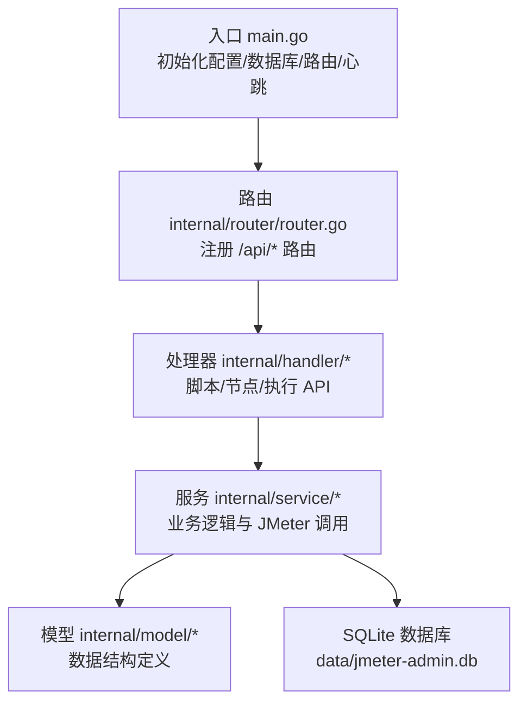
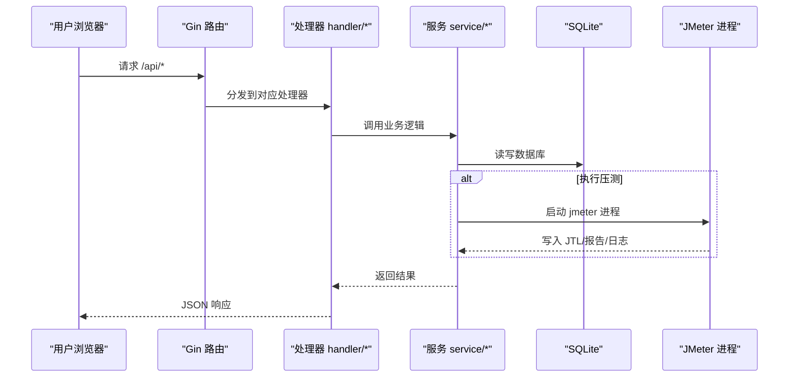
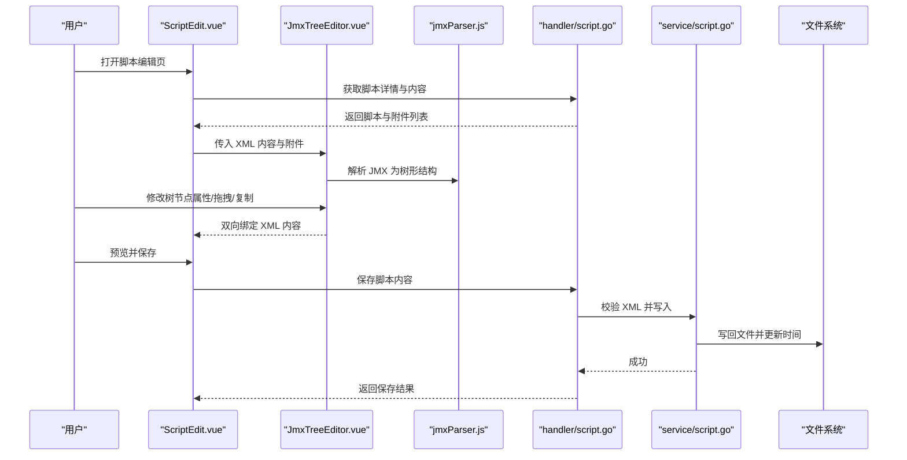
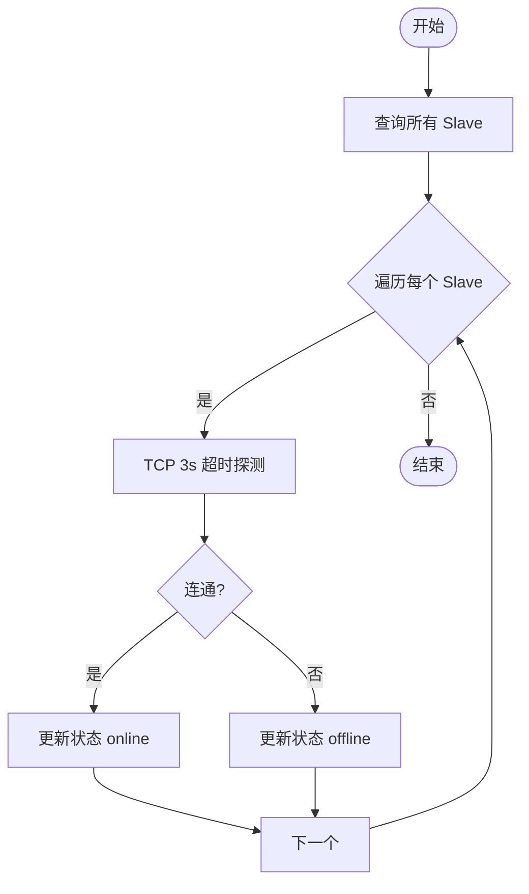
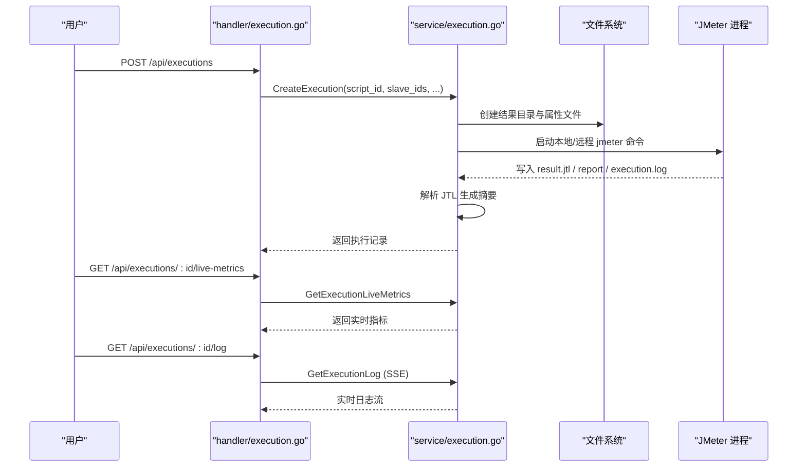
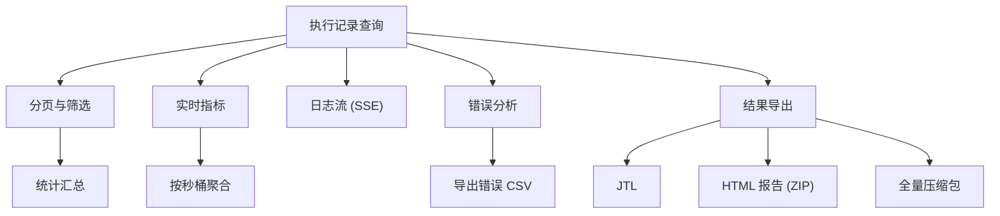
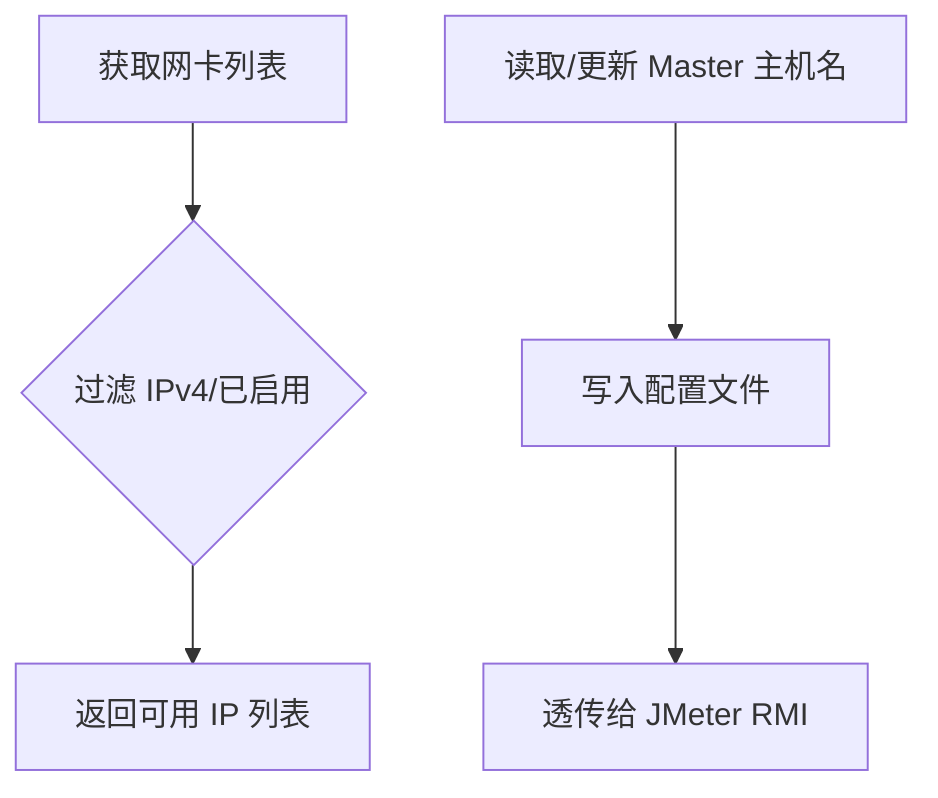
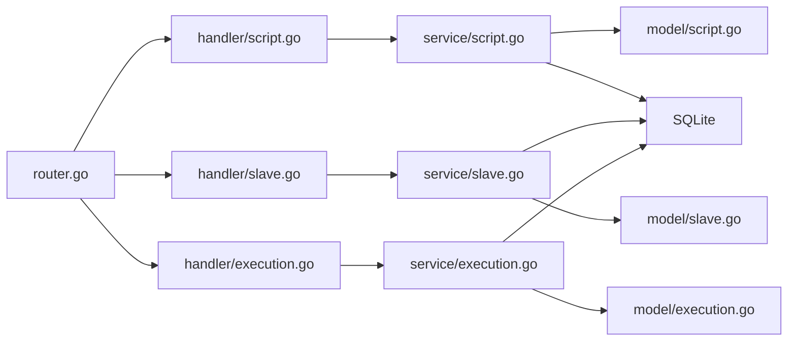

# 核心功能

<cite>
**本文引用的文件**
- [main.go](file://main.go)
- [README.md](file://README.md)
- [config/config.go](file://config/config.go)
- [internal/router/router.go](file://internal/router/router.go)
- [internal/model/script.go](file://internal/model/script.go)
- [internal/model/slave.go](file://internal/model/slave.go)
- [internal/model/execution.go](file://internal/model/execution.go)
- [internal/handler/script.go](file://internal/handler/script.go)
- [internal/handler/slave.go](file://internal/handler/slave.go)
- [internal/handler/execution.go](file://internal/handler/execution.go)
- [internal/service/script.go](file://internal/service/script.go)
- [internal/service/slave.go](file://internal/service/slave.go)
- [internal/service/execution.go](file://internal/service/execution.go)
- [web/src/components/JmxTreeEditor.vue](file://web/src/components/JmxTreeEditor.vue)
- [web/src/utils/jmxParser.js](file://web/src/utils/jmxParser.js)
- [web/src/views/ScriptEdit.vue](file://web/src/views/ScriptEdit.vue)
</cite>

## 目录
1. [简介](#简介)
2. [项目结构](#项目结构)
3. [核心组件](#核心组件)
4. [架构总览](#架构总览)
5. [详细组件分析](#详细组件分析)
6. [依赖关系分析](#依赖关系分析)
7. [性能考量](#性能考量)
8. [故障排查指南](#故障排查指南)
9. [结论](#结论)
10. [附录](#附录)

## 简介
JMeter Admin 是一个基于 Go（Gin）+ Vue 3（Element Plus）+ SQLite 的单文件部署型 JMeter 分布式压测管理平台。它提供五大核心功能：
- JMX 脚本管理：支持上传、可视化树形编辑、XML 源码编辑双模式
- Slave 节点管理：自动心跳检测、一键连通性检查
- 分布式压测执行：支持单机/分布式模式，动态 JVM 内存分配
- 执行记录管理：实时日志流、错误分析、结果导出（JTL/报告/CSV）
- Master IP 自动检测：多网卡环境智能识别或手动配置

## 项目结构
后端采用分层设计：入口程序负责初始化配置、数据库与路由；路由层注册 API；处理器层承接请求并调用服务层；服务层封装业务逻辑；模型层定义数据结构；数据库层负责 SQLite 初始化与迁移。

图表来源
- [main.go:28-66](file://main.go#L28-L66)
- [internal/router/router.go:14-112](file://internal/router/router.go#L14-L112)

章节来源
- [main.go:1-83](file://main.go#L1-L83)
- [README.md:92-120](file://README.md#L92-L120)

## 核心组件
- 配置中心：集中管理服务端口、JMeter 路径、Master 主机名、心跳间隔、目录等
- 路由与处理器：统一暴露 /api/* REST 接口，覆盖脚本、节点、执行三大领域
- 服务层：封装脚本 CRUD、JMX 校验与持久化、Slave 连通性与心跳、执行生命周期与结果解析
- 前端编辑器：可视化树形编辑器与 XML 源码编辑器双模切换，支持历史记录与差异预览

章节来源
- [config/config.go:10-41](file://config/config.go#L10-L41)
- [internal/router/router.go:20-75](file://internal/router/router.go#L20-L75)
- [internal/handler/script.go:37-108](file://internal/handler/script.go#L37-L108)
- [internal/handler/slave.go:16-236](file://internal/handler/slave.go#L16-L236)
- [internal/handler/execution.go:38-53](file://internal/handler/execution.go#L38-L53)

## 架构总览
系统启动时加载配置、创建必要目录、初始化 SQLite、清理陈旧执行记录、启动 Slave 心跳检测，并注册路由。前端资源嵌入后端二进制，通过 /api/* 与后端交互。

图表来源
- [main.go:28-66](file://main.go#L28-L66)
- [internal/router/router.go:14-112](file://internal/router/router.go#L14-L112)
- [internal/service/execution.go:103-481](file://internal/service/execution.go#L103-L481)

章节来源
- [main.go:28-66](file://main.go#L28-L66)
- [internal/router/router.go:14-112](file://internal/router/router.go#L14-L112)

## 详细组件分析

### 一、JMX 脚本管理
- 业务价值
  - 统一管理 JMX 脚本与附件，支持可视化树形编辑与 XML 源码编辑双模式，降低学习成本
  - 提供历史记录与差异预览，保障变更安全
- 技术实现
  - 上传：限制单文件与总大小，校验扩展名，写入 uploads/{id}/ 并记录到 script_files
  - 可视化编辑：基于 JmxTreeEditor 组件，解析 JMX 为树形结构，支持拖拽、复制、上下移动、启用/禁用、批量键值对与字符串列表编辑
  - XML 源码编辑：集成 Monaco Editor，提供语法高亮与差异对比
  - 保存：校验 XML 合法性，写回磁盘并更新脚本时间
- 使用场景
  - 快速上传已有脚本进行二次编辑
  - 通过树形编辑器调整线程组、HTTP 请求、断言、提取器等元素
  - 通过 XML 源码进行精细修改与版本对比
- 最佳实践
  - 优先使用可视化编辑器进行常规修改
  - 大规模改动建议先在测试环境验证
  - 保存前使用差异预览核对变更范围

图表来源
- [web/src/views/ScriptEdit.vue:535-568](file://web/src/views/ScriptEdit.vue#L535-L568)
- [web/src/components/JmxTreeEditor.vue:674-707](file://web/src/components/JmxTreeEditor.vue#L674-L707)
- [web/src/utils/jmxParser.js:795-800](file://web/src/utils/jmxParser.js#L795-L800)
- [internal/handler/script.go:196-238](file://internal/handler/script.go#L196-L238)
- [internal/service/script.go:229-280](file://internal/service/script.go#L229-L280)

章节来源
- [internal/handler/script.go:37-108](file://internal/handler/script.go#L37-L108)
- [internal/handler/script.go:240-327](file://internal/handler/script.go#L240-L327)
- [internal/service/script.go:18-83](file://internal/service/script.go#L18-L83)
- [internal/service/script.go:229-280](file://internal/service/script.go#L229-L280)
- [web/src/views/ScriptEdit.vue:535-568](file://web/src/views/ScriptEdit.vue#L535-L568)
- [web/src/components/JmxTreeEditor.vue:674-707](file://web/src/components/JmxTreeEditor.vue#L674-L707)
- [web/src/utils/jmxParser.js:795-800](file://web/src/utils/jmxParser.js#L795-L800)

### 二、Slave 节点管理
- 业务价值
  - 统一维护分布式压测节点，自动心跳检测保障节点健康度，一键连通性检查提升运维效率
- 技术实现
  - 列表/新增/更新/删除：标准 CRUD
  - 连通性检测：基于 TCP 3 秒超时探测
  - 心跳检测：后台定时器并发检测，限制并发数，更新状态与最后检测时间
  - 网卡识别：列出本机 IPv4 网卡，辅助配置 Master 主机名
- 使用场景
  - 新增 Slave 节点后立即检查连通性
  - 定期查看心跳状态，及时发现离线节点
  - 多网卡环境下通过网卡列表辅助选择 Master 主机名
- 最佳实践
  - Slave 端启动 jmeter-server 时禁用 RMI SSL
  - 防火墙开放 50000/1099 端口
  - 心跳间隔建议不低于 10 秒，避免频繁探测

图表来源
- [internal/service/slave.go:172-220](file://internal/service/slave.go#L172-L220)
- [internal/handler/slave.go:16-236](file://internal/handler/slave.go#L16-L236)

章节来源
- [internal/service/slave.go:15-41](file://internal/service/slave.go#L15-L41)
- [internal/service/slave.go:112-157](file://internal/service/slave.go#L112-L157)
- [internal/service/slave.go:159-220](file://internal/service/slave.go#L159-L220)
- [internal/handler/slave.go:16-236](file://internal/handler/slave.go#L16-L236)

### 三、分布式压测执行
- 业务价值
  - 支持单机/分布式混合模式，自动合并本地与远程结果，生成报告，提供实时日志流与错误分析
- 技术实现
  - 执行创建：组装本地/远程 JMeter 命令，动态计算 JVM 参数（取系统可用内存 80%），异步执行
  - 结果解析：解析 JTL，统计请求总量、成功率、平均/峰值 RT、并发、吞吐等指标
  - 实时指标：按秒聚合，计算 TPS、请求速率、成功率、误差率、并发峰值
  - 日志流：SSE 实时推送日志，支持快照读取
  - 结果导出：JTL、HTML 报告、错误 CSV、全量压缩包
- 使用场景
  - 小规模压测使用单机模式
  - 大规模压测使用分布式模式，可选包含 Master 本地执行
  - 需要错误明细时开启保存 HTTP 详情，支持分布式回传
- 最佳实践
  - 多网卡环境务必配置 Master 主机名，避免 RMI 回调失败
  - 分布式模式下建议开启保存 HTTP 详情以便后续分析
  - 合理设置 ramp-up 与线程数，避免瞬时拥塞

图表来源
- [internal/handler/execution.go:38-53](file://internal/handler/execution.go#L38-L53)
- [internal/handler/execution.go:118-134](file://internal/handler/execution.go#L118-L134)
- [internal/handler/execution.go:555-708](file://internal/handler/execution.go#L555-L708)
- [internal/service/execution.go:103-481](file://internal/service/execution.go#L103-L481)
- [internal/service/execution.go:673-947](file://internal/service/execution.go#L673-L947)

章节来源
- [internal/handler/execution.go:38-53](file://internal/handler/execution.go#L38-L53)
- [internal/handler/execution.go:118-134](file://internal/handler/execution.go#L118-L134)
- [internal/handler/execution.go:555-708](file://internal/handler/execution.go#L555-L708)
- [internal/service/execution.go:103-481](file://internal/service/execution.go#L103-L481)
- [internal/service/execution.go:673-947](file://internal/service/execution.go#L673-L947)

### 四、执行记录管理
- 业务价值
  - 提供执行列表、统计、详情、实时指标、日志流、错误分析与多种导出能力，支撑全流程闭环
- 技术实现
  - 列表与筛选：支持按脚本、状态、关键字、日期范围分页查询
  - 统计：运行中/已完成/失败/已停止数量
  - 实时指标：按秒桶聚合，输出 TPS、请求速率、成功率、误差率、并发等
  - 日志流：SSE 推送，支持快照读取
  - 错误分析：解析 JTL，导出错误 CSV
  - 结果导出：JTL、HTML 报告（ZIP）、全量压缩包（日志/JTL/报告/摘要）
- 使用场景
  - 实时监控压测过程，快速定位异常
  - 导出报告与错误明细用于复盘
  - 通过统计概览掌握整体执行态势
- 最佳实践
  - 使用实时指标观察峰值与波动
  - 错误分析优先查看错误 CSV，再结合日志定位根因
  - 导出全量包归档，便于长期审计

图表来源
- [internal/handler/execution.go:55-87](file://internal/handler/execution.go#L55-L87)
- [internal/handler/execution.go:89-98](file://internal/handler/execution.go#L89-L98)
- [internal/handler/execution.go:118-134](file://internal/handler/execution.go#L118-L134)
- [internal/handler/execution.go:555-708](file://internal/handler/execution.go#L555-L708)
- [internal/handler/execution.go:170-185](file://internal/handler/execution.go#L170-L185)
- [internal/handler/execution.go:211-259](file://internal/handler/execution.go#L211-L259)
- [internal/handler/execution.go:261-358](file://internal/handler/execution.go#L261-L358)
- [internal/handler/execution.go:420-480](file://internal/handler/execution.go#L420-L480)

章节来源
- [internal/handler/execution.go:55-87](file://internal/handler/execution.go#L55-L87)
- [internal/handler/execution.go:89-98](file://internal/handler/execution.go#L89-L98)
- [internal/handler/execution.go:118-134](file://internal/handler/execution.go#L118-L134)
- [internal/handler/execution.go:555-708](file://internal/handler/execution.go#L555-L708)
- [internal/handler/execution.go:170-185](file://internal/handler/execution.go#L170-L185)
- [internal/handler/execution.go:211-259](file://internal/handler/execution.go#L211-L259)
- [internal/handler/execution.go:261-358](file://internal/handler/execution.go#L261-L358)
- [internal/handler/execution.go:420-480](file://internal/handler/execution.go#L420-L480)

### 五、Master IP 自动检测
- 业务价值
  - 多网卡环境下自动识别可用网卡 IP，或手动配置 Master 主机名，确保 Slave 正确回传数据
- 技术实现
  - 网卡列表：枚举本机 IPv4 网卡，过滤未启用与回环接口
  - Master 主机名：读取/更新配置，透传给 JMeter 的 -Djava.rmi.server.hostname
- 使用场景
  - 服务器多网卡（内网/外网）时，自动选择可被 Slave 访问的 IP
  - 无法自动识别时，手动在页面设置 Master 主机名
- 最佳实践
  - 配置后重启服务或刷新页面生效
  - 确保防火墙放行 RMI 回传端口

图表来源
- [internal/handler/slave.go:124-167](file://internal/handler/slave.go#L124-L167)
- [internal/handler/slave.go:169-198](file://internal/handler/slave.go#L169-L198)
- [config/config.go:26-29](file://config/config.go#L26-L29)

章节来源
- [internal/handler/slave.go:124-167](file://internal/handler/slave.go#L124-L167)
- [internal/handler/slave.go:169-198](file://internal/handler/slave.go#L169-L198)
- [config/config.go:26-29](file://config/config.go#L26-L29)

## 依赖关系分析
- 组件耦合
  - 路由层与处理器层低耦合，职责清晰
  - 处理器依赖服务层，服务层依赖模型与数据库
  - 前端编辑器依赖解析工具与 API
- 外部依赖
  - Gin：Web 框架
  - Element Plus：UI 组件库
  - SQLite：本地数据库
  - JMeter：压测引擎

图表来源
- [internal/router/router.go:20-75](file://internal/router/router.go#L20-L75)
- [internal/handler/script.go:12-14](file://internal/handler/script.go#L12-L14)
- [internal/handler/slave.go:9-13](file://internal/handler/slave.go#L9-L13)
- [internal/handler/execution.go:17-21](file://internal/handler/execution.go#L17-L21)
- [internal/service/script.go:13-16](file://internal/service/script.go#L13-L16)
- [internal/service/slave.go:11-13](file://internal/service/slave.go#L11-L13)
- [internal/service/execution.go:24-27](file://internal/service/execution.go#L24-L27)

章节来源
- [internal/router/router.go:20-75](file://internal/router/router.go#L20-L75)
- [internal/model/script.go:3-12](file://internal/model/script.go#L3-L12)
- [internal/model/slave.go:3-11](file://internal/model/slave.go#L3-L11)
- [internal/model/execution.go:3-18](file://internal/model/execution.go#L3-L18)

## 性能考量
- JVM 内存动态分配：根据系统可用内存的 80% 自动计算 -Xms/-Xmx，避免手工配置复杂度
- 并发控制：Slave 心跳检测使用信号量限制并发（默认 10），避免对数据库造成压力
- 结果解析：JTL 解析按秒桶聚合，避免一次性加载全量数据
- 日志流：SSE 推送，支持快照读取与超时控制，兼顾实时性与稳定性

章节来源
- [internal/service/execution.go:54-101](file://internal/service/execution.go#L54-L101)
- [internal/service/slave.go:179-180](file://internal/service/slave.go#L179-L180)
- [internal/service/execution.go:673-947](file://internal/service/execution.go#L673-L947)
- [internal/handler/execution.go:555-708](file://internal/handler/execution.go#L555-L708)

## 故障排查指南
- 编译报错 CGO 相关
  - 确保系统已安装 gcc/build-essential
- 前端构建慢
  - 使用 npmmirror 镜像加速 npm 配置
- Slave 连接失败
  - 检查 master_hostname 配置是否正确
  - 防火墙开放 50000/1099 端口
  - Slave 端禁用 RMI SSL：-Dserver.rmi.ssl.disable=true
- JMeter OOM
  - 系统自动根据可用内存分配 JVM 堆（80% 可用内存），无需手动配置
- SQLite 迁移报错
  - 删除数据库文件重新创建

章节来源
- [README.md:270-312](file://README.md#L270-L312)

## 结论
JMeter Admin 通过清晰的分层架构与完善的 API 设计，将 JMeter 的复杂操作简化为直观的图形界面与一键式操作。五大核心功能覆盖了脚本管理、节点治理、分布式执行、结果分析与网络配置的全链路需求，适合不同技术水平的用户从入门到精通地开展压测工作。

## 附录
- 快速开始与一键部署
  - 安装依赖 → 编译 → 启动 → 访问 http://your-server-ip:8080
- API 文档
  - 脚本管理、Slave 管理、执行管理、系统配置等接口详见 README 的 API 文档章节
- 数据库表结构
  - scripts、script_files、slaves、executions 表结构详见 README 的数据库表结构章节

章节来源
- [README.md:27-72](file://README.md#L27-L72)
- [README.md:122-174](file://README.md#L122-L174)
- [README.md:175-230](file://README.md#L175-L230)