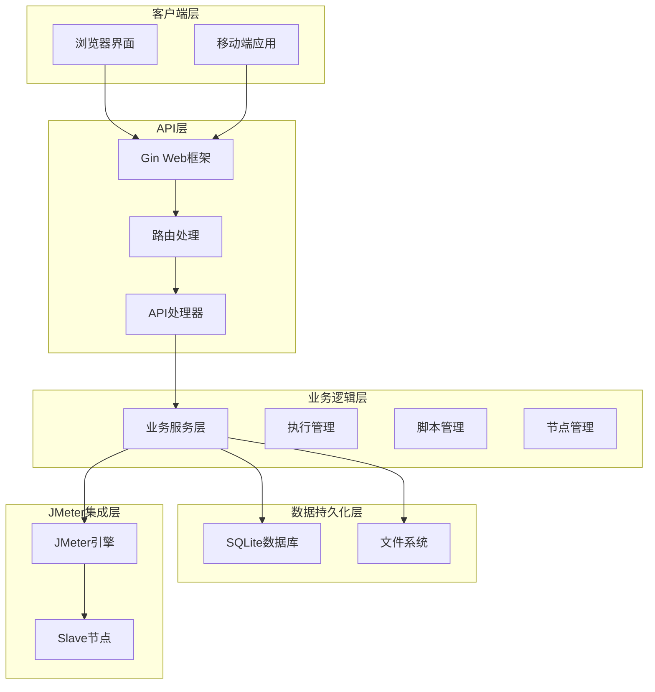
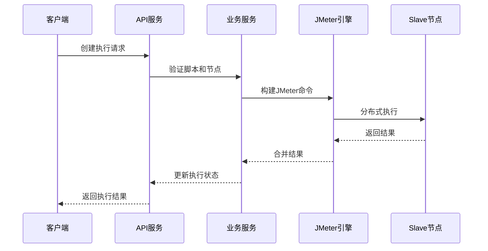
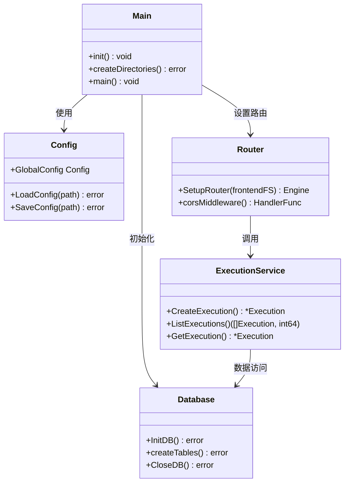
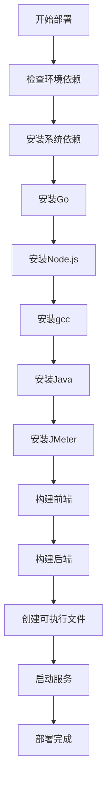
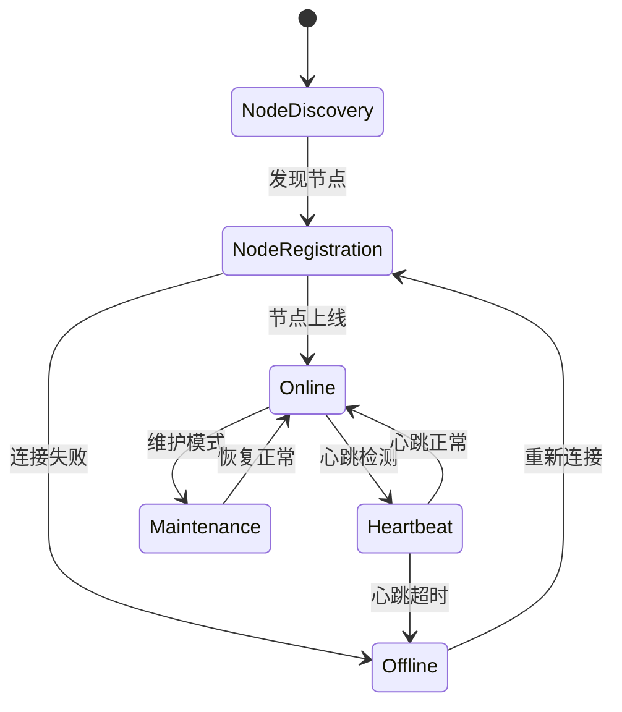

# 项目介绍

<cite>
**本文档引用的文件**
- [README.md](file://README.md)
- [main.go](file://main.go)
- [go.mod](file://go.mod)
- [config/config.go](file://config/config.go)
- [internal/router/router.go](file://internal/router/router.go)
- [internal/database/db.go](file://internal/database/db.go)
- [internal/service/execution.go](file://internal/service/execution.go)
- [web/src/main.js](file://web/src/main.js)
- [web/package.json](file://web/package.json)
- [Makefile](file://Makefile)
- [deploy.sh](file://deploy.sh)
- [web/src/views/ExecutionList.vue](file://web/src/views/ExecutionList.vue)
- [web/src/views/ScriptList.vue](file://web/src/views/ScriptList.vue)
</cite>

## 目录
1. [项目概述](#项目概述)
2. [技术架构设计](#技术架构设计)
3. [核心特性与价值](#核心特性与价值)
4. [技术栈选择分析](#技术栈选择分析)
5. [系统架构图](#系统架构图)
6. [部署与运维优势](#部署与运维优势)
7. [应用场景与解决方案](#应用场景与解决方案)
8. [发展历程与未来规划](#发展历程与未来规划)
9. [快速开始指南](#快速开始指南)
10. [总结](#总结)

## 项目概述

JMeter Admin是一个**单文件部署的JMeter分布式压测管理平台**，采用Go + Vue 3 + SQLite技术栈开发。该项目的核心价值在于提供了一个轻量级、易部署、功能完整的分布式性能测试管理解决方案。

### 核心功能特性

- **JMX脚本管理**：支持上传、可视化树形编辑、XML源码编辑双模式
- **Slave节点管理**：自动心跳检测、一键连通性检查
- **分布式压测执行**：支持单机模式与分布式模式
- **执行记录管理**：实时日志流、错误分析、结果导出（JTL/报告/CSV）
- **Master IP自动检测**：多网卡环境自动识别或手动配置

## 技术架构设计

### 整体架构模式



**架构图来源**
- [main.go:28-66](file://main.go#L28-L66)
- [internal/router/router.go:14-112](file://internal/router/router.go#L14-L112)

### 核心设计理念

1. **单文件部署**：通过Go的embed功能将前端资源嵌入二进制文件
2. **零依赖架构**：使用SQLite替代传统数据库，减少外部依赖
3. **前后端一体化**：统一的构建流程，简化部署复杂度
4. **容器友好**：支持跨平台编译，便于容器化部署

## 核心特性与价值

### 单文件部署的独特优势

| 特性 | 优势 | 技术实现 |
|------|------|----------|
| **零依赖部署** | 无需额外安装数据库、Web服务器 | SQLite + Go embed |
| **简化运维** | 一个二进制文件即可运行 | 统一构建流程 |
| **快速部署** | 一键安装脚本 | deploy.sh自动化 |
| **跨平台支持** | 支持Linux、Windows、macOS | CGO_ENABLED=1编译 |

### 分布式压测管理能力



**序列图来源**
- [internal/service/execution.go:104-481](file://internal/service/execution.go#L104-L481)

## 技术栈选择分析

### Go + Gin + SQLite 的技术组合优势

#### Go语言选择理由

1. **编译型语言**：运行时性能优异，无运行时依赖
2. **并发支持**：内置goroutine，适合高并发的API服务
3. **跨平台编译**：支持多种操作系统和架构
4. **生态完善**：丰富的第三方库支持

#### Gin框架优势

- **高性能**：基于httprouter，路由性能优异
- **简洁API**：开发体验良好，学习成本低
- **中间件支持**：CORS、日志等中间件丰富
- **JSON支持**：原生支持JSON序列化

#### SQLite数据库优势

- **零配置**：无需独立数据库服务
- **文件存储**：单文件即可存储所有数据
- **ACID特性**：保证数据一致性
- **跨平台**：支持多种操作系统

#### Vue 3 + Element Plus 前端技术栈

- **现代化框架**：Composition API，更好的TypeScript支持
- **组件化开发**：Element Plus提供丰富的UI组件
- **响应式设计**：良好的移动端适配
- **开发体验**：Vite提供快速热重载

**技术栈选择来源**
- [go.mod:5-9](file://go.mod#L5-L9)
- [web/package.json:10-17](file://web/package.json#L10-L17)

## 系统架构图

### 代码架构关系图



**类图来源**
- [main.go:19-66](file://main.go#L19-L66)
- [config/config.go:41-112](file://config/config.go#L41-L112)
- [internal/router/router.go:14-112](file://internal/router/router.go#L14-L112)
- [internal/database/db.go:15-34](file://internal/database/db.go#L15-L34)

## 部署与运维优势

### 一键部署脚本功能



**流程图来源**
- [deploy.sh:47-92](file://deploy.sh#L47-L92)

### 部署脚本核心功能

1. **环境检查**：自动检测并安装Go、Node.js、gcc等依赖
2. **版本管理**：精确控制各组件版本
3. **镜像加速**：使用国内镜像源提升下载速度
4. **服务管理**：提供systemd服务安装功能
5. **日志监控**：完整的日志输出和错误处理

**部署脚本来源**
- [deploy.sh:174-436](file://deploy.sh#L174-L436)

## 应用场景与解决方案

### 企业级分布式压测管理

#### 场景特点
- 多团队协作的性能测试需求
- 需要集中化的测试脚本管理
- 分布式节点的统一监控
- 自动化测试执行流程

#### 解决方案优势

| 场景需求 | JMeter Admin解决方案 | 传统方案对比 |
|----------|---------------------|-------------|
| **脚本管理** | 集中式JMX脚本管理，版本控制 | 多个Git仓库分散管理 |
| **节点管理** | 自动心跳检测，连通性检查 | 手工维护节点清单 |
| **执行监控** | 实时日志流，错误分析 | 事后分析，响应慢 |
| **结果导出** | 多格式结果导出，报告生成 | 手工收集，格式不统一 |
| **权限控制** | 基于角色的访问控制 | 传统文件权限管理 |

### 多节点协调机制



**状态图来源**
- [internal/service/execution.go:48-52](file://internal/service/execution.go#L48-L52)

## 发展历程与未来规划

### 技术演进历程

#### 第一阶段：基础功能实现
- 实现基本的JMX脚本管理
- 建立分布式节点管理机制
- 完成核心的压测执行功能

#### 第二阶段：用户体验优化
- 改进前端交互体验
- 增强错误处理和日志功能
- 优化部署流程

#### 第三阶段：企业级功能扩展
- 增加权限管理和审计功能
- 完善监控和告警机制
- 提供更丰富的报告分析

### 未来发展规划

#### 短期目标（3-6个月）
1. **增强监控能力**：增加实时性能指标监控
2. **优化用户体验**：改进前端界面和交互流程
3. **扩展报告功能**：提供更多维度的测试报告

#### 中期目标（6-12个月）
1. **集群化部署**：支持多实例部署和负载均衡
2. **插件系统**：提供扩展插件机制
3. **云原生支持**：完善Docker和Kubernetes支持

#### 长期愿景（12+个月）
1. **AI辅助测试**：引入智能测试场景推荐
2. **测试编排**：支持复杂的测试流程编排
3. **开源生态**：建立完善的社区和贡献机制

## 快速开始指南

### 环境要求

| 组件 | 版本要求 | 说明 |
|------|----------|------|
| Go | >= 1.21 | 后端编译环境 |
| Node.js | >= 16.x | 前端构建工具 |
| gcc | 任意 | SQLite编译依赖 |
| Java | >= 11 | JMeter运行时 |
| JMeter | >= 5.6 | 压测引擎 |

### 一键部署流程

```bash
# 1. 安装所有依赖
./deploy.sh install-deps

# 2. 刷新环境变量
source ~/.bashrc

# 3. 编译项目
./deploy.sh install

# 4. 启动服务
./deploy.sh start

# 5. 访问管理界面
http://your-server-ip:8080
```

### 开发环境搭建

```bash
# 同时启动前后端（前端热更新）
make dev

# 或分别启动
make dev-backend    # 后端 :8080
make dev-frontend   # 前端 :3000
```

**快速开始来源**
- [README.md:27-72](file://README.md#L27-L72)
- [Makefile:28-39](file://Makefile#L28-L39)

## 总结

JMeter Admin项目通过精心设计的技术架构和务实的功能实现，为企业级分布式压测管理提供了高效、可靠的解决方案。其独特的单文件部署模式、零依赖架构设计，以及Go + Vue 3 + SQLite的完美技术组合，使得该平台在易用性、可维护性和扩展性方面都达到了优秀水平。

### 核心价值总结

1. **降低部署门槛**：单文件部署，零依赖配置
2. **提升运维效率**：统一的管理界面和自动化流程
3. **保证技术先进性**：采用现代技术栈，持续演进
4. **满足企业需求**：功能完整，适合大规模应用场景

### 技术决策背景

- **Go语言**：选择Go主要是考虑到其出色的并发性能和跨平台编译能力，非常适合构建高性能的API服务
- **Vue 3**：采用最新的前端技术栈，提供更好的开发体验和用户体验
- **SQLite**：选择SQLite是为了简化部署流程，避免复杂的数据库配置和运维
- **单文件部署**：通过Go的embed功能实现，极大简化了部署和运维复杂度

JMeter Admin项目不仅是一个技术产品，更是对现代软件工程理念的实践体现。它展示了如何通过合理的技术选型和架构设计，为企业用户提供既实用又高效的解决方案。