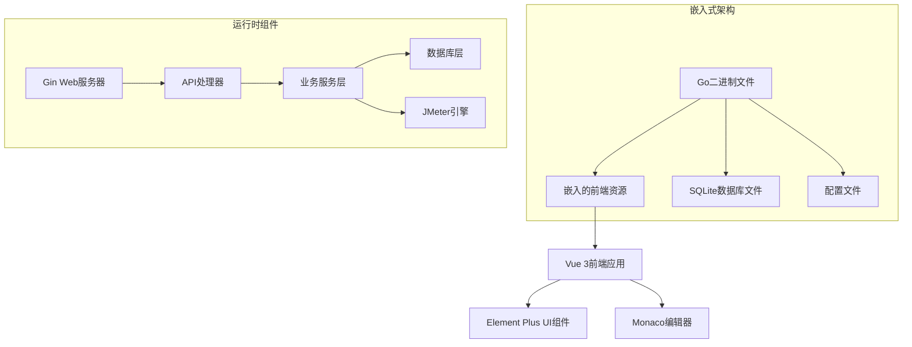
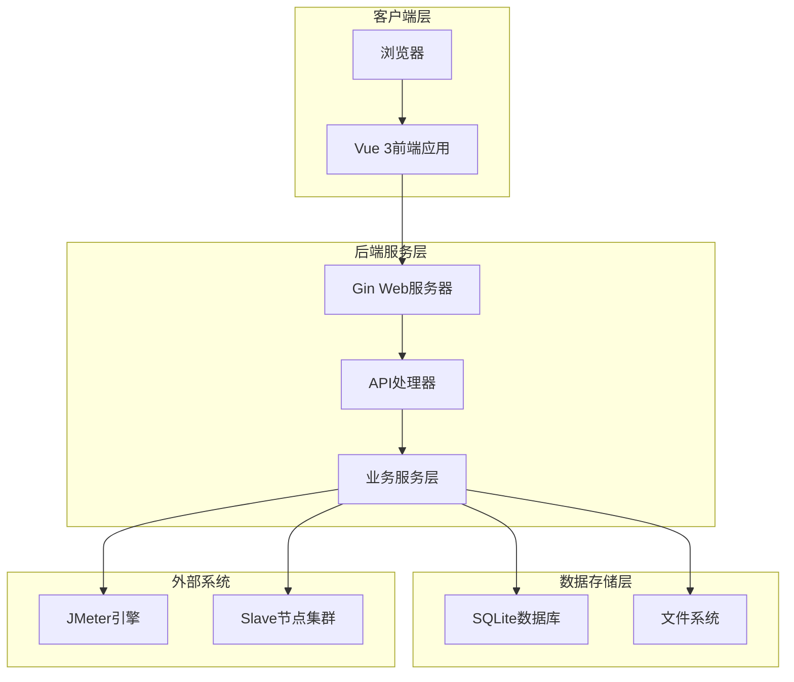
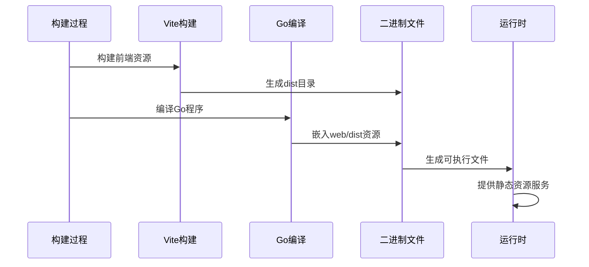
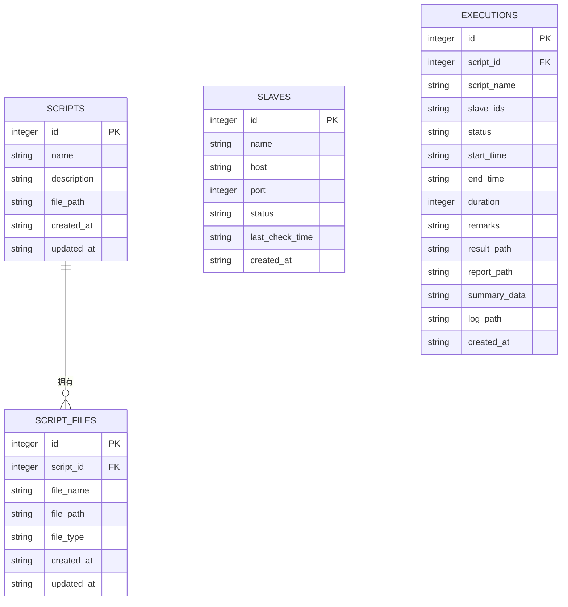

# 项目概述

<cite>
**本文引用的文件**
- [README.md](file://README.md)
- [main.go](file://main.go)
- [go.mod](file://go.mod)
- [config/config.go](file://config/config.go)
- [config.yaml](file://config.yaml)
- [internal/router/router.go](file://internal/router/router.go)
- [internal/model/script.go](file://internal/model/script.go)
- [internal/model/slave.go](file://internal/model/slave.go)
- [internal/model/execution.go](file://internal/model/execution.go)
- [internal/service/script.go](file://internal/service/script.go)
- [internal/service/slave.go](file://internal/service/slave.go)
- [internal/service/execution.go](file://internal/service/execution.go)
- [web/src/main.js](file://web/src/main.js)
- [web/package.json](file://web/package.json)
- [web/vite.config.js](file://web/vite.config.js)
- [Makefile](file://Makefile)
</cite>

## 更新摘要
**所做更改**
- 新增完整的项目介绍和核心价值说明
- 详细的技术栈选择说明和架构设计考量
- 完善的核心功能特性介绍，包括JMX脚本管理、Slave节点管理、分布式压测执行等
- 新增快速开始指南，涵盖一键部署、本地开发和编译部署三种模式
- 补充系统架构图和前后端分离设计说明
- 增加详细的API接口文档和数据库表结构说明

## 目录
1. [项目介绍](#项目介绍)
2. [技术栈与架构设计](#技术栈与架构设计)
3. [核心功能特性](#核心功能特性)
4. [系统架构概览](#系统架构概览)
5. [快速开始指南](#快速开始指南)
6. [API接口文档](#api接口文档)
7. [数据库设计](#数据库设计)
8. [部署与配置](#部署与配置)
9. [常见问题解答](#常见问题解答)
10. [结语](#结语)

## 项目介绍

JMeter Admin 是一款"单文件部署"的 JMeter 分布式压测管理平台，采用 **Go (Gin) + Vue 3 (Element Plus) + SQLite** 技术栈开发。前端资源嵌入后端二进制文件，编译后生成单个可执行文件，实现零依赖部署。

### 核心价值与目标

JMeter Admin 致力于简化分布式压力测试的部署和管理复杂度，为中小团队提供开箱即用的压力测试解决方案。项目的核心价值体现在：

- **极简部署**：单文件可执行程序，无需额外依赖
- **零运维成本**：内置SQLite数据库，自动管理数据存储
- **分布式友好**：原生支持JMeter分布式压测，内置节点管理
- **开发友好**：现代化前端界面，提供JMX脚本可视化编辑

### 独特优势

1. **单文件部署**：前端静态资源内嵌到Go二进制文件中，最终产出单一可执行文件
2. **零依赖环境**：SQLite本地存储，无需外部数据库服务
3. **智能配置**：支持Master IP自动检测，简化分布式配置
4. **实时监控**：提供SSE实时日志流和执行指标监控
5. **结果导出**：支持JTL、HTML报告、错误分析等多种格式导出

**章节来源**
- [README.md:5-16](file://README.md#L5-L16)

## 技术栈与架构设计

### 技术栈选择

项目采用三层技术栈设计，每层都有明确的技术考量：

#### 后端技术栈
- **Go + Gin**：高性能Web框架，适合构建RESTful API服务
- **SQLite**：轻量级嵌入式数据库，无需额外服务进程
- **go-sqlite3**：Go语言SQLite驱动，提供类型安全的数据库操作

#### 前端技术栈  
- **Vue 3**：现代JavaScript框架，提供响应式用户界面
- **Element Plus**：基于Vue 3的桌面端组件库，提供丰富的UI组件
- **Monaco Editor**：VS Code同款编辑器，支持JMX文件语法高亮

#### 构建工具
- **Vite**：快速的前端构建工具，支持热重载开发
- **Go Embed**：Go 1.16+内置功能，支持将静态资源嵌入二进制

### 架构设计考量



**图表来源**
- [main.go:16-17](file://main.go#L16-L17)
- [go.mod:5-9](file://go.mod#L5-L9)
- [web/package.json:10-22](file://web/package.json#L10-L22)

### 架构优势

1. **部署简单**：单文件可执行程序，跨平台支持
2. **资源优化**：静态资源内嵌，减少文件传输开销
3. **性能优异**：Go语言高性能，SQLite轻量存储
4. **开发效率**：Vue 3现代化开发体验，Monaco编辑器专业级体验

**章节来源**
- [go.mod:1-42](file://go.mod#L1-42)
- [web/package.json:1-24](file://web/package.json#L1-24)

## 核心功能特性

### JMX脚本管理

提供完整的JMX脚本生命周期管理：

- **双模式编辑**：支持树形可视化编辑和XML源码编辑
- **附件管理**：支持CSV、JAR等测试资源文件上传
- **版本控制**：自动保存脚本历史版本
- **模板支持**：内置常用测试场景模板

### Slave节点管理

内置完整的节点管理功能：

- **自动心跳检测**：定期检测节点连通性和状态
- **一键连通性检查**：支持单个节点连通性验证
- **状态监控**：实时显示节点在线状态和最后检测时间
- **批量管理**：支持节点的增删改查操作

### 分布式压测执行

强大的分布式压测执行能力：

- **单机/分布式模式**：灵活选择执行模式
- **实时监控**：SSE实时日志流和执行指标
- **智能调度**：自动分配负载到各Slave节点
- **异常处理**：自动重试和故障转移机制

### 执行记录管理

完善的执行记录和结果管理：

- **执行统计**：支持按时间、状态等维度统计
- **实时日志**：SSE流式推送执行日志
- **错误分析**：自动分析和分类错误类型
- **结果导出**：支持多种格式结果文件导出

### Master IP自动检测

智能的Master节点配置：

- **多网卡检测**：自动识别可用网络接口
- **IP自动配置**：根据网络环境自动推断Master IP
- **手动覆盖**：支持用户手动指定Master IP
- **RMI配置**：自动配置JMeter RMI回调地址

**章节来源**
- [README.md:9-15](file://README.md#L9-L15)

## 系统架构概览

JMeter Admin 采用前后端分离的微服务架构，后端提供RESTful API，前端通过Vue 3提供现代化用户界面。



**图表来源**
- [main.go:28-66](file://main.go#L28-L66)
- [internal/router/router.go:14-112](file://internal/router/router.go#L14-L112)
- [internal/service/execution.go:103-179](file://internal/service/execution.go#L103-L179)

### 前后端分离设计

系统采用标准的前后端分离架构：

- **前端**：Vue 3单页应用，提供用户交互界面
- **后端**：Go Gin Web服务器，提供RESTful API
- **数据层**：SQLite本地数据库，存储配置和执行记录
- **静态资源**：通过Go Embed嵌入到二进制文件中

### 嵌入式资源实现



**图表来源**
- [Makefile:4-12](file://Makefile#L4-L12)
- [main.go:16-17](file://main.go#L16-L17)

**章节来源**
- [main.go:16-17](file://main.go#L16-L17)
- [internal/router/router.go:80-109](file://internal/router/router.go#L80-L109)

## 快速开始指南

### 一键部署（Linux服务器）

最简单的部署方式，适合生产环境使用：

```bash
# 安装系统依赖
./deploy.sh install-deps

# 重新加载bash配置
source ~/.bashrc

# 编译项目
./deploy.sh install

# 启动服务
./deploy.sh start

# 访问管理界面
# 默认端口8080，访问 http://your-server-ip:8080
```

### 本地开发环境

支持前后端同时开发，提供热重载功能：

```bash
# 同时启动前后端（推荐）
make dev

# 或分别启动
make dev-backend    # 后端 :8080
make dev-frontend   # 前端 :3000
```

### 编译部署

支持多种编译方式，满足不同部署需求：

```bash
# 完整编译（前端 + 后端）
make build-all

# 仅编译后端（需先构建前端）
make build-backend

# 交叉编译Linux版本
make build-linux

# 运行编译后的程序
./jmeter-admin
```

### 环境要求

| 组件 | 版本要求 | 用途 |
|------|----------|------|
| Go | >= 1.21 | 后端编译和运行 |
| Node.js | >= 16.x | 前端构建 |
| gcc | 任意 | SQLite编译依赖（CGO） |
| Java | >= 11 | JMeter运行时 |
| JMeter | >= 5.6 | 压测引擎 |

**章节来源**
- [README.md:27-72](file://README.md#L27-L72)
- [README.md:17-26](file://README.md#L17-L26)
- [Makefile:1-39](file://Makefile#L1-L39)

## API接口文档

### 脚本管理接口

提供完整的JMX脚本管理功能：

| 方法 | 路径 | 说明 |
|------|------|------|
| GET | /api/scripts | 获取脚本列表 |
| POST | /api/scripts | 创建新脚本 |
| GET | /api/scripts/:id | 获取脚本详情 |
| PUT | /api/scripts/:id | 更新脚本信息 |
| DELETE | /api/scripts/:id | 删除脚本 |
| GET | /api/scripts/:id/download | 下载主脚本文件 |
| GET | /api/scripts/:id/content | 获取JMX内容 |
| PUT | /api/scripts/:id/content | 保存JMX内容 |
| POST | /api/scripts/:id/files | 上传附件文件 |
| DELETE | /api/scripts/:id/files/:fileId | 删除附件文件 |

### Slave节点管理接口

提供节点的完整生命周期管理：

| 方法 | 路径 | 说明 |
|------|------|------|
| GET | /api/slaves | 获取节点列表 |
| POST | /api/slaves | 添加新节点 |
| PUT | /api/slaves/:id | 更新节点信息 |
| DELETE | /api/slaves/:id | 删除节点 |
| POST | /api/slaves/:id/check | 连通性检测 |
| GET | /api/slaves/heartbeat-status | 获取心跳状态 |

### 执行管理接口

分布式压测执行的核心接口：

| 方法 | 路径 | 说明 |
|------|------|------|
| GET | /api/executions | 获取执行列表 |
| GET | /api/executions/stats | 获取统计汇总 |
| POST | /api/executions | 创建新的执行任务 |
| GET | /api/executions/:id | 获取执行详情 |
| GET | /api/executions/:id/live-metrics | 获取实时指标 |
| DELETE | /api/executions/:id | 删除执行记录 |
| POST | /api/executions/:id/stop | 停止执行任务 |
| GET | /api/executions/:id/log | 获取实时日志（SSE） |
| GET | /api/executions/:id/errors | 获取错误分析 |
| POST | /api/executions/:id/error-details/upload | 上传错误详情 |
| GET | /api/executions/:id/download/jtl | 下载JTL结果文件 |
| GET | /api/executions/:id/download/report | 下载HTML报告 |
| GET | /api/executions/:id/download/errors | 导出错误CSV |
| GET | /api/executions/:id/download/all | 下载全部结果 |

### 系统配置接口

提供系统运行时配置管理：

| 方法 | 路径 | 说明 |
|------|------|------|
| GET | /api/config/network-interfaces | 获取网络接口列表 |
| GET | /api/config/master-hostname | 获取Master主机名 |
| PUT | /api/config/master-hostname | 更新Master主机名 |

**章节来源**
- [README.md:122-174](file://README.md#L122-L174)

## 数据库设计

### 数据库架构

系统使用SQLite作为本地数据库，采用关系型数据模型设计：



**图表来源**
- [internal/model/script.go:3-22](file://internal/model/script.go#L3-L22)
- [internal/model/slave.go:3-11](file://internal/model/slave.go#L3-L11)
- [internal/model/execution.go:3-18](file://internal/model/execution.go#L3-L18)

### 表结构详解

#### scripts 表（脚本表）
存储JMX脚本的基本信息和主文件路径。

| 字段 | 类型 | 说明 |
|------|------|------|
| id | INTEGER | 主键，自增ID |
| name | TEXT | 脚本名称 |
| description | TEXT | 脚本描述 |
| file_path | TEXT | 主JMX文件路径 |
| created_at | TEXT | 创建时间 |
| updated_at | TEXT | 更新时间 |

#### script_files 表（脚本附件表）
存储脚本相关的附件文件信息。

| 字段 | 类型 | 说明 |
|------|------|------|
| id | INTEGER | 主键，自增ID |
| script_id | INTEGER | 关联脚本ID（外键） |
| file_name | TEXT | 文件名 |
| file_path | TEXT | 文件完整路径 |
| file_type | TEXT | 文件类型（jmx/csv/jar/other） |
| created_at | TEXT | 创建时间 |
| updated_at | TEXT | 更新时间 |

#### slaves 表（Slave节点表）
存储分布式节点的信息和状态。

| 字段 | 类型 | 说明 |
|------|------|------|
| id | INTEGER | 主键，自增ID |
| name | TEXT | 节点名称 |
| host | TEXT | 主机地址 |
| port | INTEGER | 端口号 |
| status | TEXT | 节点状态（online/offline） |
| last_check_time | TEXT | 最后检测时间 |
| created_at | TEXT | 创建时间 |

#### executions 表（执行记录表）
存储压测执行的历史记录和结果信息。

| 字段 | 类型 | 说明 |
|------|------|------|
| id | INTEGER | 主键，自增ID |
| script_id | INTEGER | 关联脚本ID（外键） |
| script_name | TEXT | 脚本名称（冗余字段） |
| slave_ids | TEXT | 选中的Slave节点ID（JSON数组） |
| status | TEXT | 执行状态（running/success/failed/stopped） |
| start_time | TEXT | 开始时间 |
| end_time | TEXT | 结束时间 |
| duration | INTEGER | 执行时长（秒） |
| remarks | TEXT | 执行备注 |
| result_path | TEXT | 结果文件路径 |
| report_path | TEXT | HTML报告路径 |
| summary_data | TEXT | 汇总数据（JSON格式） |
| log_path | TEXT | 日志文件路径 |
| created_at | TEXT | 创建时间 |

**章节来源**
- [README.md:175-230](file://README.md#L175-L230)

## 部署与配置

### 配置文件说明

系统使用YAML格式的配置文件，首次启动时自动生成：

```yaml
# JMeter Admin 配置文件
# 修改后需重启服务生效（master_hostname 除外，可通过页面实时修改）

# 后端服务配置
server:
  port: 8080                          # HTTP服务监听端口

# 前端开发配置（仅开发模式使用）
frontend:
  port: 3000                          # 前端Vite开发服务器端口

# JMeter配置
jmeter:
  path: "jmeter"                      # JMeter可执行文件路径
  master_hostname: ""                 # Master节点IP（多网卡时必填）

# Slave节点配置
slave:
  heartbeat_interval: 30              # 心跳检测间隔（秒）

# 数据目录配置
dirs:
  data: "./data"                      # SQLite数据存储目录
  uploads: "./uploads"                # 脚本和附件上传目录
  results: "./results"                # 执行结果和报告存储目录
```

### 服务管理

提供完整的系统服务管理功能：

```bash
# 基础服务管理
./deploy.sh start     # 启动服务
./deploy.sh stop      # 停止服务
./deploy.sh restart   # 重启服务
./deploy.sh status    # 查看服务状态

# systemd服务集成（可选）
./deploy.sh install-service  # 安装systemd服务
sudo systemctl enable jmeter-admin  # 设置开机自启
sudo systemctl start jmeter-admin   # 启动服务
```

### 分布式配置

#### Master节点配置

1. 在`config.yaml`中配置`master_hostname`，或在页面「系统设置」中选择网卡IP
2. 多网卡环境必须显式指定，否则Slave无法回传数据

#### Slave节点配置

1. 在页面「节点管理」中添加Slave，填写`host:port`
2. Slave端启动jmeter-server：
   ```bash
   jmeter-server -Dserver.rmi.ssl.disable=true
   ```

#### 多网卡环境注意事项

- Master有多个网卡时，RMI回调IP可能错误
- 必须在配置中指定`master_hostname`为Slave可访问的IP
- 系统会自动将`-Djava.rmi.server.hostname`传递给JMeter

**章节来源**
- [config.yaml:1-26](file://config.yaml#L1-L26)
- [README.md:231-268](file://README.md#L231-L268)

## 常见问题解答

### 编译相关问题

**Q: 编译时报CGO相关错误？**
A: 确保系统已安装gcc编译工具链：
```bash
# Ubuntu/Debian系统
sudo apt-get install -y gcc build-essential

# CentOS/RHEL系统  
sudo yum install -y gcc gcc-c++ make
```

**Q: 前端构建速度慢？**
A: 使用国内镜像源提升npm安装速度：
```bash
npm config set registry https://registry.npmmirror.com
```

### 运行环境问题

**Q: Slave连接失败？**
A: 依次检查以下配置：
1. `master_hostname`配置是否正确
2. 防火墙是否开放端口（默认50000, 1099）
3. Slave端是否禁用RMI SSL：`-Dserver.rmi.ssl.disable=true`

**Q: JMeter内存不足？**
A: 系统会自动根据可用内存分配JVM堆（80%可用内存），无需手动配置。

**Q: SQLite数据库损坏？**
A: 删除数据库文件重新创建：
```bash
rm -f data/jmeter-admin.db
./jmeter-admin
```

### 功能使用问题

**Q: 如何查看实时执行日志？**
A: 在执行详情页面点击"实时日志"按钮，系统会建立SSE连接推送实时日志。

**Q: 如何导出压测结果？**
A: 支持多种格式导出：
- JTL原始结果文件
- HTML报告文件  
- 错误分析CSV
- 全部结果压缩包

**章节来源**
- [README.md:270-312](file://README.md#L270-L312)

## 结语

JMeter Admin 通过精心设计的技术栈选择和架构方案，成功地将复杂的分布式压力测试管理变得简单易用。项目的核心优势在于：

1. **极简部署**：单文件可执行程序，降低部署复杂度
2. **零运维成本**：内置SQLite数据库，无需额外维护
3. **开发友好**：现代化前端界面，提供专业级编辑体验
4. **功能完善**：覆盖从脚本管理到结果导出的完整工作流

无论是初学者还是有经验的开发者，都能通过JMeter Admin快速搭建属于自己的分布式压测平台。项目持续演进中，欢迎社区贡献和反馈，共同完善这个开源项目。

**章节来源**
- [README.md:313-316](file://README.md#L313-L316)