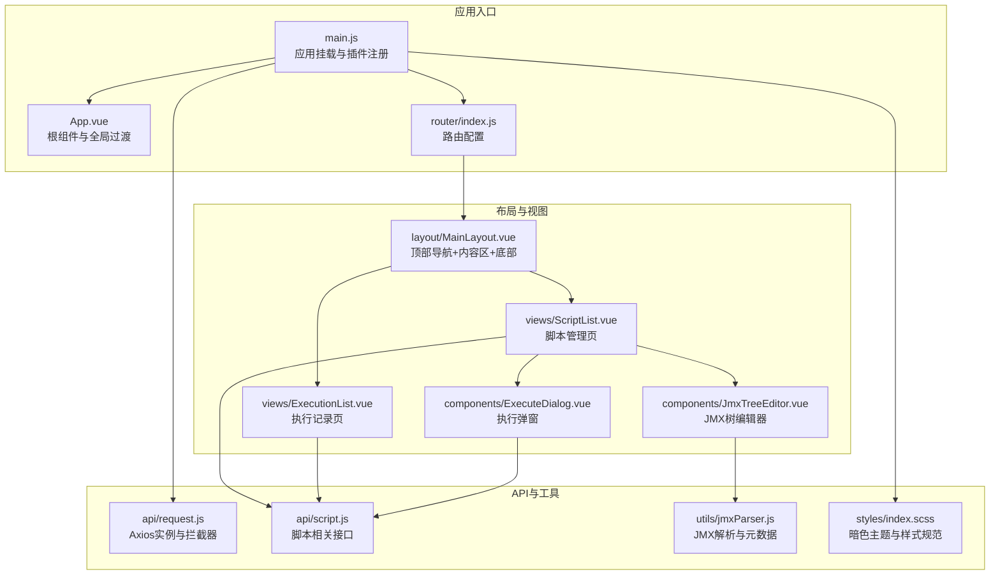
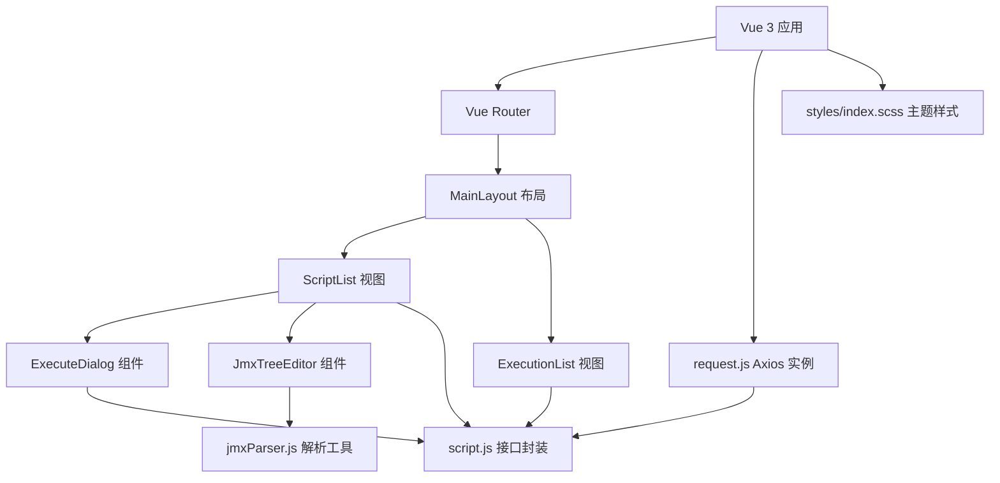
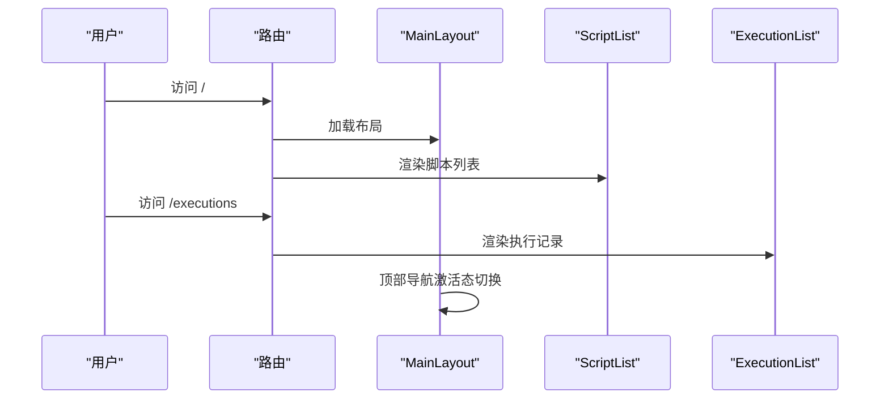
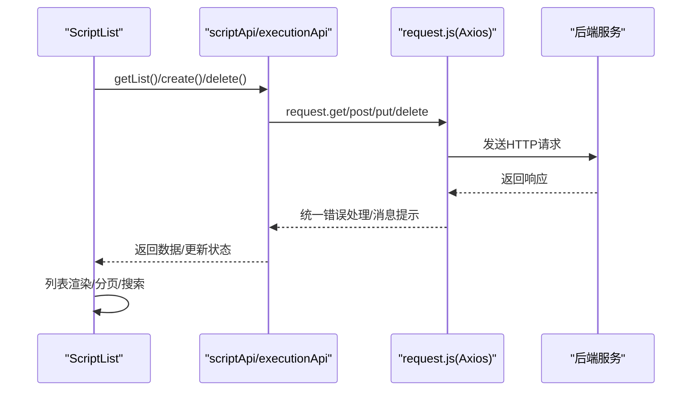
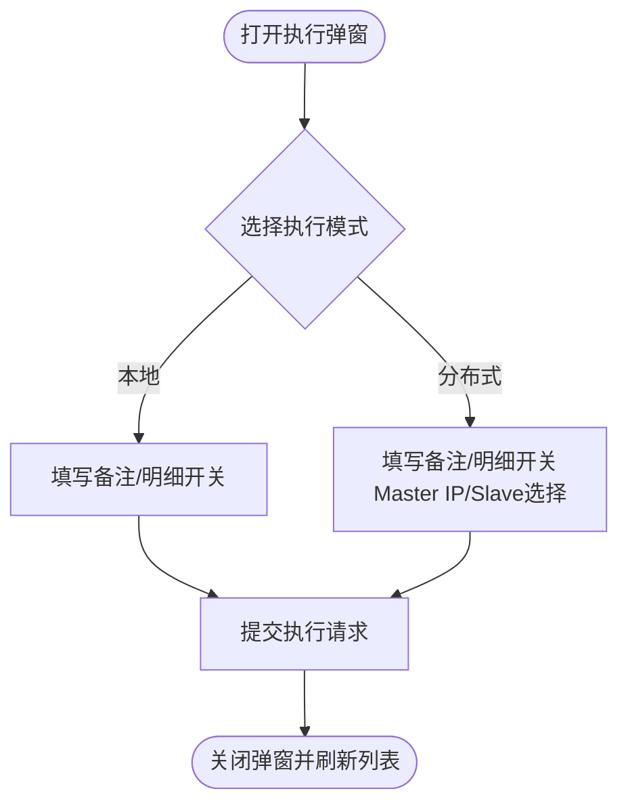
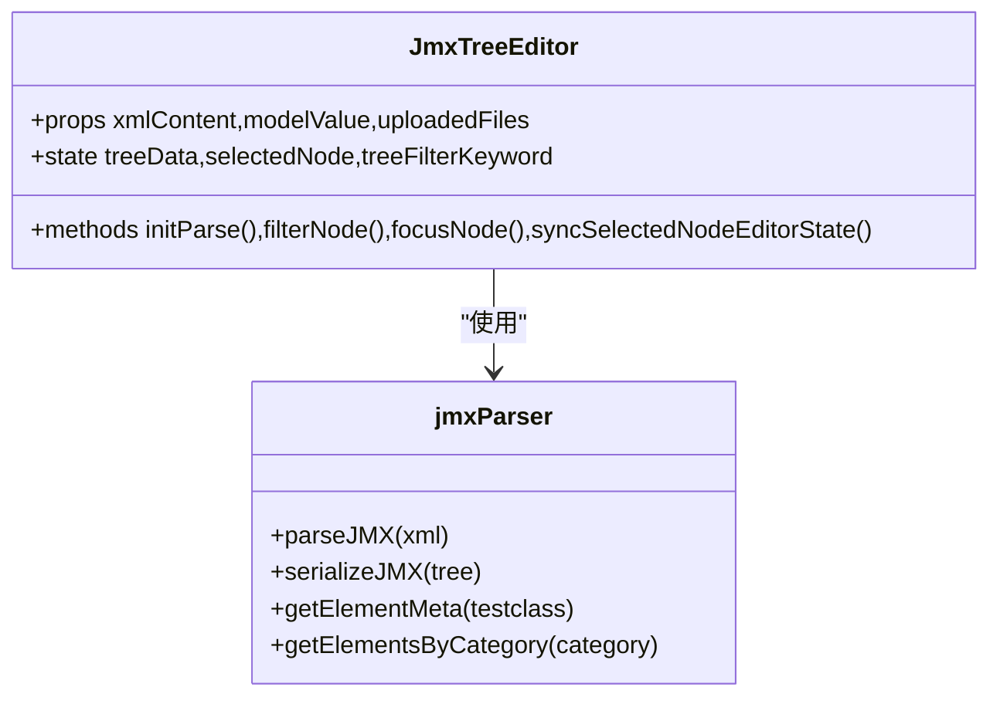
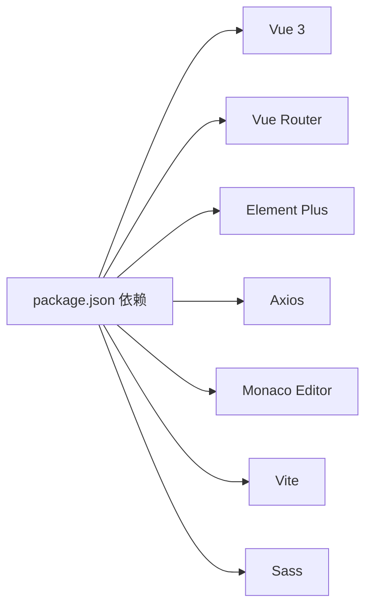

# 前端架构设计

<cite>
**本文档引用的文件**
- [web/package.json](file://web/package.json)
- [web/vite.config.js](file://web/vite.config.js)
- [web/src/main.js](file://web/src/main.js)
- [web/src/App.vue](file://web/src/App.vue)
- [web/src/router/index.js](file://web/src/router/index.js)
- [web/src/layout/MainLayout.vue](file://web/src/layout/MainLayout.vue)
- [web/src/views/ScriptList.vue](file://web/src/views/ScriptList.vue)
- [web/src/views/ExecutionList.vue](file://web/src/views/ExecutionList.vue)
- [web/src/components/ExecuteDialog.vue](file://web/src/components/ExecuteDialog.vue)
- [web/src/components/JmxTreeEditor.vue](file://web/src/components/JmxTreeEditor.vue)
- [web/src/api/request.js](file://web/src/api/request.js)
- [web/src/api/script.js](file://web/src/api/script.js)
- [web/src/utils/jmxParser.js](file://web/src/utils/jmxParser.js)
- [web/src/styles/index.scss](file://web/src/styles/index.scss)
- [web/postcss.config.js](file://web/postcss.config.js)
</cite>

## 目录
1. [引言](#引言)
2. [项目结构](#项目结构)
3. [核心组件](#核心组件)
4. [架构总览](#架构总览)
5. [详细组件分析](#详细组件分析)
6. [依赖关系分析](#依赖关系分析)
7. [性能考量](#性能考量)
8. [故障排查指南](#故障排查指南)
9. [结论](#结论)
10. [附录](#附录)

## 引言
本文件面向JMeter Admin前端，系统化阐述基于Vue 3 + Element Plus的前端架构设计。内容涵盖技术栈选择、组件层次结构、路由与状态管理、前后端交互模式、数据流设计、组件化最佳实践、构建与打包优化、响应式与兼容性、开发与调试技巧，以及性能优化与用户体验提升策略。旨在帮助开发者快速理解并高效扩展系统。

## 项目结构
前端采用Vite作为构建工具，目录组织遵循“按功能模块划分”的组织方式：
- 应用入口与全局配置：main.js、App.vue、router、styles
- 视图层：views（页面级组件）
- 组件层：components（通用业务组件）
- API层：api（Axios封装与业务接口）
- 工具层：utils（解析器、格式化工具）
- 构建配置：vite.config.js、postcss.config.js、package.json

**图表来源**
- [web/src/main.js:1-23](file://web/src/main.js#L1-L23)
- [web/src/App.vue:1-28](file://web/src/App.vue#L1-L28)
- [web/src/router/index.js:1-55](file://web/src/router/index.js#L1-L55)
- [web/src/layout/MainLayout.vue:1-228](file://web/src/layout/MainLayout.vue#L1-L228)
- [web/src/views/ScriptList.vue:1-975](file://web/src/views/ScriptList.vue#L1-L975)
- [web/src/views/ExecutionList.vue:1-1119](file://web/src/views/ExecutionList.vue#L1-L1119)
- [web/src/components/ExecuteDialog.vue:1-944](file://web/src/components/ExecuteDialog.vue#L1-L944)
- [web/src/components/JmxTreeEditor.vue:1-2400](file://web/src/components/JmxTreeEditor.vue#L1-L2400)
- [web/src/api/request.js:1-103](file://web/src/api/request.js#L1-L103)
- [web/src/api/script.js:1-74](file://web/src/api/script.js#L1-L74)
- [web/src/utils/jmxParser.js:1-1949](file://web/src/utils/jmxParser.js#L1-L1949)
- [web/src/styles/index.scss:1-1110](file://web/src/styles/index.scss#L1-L1110)

**章节来源**
- [web/package.json:1-24](file://web/package.json#L1-L24)
- [web/vite.config.js:1-35](file://web/vite.config.js#L1-L35)
- [web/src/main.js:1-23](file://web/src/main.js#L1-L23)
- [web/src/App.vue:1-28](file://web/src/App.vue#L1-L28)
- [web/src/router/index.js:1-55](file://web/src/router/index.js#L1-L55)
- [web/src/layout/MainLayout.vue:1-228](file://web/src/layout/MainLayout.vue#L1-L228)
- [web/src/styles/index.scss:1-1110](file://web/src/styles/index.scss#L1-L1110)

## 核心组件
- 应用入口与插件
  - main.js负责创建Vue实例、注册Element Plus、全局图标、路由与样式，设置暗色模式。
  - App.vue提供全局路由过渡动画。
- 路由与布局
  - router/index.js定义嵌套路由，MainLayout作为容器布局，承载顶部导航、内容区与底部。
- 视图组件
  - ScriptList：脚本上传、列表展示、搜索、分页、执行弹窗、统计概览。
  - ExecutionList：执行记录统计、筛选、表格、自动刷新。
- 业务组件
  - ExecuteDialog：执行模式选择、备注、失败明细开关、分布式执行配置。
  - JmxTreeEditor：JMX树形编辑器，支持搜索、拖拽、属性编辑、元数据驱动的表单渲染。
- API与工具
  - request.js：Axios实例、请求去重、统一错误处理、上传进度。
  - script.js：脚本相关REST接口封装。
  - jmxParser.js：JMX解析、序列化、元素元数据与分类。

**章节来源**
- [web/src/main.js:1-23](file://web/src/main.js#L1-L23)
- [web/src/App.vue:1-28](file://web/src/App.vue#L1-L28)
- [web/src/router/index.js:1-55](file://web/src/router/index.js#L1-L55)
- [web/src/layout/MainLayout.vue:1-228](file://web/src/layout/MainLayout.vue#L1-L228)
- [web/src/views/ScriptList.vue:1-975](file://web/src/views/ScriptList.vue#L1-L975)
- [web/src/views/ExecutionList.vue:1-1119](file://web/src/views/ExecutionList.vue#L1-L1119)
- [web/src/components/ExecuteDialog.vue:1-944](file://web/src/components/ExecuteDialog.vue#L1-L944)
- [web/src/components/JmxTreeEditor.vue:1-2400](file://web/src/components/JmxTreeEditor.vue#L1-L2400)
- [web/src/api/request.js:1-103](file://web/src/api/request.js#L1-L103)
- [web/src/api/script.js:1-74](file://web/src/api/script.js#L1-L74)
- [web/src/utils/jmxParser.js:1-1949](file://web/src/utils/jmxParser.js#L1-L1949)

## 架构总览
前端采用“视图-组件-API-工具”分层架构，配合Element Plus提供UI能力，Vite提供开发与构建能力。整体交互流程为：视图组件通过API层发起HTTP请求，Axios拦截器统一处理请求去重与错误提示，返回数据驱动组件渲染；工具层负责复杂逻辑（如JMX解析）。

**图表来源**
- [web/src/main.js:1-23](file://web/src/main.js#L1-L23)
- [web/src/router/index.js:1-55](file://web/src/router/index.js#L1-L55)
- [web/src/layout/MainLayout.vue:1-228](file://web/src/layout/MainLayout.vue#L1-L228)
- [web/src/views/ScriptList.vue:1-975](file://web/src/views/ScriptList.vue#L1-L975)
- [web/src/views/ExecutionList.vue:1-1119](file://web/src/views/ExecutionList.vue#L1-L1119)
- [web/src/components/ExecuteDialog.vue:1-944](file://web/src/components/ExecuteDialog.vue#L1-L944)
- [web/src/components/JmxTreeEditor.vue:1-2400](file://web/src/components/JmxTreeEditor.vue#L1-L2400)
- [web/src/api/request.js:1-103](file://web/src/api/request.js#L1-L103)
- [web/src/api/script.js:1-74](file://web/src/api/script.js#L1-L74)
- [web/src/utils/jmxParser.js:1-1949](file://web/src/utils/jmxParser.js#L1-L1949)
- [web/src/styles/index.scss:1-1110](file://web/src/styles/index.scss#L1-L1110)

## 详细组件分析

### 路由与布局
- 路由采用history模式与嵌套路由，首页重定向至脚本列表，子路由包含脚本管理、编辑、Slave管理、执行记录与详情。
- MainLayout提供顶部导航（脚本、Slave、执行记录），内容区支持页面级过渡动画，底部展示版本信息。

**图表来源**
- [web/src/router/index.js:1-55](file://web/src/router/index.js#L1-L55)
- [web/src/layout/MainLayout.vue:1-228](file://web/src/layout/MainLayout.vue#L1-L228)

**章节来源**
- [web/src/router/index.js:1-55](file://web/src/router/index.js#L1-L55)
- [web/src/layout/MainLayout.vue:1-228](file://web/src/layout/MainLayout.vue#L1-L228)

### 视图组件：脚本管理（ScriptList）
- 功能要点
  - 统计概览：总脚本数、总文件数、运行中、执行记录数。
  - 上传区域：描述输入、文件上传（.jmx）、提交按钮。
  - 列表区域：表格展示、搜索、分页、操作列（下载、编辑、执行、删除）。
  - 执行弹窗：选择执行模式、备注、失败明细开关、分布式配置。
  - 使用指南弹窗：操作指引。
- 数据流
  - 组件通过scriptApi与executionApi发起请求，Axios拦截器统一处理错误与加载态。
  - 上传采用FormData，支持校验与进度反馈。
  - 删除采用二次确认，避免误操作。

**图表来源**
- [web/src/views/ScriptList.vue:1-975](file://web/src/views/ScriptList.vue#L1-L975)
- [web/src/api/script.js:1-74](file://web/src/api/script.js#L1-L74)
- [web/src/api/request.js:1-103](file://web/src/api/request.js#L1-L103)

**章节来源**
- [web/src/views/ScriptList.vue:1-975](file://web/src/views/ScriptList.vue#L1-L975)
- [web/src/api/script.js:1-74](file://web/src/api/script.js#L1-L74)
- [web/src/api/request.js:1-103](file://web/src/api/request.js#L1-L103)

### 视图组件：执行记录（ExecutionList）
- 功能要点
  - 统计卡片：总执行数、运行中、已完成、失败、已停止。
  - 筛选区域：脚本、状态、日期范围、关键字。
  - 执行记录表格：状态标签、时间、指标排序、自动刷新指示。
- 数据流
  - 通过executionApi获取列表，支持分页与筛选参数。
  - 当存在运行中任务时，启用自动刷新机制。

**章节来源**
- [web/src/views/ExecutionList.vue:1-1119](file://web/src/views/ExecutionList.vue#L1-L1119)
- [web/src/api/script.js:1-74](file://web/src/api/script.js#L1-L74)

### 业务组件：执行弹窗（ExecuteDialog）
- 功能要点
  - 执行模式：本地/分布式二选一。
  - 备注输入与字数限制。
  - 失败请求明细开关，分布式模式下Master参与开关。
  - 分布式模式下的Master回调地址选择与Slave节点选择。
- 交互流程
  - 用户选择模式后，根据模式动态展开配置项。
  - 选择Slave节点并提交，触发执行流程。

**图表来源**
- [web/src/components/ExecuteDialog.vue:1-944](file://web/src/components/ExecuteDialog.vue#L1-L944)

**章节来源**
- [web/src/components/ExecuteDialog.vue:1-944](file://web/src/components/ExecuteDialog.vue#L1-L944)

### 业务组件：JMX树编辑器（JmxTreeEditor）
- 功能要点
  - 左侧树形结构：搜索、展开/收起、拖拽排序、右键菜单。
  - 右侧属性面板：根据元素元数据动态渲染表单（字符串、数字、布尔、选择、文本域、键值对、线程调度、字符串列表等）。
  - 原始XML展示：当元素无元数据定义时，展示原始XML。
  - 工具栏：新增子元素、前后插入、上下移动、复制、启用/禁用、删除。
- 数据与算法
  - jmxParser.js提供解析、序列化、元数据定义、分类与摘要生成。
  - 组件内部维护树数据、选中节点、过滤关键词、KV列表与字符串列表状态。

**图表来源**
- [web/src/components/JmxTreeEditor.vue:1-2400](file://web/src/components/JmxTreeEditor.vue#L1-L2400)
- [web/src/utils/jmxParser.js:1-1949](file://web/src/utils/jmxParser.js#L1-L1949)

**章节来源**
- [web/src/components/JmxTreeEditor.vue:1-2400](file://web/src/components/JmxTreeEditor.vue#L1-L2400)
- [web/src/utils/jmxParser.js:1-1949](file://web/src/utils/jmxParser.js#L1-L1949)

### API与数据流
- Axios封装
  - request.js创建Axios实例，设置基础URL、超时与Content-Type。
  - 请求拦截器：请求去重（基于请求签名），避免重复请求。
  - 响应拦截器：统一错误处理（超时、网络异常、4xx/5xx、业务错误码），消息提示。
  - 上传进度：uploadWithProgress支持进度回调。
- 接口封装
  - script.js对脚本相关接口进行统一封装，包含列表、创建、详情、更新、删除、内容读写、文件上传/删除、下载等。
- 数据流
  - 视图组件通过API层发起请求，Axios拦截器统一处理错误与加载态，返回数据驱动组件渲染。

**章节来源**
- [web/src/api/request.js:1-103](file://web/src/api/request.js#L1-L103)
- [web/src/api/script.js:1-74](file://web/src/api/script.js#L1-L74)

## 依赖关系分析
- 技术栈
  - Vue 3、Vue Router 4、Element Plus、Axios、Monaco Editor。
  - Vite提供开发服务器与构建，Sass支持样式预处理。
- 依赖注入与耦合
  - 视图组件依赖API层，API层依赖Axios实例，避免直接引入HTTP库。
  - 组件间通过props与事件通信，减少耦合。
- 外部集成
  - 构建配置提供代理规则，开发时将/api前缀转发至后端，/reports转发至后端。

**图表来源**
- [web/package.json:1-24](file://web/package.json#L1-L24)

**章节来源**
- [web/package.json:1-24](file://web/package.json#L1-L24)
- [web/vite.config.js:1-35](file://web/vite.config.js#L1-L35)

## 性能考量
- 请求去重
  - Axios请求拦截器通过请求签名去重，避免重复请求与竞态。
- 组件懒加载与按需加载
  - 对于大型组件（如JmxTreeEditor）建议结合路由懒加载，减少首屏体积。
- 样式与主题
  - 暗色主题变量集中管理，Element Plus变量覆盖减少重复样式。
- 构建优化
  - Vite默认启用代码分割与Tree Shaking；可结合产物分析进一步优化第三方包体积。
- 交互体验
  - 全局与页面级过渡动画，提升页面切换流畅度。
  - 表格与列表采用虚拟滚动（如需）与分页，降低DOM压力。

[本节为通用指导，无需特定文件引用]

## 故障排查指南
- 常见问题
  - 请求失败：检查后端服务是否启动、代理配置是否正确、网络连通性。
  - 401/403：检查登录状态与权限。
  - 404：确认接口路径与后端一致。
  - 上传失败：检查文件类型与大小限制、FormData构造。
- 调试技巧
  - 使用浏览器Network面板观察请求与响应。
  - 在request.js中打印请求配置与错误堆栈。
  - 在组件中增加日志输出，定位数据流转问题。
- 错误处理
  - Axios拦截器统一处理错误消息提示，确保用户可见性。

**章节来源**
- [web/src/api/request.js:1-103](file://web/src/api/request.js#L1-L103)

## 结论
JMeter Admin前端采用Vue 3 + Element Plus构建，具备清晰的分层架构与良好的组件化组织。通过Axios统一拦截与错误处理、路由嵌套布局、丰富的业务组件与工具层，实现了脚本管理、执行记录与JMX编辑的核心功能。建议在后续迭代中引入路由懒加载、虚拟滚动、产物分析与自动化测试，持续提升性能与可维护性。

[本节为总结，无需特定文件引用]

## 附录

### 开发环境配置与调试
- 环境变量
  - FRONTEND_PORT：前端开发端口，默认3000。
  - BACKEND_PORT：后端服务端口，默认8080。
- 代理配置
  - /api前缀转发至后端，/reports前缀转发至后端。
- 调试建议
  - 使用Vue DevTools检查组件层级与状态。
  - 在main.js中临时调整Element Plus主题或图标注册以验证改动。

**章节来源**
- [web/vite.config.js:1-35](file://web/vite.config.js#L1-L35)
- [web/src/main.js:1-23](file://web/src/main.js#L1-L23)

### 构建与打包优化策略
- 代码分割
  - 路由级懒加载，拆分vendor与业务代码。
- Tree Shaking
  - 使用ES模块导入，避免无用导出。
- 第三方包优化
  - 分析bundle体积，剔除冗余依赖，按需引入Element Plus组件。
- 资源优化
  - 启用Gzip/Brotli压缩，合理设置静态资源缓存策略。

[本节为通用指导，无需特定文件引用]

### 响应式设计与跨浏览器兼容性
- 响应式
  - 使用SCSS变量与Flex布局适配不同屏幕尺寸。
  - 表格与卡片在小屏设备上保持可读性与可用性。
- 兼容性
  - 使用PostCSS配置与现代语法，确保主流浏览器兼容。
  - 对不支持的特性提供降级方案或polyfill。

**章节来源**
- [web/src/styles/index.scss:1-1110](file://web/src/styles/index.scss#L1-L1110)
- [web/postcss.config.js:1-4](file://web/postcss.config.js#L1-L4)