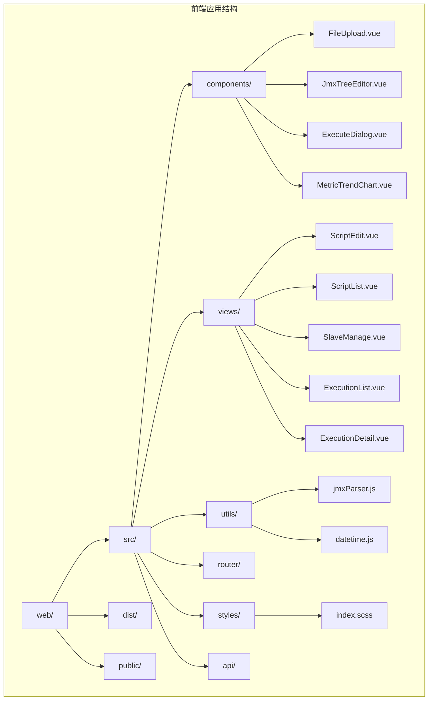
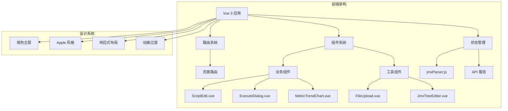
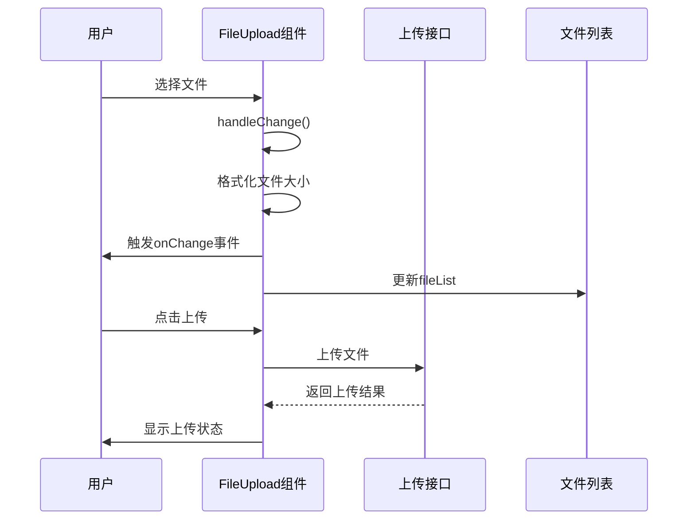
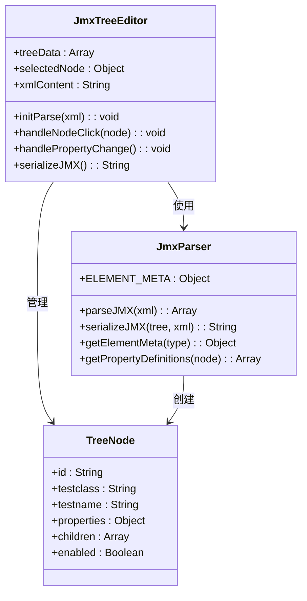
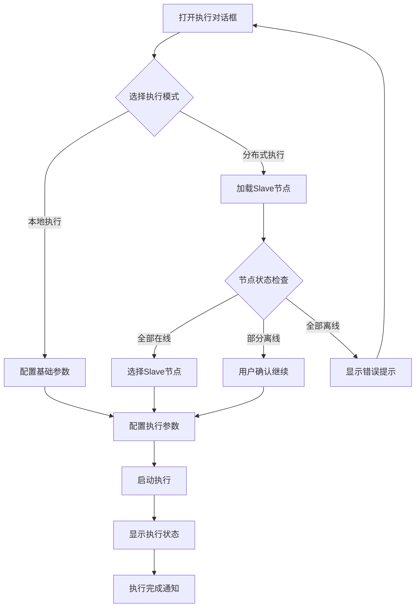
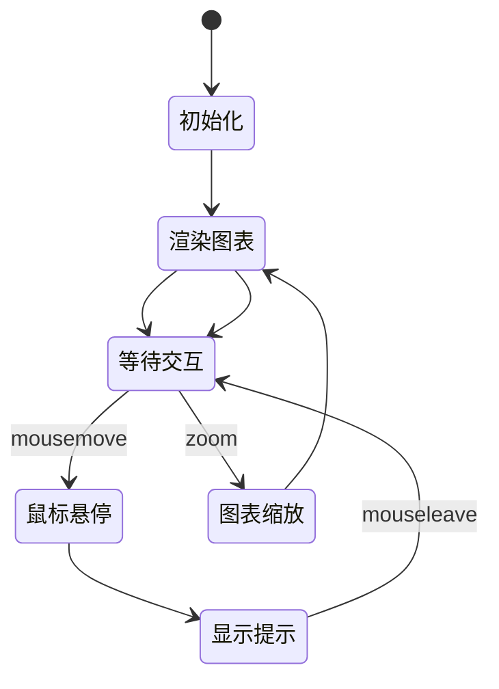
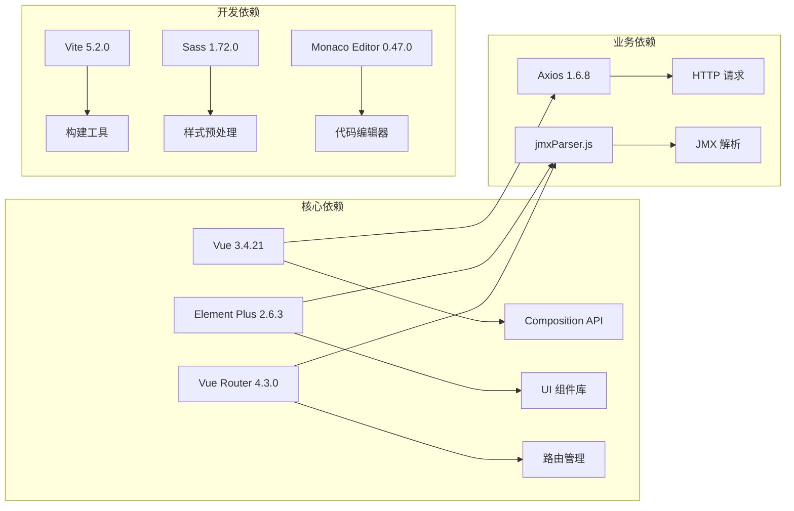

# 前端组件详解

<cite>
**本文档引用的文件**
- [FileUpload.vue](file://web/src/components/FileUpload.vue)
- [JmxTreeEditor.vue](file://web/src/components/JmxTreeEditor.vue)
- [ExecuteDialog.vue](file://web/src/components/ExecuteDialog.vue)
- [MetricTrendChart.vue](file://web/src/components/MetricTrendChart.vue)
- [jmxParser.js](file://web/src/utils/jmxParser.js)
- [ScriptEdit.vue](file://web/src/views/ScriptEdit.vue)
- [main.js](file://web/src/main.js)
- [index.scss](file://web/src/styles/index.scss)
- [package.json](file://web/package.json)
- [router/index.js](file://web/src/router/index.js)
</cite>

## 目录
1. [简介](#简介)
2. [项目结构](#项目结构)
3. [核心组件](#核心组件)
4. [架构概览](#架构概览)
5. [详细组件分析](#详细组件分析)
6. [依赖关系分析](#依赖关系分析)
7. [性能考虑](#性能考虑)
8. [故障排除指南](#故障排除指南)
9. [结论](#结论)

## 简介

JMeter Admin 是一个基于 Vue 3 和 Element Plus 的现代化 JMeter 脚本管理平台。本文档深入分析前端核心组件的设计与实现，涵盖文件上传组件、JMX 树形编辑器、执行对话框、指标趋势图表等关键 UI 组件。

该平台采用暗色主题设计，提供完整的 JMeter 脚本编辑、管理和执行功能，支持可视化编辑和 XML 源码编辑两种模式。

## 项目结构

前端项目采用模块化架构，主要目录结构如下：

**图表来源**
- [main.js:1-23](file://web/src/main.js#L1-L23)
- [router/index.js:1-55](file://web/src/router/index.js#L1-L55)

**章节来源**
- [main.js:1-23](file://web/src/main.js#L1-L23)
- [package.json:1-24](file://web/package.json#L1-L24)

## 核心组件

### 文件上传组件 (FileUpload)

文件上传组件提供了灵活的文件选择和管理功能，支持多种文件格式和上传模式。

**主要特性：**
- 支持拖拽上传和点击选择
- 多文件上传限制
- 实时文件列表展示
- 文件大小格式化显示
- 自定义接受文件类型

**组件属性：**
- `accept`: 接受的文件类型，默认 '*'
- `multiple`: 是否允许多文件上传，默认 true
- `limit`: 文件数量限制，默认 0（无限制）
- `fileList`: 当前文件列表，默认 []
- `tip`: 自定义提示信息
- `compact`: 紧凑模式显示
- `showFileList`: 是否显示文件列表，默认 true
- `singleTile`: 单文件选择模式

**事件处理：**
- `update:fileList`: 文件列表更新事件
- `onChange`: 文件变更事件

**章节来源**
- [FileUpload.vue:69-104](file://web/src/components/FileUpload.vue#L69-L104)
- [FileUpload.vue:120-145](file://web/src/components/FileUpload.vue#L120-L145)

### JMX 树形编辑器 (JmxTreeEditor)

JMX 树形编辑器是整个平台的核心组件，提供可视化的 JMeter 脚本编辑功能。

**主要功能：**
- JMX 文件解析和序列化
- 树形结构可视化展示
- 元素属性编辑
- 拖拽排序和层级管理
- 搜索和过滤功能

**编辑器特性：**
- 左侧元素树：支持展开/折叠、搜索、批量操作
- 右侧属性面板：根据元素类型动态生成编辑表单
- 支持 50+ 种 JMeter 元素类型的可视化编辑
- 实时 XML 同步和验证

**章节来源**
- [JmxTreeEditor.vue:599-614](file://web/src/components/JmxTreeEditor.vue#L599-L614)
- [JmxTreeEditor.vue:721-769](file://web/src/components/JmxTreeEditor.vue#L721-L769)

### 执行对话框 (ExecuteDialog)

执行对话框提供脚本执行的完整配置界面，支持本地和分布式执行模式。

**执行模式：**
- **本地执行**：在当前服务器执行测试
- **分布式执行**：在多个节点上并行执行

**分布式执行特性：**
- Slave 节点选择和管理
- Master 回调地址配置
- 节点状态监控
- 执行参数配置

**章节来源**
- [ExecuteDialog.vue:266-279](file://web/src/components/ExecuteDialog.vue#L266-L279)
- [ExecuteDialog.vue:420-484](file://web/src/components/ExecuteDialog.vue#L420-L484)

### 指标趋势图表 (MetricTrendChart)

指标趋势图表组件提供实时性能指标可视化，支持多种图表交互功能。

**图表特性：**
- SVG 原生绘制，高性能渲染
- 鼠标悬停交互和精确定位
- 动态数据更新和缩放
- 自适应布局和响应式设计

**交互功能：**
- 鼠标悬停显示详细信息
- 图表区域缩放
- 点击事件处理
- 动画过渡效果

**章节来源**
- [MetricTrendChart.vue:126-137](file://web/src/components/MetricTrendChart.vue#L126-L137)
- [MetricTrendChart.vue:269-283](file://web/src/components/MetricTrendChart.vue#L269-L283)

## 架构概览

平台采用前后端分离架构，前端使用 Vue 3 Composition API 和 Element Plus 组件库。

**图表来源**
- [main.js:9-22](file://web/src/main.js#L9-L22)
- [index.scss:1-112](file://web/src/styles/index.scss#L1-L112)

**章节来源**
- [main.js:1-23](file://web/src/main.js#L1-L23)
- [router/index.js:1-55](file://web/src/router/index.js#L1-L55)

## 详细组件分析

### 文件上传组件深度分析

文件上传组件实现了完整的文件管理流程，从文件选择到列表展示的全生命周期管理。

**图表来源**
- [FileUpload.vue:120-145](file://web/src/components/FileUpload.vue#L120-L145)

**组件设计要点：**
- 响应式文件大小格式化
- 多文件选择和限制机制
- 实时文件列表更新
- 用户友好的视觉反馈

**章节来源**
- [FileUpload.vue:147-152](file://web/src/components/FileUpload.vue#L147-L152)

### JMX 树形编辑器核心实现

JMX 树形编辑器是平台最复杂的组件，实现了完整的 JMeter 脚本可视化编辑功能。

**图表来源**
- [JmxTreeEditor.vue:658-698](file://web/src/components/JmxTreeEditor.vue#L658-L698)
- [jmxParser.js:11-789](file://web/src/utils/jmxParser.js#L11-L789)

**核心功能实现：**

1. **JMX 解析引擎**：支持完整的 JMeter XML 结构解析
2. **元数据管理系统**：定义 50+ 种 JMeter 元素的属性定义
3. **动态表单生成**：根据元素类型自动生成相应的编辑表单
4. **实时序列化**：双向同步 JMX 树结构和 XML 字符串

**章节来源**
- [jmxParser.js:1216-1285](file://web/src/utils/jmxParser.js#L1216-L1285)
- [JmxTreeEditor.vue:721-755](file://web/src/components/JmxTreeEditor.vue#L721-L755)

### 执行对话框交互流程

执行对话框实现了复杂的分布式执行配置逻辑。

**图表来源**
- [ExecuteDialog.vue:420-484](file://web/src/components/ExecuteDialog.vue#L420-L484)

**分布式执行特性：**
- 自动节点连通性检查
- 智能离线节点处理
- Master 回调地址自动配置
- 执行参数的灵活配置

**章节来源**
- [ExecuteDialog.vue:346-385](file://web/src/components/ExecuteDialog.vue#L346-L385)

### 指标趋势图表渲染机制

指标趋势图表采用了高性能的 SVG 渲染方案，支持复杂的交互功能。

**图表来源**
- [MetricTrendChart.vue:264-283](file://web/src/components/MetricTrendChart.vue#L264-L283)

**性能优化策略：**
- SVG 原生绘制，避免 DOM 操作开销
- 精确的坐标计算和缓存
- 动画过渡的硬件加速
- 响应式布局适配

**章节来源**
- [MetricTrendChart.vue:154-204](file://web/src/components/MetricTrendChart.vue#L154-L204)

## 依赖关系分析

前端项目采用模块化依赖管理，主要依赖关系如下：

**图表来源**
- [package.json:10-22](file://web/package.json#L10-L22)

**第三方库使用：**
- **Vue 3**: 前端框架，提供响应式数据绑定和组件系统
- **Element Plus**: UI 组件库，提供丰富的预设组件
- **Monaco Editor**: VS Code 同款编辑器，用于 XML 源码编辑
- **Axios**: HTTP 客户端，处理 API 请求

**章节来源**
- [package.json:1-24](file://web/package.json#L1-L24)

## 性能考虑

### 渲染性能优化

1. **虚拟 DOM 优化**：使用 Vue 3 的 Composition API 提供更好的性能
2. **懒加载策略**：按需加载大型组件和依赖
3. **组件缓存**：合理使用 keep-alive 缓存页面组件

### 内存管理

1. **事件监听器清理**：组件销毁时自动清理事件监听
2. **定时器管理**：及时清理定时器和轮询任务
3. **大数据处理**：对大量数据进行分页和虚拟滚动

### 网络性能

1. **请求合并**：减少不必要的 API 调用
2. **缓存策略**：合理使用浏览器缓存和应用缓存
3. **压缩传输**：启用 Gzip 压缩和资源压缩

## 故障排除指南

### 常见问题诊断

**JMX 解析错误：**
- 检查 XML 格式是否正确
- 验证 JMeter 元素类型是否受支持
- 确认文件编码格式

**组件渲染异常：**
- 检查 Element Plus 版本兼容性
- 验证组件属性传入是否正确
- 确认样式文件加载正常

**性能问题：**
- 监控组件渲染时间
- 检查是否存在内存泄漏
- 优化大数据量的渲染策略

### 调试技巧

1. **开发者工具**：使用 Vue DevTools 分析组件状态
2. **网络监控**：检查 API 请求和响应
3. **性能分析**：使用浏览器性能面板分析渲染瓶颈

**章节来源**
- [jmxParser.js:1216-1285](file://web/src/utils/jmxParser.js#L1216-L1285)

## 结论

JMeter Admin 前端组件展现了现代 Web 应用的优秀设计实践。通过精心设计的组件架构、完善的错误处理机制和优秀的用户体验，为 JMeter 脚本管理提供了强大而易用的解决方案。

**主要优势：**
- 模块化设计，易于维护和扩展
- 完善的类型定义和错误处理
- 优秀的性能表现和用户体验
- 丰富的交互功能和视觉效果

**未来改进方向：**
- 增加更多的国际化支持
- 优化移动端适配
- 扩展更多的 JMeter 元素类型支持
- 增强数据导入导出功能

该组件体系为类似的企业级应用开发提供了良好的参考范例，展示了如何在复杂业务场景下实现高质量的前端解决方案。