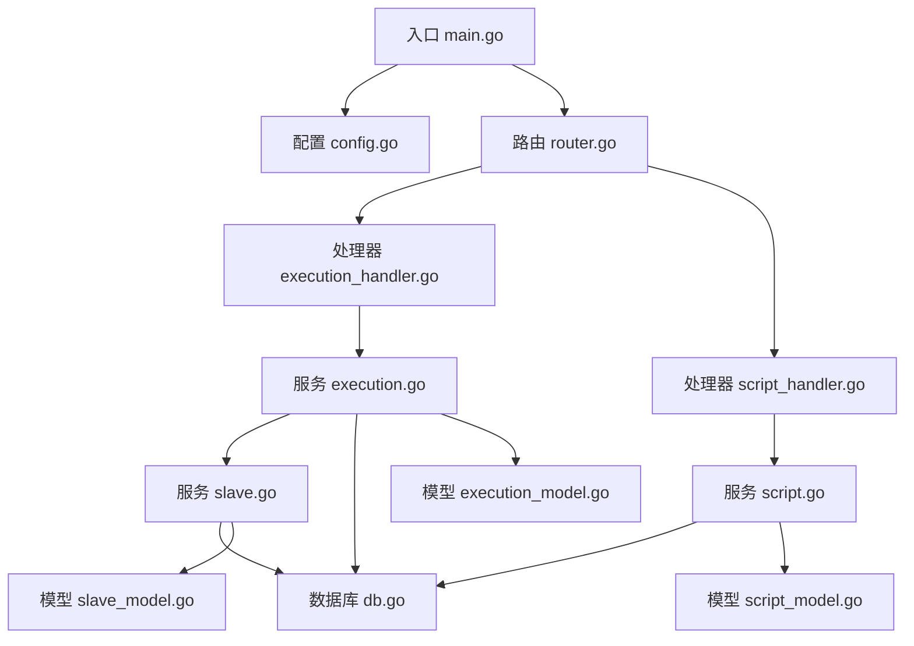
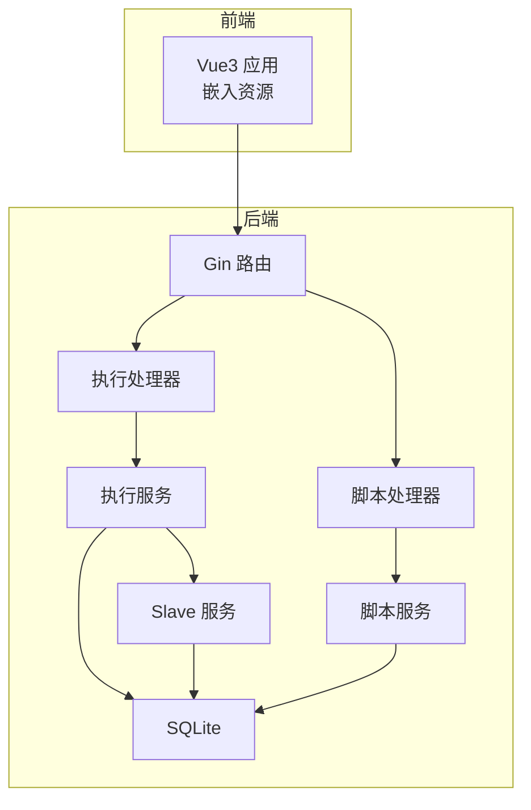
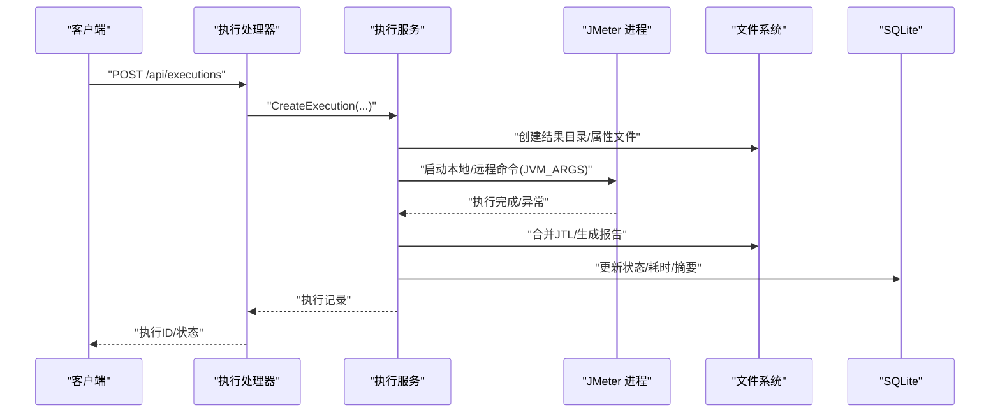
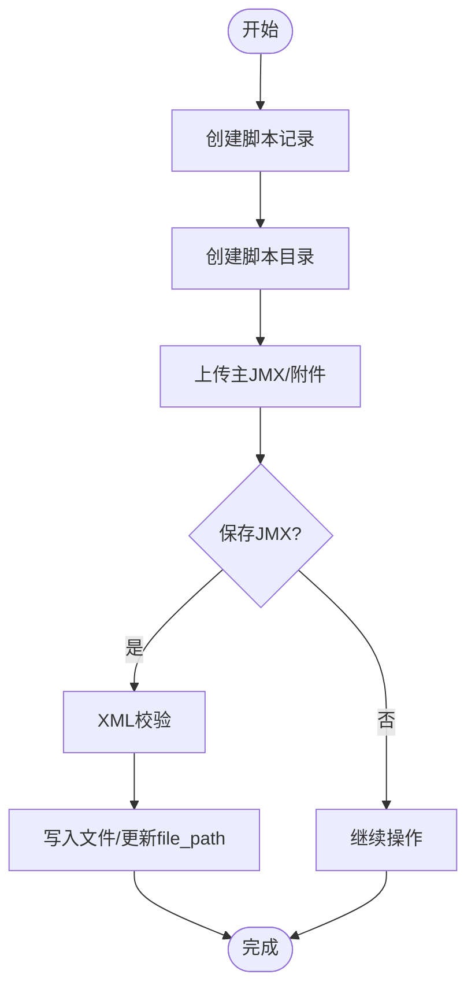
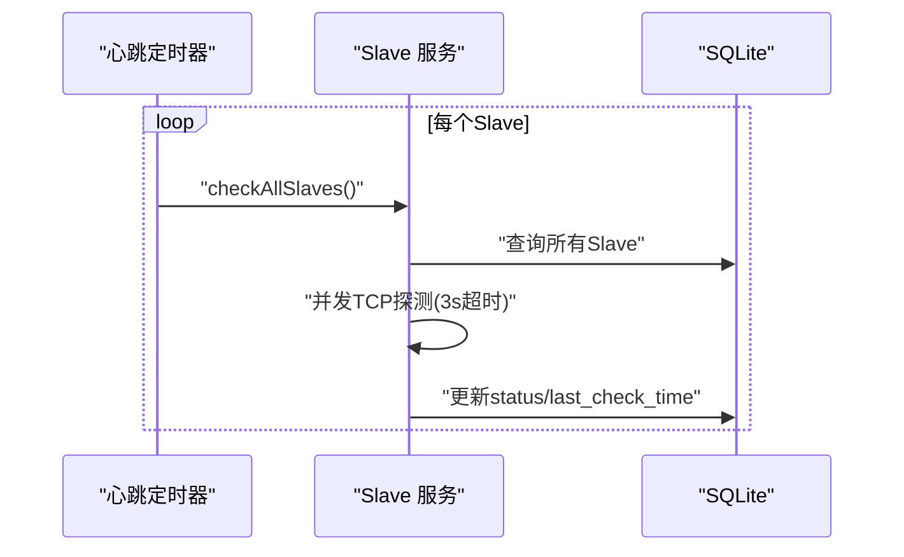
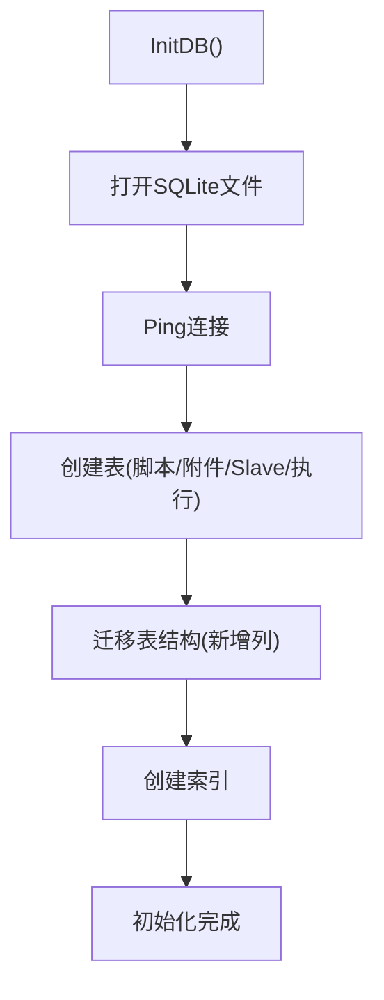
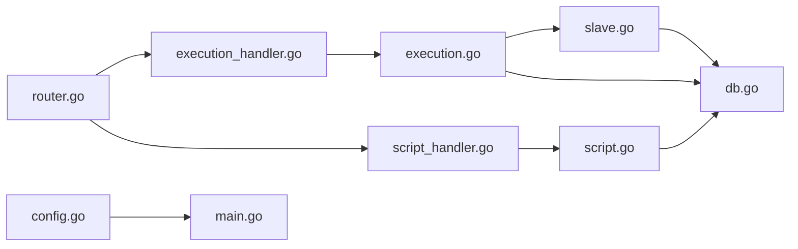

# 故障排除

<cite>
**本文引用的文件**
- [main.go](file://main.go)
- [config.go](file://config/config.go)
- [router.go](file://internal/router/router.go)
- [db.go](file://internal/database/db.go)
- [execution.go](file://internal/service/execution.go)
- [script.go](file://internal/service/script.go)
- [slave.go](file://internal/service/slave.go)
- [execution_handler.go](file://internal/handler/execution.go)
- [script_handler.go](file://internal/handler/script.go)
- [execution_model.go](file://internal/model/execution.go)
- [script_model.go](file://internal/model/script.go)
- [slave_model.go](file://internal/model/slave.go)
- [Makefile](file://Makefile)
- [deploy.sh](file://deploy.sh)
- [README.md](file://README.md)
</cite>

## 目录
1. [简介](#简介)
2. [项目结构](#项目结构)
3. [核心组件](#核心组件)
4. [架构总览](#架构总览)
5. [详细组件分析](#详细组件分析)
6. [依赖分析](#依赖分析)
7. [性能考虑](#性能考虑)
8. [故障排除指南](#故障排除指南)
9. [结论](#结论)
10. [附录](#附录)

## 简介
本指南面向运维与开发人员，系统化梳理 JMeter Admin 在编译、运行、网络、性能等方面的常见问题与排障流程，并提供日志分析、错误追踪、性能监控与瓶颈识别方法。文档覆盖开发、测试、生产三类环境的差异化策略，以及紧急事件的处置预案与恢复措施。同时给出版本升级与迁移过程中的注意事项与解决方案。

## 项目结构
JMeter Admin 采用“Go(Gin)+Vue3(Element Plus)+SQLite”技术栈，前端资源嵌入后端二进制，实现单文件部署。核心模块包括：
- 入口与配置：main.go、config/config.go
- 路由与中间件：internal/router/router.go
- 数据库：internal/database/db.go（SQLite）
- 业务服务：internal/service 下的脚本、执行、Slave 管理
- API 处理器：internal/handler 下的脚本、执行、Slave 管理
- 数据模型：internal/model 下的脚本、执行、Slave
- 构建与部署：Makefile、deploy.sh
- 项目说明：README.md

图表来源
- [main.go:28-66](file://main.go#L28-L66)
- [router.go:14-112](file://internal/router/router.go#L14-L112)
- [execution_handler.go:38-53](file://internal/handler/execution.go#L38-L53)
- [script_handler.go:37-108](file://internal/handler/script.go#L37-L108)
- [execution.go:103-481](file://internal/service/execution.go#L103-L481)
- [script.go:85-116](file://internal/service/script.go#L85-L116)
- [slave.go:15-41](file://internal/service/slave.go#L15-L41)
- [db.go:15-34](file://internal/database/db.go#L15-L34)
- [execution_model.go:3-18](file://internal/model/execution.go#L3-L18)
- [script_model.go:3-22](file://internal/model/script.go#L3-L22)
- [slave_model.go:3-11](file://internal/model/slave.go#L3-L11)

章节来源
- [main.go:28-66](file://main.go#L28-L66)
- [config.go:43-84](file://config/config.go#L43-L84)
- [router.go:14-112](file://internal/router/router.go#L14-L112)
- [db.go:15-34](file://internal/database/db.go#L15-L34)

## 核心组件
- 配置管理：负责加载/保存配置，含服务端口、JMeter 路径、Master 主机名、Slave 心跳间隔、目录结构等。
- 路由与中间件：统一注册 API 路由组，提供跨域支持与前端静态资源服务。
- 数据库：SQLite 初始化、表结构创建与迁移、索引创建。
- 业务服务：
  - 执行服务：动态计算 JVM 参数、构建 JMeter 命令、异步执行、合并结果、生成报告、解析 JTL、实时指标聚合。
  - 脚本服务：脚本 CRUD、JMX 内容读写、附件上传/删除、XML 校验。
  - Slave 服务：心跳检测、连通性检测、状态维护。
- 处理器：对接前端请求，调用服务层，返回标准响应。
- 模型：脚本、执行、Slave 的数据结构。

章节来源
- [config.go:10-41](file://config/config.go#L10-L41)
- [execution.go:54-101](file://internal/service/execution.go#L54-L101)
- [script.go:18-83](file://internal/service/script.go#L18-L83)
- [slave.go:15-41](file://internal/service/slave.go#L15-L41)

## 架构总览
系统采用“嵌入式前端 + 后端 API + SQLite”的轻量架构。前端资源通过 embed 嵌入二进制，后端以 Gin 提供 REST API；执行流程由服务层协调 JMeter 子进程，结果落盘并生成报告。

图表来源
- [router.go:14-112](file://internal/router/router.go#L14-L112)
- [execution_handler.go:38-53](file://internal/handler/execution.go#L38-L53)
- [script_handler.go:37-108](file://internal/handler/script.go#L37-L108)
- [execution.go:103-481](file://internal/service/execution.go#L103-L481)
- [script.go:85-116](file://internal/service/script.go#L85-L116)
- [slave.go:15-41](file://internal/service/slave.go#L15-L41)
- [db.go:15-34](file://internal/database/db.go#L15-L34)

## 详细组件分析

### 执行服务（分布式压测核心）
- 动态 JVM 内存：基于系统可用内存的 80% 计算堆大小，范围控制在合理区间，避免 OOM。
- 命令构建：区分本地/远程模式，支持合并本地与远程结果、生成报告。
- 并发执行：本地与远程命令并行执行，合并 JTL、生成报告。
- 实时指标：解析 JTL，按秒聚合吞吐、成功率、响应时间、并发度等。
- 状态更新：执行结束后更新状态、耗时、摘要数据。

图表来源
- [execution_handler.go:38-53](file://internal/handler/execution.go#L38-L53)
- [execution.go:103-481](file://internal/service/execution.go#L103-L481)

章节来源
- [execution.go:54-101](file://internal/service/execution.go#L54-L101)
- [execution.go:237-366](file://internal/service/execution.go#L237-L366)
- [execution.go:368-463](file://internal/service/execution.go#L368-L463)
- [execution_model.go:3-18](file://internal/model/execution.go#L3-L18)

### 脚本服务（JMX 管理）
- 脚本 CRUD：创建脚本记录、更新描述、删除脚本及关联文件。
- JMX 内容：读取/保存 JMX，保存前进行 XML 校验。
- 附件管理：上传/删除附件，区分主 JMX 并维护 file_path。

图表来源
- [script.go:85-116](file://internal/service/script.go#L85-L116)
- [script.go:251-280](file://internal/service/script.go#L251-L280)
- [script.go:299-359](file://internal/service/script.go#L299-L359)

章节来源
- [script.go:18-83](file://internal/service/script.go#L18-L83)
- [script.go:251-280](file://internal/service/script.go#L251-L280)
- [script_model.go:3-22](file://internal/model/script.go#L3-L22)

### Slave 服务（节点管理）
- 心跳检测：定时扫描所有 Slave，TCP 超时检测连通性，更新状态与最后检测时间。
- 连通性检测：单次检测接口，返回在线/离线状态。

图表来源
- [slave.go:159-220](file://internal/service/slave.go#L159-L220)
- [slave.go:112-157](file://internal/service/slave.go#L112-L157)

章节来源
- [slave.go:15-41](file://internal/service/slave.go#L15-L41)
- [slave_model.go:3-11](file://internal/model/slave.go#L3-L11)

### 数据库与迁移
- 初始化：打开 SQLite 文件，Ping 成功后创建表与索引。
- 迁移：向 executions、script_files、slaves 表新增列，兼容历史数据。
- 索引：为 executions 常用查询字段建立索引，提升分页与筛选性能。

图表来源
- [db.go:15-34](file://internal/database/db.go#L15-L34)
- [db.go:103-124](file://internal/database/db.go#L103-L124)
- [db.go:173-189](file://internal/database/db.go#L173-L189)

章节来源
- [db.go:15-34](file://internal/database/db.go#L15-L34)
- [db.go:103-124](file://internal/database/db.go#L103-L124)
- [db.go:173-189](file://internal/database/db.go#L173-L189)

## 依赖分析
- 外部依赖：gin、sqlite3 驱动、go-sqlite3。
- 内部耦合：处理器依赖服务层；服务层依赖数据库与配置；路由依赖处理器。
- 风险点：CGO/SQLite 编译依赖、JMeter/JDK 版本兼容、网络连通性（Slave 心跳/RMI）。

图表来源
- [router.go:14-112](file://internal/router/router.go#L14-L112)
- [execution_handler.go:38-53](file://internal/handler/execution.go#L38-L53)
- [script_handler.go:37-108](file://internal/handler/script.go#L37-L108)
- [execution.go:103-481](file://internal/service/execution.go#L103-L481)
- [script.go:85-116](file://internal/service/script.go#L85-L116)
- [slave.go:15-41](file://internal/service/slave.go#L15-L41)
- [db.go:15-34](file://internal/database/db.go#L15-L34)
- [config.go:43-84](file://config/config.go#L43-L84)
- [main.go:28-66](file://main.go#L28-L66)

章节来源
- [router.go:14-112](file://internal/router/router.go#L14-L112)
- [execution_handler.go:38-53](file://internal/handler/execution.go#L38-L53)
- [script_handler.go:37-108](file://internal/handler/script.go#L37-L108)
- [execution.go:103-481](file://internal/service/execution.go#L103-L481)
- [script.go:85-116](file://internal/service/script.go#L85-L116)
- [slave.go:15-41](file://internal/service/slave.go#L15-L41)
- [db.go:15-34](file://internal/database/db.go#L15-L34)
- [config.go:43-84](file://config/config.go#L43-L84)
- [main.go:28-66](file://main.go#L28-L66)

## 性能考虑
- JVM 内存：自动按系统可用内存 80% 分配，避免手工配置导致 OOM。
- 并发与合并：本地/远程命令并行执行，完成后合并 JTL 并生成报告，减少人工干预。
- 实时指标：按秒桶聚合，降低前端渲染压力。
- 数据库：为高频查询字段建立索引，优化分页与筛选。
- 前端静态资源：嵌入二进制，减少外部依赖与网络开销。

章节来源
- [execution.go:54-101](file://internal/service/execution.go#L54-L101)
- [execution.go:368-463](file://internal/service/execution.go#L368-L463)
- [db.go:173-189](file://internal/database/db.go#L173-L189)

## 故障排除指南

### 一、编译错误
- CGO/SQLite 缺失 gcc
  - 现象：编译时报 CGO 相关错误。
  - 排查：确认系统已安装 gcc 与 build-essential。
  - 解决：参考一键部署脚本安装 gcc。
  - 参考
    - [README.md: 272-282:272-282](file://README.md#L272-L282)
    - [deploy.sh: 344-360:344-360](file://deploy.sh#L344-L360)
- Node.js 版本过低
  - 现象：前端构建失败或依赖不兼容。
  - 排查：检查 node --version 是否满足要求。
  - 解决：使用一键安装脚本或升级 Node.js。
  - 参考
    - [README.md: 21-25:21-25](file://README.md#L21-L25)
    - [deploy.sh: 287-342:287-342](file://deploy.sh#L287-L342)
- Go 版本不匹配
  - 现象：构建失败或模块不兼容。
  - 排查：go version 是否满足要求。
  - 解决：使用一键安装脚本安装推荐版本。
  - 参考
    - [README.md: 21](file://README.md#L21)
    - [deploy.sh: 223-285:223-285](file://deploy.sh#L223-L285)
- 前端构建缓慢
  - 现象：npm install/build 时间过长。
  - 排查：网络环境与镜像源。
  - 解决：使用国内镜像源或参考 README 的加速建议。
  - 参考
    - [README.md: 284-290:284-290](file://README.md#L284-L290)
    - [deploy.sh: 306-334:306-334](file://deploy.sh#L306-L334)

章节来源
- [README.md: 272-290:272-290](file://README.md#L272-L290)
- [deploy.sh: 223-285:223-285](file://deploy.sh#L223-L285)
- [deploy.sh: 306-360:306-360](file://deploy.sh#L306-L360)

### 二、运行时错误
- 服务启动失败
  - 现象：启动后立即退出或端口占用。
  - 排查：查看日志文件、检查端口占用、确认配置文件。
  - 解决：使用部署脚本 start/stop/restart，或手动检查 PID/日志。
  - 参考
    - [main.go:61-65](file://main.go#L61-L65)
    - [deploy.sh: 94-115:94-115](file://deploy.sh#L94-L115)
- 数据库初始化失败
  - 现象：提示无法打开/连接数据库。
  - 排查：确认 data 目录权限、SQLite 文件可写。
  - 解决：删除数据库文件后重启，触发重建。
  - 参考
    - [db.go:15-34](file://internal/database/db.go#L15-L34)
    - [README.md: 304-312:304-312](file://README.md#L304-L312)
- 执行失败（JMeter 进程异常）
  - 现象：执行状态为 failed，日志中出现异常。
  - 排查：查看执行日志流、检查 JVM 参数、JMeter 路径与版本。
  - 解决：调整 JVM_ARGS 或使用环境变量覆盖；确认 JMeter 可执行文件路径。
  - 参考
    - [execution.go:368-463](file://internal/service/execution.go#L368-L463)
    - [execution_handler.go:555-708](file://internal/handler/execution.go#L555-L708)

章节来源
- [main.go:61-65](file://main.go#L61-L65)
- [deploy.sh: 94-115:94-115](file://deploy.sh#L94-L115)
- [db.go:15-34](file://internal/database/db.go#L15-L34)
- [README.md: 304-312:304-312](file://README.md#L304-L312)
- [execution.go:368-463](file://internal/service/execution.go#L368-L463)
- [execution_handler.go:555-708](file://internal/handler/execution.go#L555-L708)

### 三、网络连接问题
- Slave 连接失败
  - 现象：心跳持续离线或连通性检测失败。
  - 排查：确认 host:port、防火墙开放、RMI SSL 配置、Master 回调地址。
  - 解决：在页面配置 master_hostname，确保 Slave 端禁用 RMI SSL。
  - 参考
    - [README.md: 292-299:292-299](file://README.md#L292-L299)
    - [slave.go:159-220](file://internal/service/slave.go#L159-L220)
    - [execution.go:327-334](file://internal/service/execution.go#L327-L334)
- 多网卡环境 RMI 回调错误
  - 现象：Slave 无法回传数据。
  - 排查：确认 master_hostname 配置为 Slave 可访问的 IP。
  - 解决：在配置中显式设置 master_hostname。
  - 参考
    - [README.md: 247-251:247-251](file://README.md#L247-L251)
    - [config.go:26-29](file://config/config.go#L26-L29)

章节来源
- [README.md: 292-299:292-299](file://README.md#L292-L299)
- [slave.go:159-220](file://internal/service/slave.go#L159-L220)
- [execution.go:327-334](file://internal/service/execution.go#L327-L334)
- [README.md: 247-251:247-251](file://README.md#L247-L251)
- [config.go:26-29](file://config/config.go#L26-L29)

### 四、性能问题
- OOM（JVM 堆溢出）
  - 现象：JMeter 执行过程中 OOM。
  - 排查：检查系统可用内存与自动分配的 JVM 参数。
  - 解决：使用自动分配策略；必要时通过环境变量覆盖 JVM_ARGS。
  - 参考
    - [README.md: 300-303:300-303](file://README.md#L300-L303)
    - [execution.go:54-101](file://internal/service/execution.go#L54-L101)
- CPU/IO 抖动
  - 现象：执行期间 CPU 占用高或磁盘 IO 抖动。
  - 排查：观察实时指标与日志，确认 JTL 生成与报告生成阶段。
  - 解决：减少并发、优化脚本、关闭不必要的监听器字段。
  - 参考
    - [execution.go:237-366](file://internal/service/execution.go#L237-L366)
- 数据库查询慢
  - 现象：执行列表/统计查询响应慢。
  - 排查：确认索引是否生效、查询条件是否合理。
  - 解决：利用现有索引，避免全表扫描。
  - 参考
    - [db.go:173-189](file://internal/database/db.go#L173-L189)

章节来源
- [README.md: 300-303:300-303](file://README.md#L300-L303)
- [execution.go:54-101](file://internal/service/execution.go#L54-L101)
- [execution.go:237-366](file://internal/service/execution.go#L237-L366)
- [db.go:173-189](file://internal/database/db.go#L173-L189)

### 五、日志分析与错误追踪
- 实时日志流（SSE）
  - 使用 /api/executions/:id/log 接口获取实时日志，支持快照与断流恢复。
  - 参考
    - [execution_handler.go:555-708](file://internal/handler/execution.go#L555-L708)
- 执行错误分析
  - 通过 /api/executions/:id/errors 获取错误记录，支持导出 CSV。
  - 参考
    - [execution_handler.go:170-185](file://internal/handler/execution.go#L170-L185)
    - [execution_handler.go:360-418](file://internal/handler/execution.go#L360-L418)
- 执行结果导出
  - 支持 JTL、HTML 报告、错误 CSV、完整包（ZIP）。
  - 参考
    - [execution_handler.go:211-259](file://internal/handler/execution.go#L211-L259)
    - [execution_handler.go:261-358](file://internal/handler/execution.go#L261-L358)
    - [execution_handler.go:420-480](file://internal/handler/execution.go#L420-L480)

章节来源
- [execution_handler.go:555-708](file://internal/handler/execution.go#L555-L708)
- [execution_handler.go:170-185](file://internal/handler/execution.go#L170-L185)
- [execution_handler.go:360-418](file://internal/handler/execution.go#L360-L418)
- [execution_handler.go:211-259](file://internal/handler/execution.go#L211-L259)
- [execution_handler.go:261-358](file://internal/handler/execution.go#L261-L358)
- [execution_handler.go:420-480](file://internal/handler/execution.go#L420-L480)

### 六、性能监控与瓶颈识别
- 实时趋势与摘要
  - /api/executions/:id/live-metrics 返回按秒聚合的吞吐、成功率、响应时间、并发度等。
  - 参考
    - [execution_handler.go:118-134](file://internal/handler/execution.go#L118-L134)
    - [execution.go:673-800](file://internal/service/execution.go#L673-L800)
- 执行统计
  - /api/executions/stats 提供总数、运行中、成功、失败、已停止的统计。
  - 参考
    - [execution_handler.go:89-98](file://internal/handler/execution.go#L89-L98)
    - [execution.go:596-635](file://internal/service/execution.go#L596-L635)

章节来源
- [execution_handler.go:118-134](file://internal/handler/execution.go#L118-L134)
- [execution.go:673-800](file://internal/service/execution.go#L673-L800)
- [execution_handler.go:89-98](file://internal/handler/execution.go#L89-L98)
- [execution.go:596-635](file://internal/service/execution.go#L596-L635)

### 七、不同环境的故障排除策略
- 开发环境
  - 使用 make dev 同时启动前后端；若前端热更新异常，检查 Node.js 与依赖安装。
  - 参考
    - [README.md: 45-56:45-56](file://README.md#L45-L56)
    - [Makefile: 28-39:28-39](file://Makefile#L28-L39)
- 测试环境
  - 使用一键部署脚本安装依赖与编译；关注端口占用与日志文件位置。
  - 参考
    - [deploy.sh: 47-92:47-92](file://deploy.sh#L47-L92)
    - [deploy.sh: 94-115:94-115](file://deploy.sh#L94-L115)
- 生产环境
  - 建议使用 systemd 服务托管；通过 status 查看运行状态与监听端口。
  - 参考
    - [deploy.sh: 438-478:438-478](file://deploy.sh#L438-L478)
    - [deploy.sh: 153-172:153-172](file://deploy.sh#L153-L172)

章节来源
- [README.md: 45-56:45-56](file://README.md#L45-L56)
- [Makefile: 28-39:28-39](file://Makefile#L28-L39)
- [deploy.sh: 47-92:47-92](file://deploy.sh#L47-L92)
- [deploy.sh: 94-115:94-115](file://deploy.sh#L94-L115)
- [deploy.sh: 438-478:438-478](file://deploy.sh#L438-L478)
- [deploy.sh: 153-172:153-172](file://deploy.sh#L153-L172)

### 八、紧急情况处理与恢复
- 服务崩溃/无法启动
  - 步骤：停止服务、检查日志、确认端口与权限、重新启动。
  - 参考
    - [deploy.sh: 118-144:118-144](file://deploy.sh#L118-L144)
    - [deploy.sh: 153-172:153-172](file://deploy.sh#L153-L172)
- 数据库损坏
  - 步骤：备份数据目录、删除数据库文件、重启服务自动重建。
  - 参考
    - [README.md: 304-312:304-312](file://README.md#L304-L312)
    - [db.go:15-34](file://internal/database/db.go#L15-L34)
- 执行卡死/长时间无日志
  - 步骤：检查 Slave 状态、网络连通性、JMeter 进程、日志流是否断流。
  - 参考
    - [slave.go:159-220](file://internal/service/slave.go#L159-L220)
    - [execution_handler.go:555-708](file://internal/handler/execution.go#L555-L708)

章节来源
- [deploy.sh: 118-144:118-144](file://deploy.sh#L118-L144)
- [deploy.sh: 153-172:153-172](file://deploy.sh#L153-L172)
- [README.md: 304-312:304-312](file://README.md#L304-L312)
- [db.go:15-34](file://internal/database/db.go#L15-L34)
- [slave.go:159-220](file://internal/service/slave.go#L159-L220)
- [execution_handler.go:555-708](file://internal/handler/execution.go#L555-L708)

### 九、版本升级与迁移
- 升级步骤
  - 备份数据目录与配置文件；重新安装依赖；编译新版本；启动服务验证。
  - 参考
    - [deploy.sh: 47-92:47-92](file://deploy.sh#L47-L92)
    - [README.md: 58-72:58-72](file://README.md#L58-L72)
- 迁移注意事项
  - 数据库迁移会自动新增列，无需手工 SQL；如遇异常，删除数据库文件后重启。
  - 参考
    - [db.go:103-124](file://internal/database/db.go#L103-L124)
    - [README.md: 304-312:304-312](file://README.md#L304-L312)

章节来源
- [deploy.sh: 47-92:47-92](file://deploy.sh#L47-L92)
- [README.md: 58-72:58-72](file://README.md#L58-L72)
- [db.go:103-124](file://internal/database/db.go#L103-L124)
- [README.md: 304-312:304-312](file://README.md#L304-L312)

### 十、社区支持与问题反馈
- 问题反馈渠道
  - 通过项目仓库 Issues 提交问题，附带环境信息、配置、日志片段与复现步骤。
  - 参考
    - [README.md: 1-316:1-316](file://README.md#L1-L316)

章节来源
- [README.md: 1-316:1-316](file://README.md#L1-L316)

## 结论
JMeter Admin 通过“嵌入式前端 + Gin API + SQLite”的架构实现了轻量、易部署的分布式压测管理平台。针对编译、运行、网络、性能等常见问题，建议遵循本文提供的系统化排障流程：先检查环境与配置，再结合日志与实时指标定位问题，最后通过数据库迁移与服务治理完成恢复。在不同环境中采用差异化的策略与工具链，可显著提升稳定性与可维护性。

## 附录
- 常用命令
  - 编译：make build-all / make build-backend / make build-linux
  - 运行：make dev / ./deploy.sh install && ./deploy.sh start
  - 管理：./deploy.sh status / ./deploy.sh restart
- 关键路径
  - 配置文件：config.yaml（自动生成）
  - 数据库：data/jmeter-admin.db
  - 结果目录：results/<执行ID>/
  - 上传目录：uploads/<脚本ID>/

章节来源
- [Makefile: 1-39:1-39](file://Makefile#L1-L39)
- [README.md: 74-90:74-90](file://README.md#L74-L90)
- [config.go:86-97](file://config/config.go#L86-L97)
- [db.go:15-34](file://internal/database/db.go#L15-L34)