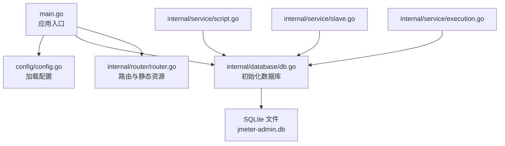
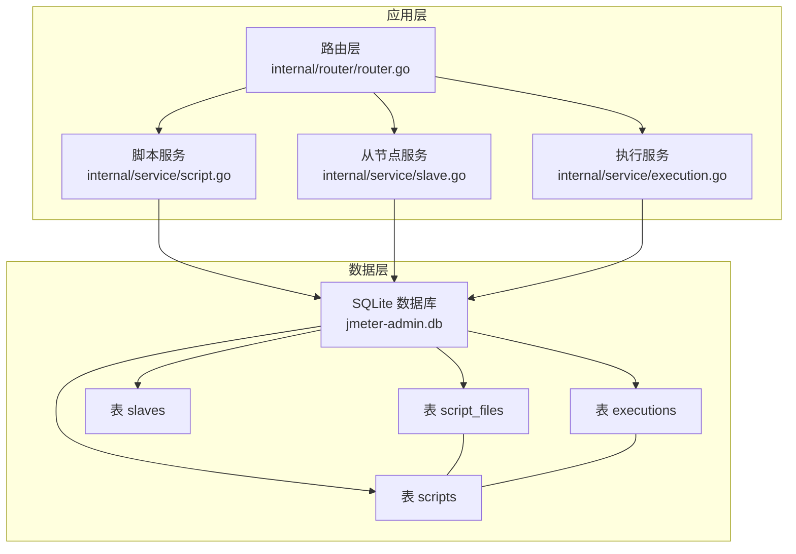
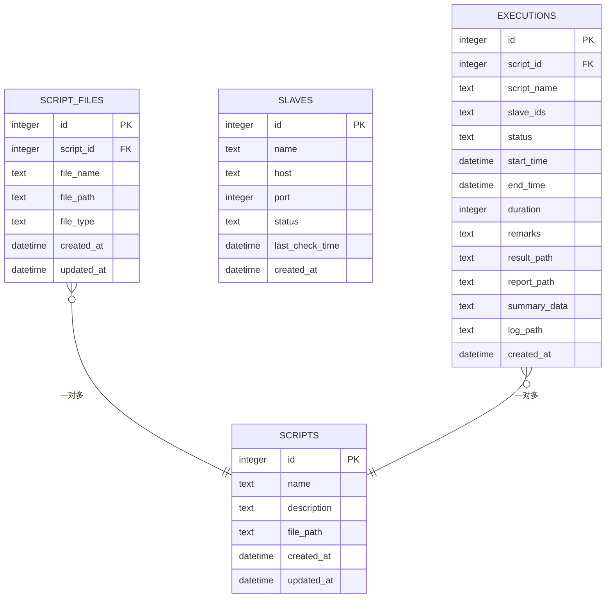
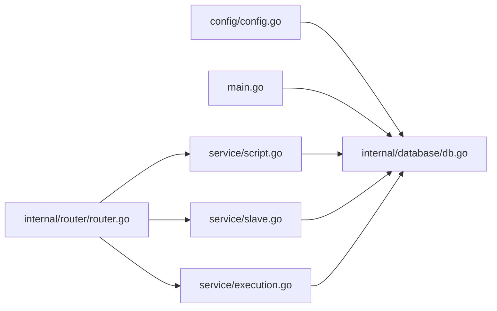
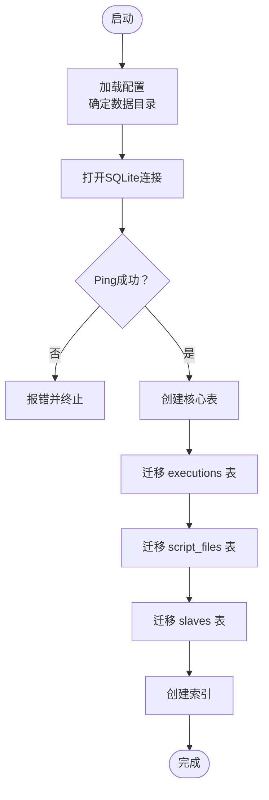
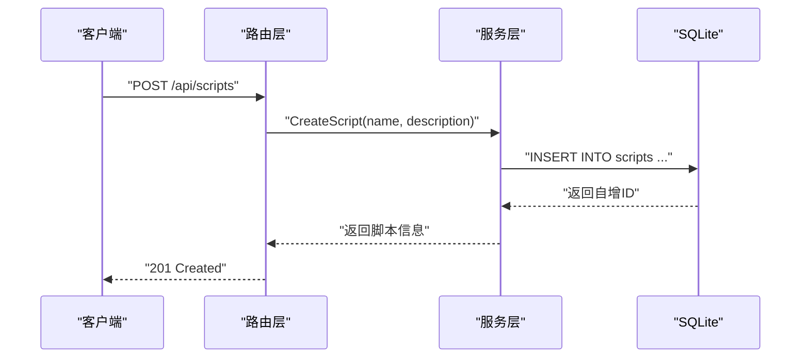

# 数据库设计

<cite>
**本文引用的文件**
- [internal/database/db.go](file://internal/database/db.go)
- [config/config.go](file://config/config.go)
- [config.yaml](file://config.yaml)
- [internal/service/script.go](file://internal/service/script.go)
- [internal/service/slave.go](file://internal/service/slave.go)
- [internal/service/execution.go](file://internal/service/execution.go)
- [internal/model/script.go](file://internal/model/script.go)
- [internal/model/slave.go](file://internal/model/slave.go)
- [internal/model/execution.go](file://internal/model/execution.go)
- [internal/router/router.go](file://internal/router/router.go)
- [main.go](file://main.go)
</cite>

## 目录
1. [简介](#简介)
2. [项目结构](#项目结构)
3. [核心组件](#核心组件)
4. [架构总览](#架构总览)
5. [详细组件分析](#详细组件分析)
6. [依赖分析](#依赖分析)
7. [性能考量](#性能考量)
8. [故障排查指南](#故障排查指南)
9. [结论](#结论)
10. [附录](#附录)

## 简介
本文件面向JMeter Admin项目的数据库设计，聚焦于SQLite数据库的整体架构与设计原则，系统阐述四个核心数据表（scripts、script_files、slaves、executions）的结构、字段、约束与关系，并给出索引策略、查询优化建议、数据模型演进与迁移策略、数据访问模式、缓存策略、数据生命周期与备份恢复方案等。目标是帮助开发者与运维人员快速理解并高效维护该数据库。

## 项目结构
- 数据库初始化入口位于数据库包，负责打开SQLite文件、创建表、执行迁移与索引。
- 配置模块提供数据目录、上传目录、结果目录与JMeter路径等关键路径，决定数据库文件位置与相关文件存储位置。
- 服务层封装了对scripts、slaves、executions三类实体的增删改查与业务逻辑，统一通过database.DB进行SQL操作。
- 路由层暴露REST API，驱动服务层完成数据库交互；前端静态资源与报告静态目录由路由统一托管。

**图表来源**
- [main.go:28-66](file://main.go#L28-L66)
- [config/config.go:43-84](file://config/config.go#L43-L84)
- [internal/database/db.go:15-34](file://internal/database/db.go#L15-L34)
- [internal/router/router.go:14-112](file://internal/router/router.go#L14-L112)

**章节来源**
- [main.go:28-66](file://main.go#L28-L66)
- [config/config.go:43-84](file://config/config.go#L43-L84)
- [internal/database/db.go:15-34](file://internal/database/db.go#L15-L34)
- [internal/router/router.go:14-112](file://internal/router/router.go#L14-L112)

## 核心组件
- scripts表：存放测试脚本元数据（名称、描述、主JMX文件路径、创建/更新时间）。
- script_files表：存放脚本关联的附件文件（名称、路径、类型、创建/更新时间），与scripts形成一对多关系。
- slaves表：存放JMeter从节点信息（名称、主机、端口、状态、最后检测时间、创建时间）。
- executions表：存放执行任务记录（脚本ID/名称、从节点集合、状态、起止时间、耗时、备注、结果/报告/日志路径、摘要数据、创建时间），与scripts形成一对多关系。

**章节来源**
- [internal/database/db.go:36-101](file://internal/database/db.go#L36-L101)

## 架构总览
数据库采用SQLite单文件存储，结合迁移与索引策略，满足轻量部署与高可用需求。服务层通过统一的数据库连接执行SQL，路由层提供REST接口，前端静态资源与报告静态目录由路由托管。

**图表来源**
- [internal/router/router.go:20-75](file://internal/router/router.go#L20-L75)
- [internal/service/script.go:18-83](file://internal/service/script.go#L18-L83)
- [internal/service/slave.go:15-41](file://internal/service/slave.go#L15-L41)
- [internal/service/execution.go:504-594](file://internal/service/execution.go#L504-L594)
- [internal/database/db.go:36-101](file://internal/database/db.go#L36-L101)

## 详细组件分析

### scripts 表
- 字段与类型
  - id: 整型，自增主键
  - name: 文本，非空
  - description: 文本
  - file_path: 文本，非空（指向主JMX文件路径）
  - created_at: 时间戳
  - updated_at: 时间戳
- 约束与设计要点
  - 主键自增，保证唯一标识
  - name与file_path非空，确保脚本元数据完整性
  - file_path用于直接定位主JMX文件，便于下载与编辑
- 关系
  - 与script_files：一对多（一个脚本可有多个附件文件）
  - 与executions：一对多（一个脚本可多次执行）

**章节来源**
- [internal/database/db.go:38-46](file://internal/database/db.go#L38-L46)
- [internal/model/script.go:3-12](file://internal/model/script.go#L3-L12)

### script_files 表
- 字段与类型
  - id: 整型，自增主键
  - script_id: 整型，非空，外键引用scripts.id（级联删除）
  - file_name: 文本，非空
  - file_path: 文本，非空（磁盘绝对路径）
  - file_type: 文本，非空（如jmx/csv/jar/json等）
  - created_at: 时间戳
  - updated_at: 时间戳（迁移新增）
- 约束与设计要点
  - 外键约束保证脚本删除时自动清理附件记录
  - file_type用于区分JMX主文件与其他附件
  - updated_at用于追踪文件变更时间
- 关系
  - 与scripts：多对一（多个文件属于一个脚本）

**章节来源**
- [internal/database/db.go:52-64](file://internal/database/db.go#L52-L64)
- [internal/model/script.go:14-22](file://internal/model/script.go#L14-L22)

### slaves 表
- 字段与类型
  - id: 整型，自增主键
  - name: 文本，非空
  - host: 文本，非空
  - port: 整型，非空
  - status: 文本，默认离线
  - last_check_time: 时间戳（迁移新增）
  - created_at: 时间戳
- 约束与设计要点
  - 唯一性：无显式唯一约束，但name+host+port组合可用于业务去重
  - status用于运行时状态管理
  - last_check_time用于心跳检测记录
- 关系
  - 独立表，不依赖其他表

**章节来源**
- [internal/database/db.go:67-78](file://internal/database/db.go#L67-L78)
- [internal/model/slave.go:3-11](file://internal/model/slave.go#L3-L11)

### executions 表
- 字段与类型
  - id: 整型，自增主键
  - script_id: 整型，非空，外键引用scripts.id
  - script_name: 文本，冗余字段，便于展示
  - slave_ids: 文本（JSON数组），记录参与执行的从节点ID集合
  - status: 文本，默认运行中
  - start_time: 时间戳
  - end_time: 时间戳
  - duration: 整型，默认0（秒）
  - remarks: 文本（迁移新增）
  - result_path: 文本（结果JTL路径）
  - report_path: 文本（报告输出目录）
  - summary_data: 文本（JSON对象，摘要统计）
  - log_path: 文本（执行日志路径）
  - created_at: 时间戳
- 约束与设计要点
  - 外键约束保证脚本删除时不影响执行记录
  - 冗余字段script_name减少查询时的JOIN
  - slave_ids以JSON数组存储，便于快速检索与展示
  - duration、remarks为迁移新增字段，增强统计与备注能力
- 关系
  - 与scripts：多对一（多次执行对应同一脚本）

**章节来源**
- [internal/database/db.go:81-98](file://internal/database/db.go#L81-L98)
- [internal/model/execution.go:3-18](file://internal/model/execution.go#L3-L18)

### 表关系图

**图表来源**
- [internal/database/db.go:38-98](file://internal/database/db.go#L38-L98)

## 依赖分析
- 数据库初始化依赖配置模块提供的数据目录路径，最终生成SQLite文件。
- 服务层通过统一的database.DB执行SQL，避免分散的连接管理。
- 路由层将API请求映射到具体的服务方法，服务方法再访问数据库。
- 从节点心跳检测独立于数据库，但会更新slaves表的状态与检测时间。

**图表来源**
- [config/config.go:43-84](file://config/config.go#L43-L84)
- [internal/database/db.go:15-34](file://internal/database/db.go#L15-L34)
- [main.go:28-66](file://main.go#L28-L66)
- [internal/router/router.go:20-75](file://internal/router/router.go#L20-L75)

**章节来源**
- [config/config.go:43-84](file://config/config.go#L43-L84)
- [internal/database/db.go:15-34](file://internal/database/db.go#L15-L34)
- [main.go:28-66](file://main.go#L28-L66)
- [internal/router/router.go:20-75](file://internal/router/router.go#L20-L75)

## 性能考量
- 索引策略
  - executions表：script_id、status、created_at(倒序)索引，支持按脚本、状态、时间排序的高频查询。
  - script_files表：script_id索引，支持按脚本查询附件列表。
- 查询优化建议
  - 列出脚本列表时，使用COALESCE与子查询获取最新JMX文件名与文件计数，避免复杂JOIN。
  - 执行记录分页查询时，优先使用created_at倒序索引，减少排序开销。
  - 从节点状态批量检测时，使用并发控制与信号量限制，避免过多TCP连接导致阻塞。
- 缓存策略
  - 从节点状态可短期缓存于内存（status与last_check_time），结合定时心跳刷新。
  - 执行记录的实时指标可按时间桶聚合缓存，降低CSV解析频率。
- I/O与文件系统
  - 脚本与附件文件存储在磁盘，数据库仅存路径与元信息，降低数据库体积与锁竞争。
  - 执行结果与报告目录独立管理，便于清理与归档。

**章节来源**
- [internal/database/db.go:174-189](file://internal/database/db.go#L174-L189)
- [internal/service/script.go:18-83](file://internal/service/script.go#L18-L83)
- [internal/service/slave.go:159-220](file://internal/service/slave.go#L159-L220)
- [internal/service/execution.go:504-594](file://internal/service/execution.go#L504-L594)

## 故障排查指南
- 数据库连接失败
  - 检查数据目录权限与路径配置，确认SQLite文件可创建与读写。
  - 确认数据库Ping成功后再创建表与索引。
- 表结构异常
  - 若执行记录缺少duration或remarks字段，确认迁移函数是否执行成功。
  - 若脚本文件缺少updated_at字段，确认迁移函数是否执行成功。
  - 若从节点缺少last_check_time字段，确认迁移函数是否执行成功。
- 查询性能问题
  - 确认索引已创建且未被破坏。
  - 对高频过滤条件（script_id/status/created_at）进行EXPLAIN QUERY PLAN分析。
- 从节点状态异常
  - 检查心跳检测间隔配置与网络连通性。
  - 查看last_check_time与status更新是否正常。
- 执行记录状态异常
  - 服务重启时running状态会被清理为failed，属预期行为。
  - 检查执行日志路径与权限，确保日志可写。

**章节来源**
- [internal/database/db.go:15-34](file://internal/database/db.go#L15-L34)
- [internal/database/db.go:126-171](file://internal/database/db.go#L126-L171)
- [internal/database/db.go:174-189](file://internal/database/db.go#L174-L189)
- [internal/service/slave.go:159-220](file://internal/service/slave.go#L159-L220)
- [main.go:45-48](file://main.go#L45-L48)

## 结论
该数据库设计以SQLite为核心，围绕脚本、附件、从节点与执行四类实体构建，通过外键与冗余字段保障数据一致性与查询效率。迁移机制确保表结构随版本演进而平滑升级，索引策略覆盖高频查询场景。配合服务层的数据访问模式与缓存策略，整体具备良好的可维护性与扩展性。

## 附录

### 数据库初始化与迁移流程
- 初始化步骤
  - 读取配置，确定数据目录与SQLite文件路径
  - 打开数据库连接并Ping验证
  - 创建四张核心表（scripts、script_files、slaves、executions）
  - 执行迁移：为executions添加duration与remarks列；为script_files添加updated_at列；为slaves添加last_check_time列
  - 创建索引：executions(script_id、status、created_at DESC)、script_files(script_id)
- 迁移策略
  - 使用PRAGMA查询列是否存在，避免重复添加
  - 新增列默认值与约束遵循现有业务语义
- 版本兼容性
  - 通过迁移函数保证旧版本数据库可平滑升级至新功能
  - 外键约束与索引在创建阶段即确立，确保后续查询稳定

**图表来源**
- [internal/database/db.go:15-34](file://internal/database/db.go#L15-L34)
- [internal/database/db.go:126-171](file://internal/database/db.go#L126-L171)
- [internal/database/db.go:174-189](file://internal/database/db.go#L174-L189)

**章节来源**
- [internal/database/db.go:15-34](file://internal/database/db.go#L15-L34)
- [internal/database/db.go:126-171](file://internal/database/db.go#L126-L171)
- [internal/database/db.go:174-189](file://internal/database/db.go#L174-L189)

### 数据访问模式与API映射
- 脚本管理
  - 列表分页与模糊搜索：scripts表主查询，script_files辅助统计文件数与最新JMX文件名
  - CRUD：直接对scripts与script_files表进行INSERT/UPDATE/DELETE
- 从节点管理
  - 列表查询：slaves表全量查询
  - 连通性检测：TCP探测后更新status与last_check_time
  - 心跳检测：并发批量检测，限制最大并发数
- 执行管理
  - 创建执行：写入executions记录，生成结果/报告/日志路径
  - 实时指标：按时间桶聚合JTL CSV数据
  - 统计与分页：基于索引的过滤与排序

**图表来源**
- [internal/router/router.go:23-36](file://internal/router/router.go#L23-L36)
- [internal/service/script.go:85-116](file://internal/service/script.go#L85-L116)

**章节来源**
- [internal/router/router.go:23-36](file://internal/router/router.go#L23-L36)
- [internal/service/script.go:85-116](file://internal/service/script.go#L85-L116)
- [internal/service/slave.go:15-41](file://internal/service/slave.go#L15-L41)
- [internal/service/execution.go:504-594](file://internal/service/execution.go#L504-L594)

### 数据生命周期与备份恢复
- 生命周期
  - 脚本：可长期保留，附件文件随脚本删除而清理
  - 从节点：可长期保留，状态定期更新
  - 执行记录：按业务策略定期清理历史记录，避免数据库膨胀
- 备份
  - 直接复制SQLite文件即可完成备份
  - 建议在停机窗口或低峰期执行备份
- 恢复
  - 停止服务，替换SQLite文件，启动服务
  - 恢复后检查各目录权限与路径配置

**章节来源**
- [config/config.go:58-63](file://config/config.go#L58-L63)
- [main.go:68-82](file://main.go#L68-L82)