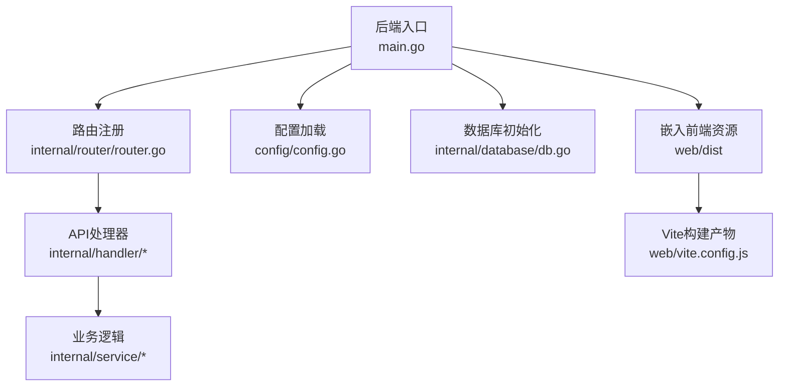
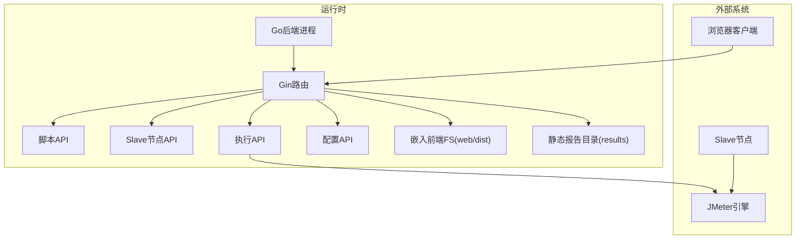
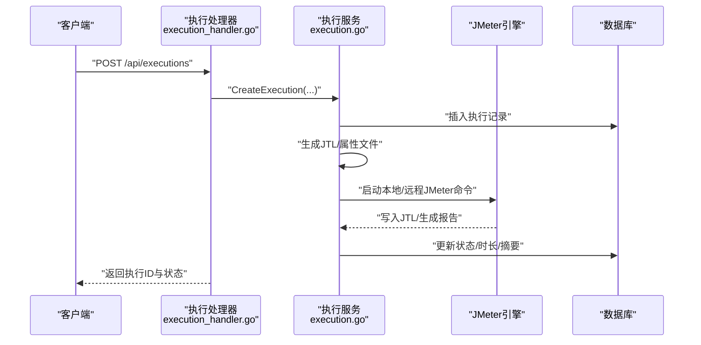
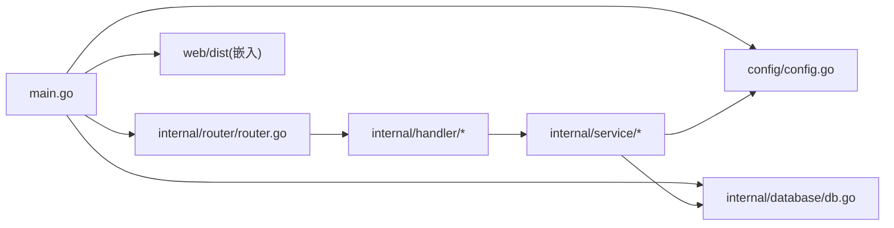

# 构建和部署

<cite>
**本文引用的文件**
- [Makefile](file://Makefile)
- [main.go](file://main.go)
- [go.mod](file://go.mod)
- [config.yaml](file://config.yaml)
- [deploy.sh](file://deploy.sh)
- [vite.config.js](file://web/vite.config.js)
- [package.json](file://web/package.json)
- [postcss.config.js](file://web/postcss.config.js)
- [config.go](file://config/config.go)
- [db.go](file://internal/database/db.go)
- [router.go](file://internal/router/router.go)
- [execution.go](file://internal/service/execution.go)
- [execution_handler.go](file://internal/handler/execution.go)
- [execution_model.go](file://internal/model/execution.go)
- [script_service.go](file://internal/service/script.go)
- [README.md](file://README.md)
</cite>

## 目录
1. [简介](#简介)
2. [项目结构](#项目结构)
3. [核心组件](#核心组件)
4. [架构总览](#架构总览)
5. [详细组件分析](#详细组件分析)
6. [依赖分析](#依赖分析)
7. [性能考虑](#性能考虑)
8. [故障排除指南](#故障排除指南)
9. [结论](#结论)
10. [附录](#附录)

## 简介
本指南面向JMeter Admin项目的构建与部署，覆盖开发环境搭建、Makefile构建命令、前端Vite配置与打包优化、后端编译与CGO依赖处理、多种部署策略（单文件、容器化、传统）、生产配置优化与安全加固、自动化部署脚本使用与定制，以及部署后的监控、日志与故障排除建议。

## 项目结构
项目采用“后端Go + 嵌入前端资源”的单文件部署架构：
- 后端入口与路由：main.go、internal/router/router.go
- 配置管理：config/config.go、config.yaml
- 数据库：internal/database/db.go（SQLite + go-sqlite3）
- 业务逻辑：internal/service/*
- API处理器：internal/handler/*
- 前端工程：web/（Vue 3 + Vite）

图表来源
- [main.go:28-66](file://main.go#L28-L66)
- [router.go:14-112](file://internal/router/router.go#L14-L112)
- [config.go:43-84](file://config/config.go#L43-L84)
- [db.go:15-34](file://internal/database/db.go#L15-L34)
- [vite.config.js:1-35](file://web/vite.config.js#L1-L35)

章节来源
- [README.md:92-120](file://README.md#L92-L120)
- [main.go:16-17](file://main.go#L16-L17)
- [router.go:80-109](file://internal/router/router.go#L80-L109)

## 核心组件
- 构建与运行
  - Makefile提供统一构建命令，支持前端构建、后端编译、交叉编译Linux版本、开发模式等。
  - deploy.sh提供一键安装依赖、编译、启动、systemd服务安装等。
- 配置系统
  - config.yaml默认生成，config.go负责加载与保存；支持服务端口、JMeter路径与Master主机名、目录配置等。
- 数据层
  - SQLite数据库，go-sqlite3驱动；自动建表与索引，支持迁移。
- 路由与静态资源
  - Gin路由组/API分组；嵌入前端web/dist；静态报告目录映射；CORS中间件。
- 业务与执行
  - 执行管理：本地/分布式模式、JVM内存动态计算、实时日志SSE、错误明细收集与导出、报告生成与打包下载。
- 前端工程
  - Vite开发服务器与代理；构建产物输出至web/dist；依赖与插件配置。

章节来源
- [Makefile:1-39](file://Makefile#L1-L39)
- [deploy.sh:48-92](file://deploy.sh#L48-L92)
- [config.yaml:1-26](file://config.yaml#L1-L26)
- [config.go:43-113](file://config/config.go#L43-L113)
- [db.go:15-197](file://internal/database/db.go#L15-L197)
- [router.go:14-129](file://internal/router/router.go#L14-L129)
- [execution.go:104-481](file://internal/service/execution.go#L104-L481)
- [execution_handler.go:38-168](file://internal/handler/execution.go#L38-L168)
- [vite.config.js:1-35](file://web/vite.config.js#L1-L35)
- [package.json:1-24](file://web/package.json#L1-L24)

## 架构总览
后端以Gin为核心，统一处理API与静态资源；前端资源通过go:embed嵌入，运行时由Gin提供静态文件服务与SPA回退；业务层对接JMeter执行引擎，生成结果与报告，并通过SSE推送实时日志。

图表来源
- [main.go:28-66](file://main.go#L28-L66)
- [router.go:14-112](file://internal/router/router.go#L14-L112)
- [execution.go:237-347](file://internal/service/execution.go#L237-L347)

## 详细组件分析

### 构建与开发工具链
- Makefile命令
  - build-frontend：进入web目录，安装依赖并执行构建，生成web/dist。
  - build-backend：启用CGO编译后端，生成单文件可执行文件。
  - build-all：先构建前端再构建后端。
  - build-linux：交叉编译Linux版本（GOOS=linux）。
  - clean：清理可执行文件与web/dist。
  - run：直接运行生成的可执行文件。
  - dev：并行启动后端与前端开发服务器。
  - dev-backend：仅后端开发模式。
  - dev-frontend：仅前端开发模式，支持BACKEND_PORT与FRONTEND_PORT环境变量。
- deploy.sh能力
  - install-deps：一键安装Go、Node.js、gcc、Java、JMeter，含国内镜像加速与环境变量配置。
  - install：前端构建（若web/dist不存在则构建），后端CGO编译。
  - start/stop/restart/status：服务管理与状态查看。
  - install-service：生成systemd服务文件，支持开机自启。

章节来源
- [Makefile:3-39](file://Makefile#L3-L39)
- [deploy.sh:30-92](file://deploy.sh#L30-L92)
- [deploy.sh:174-436](file://deploy.sh#L174-L436)
- [deploy.sh:438-478](file://deploy.sh#L438-L478)

### 前端构建与Vite配置
- Vite配置要点
  - 环境变量：BACKEND_PORT（默认8080）、FRONTEND_PORT（默认3000）。
  - 代理：/api与/reports代理到后端localhost:BACKEND_PORT。
  - 构建输出：outDir为web/dist，assetsDir为assets。
- 依赖与脚本
  - 依赖：vue、vue-router、element-plus、axios、monaco-editor等。
  - 脚本：dev、build、preview。
- 打包优化建议
  - 生产构建时开启压缩与分块策略（Vite默认行为）。
  - 通过环境变量控制端口，便于容器化与多实例部署。
  - 使用别名@简化导入路径（resolve.alias）。

章节来源
- [vite.config.js:5-34](file://web/vite.config.js#L5-L34)
- [package.json:5-23](file://web/package.json#L5-L23)
- [postcss.config.js:1-4](file://web/postcss.config.js#L1-L4)

### 后端编译与CGO依赖
- CGO启用：构建后端时设置CGO_ENABLED=1，确保SQLite驱动正常编译。
- 依赖管理：go.mod声明gin、go-sqlite3、yaml等核心依赖。
- 时区与时钟：应用启动时设置本地时区为Asia/Shanghai。
- 嵌入前端：使用//go:embed all:web/dist将前端产物嵌入二进制。

章节来源
- [Makefile:8-9](file://Makefile#L8-L9)
- [Makefile:16-17](file://Makefile#L16-L17)
- [go.mod:5-9](file://go.mod#L5-L9)
- [main.go:16-26](file://main.go#L16-L26)

### 配置系统
- config.yaml默认项：server.port、frontend.port、jmeter.path与master_hostname、dirs.data/uploads/results。
- config.go加载与保存：默认值设定、文件不存在时自动生成、YAML解析与写入。
- 运行时行为：服务端口、JMeter路径、Master主机名、目录结构。

章节来源
- [config.yaml:1-26](file://config.yaml#L1-L26)
- [config.go:43-113](file://config/config.go#L43-L113)

### 数据库与迁移
- 初始化：打开SQLite数据库，Ping验证，创建表与索引。
- 表结构：scripts、script_files、slaves、executions。
- 迁移：对executions、script_files、slaves新增列（duration、remarks、updated_at、last_check_time）。
- 索引：提升查询性能。

章节来源
- [db.go:15-197](file://internal/database/db.go#L15-L197)

### 路由与静态资源
- 路由分组：/api/scripts、/api/slaves、/api/executions、/api/config。
- 静态资源：/reports映射到results目录；嵌入web/dist并通过NoRoute回退到index.html。
- CORS：允许任意源与常用方法/头。

章节来源
- [router.go:14-129](file://internal/router/router.go#L14-L129)

### 执行流程与JMeter集成
- 执行模式：本地、分布式、本地+分布式组合。
- JVM内存：根据系统可用内存动态计算堆大小（80%可用内存，范围限制）。
- 命令构建：基于JMeter CLI参数与属性文件，支持错误明细采集与回传。
- 并发执行：本地与远程命令并发执行，合并JTL、生成报告。
- 实时日志：SSE流式推送；支持快照读取。
- 结果导出：JTL、HTML报告ZIP、错误CSV、全量ZIP。

图表来源
- [execution_handler.go:38-53](file://internal/handler/execution.go#L38-L53)
- [execution.go:104-481](file://internal/service/execution.go#L104-L481)

章节来源
- [execution_handler.go:38-168](file://internal/handler/execution.go#L38-L168)
- [execution.go:104-481](file://internal/service/execution.go#L104-L481)

### 前端开发与代理
- 开发模式：dev-backend启动后端，dev-frontend启动Vite，支持BACKEND_PORT与FRONTEND_PORT。
- 代理规则：/api与/reports转发至后端，便于前后端分离开发。

章节来源
- [Makefile:33-38](file://Makefile#L33-L38)
- [vite.config.js:16-29](file://web/vite.config.js#L16-L29)

## 依赖分析
- 运行时依赖
  - Go运行时、SQLite数据库、JMeter运行时（Java 11+）、网络与系统库。
- 构建时依赖
  - Go工具链、Node.js与npm、gcc（CGO）。
- 项目内部模块耦合
  - main.go依赖config、database、router、service。
  - router依赖handler与config。
  - handler依赖service与model。
  - service依赖database、config与JMeter命令行。

图表来源
- [main.go:10-14](file://main.go#L10-L14)
- [router.go:8-11](file://internal/router/router.go#L8-L11)
- [execution.go:24-26](file://internal/service/execution.go#L24-L26)

章节来源
- [go.mod:5-9](file://go.mod#L5-L9)
- [main.go:10-14](file://main.go#L10-L14)
- [router.go:8-11](file://internal/router/router.go#L8-L11)

## 性能考虑
- JVM内存分配：根据系统可用内存动态计算堆大小，避免手工配置带来的误差。
- 并发执行：本地与远程命令并发执行，减少总耗时；合并JTL与生成报告异步进行。
- 索引优化：为executions与script_files建立索引，提升查询效率。
- 前端构建：生产构建开启压缩与分块，减小体积与加载时间。
- SSE日志：按行推送，避免一次性大文件传输。

章节来源
- [execution.go:54-101](file://internal/service/execution.go#L54-L101)
- [db.go:173-189](file://internal/database/db.go#L173-L189)

## 故障排除指南
- 编译CGO相关错误
  - 确认系统已安装gcc/gcc-c++/make；参考一键安装脚本install-deps。
- 前端构建缓慢
  - 使用国内镜像源（npmmirror），或离线构建后上传web/dist。
- Slave连接失败
  - 检查master_hostname配置、防火墙开放端口（默认50000、1099）、Slave端禁用RMI SSL。
- JMeter OOM
  - 系统自动按可用内存分配JVM堆，无需手动设置；可通过JVM_ARGS环境变量覆盖。
- SQLite迁移报错
  - 删除数据库文件后重启，触发重建与迁移。
- 服务管理
  - 使用deploy.sh start/stop/status；或systemd服务管理（install-service）。

章节来源
- [deploy.sh:174-436](file://deploy.sh#L174-L436)
- [README.md:270-312](file://README.md#L270-L312)

## 结论
JMeter Admin通过“后端嵌入前端资源”的单文件部署模式，结合Makefile与一键部署脚本，实现了从开发到生产的高效闭环。配合SQLite与JMeter的轻量特性，适合中小规模分布式压测场景。生产部署建议结合systemd与防火墙策略，强化安全与稳定性。

## 附录

### 多种部署策略
- 单文件部署
  - 本地编译后得到单一可执行文件，直接运行；适合快速交付与最小化运维。
- 容器化部署
  - 基于Linux交叉编译产物，制作容器镜像；通过环境变量配置端口、JMeter路径与Master主机名。
- 传统部署
  - 在目标服务器上执行deploy.sh install-deps与install，再通过start/stop管理；可选install-service安装systemd服务。

章节来源
- [Makefile:14-17](file://Makefile#L14-L17)
- [deploy.sh:48-92](file://deploy.sh#L48-L92)
- [deploy.sh:438-478](file://deploy.sh#L438-L478)

### 生产环境配置优化与安全加固
- 网络与端口
  - 仅开放8080（HTTP）与JMeter默认端口（50000、1099）；通过防火墙限制来源IP。
- 时区与时钟
  - 应用启动时设置为Asia/Shanghai，确保日志与报告时间一致。
- 配置隔离
  - 将config.yaml放置在受控目录，限制权限；通过环境变量覆盖敏感配置。
- 日志与审计
  - 使用systemd日志与独立日志文件；定期轮转与归档。
- 安全建议
  - 限制对/api/config的修改权限；仅授权用户可访问；启用反向代理TLS终止。

章节来源
- [main.go:20-26](file://main.go#L20-L26)
- [config.yaml:1-26](file://config.yaml#L1-L26)
- [router.go:114-128](file://internal/router/router.go#L114-L128)

### 自动化部署脚本使用与定制
- 使用方式
  - install-deps：安装Go、Node.js、gcc、Java、JMeter。
  - install：前端构建（若缺失）+后端CGO编译。
  - start/stop/restart/status：服务生命周期管理。
  - install-service：生成systemd服务文件。
- 定制建议
  - 根据网络环境调整国内镜像源；
  - 在CI/CD中复用install与start命令；
  - 将config.yaml纳入版本管理，配合环境变量覆盖。

章节来源
- [deploy.sh:500-526](file://deploy.sh#L500-L526)
- [deploy.sh:174-436](file://deploy.sh#L174-L436)

### 监控、日志与故障排除
- 监控
  - 通过systemd status查看进程状态；使用lsof/netstat确认端口占用。
- 日志
  - 后端日志输出至标准输出（systemd journal）；执行日志位于results/{id}/execution.log。
- 故障排除
  - 使用status查看PID与监听端口；必要时强制停止并清理PID文件；检查JMeter与Slave连通性。

章节来源
- [deploy.sh:153-172](file://deploy.sh#L153-L172)
- [execution_handler.go:555-708](file://internal/handler/execution.go#L555-L708)