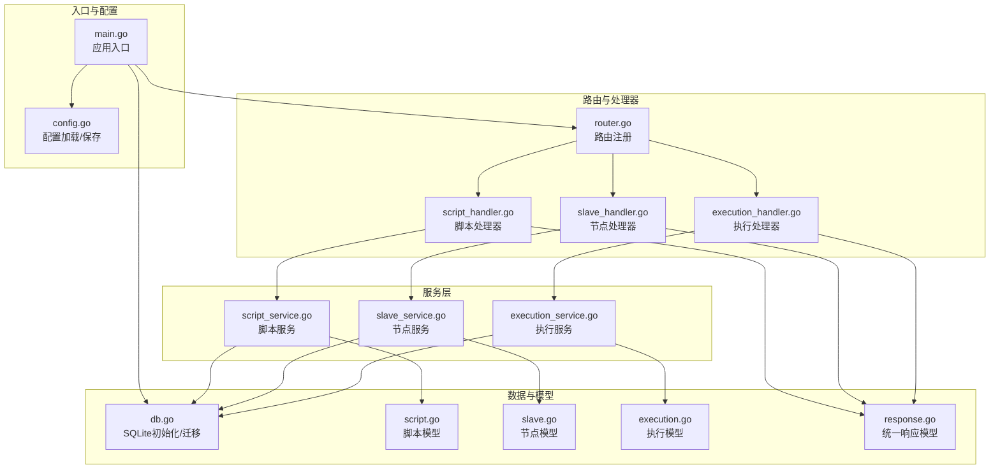
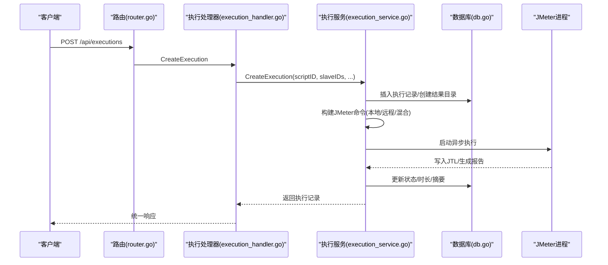
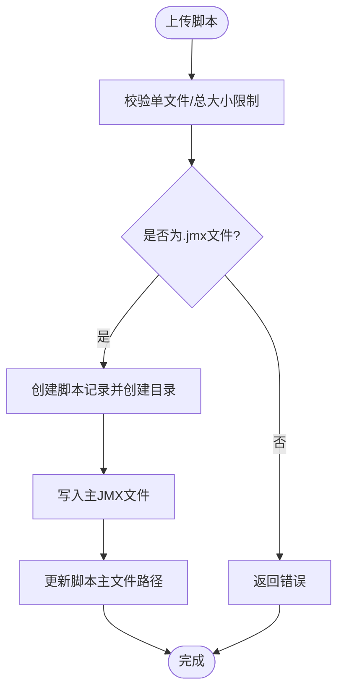
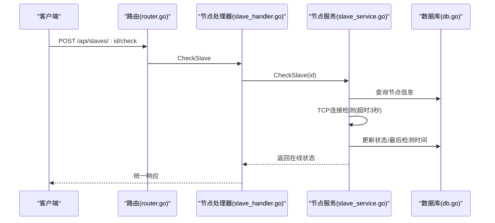
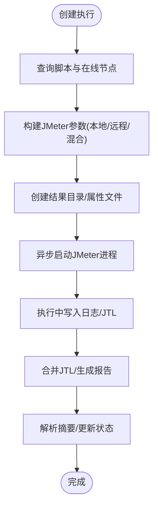
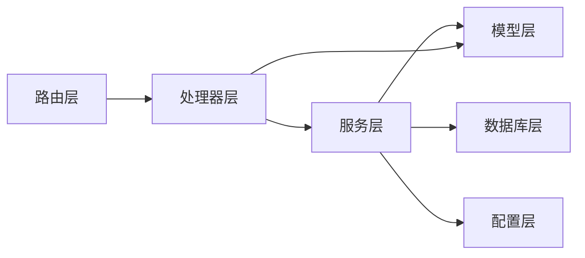

# 核心业务模块

<cite>
**本文引用的文件**
- [main.go](file://main.go)
- [router.go](file://internal/router/router.go)
- [config.go](file://config/config.go)
- [db.go](file://internal/database/db.go)
- [script.go](file://internal/model/script.go)
- [slave.go](file://internal/model/slave.go)
- [execution.go](file://internal/model/execution.go)
- [response.go](file://internal/model/response.go)
- [script_handler.go](file://internal/handler/script.go)
- [slave_handler.go](file://internal/handler/slave.go)
- [execution_handler.go](file://internal/handler/execution.go)
- [script_service.go](file://internal/service/script.go)
- [slave_service.go](file://internal/service/slave.go)
- [execution_service.go](file://internal/service/execution.go)
</cite>

## 目录
1. [简介](#简介)
2. [项目结构](#项目结构)
3. [核心组件](#核心组件)
4. [架构总览](#架构总览)
5. [详细组件分析](#详细组件分析)
6. [依赖分析](#依赖分析)
7. [性能考虑](#性能考虑)
8. [故障排查指南](#故障排查指南)
9. [结论](#结论)
10. [附录](#附录)

## 简介
本文件面向JMeter Admin的核心业务模块，围绕“脚本管理系统”、“Slave节点管理”和“执行管理系统”三大模块进行系统化梳理。文档从架构设计、数据流程、关键算法、模块协作与依赖、业务规则与数据校验、扩展与定制化建议、性能优化策略、异常处理与错误恢复、以及测试与质量保障等方面进行全面阐述，帮助开发者与运维人员快速理解与高效维护系统。

## 项目结构
JMeter Admin采用典型的分层架构：入口程序负责初始化配置、数据库与路由；路由层组织REST API；处理器层承接请求并调用服务层；服务层封装业务逻辑与数据持久化；模型层定义数据结构；数据库层基于SQLite进行本地存储；配置层提供运行时参数。

图示来源
- [main.go:28-66](file://main.go#L28-L66)
- [router.go:14-112](file://internal/router/router.go#L14-L112)
- [config.go:43-84](file://config/config.go#L43-L84)
- [db.go:15-34](file://internal/database/db.go#L15-L34)
- [script_handler.go:37-50](file://internal/handler/script.go#L37-L50)
- [slave_handler.go:16-24](file://internal/handler/slave.go#L16-L24)
- [execution_handler.go:38-53](file://internal/handler/execution.go#L38-L53)

章节来源
- [main.go:28-66](file://main.go#L28-L66)
- [router.go:14-112](file://internal/router/router.go#L14-L112)
- [config.go:43-84](file://config/config.go#L43-L84)
- [db.go:15-34](file://internal/database/db.go#L15-L34)

## 核心组件
- 脚本管理系统：负责脚本的增删改查、主JMX文件与附件文件的上传/下载/删除、脚本内容的读取与保存（含XML合法性校验）、分页检索与关键字过滤。
- Slave节点管理：负责节点的增删改查、连通性检测、心跳定时任务、在线状态维护、网络接口与Master主机名配置。
- 执行管理系统：负责执行的创建与启动（本地/分布式/混合模式）、异步执行与进程管理、实时指标聚合（TPS、RT、并发度等）、结果合并与报告生成、日志流式输出、错误明细上传与导出、统计汇总与历史查询、停止执行与陈旧记录清理。

章节来源
- [script_handler.go:37-327](file://internal/handler/script.go#L37-L327)
- [slave_handler.go:16-236](file://internal/handler/slave.go#L16-L236)
- [execution_handler.go:38-729](file://internal/handler/execution.go#L38-L729)
- [script_service.go:18-540](file://internal/service/script.go#L18-L540)
- [slave_service.go:15-220](file://internal/service/slave.go#L15-L220)
- [execution_service.go:103-481](file://internal/service/execution.go#L103-L481)

## 架构总览
系统通过Gin框架提供REST API，统一响应模型封装错误与分页数据；服务层通过SQLite进行数据持久化，并在启动时完成表结构初始化与迁移；执行流程以异步goroutine方式运行JMeter命令，结合实时CSV解析与报告生成，形成完整的测试生命周期闭环。

图示来源
- [router.go:49-66](file://internal/router/router.go#L49-L66)
- [execution_handler.go:38-53](file://internal/handler/execution.go#L38-L53)
- [execution_service.go:103-481](file://internal/service/execution.go#L103-L481)
- [db.go:36-124](file://internal/database/db.go#L36-L124)

## 详细组件分析

### 脚本管理系统
- 业务逻辑
  - 脚本创建：校验上传文件大小与类型，生成脚本记录并创建脚本专属目录。
  - 文件管理：支持附件批量上传（限制总大小与单文件大小），按ID或文件名删除，区分主JMX与附件类型。
  - 内容编辑：读取/保存JMX内容，保存前进行XML合法性校验。
  - 查询与分页：支持按名称关键字模糊查询、分页与总数统计。
- 关键算法与数据结构
  - 文件类型识别：根据扩展名映射至jmx/csv/json/txt/properties/xml/yaml/jar/other。
  - XML合法性校验：使用解码器逐步扫描，遇EOF视为合法，其他错误即报错。
  - 分页SQL：动态拼接where子句，分别查询总数与列表，避免重复扫描。
- 数据验证与安全
  - 上传限制：单文件≤100MB，总和≤500MB；仅允许.jmx作为主文件。
  - 路径清理：对上传文件名进行清理，防止路径穿越与空名。
- 模块协作
  - 处理器层负责参数绑定与错误返回；服务层负责数据库操作与文件系统交互；模型层提供脚本与文件结构定义。
- 扩展与定制化
  - 新增文件类型：在类型映射处扩展；新增校验规则：在保存前增加相应校验函数。
- 性能与优化
  - 批量上传采用流式读取与限制，避免内存峰值；分页查询配合索引提升查询效率。
- 异常处理与恢复
  - 文件写入失败回滚数据库记录；删除脚本时忽略不存在的磁盘文件；更新脚本时间与主文件路径保持一致性。

图示来源
- [script_handler.go:52-108](file://internal/handler/script.go#L52-L108)
- [script_service.go:85-116](file://internal/service/script.go#L85-L116)
- [script_service.go:299-359](file://internal/service/script.go#L299-L359)

章节来源
- [script_handler.go:37-327](file://internal/handler/script.go#L37-L327)
- [script_service.go:18-540](file://internal/service/script.go#L18-L540)
- [script.go:3-22](file://internal/model/script.go#L3-L22)
- [response.go:14-45](file://internal/model/response.go#L14-L45)

### Slave节点管理
- 业务逻辑
  - 节点增删改查：提供标准CRUD接口。
  - 连通性检测：TCP超时连接检测，更新状态与最后检测时间。
  - 心跳任务：定时并发检测所有节点，限制并发数，避免资源争用。
  - 配置管理：提供本机网卡IP列表查询、Master主机名配置读取与更新。
- 关键算法与数据结构
  - 并发控制：信号量限制并发数为10，避免大量节点同时检测导致阻塞。
  - TCP探测：设置3秒超时，成功则online，失败则offline。
- 数据验证与安全
  - 参数绑定与错误返回；检测失败不影响整体流程，仅更新状态。
- 模块协作
  - 处理器层负责参数校验与返回；服务层负责数据库操作与网络探测；模型层提供节点结构。
- 性能与优化
  - 并发限制与等待组确保高并发下的稳定性；心跳间隔可配置，默认30秒。
- 异常处理与恢复
  - 检测失败记录日志并继续；数据库更新失败不影响检测流程。

图示来源
- [router.go:38-47](file://internal/router/router.go#L38-L47)
- [slave_handler.go:97-122](file://internal/handler/slave.go#L97-L122)
- [slave_service.go:112-157](file://internal/service/slave.go#L112-L157)

章节来源
- [slave_handler.go:16-236](file://internal/handler/slave.go#L16-L236)
- [slave_service.go:15-220](file://internal/service/slave.go#L15-L220)
- [slave.go:3-11](file://internal/model/slave.go#L3-L11)

### 执行管理系统
- 业务逻辑
  - 执行创建：选择脚本与节点，支持本地、分布式与混合模式；生成运行时JMX（可选）；动态计算JVM参数；异步执行并写入日志。
  - 实时指标：解析JTL CSV，按秒级窗口聚合TPS、RT、成功率、并发度等指标。
  - 结果与报告：合并本地与远程JTL，生成HTML报告；支持JTL/报告/错误导出与全量打包下载。
  - 日志流式：SSE流式输出日志，支持快照与持续监听。
  - 停止执行：通过进程管理器终止JMeter进程并更新状态。
  - 统计与查询：提供执行统计与分页查询，支持多维筛选。
- 关键算法与数据结构
  - JVM内存参数：基于系统可用内存动态计算，取80%，上下限约束。
  - JTL解析：CSV懒加载、列索引缓存、按秒桶聚合、事务样本识别。
  - 命令构建：本地/远程/混合模式参数组合，属性文件与CLI属性双保险。
  - 进程管理：全局map存储执行命令，停止时逐一kill。
- 数据验证与安全
  - 节点离线检测：仅使用在线节点，离线节点记录但不阻塞执行。
  - 错误明细：分布式模式下要求配置Master回调地址，否则拒绝执行。
  - 文件访问：严格检查路径存在性与类型，避免目录穿越。
- 模块协作
  - 处理器层负责参数绑定、文件下载/上传、SSE流式输出；服务层负责执行调度、JMeter命令、JTL解析与报告生成；模型层提供执行与响应结构。
- 性能与优化
  - 动态JVM参数减少内存浪费；CSV解析按需读取与列索引复用；报告生成与JTL合并分离，避免阻塞。
- 异常处理与恢复
  - 服务启动时清理陈旧执行记录（running→failed）；执行失败时记录日志并更新状态；停止执行时计算已用时长。

图示来源
- [execution_handler.go:38-53](file://internal/handler/execution.go#L38-L53)
- [execution_service.go:103-481](file://internal/service/execution.go#L103-L481)
- [execution_service.go:800-947](file://internal/service/execution.go#L800-L947)

章节来源
- [execution_handler.go:38-729](file://internal/handler/execution.go#L38-L729)
- [execution_service.go:103-1200](file://internal/service/execution.go#L103-L1200)
- [execution.go:3-18](file://internal/model/execution.go#L3-L18)
- [response.go:14-45](file://internal/model/response.go#L14-L45)

## 依赖分析
- 组件耦合
  - 处理器层仅依赖服务层接口，低耦合便于替换与测试。
  - 服务层依赖数据库层与配置层，承担业务规则与数据一致性。
  - 模型层为纯数据结构，被处理器与服务层广泛使用。
- 外部依赖
  - Gin：Web框架与路由。
  - SQLite：轻量级本地数据库。
  - JMeter：执行引擎与报告生成。
- 循环依赖
  - 未发现循环导入；各层职责清晰。
- 接口契约
  - 统一响应模型：Success/Error/PageSuccess封装标准返回格式。

图示来源
- [router.go:14-112](file://internal/router/router.go#L14-L112)
- [response.go:14-45](file://internal/model/response.go#L14-L45)

章节来源
- [router.go:14-112](file://internal/router/router.go#L14-L112)
- [response.go:14-45](file://internal/model/response.go#L14-L45)

## 性能考虑
- 内存与JVM
  - 动态计算JVM堆大小，避免固定值导致资源浪费或溢出。
- 并发与I/O
  - 节点心跳并发限制；JTL解析按秒桶聚合，避免大文件内存压力。
- 存储与索引
  - 对执行表的关键列建立索引，提升查询性能。
- 网络与分布式
  - 分布式模式下合理配置Master主机名，确保RMI回调可达。
- 建议
  - 对大规模并发场景，可引入队列与限流；对JTL解析可考虑分片与增量聚合。

## 故障排查指南
- 常见问题
  - 执行记录状态异常：服务重启后陈旧记录会被清理为failed，检查日志与数据库状态。
  - 节点离线：心跳检测失败或TCP超时，检查网络连通性与端口开放情况。
  - 执行失败：查看执行日志，确认JMeter命令参数、JVM参数与结果路径。
  - 错误明细未回传：检查Master主机名配置与令牌生成。
- 排查步骤
  - 通过执行详情与日志接口定位问题；使用统计接口核对执行总量与状态分布。
  - 对脚本内容保存失败，检查XML合法性与文件权限。
- 修复建议
  - 节点问题：修复网络或端口；服务层会自动更新状态。
  - 执行问题：调整JVM参数、检查JMeter安装路径与属性文件。

章节来源
- [execution_service.go:1044-1060](file://internal/service/execution.go#L1044-L1060)
- [slave_service.go:172-219](file://internal/service/slave.go#L172-L219)
- [execution_handler.go:555-708](file://internal/handler/execution.go#L555-L708)

## 结论
JMeter Admin通过清晰的分层架构与完善的业务模块，实现了从脚本管理、节点监控到执行调度与结果分析的全链路能力。模块间职责明确、依赖稳定，具备良好的扩展性与可维护性。建议在生产环境中结合监控与告警体系，持续优化JVM参数与并发策略，确保系统在高负载下的稳定性与性能表现。

## 附录
- 配置项说明
  - server.port：HTTP服务监听端口。
  - jmeter.path：JMeter可执行文件路径。
  - jmeter.master_hostname：RMI回调IP，多网卡时必填。
  - slave.heartbeat_interval：心跳检测间隔（秒）。
  - dirs.data/uploads/results：数据、上传与结果目录。
- 数据库迁移
  - 自动创建表与索引；按需添加列（如executions.duration、remarks，script_files.updated_at，slaves.last_check_time）。

章节来源
- [config.go:10-41](file://config/config.go#L10-L41)
- [db.go:126-171](file://internal/database/db.go#L126-L171)