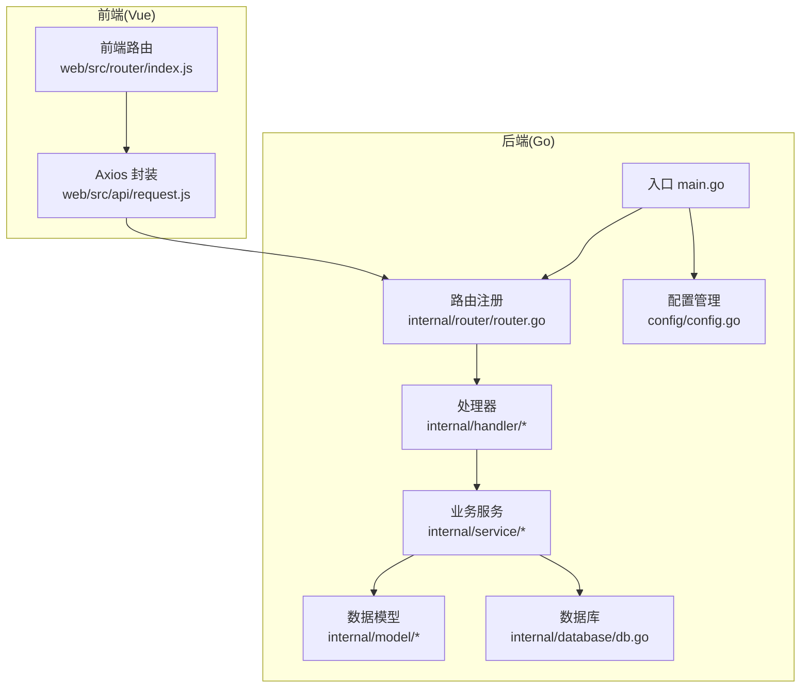
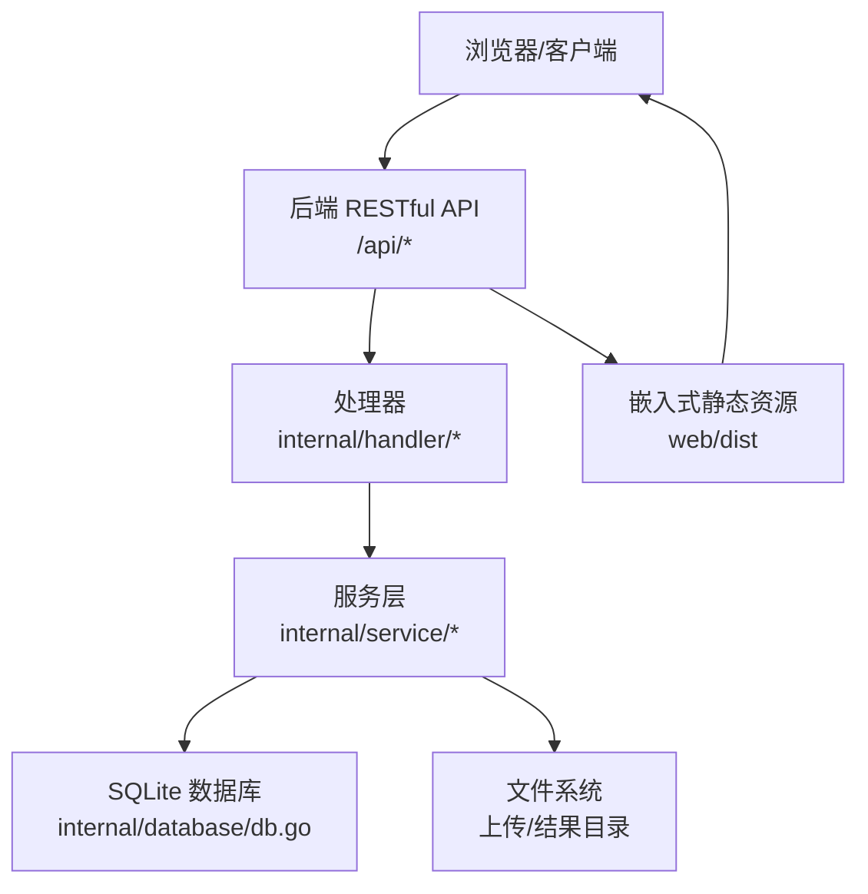
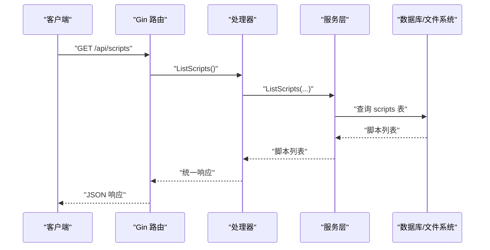
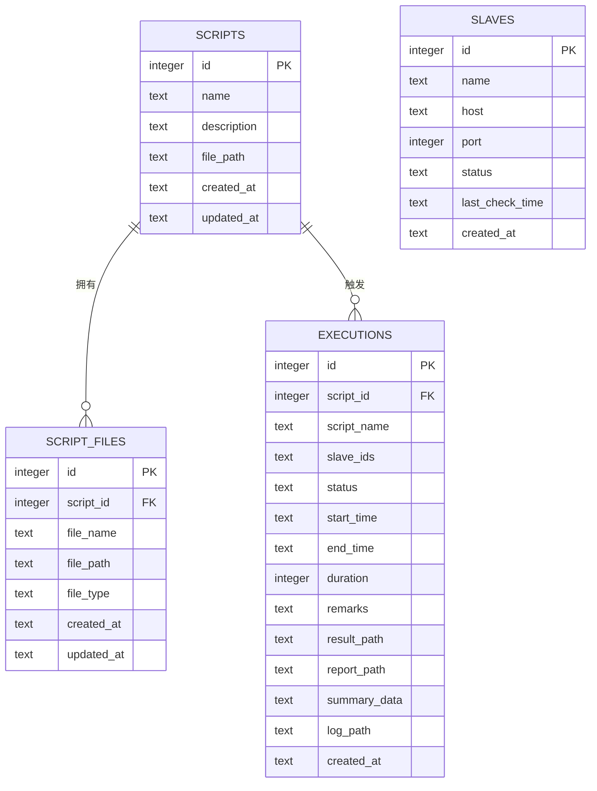
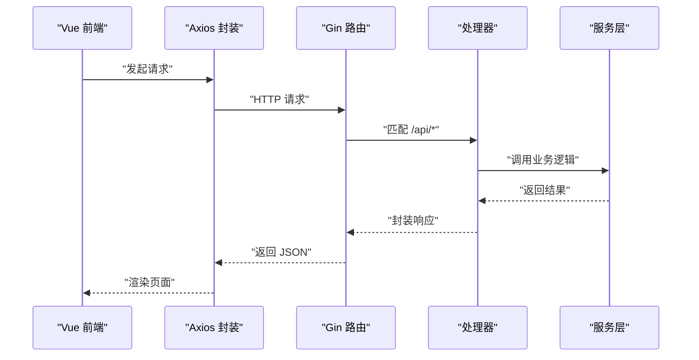
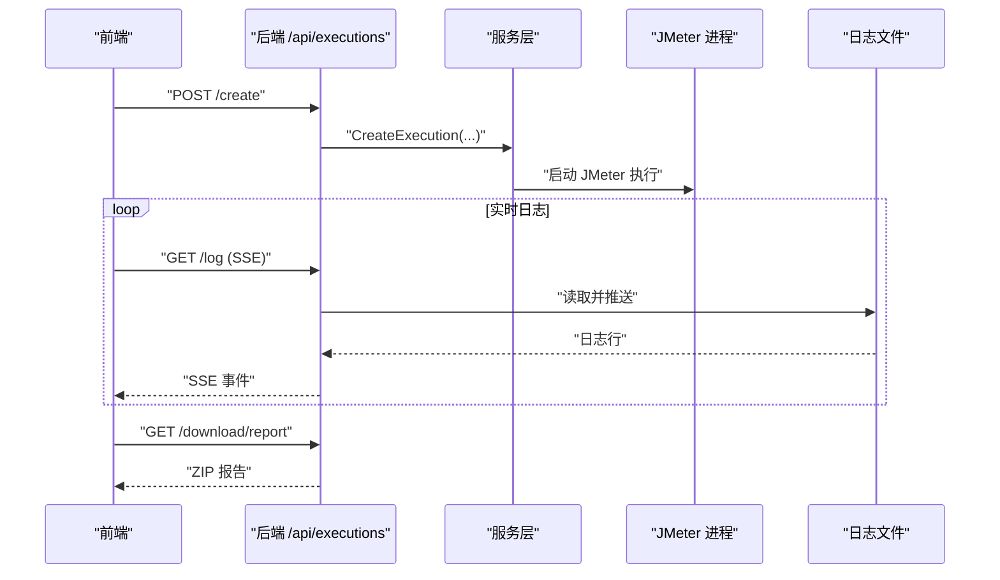
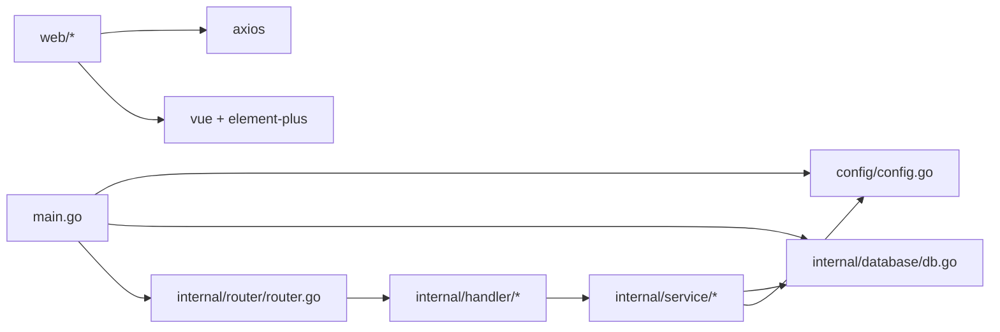

# 系统架构设计

<cite>
**本文引用的文件**
- [main.go](file://main.go)
- [go.mod](file://go.mod)
- [config/config.go](file://config/config.go)
- [internal/router/router.go](file://internal/router/router.go)
- [internal/database/db.go](file://internal/database/db.go)
- [internal/handler/script.go](file://internal/handler/script.go)
- [internal/handler/slave.go](file://internal/handler/slave.go)
- [internal/handler/execution.go](file://internal/handler/execution.go)
- [internal/model/script.go](file://internal/model/script.go)
- [internal/model/slave.go](file://internal/model/slave.go)
- [internal/service/script.go](file://internal/service/script.go)
- [internal/service/slave.go](file://internal/service/slave.go)
- [internal/service/execution.go](file://internal/service/execution.go)
- [web/src/api/request.js](file://web/src/api/request.js)
- [web/src/router/index.js](file://web/src/router/index.js)
- [web/package.json](file://web/package.json)
- [README.md](file://README.md)
</cite>

## 目录
1. [简介](#简介)
2. [项目结构](#项目结构)
3. [核心组件](#核心组件)
4. [架构总览](#架构总览)
5. [详细组件分析](#详细组件分析)
6. [依赖分析](#依赖分析)
7. [性能考量](#性能考量)
8. [故障排查指南](#故障排查指南)
9. [结论](#结论)
10. [附录](#附录)

## 简介
本项目为“JMeter Admin”——一个单文件部署的 JMeter 分布式压测管理平台。后端采用 Go + Gin，前端采用 Vue 3 + Element Plus，数据库使用 SQLite。系统通过 Gin 提供 RESTful API，前端通过 Axios 发起 HTTP 请求与后端交互；静态资源被嵌入到 Go 二进制文件中，最终生成单一可执行文件，便于零依赖部署。

## 项目结构
项目采用分层架构与 MVC 思想结合：
- 展示层（View）：Vue 前端，负责用户界面与交互。
- 控制层（Controller）：Gin 路由与处理器（Handler），负责请求接入、参数校验与响应封装。
- 业务层（Service）：封装核心业务逻辑，协调数据访问与外部工具（如 JMeter）。
- 数据访问层（DAO/Model）：SQLite 数据库与 SQL 操作。
- 配置与静态资源：YAML 配置文件、嵌入式前端资源。

图表来源
- [main.go:28-66](file://main.go#L28-L66)
- [internal/router/router.go:14-112](file://internal/router/router.go#L14-L112)
- [internal/handler/script.go:37-108](file://internal/handler/script.go#L37-L108)
- [internal/handler/slave.go:16-48](file://internal/handler/slave.go#L16-L48)
- [internal/handler/execution.go:38-53](file://internal/handler/execution.go#L38-L53)
- [internal/service/script.go:18-83](file://internal/service/script.go#L18-L83)
- [internal/service/slave.go:15-41](file://internal/service/slave.go#L15-L41)
- [internal/service/execution.go:103-180](file://internal/service/execution.go#L103-L180)
- [internal/database/db.go:15-34](file://internal/database/db.go#L15-L34)
- [config/config.go:43-84](file://config/config.go#L43-L84)

章节来源
- [README.md:92-120](file://README.md#L92-L120)
- [go.mod:1-42](file://go.mod#L1-L42)

## 核心组件
- 入口与生命周期
  - 初始化配置、创建目录、初始化数据库、清理陈旧执行记录、启动 Slave 心跳检测、设置路由并启动 HTTP 服务。
- 路由与中间件
  - Gin 路由分组（/api/scripts、/api/slaves、/api/executions、/api/config），CORS 中间件，静态资源服务（报告目录与嵌入式前端）。
- 处理器（Handler）
  - 对外暴露 RESTful API，进行参数校验、调用服务层并统一返回模型。
- 服务层（Service）
  - 脚本管理、Slave 节点管理、执行任务调度与监控、日志流式推送、结果导出等。
- 数据层（SQLite）
  - scripts、script_files、slaves、executions 表及索引，支持迁移与增补字段。
- 前端
  - Axios 封装统一错误处理与重复请求取消，Vue Router 支持历史模式。

章节来源
- [main.go:19-66](file://main.go#L19-L66)
- [internal/router/router.go:14-129](file://internal/router/router.go#L14-L129)
- [internal/handler/script.go:37-327](file://internal/handler/script.go#L37-L327)
- [internal/handler/slave.go:16-236](file://internal/handler/slave.go#L16-L236)
- [internal/handler/execution.go:38-729](file://internal/handler/execution.go#L38-L729)
- [internal/database/db.go:15-197](file://internal/database/db.go#L15-L197)
- [web/src/api/request.js:1-103](file://web/src/api/request.js#L1-L103)
- [web/src/router/index.js:1-55](file://web/src/router/index.js#L1-L55)

## 架构总览
系统采用前后端分离设计：前端 Vue 通过 Axios 调用后端 /api 前缀的 RESTful 接口；后端 Gin 路由将请求分发至对应处理器，处理器调用服务层，服务层访问数据库与文件系统，最终返回统一格式的响应。静态资源（web/dist）被嵌入到二进制文件中，通过 Gin 提供静态文件服务，并对未知路由回退到前端首页以支持 Vue Router 的 history 模式。

图表来源
- [internal/router/router.go:77-112](file://internal/router/router.go#L77-L112)
- [internal/handler/script.go:37-108](file://internal/handler/script.go#L37-L108)
- [internal/handler/slave.go:16-48](file://internal/handler/slave.go#L16-L48)
- [internal/handler/execution.go:38-53](file://internal/handler/execution.go#L38-L53)
- [internal/database/db.go:15-34](file://internal/database/db.go#L15-L34)
- [main.go:16-17](file://main.go#L16-L17)

## 详细组件分析

### 路由与中间件
- 路由分组
  - /api/scripts：脚本 CRUD、下载、内容读写、附件上传与删除。
  - /api/slaves：Slave 列表、增删改、连通性检测、心跳状态。
  - /api/executions：执行记录列表、统计、创建、详情、实时日志（SSE）、错误导出、结果下载。
  - /api/config：网络接口列表、Master 主机名读取与更新。
- 中间件
  - CORS：允许跨域请求，支持常见方法与头部。
  - 静态资源：/reports 指向结果目录；/assets/* 指向前端嵌入资源；其他路由回退到前端首页。
- 嵌入式静态资源
  - 使用 go:embed 将 web/dist 整体嵌入，运行时通过 http.FS 提供前端文件。

图表来源
- [internal/router/router.go:20-75](file://internal/router/router.go#L20-L75)
- [internal/handler/script.go:37-50](file://internal/handler/script.go#L37-L50)
- [internal/service/script.go:18-83](file://internal/service/script.go#L18-L83)
- [internal/database/db.go:36-124](file://internal/database/db.go#L36-L124)

章节来源
- [internal/router/router.go:14-129](file://internal/router/router.go#L14-L129)

### 数据库架构与持久化策略
- 数据库选择：SQLite
  - 优点：零依赖、单文件、部署简单、适合本项目单机场景。
  - 适用性：满足脚本、Slave、执行记录等小规模数据管理需求。
- 表结构与索引
  - scripts：脚本元数据。
  - script_files：脚本附件（含类型、路径、时间）。
  - slaves：Slave 节点（含状态、最近检测时间）。
  - executions：执行记录（含状态、时间、路径、摘要、日志）。
  - 索引：针对 executions 的 script_id、status、created_at 以及 script_files 的 script_id 建立索引。
- 迁移与演进
  - 支持动态迁移（新增列），保证版本升级时的数据兼容。
- 数据持久化策略
  - 配置文件 config.yaml 默认生成于运行目录，首次启动时创建。
  - 数据库存放于 data/jmeter-admin.db；上传文件与执行结果分别存放于 uploads 与 results 目录。

图表来源
- [internal/database/db.go:36-124](file://internal/database/db.go#L36-L124)

章节来源
- [internal/database/db.go:15-197](file://internal/database/db.go#L15-L197)
- [config/config.go:43-84](file://config/config.go#L43-L84)

### 前后端交互与静态资源嵌入
- 前端交互
  - Axios 封装统一请求与响应拦截，支持重复请求去重、超时与错误提示。
  - Vue Router 使用 history 模式，后端 NoRoute 回退到前端首页。
- 静态资源嵌入
  - go:embed 将 web/dist 嵌入二进制；通过 /assets/* 路由提供静态文件；/reports 指向结果目录。
- 构建与部署
  - 前端构建产物放置于 web/dist；后端编译时将该目录嵌入；最终生成单文件可执行程序。

图表来源
- [web/src/api/request.js:1-103](file://web/src/api/request.js#L1-L103)
- [internal/router/router.go:87-112](file://internal/router/router.go#L87-L112)
- [internal/handler/script.go:37-50](file://internal/handler/script.go#L37-L50)

章节来源
- [web/src/api/request.js:1-103](file://web/src/api/request.js#L1-L103)
- [web/src/router/index.js:1-55](file://web/src/router/index.js#L1-L55)
- [internal/router/router.go:77-112](file://internal/router/router.go#L77-L112)

### 执行流程与实时日志（SSE）
- 创建执行
  - 校验脚本与 Slave 在线状态，创建执行记录，准备结果目录与日志文件。
- 实时日志
  - SSE 流式推送日志，支持快照读取与断线重连；当执行结束自动关闭流。
- 结果导出
  - 支持 JTL 下载、HTML 报告 ZIP、错误 CSV 导出、全量结果打包。

图表来源
- [internal/handler/execution.go:38-53](file://internal/handler/execution.go#L38-L53)
- [internal/handler/execution.go:555-708](file://internal/handler/execution.go#L555-L708)
- [internal/handler/execution.go:261-358](file://internal/handler/execution.go#L261-L358)

章节来源
- [internal/handler/execution.go:38-729](file://internal/handler/execution.go#L38-L729)
- [internal/service/execution.go:103-200](file://internal/service/execution.go#L103-L200)

### 错误处理与统一响应
- 处理器层
  - 对业务异常统一转换为错误响应，避免泄露内部细节。
- 前端层
  - Axios 拦截器对非 2xx 状态码进行统一提示，区分超时、网络、鉴权等场景。
- 数据库与文件系统
  - 打开/连接失败、文件不存在、读写失败等均向上抛出错误，由处理器捕获并返回。

章节来源
- [internal/handler/script.go:43-49](file://internal/handler/script.go#L43-L49)
- [internal/handler/slave.go:19-23](file://internal/handler/slave.go#L19-L23)
- [internal/handler/execution.go:80-86](file://internal/handler/execution.go#L80-L86)
- [web/src/api/request.js:42-88](file://web/src/api/request.js#L42-L88)

## 依赖分析
- 外部依赖
  - Gin：Web 框架与路由。
  - SQLite 驱动：github.com/mattn/go-sqlite3。
  - YAML 解析：gopkg.in/yaml.v3。
- 内部模块耦合
  - main.go 依赖 config、database、router、service。
  - router 依赖 handler。
  - handler 依赖 service 与 model。
  - service 依赖 database 与 config。
  - 前端依赖 axios、vue、element-plus。

图表来源
- [go.mod:5-9](file://go.mod#L5-L9)
- [main.go:10-14](file://main.go#L10-L14)
- [internal/router/router.go:3-11](file://internal/router/router.go#L3-L11)

章节来源
- [go.mod:1-42](file://go.mod#L1-L42)

## 性能考量
- 数据库
  - 为 executions 与 script_files 建立索引，提升分页与关联查询性能。
  - 迁移时按需添加列，避免一次性大变更。
- 并发与限流
  - Slave 心跳检测使用信号量限制并发（例如 10），避免对目标节点造成压力。
- 文件与网络
  - 日志流式读取与 SSE，减少内存占用；报告打包采用流式写入 ZIP。
- JVM 内存
  - 动态计算 JVM 堆大小（初始堆与最大堆），依据系统可用内存自动调整，避免 OOM。

章节来源
- [internal/database/db.go:173-189](file://internal/database/db.go#L173-L189)
- [internal/service/slave.go:179-200](file://internal/service/slave.go#L179-L200)
- [internal/service/execution.go:54-101](file://internal/service/execution.go#L54-L101)
- [internal/handler/execution.go:555-708](file://internal/handler/execution.go#L555-L708)

## 故障排查指南
- 配置问题
  - config.yaml 不存在时会自动生成默认配置；若需要修改，可通过 /api/config 接口更新 master_hostname 并持久化。
- 数据库问题
  - 若迁移失败，可删除 data/jmeter-admin.db 后重启服务重建。
- 前端构建问题
  - 前端依赖通过 npm/yarn 安装；如构建缓慢可配置镜像源。
- Slave 连接问题
  - 检查 master_hostname 是否正确、防火墙端口是否开放、Slave 是否禁用 RMI SSL。
- JMeter OOM
  - 系统会自动根据可用内存分配 JVM 堆，无需手动配置；如仍出现 OOM，建议降低并发或样本量。

章节来源
- [config/config.go:86-97](file://config/config.go#L86-L97)
- [README.md:270-312](file://README.md#L270-L312)

## 结论
本系统通过清晰的分层架构与 MVC 设计，实现了前后端分离与静态资源嵌入，具备良好的可维护性与部署便利性。SQLite 的使用降低了运维复杂度，适合中小规模场景；通过索引、并发控制与流式处理优化了性能。未来可在以下方面进一步增强：引入统一的错误码与国际化、增加鉴权与审计日志、扩展监控与告警能力。

## 附录
- API 概览
  - 脚本管理：列表、创建、详情、更新、删除、下载、内容读写、附件上传与删除。
  - Slave 管理：列表、创建、更新、删除、连通性检测、心跳状态。
  - 执行管理：列表、统计、创建、详情、停止、实时日志（SSE）、错误分析、结果导出。
  - 系统配置：网络接口列表、Master 主机名读取与更新。
- 数据模型
  - Script、ScriptFile、Slave、Execution。

章节来源
- [README.md:122-174](file://README.md#L122-L174)
- [internal/model/script.go:1-23](file://internal/model/script.go#L1-L23)
- [internal/model/slave.go:1-12](file://internal/model/slave.go#L1-L12)