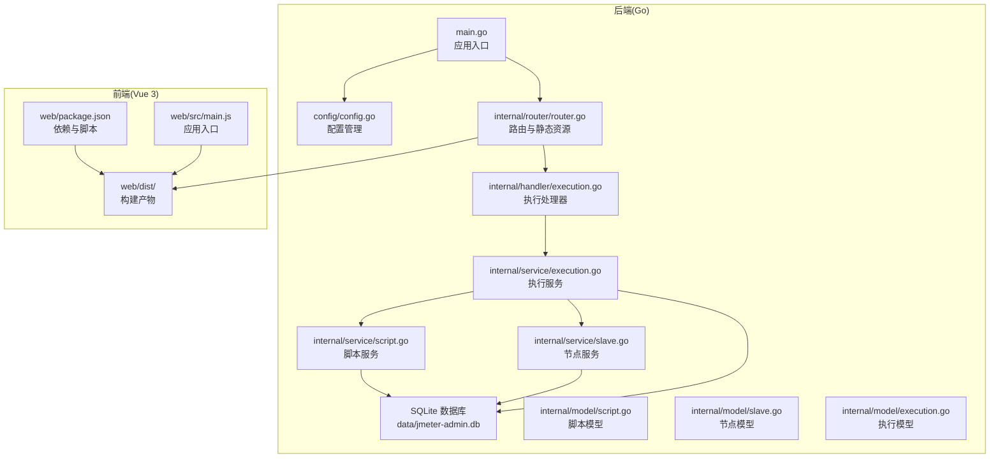
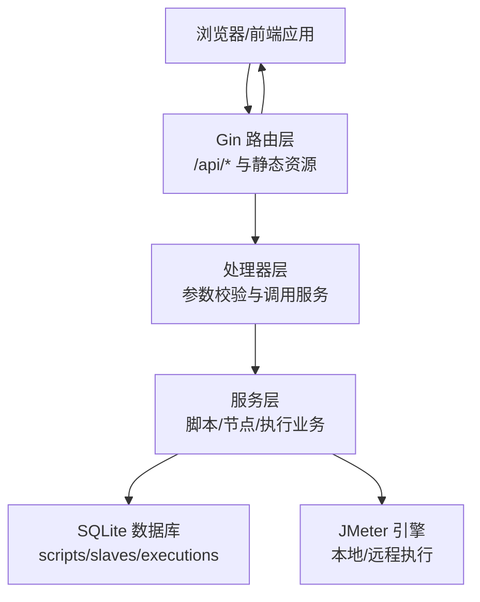
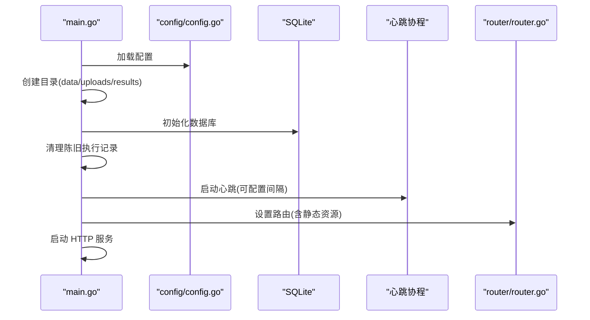
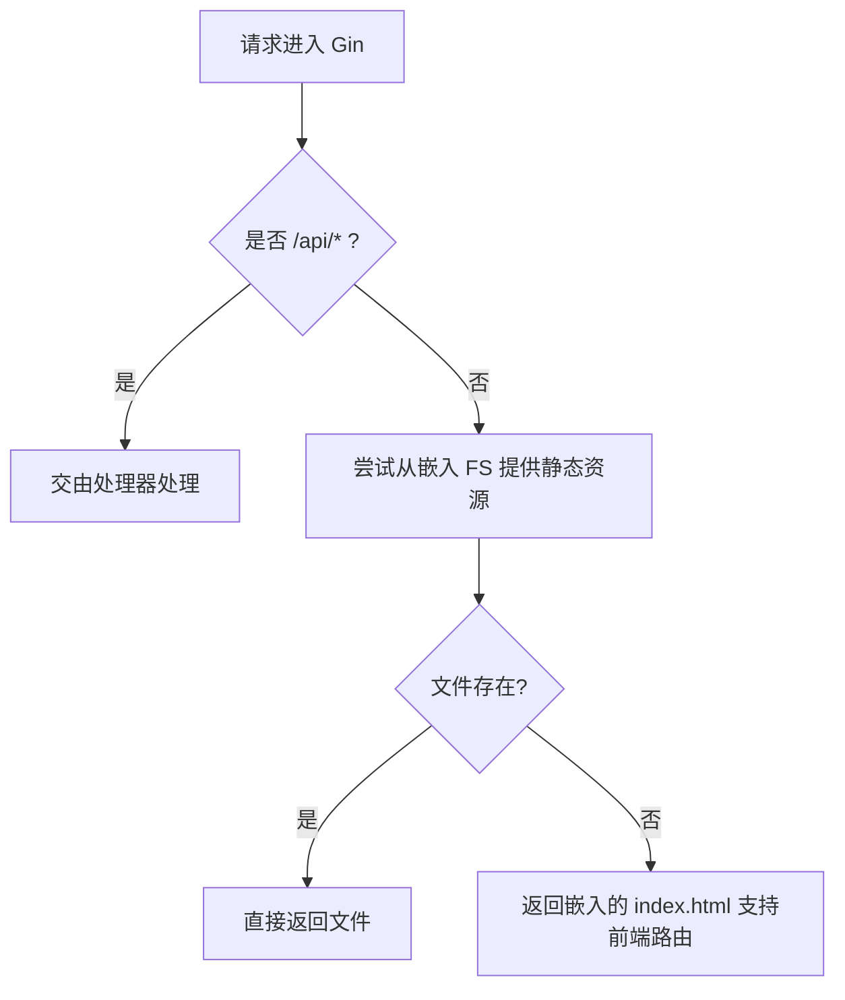
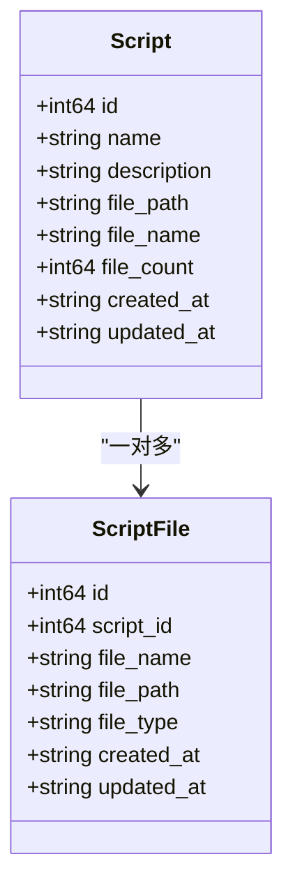
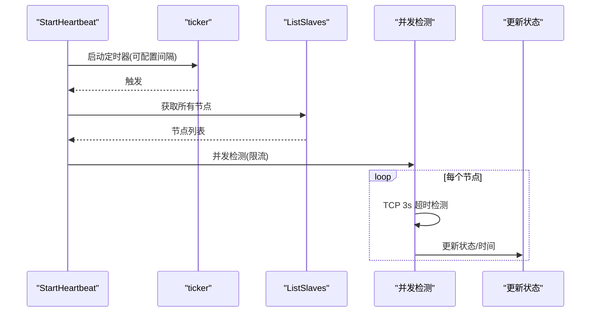
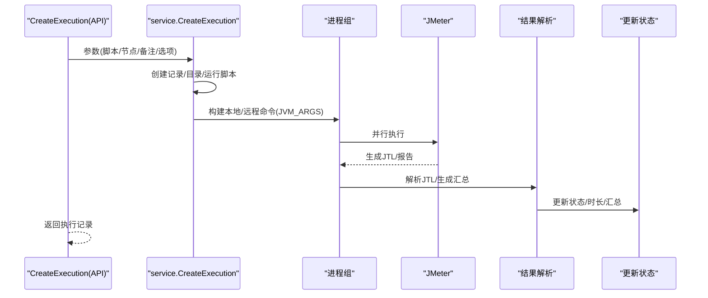
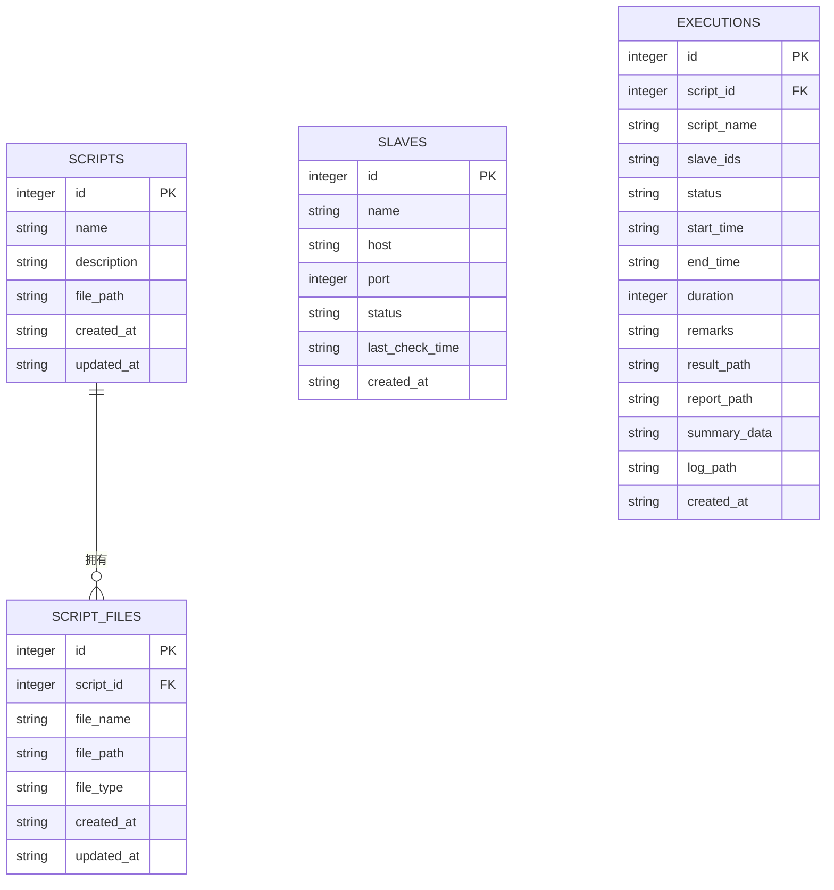
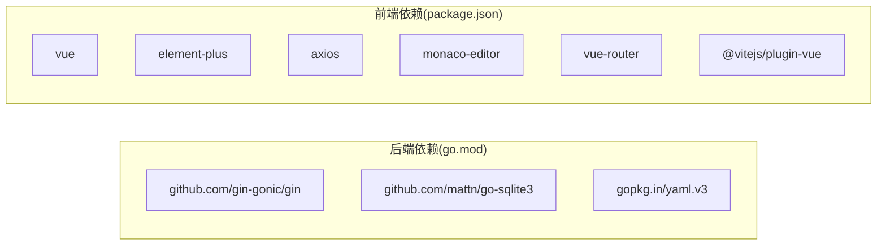

# 项目概述

<cite>
**本文引用的文件**
- [README.md](file://README.md)
- [main.go](file://main.go)
- [go.mod](file://go.mod)
- [config/config.go](file://config/config.go)
- [internal/router/router.go](file://internal/router/router.go)
- [internal/model/script.go](file://internal/model/script.go)
- [internal/model/slave.go](file://internal/model/slave.go)
- [internal/model/execution.go](file://internal/model/execution.go)
- [internal/service/script.go](file://internal/service/script.go)
- [internal/service/slave.go](file://internal/service/slave.go)
- [internal/service/execution.go](file://internal/service/execution.go)
- [internal/handler/execution.go](file://internal/handler/execution.go)
- [web/src/main.js](file://web/src/main.js)
- [web/package.json](file://web/package.json)
- [Makefile](file://Makefile)
</cite>

## 目录
1. [简介](#简介)
2. [项目结构](#项目结构)
3. [核心组件](#核心组件)
4. [架构总览](#架构总览)
5. [详细组件分析](#详细组件分析)
6. [依赖关系分析](#依赖关系分析)
7. [性能考虑](#性能考虑)
8. [故障排查指南](#故障排查指南)
9. [结论](#结论)
10. [附录](#附录)

## 简介
JMeter Admin 是一款“单文件部署”的 JMeter 分布式压测管理平台，采用 Go（Gin）+ Vue 3（Element Plus）+ SQLite 的技术栈，前端资源被嵌入后端二进制文件，最终产出单一可执行文件，实现零依赖、易部署的目标。项目提供 JMX 脚本管理、Slave 节点管理、分布式压测执行、执行记录管理、Master IP 自动检测等核心能力，适合中小团队快速搭建本地或小规模分布式压测平台。

- 单文件部署：前端资源内嵌，编译后生成独立二进制
- 零依赖：SQLite 本地存储，无需外部数据库
- 分布式友好：内置 Slave 心跳与连通性检测，支持 Master IP 配置
- 实时可观测：SSE 实时日志流、错误分析、JTL/报告/CSV 导出

**章节来源**
- [README.md:1-316](file://README.md#L1-L316)

## 项目结构
项目采用“后端 Go + 前端 Vue 3”分层设计，后端通过 Gin 提供 REST API，并将前端静态资源以嵌入方式提供；数据库使用 SQLite，数据、上传与结果目录在运行时生成。

**图表来源**
- [main.go:28-66](file://main.go#L28-L66)
- [config/config.go:43-84](file://config/config.go#L43-L84)
- [internal/router/router.go:14-112](file://internal/router/router.go#L14-L112)
- [internal/service/script.go:85-116](file://internal/service/script.go#L85-L116)
- [internal/service/slave.go:43-69](file://internal/service/slave.go#L43-L69)
- [internal/service/execution.go:103-179](file://internal/service/execution.go#L103-L179)
- [web/package.json:1-24](file://web/package.json#L1-L24)
- [web/src/main.js:1-23](file://web/src/main.js#L1-L23)

**章节来源**
- [README.md:92-120](file://README.md#L92-L120)
- [Makefile:1-39](file://Makefile#L1-L39)

## 核心组件
- 配置模块：负责加载/保存 config.yaml，包含服务端口、JMeter 路径、Master 主机名、心跳间隔、目录配置等
- 路由模块：注册 /api/* 路由组，提供脚本、节点、执行、系统配置接口；同时提供嵌入式前端静态资源与回退
- 服务模块：
  - 脚本服务：分页查询、创建、更新、删除、JMX 内容读写、附件上传/删除
  - 节点服务：增删改查、连通性检测、定时心跳
  - 执行服务：创建执行、异步执行 JMeter、合并结果、生成报告、统计汇总、SSE 实时日志、错误导出
- 处理器模块：对请求进行参数绑定与校验，调用服务层并返回统一响应模型
- 前端模块：Vue 3 应用，基于 Element Plus，打包产物嵌入后端

**章节来源**
- [config/config.go:10-41](file://config/config.go#L10-L41)
- [internal/router/router.go:20-75](file://internal/router/router.go#L20-L75)
- [internal/service/script.go:18-83](file://internal/service/script.go#L18-L83)
- [internal/service/slave.go:15-41](file://internal/service/slave.go#L15-L41)
- [internal/service/execution.go:103-179](file://internal/service/execution.go#L103-L179)
- [internal/handler/execution.go:38-53](file://internal/handler/execution.go#L38-L53)
- [web/src/main.js:1-23](file://web/src/main.js#L1-23)

## 架构总览
系统采用前后端分离设计，后端提供 REST API 与静态资源服务，前端通过 Axios 请求 API 并渲染界面。所有静态资源在编译时嵌入后端二进制，运行时由后端提供。

**图表来源**
- [internal/router/router.go:14-112](file://internal/router/router.go#L14-L112)
- [internal/handler/execution.go:38-53](file://internal/handler/execution.go#L38-L53)
- [internal/service/execution.go:103-179](file://internal/service/execution.go#L103-L179)

## 详细组件分析

### 配置与启动流程
- 应用启动时加载配置、创建必要目录、初始化数据库、清理陈旧执行记录、启动 Slave 心跳、设置路由并监听端口
- 配置项包括服务端口、JMeter 路径、Master 主机名、心跳间隔、数据/上传/结果目录

**图表来源**
- [main.go:28-66](file://main.go#L28-L66)
- [config/config.go:43-84](file://config/config.go#L43-L84)
- [internal/router/router.go:77-109](file://internal/router/router.go#L77-L109)

**章节来源**
- [main.go:19-66](file://main.go#L19-L66)
- [config/config.go:43-112](file://config/config.go#L43-L112)

### 路由与静态资源
- 路由组 /api 下挂载脚本、节点、执行、系统配置接口
- 静态资源通过嵌入的 web/dist 提供，支持 Vue Router history 模式回退至 index.html

**图表来源**
- [internal/router/router.go:14-112](file://internal/router/router.go#L14-L112)

**章节来源**
- [internal/router/router.go:20-112](file://internal/router/router.go#L20-L112)

### 脚本管理服务
- 支持分页查询、创建、更新、删除、下载主 JMX、读取/保存 JMX 内容、上传/删除附件
- 附件类型自动识别，.jmx 文件更新 scripts 表的 file_path 字段

**图表来源**
- [internal/model/script.go:3-22](file://internal/model/script.go#L3-L22)
- [internal/service/script.go:85-116](file://internal/service/script.go#L85-L116)
- [internal/service/script.go:299-359](file://internal/service/script.go#L299-L359)

**章节来源**
- [internal/service/script.go:18-83](file://internal/service/script.go#L18-L83)
- [internal/service/script.go:118-177](file://internal/service/script.go#L118-L177)
- [internal/service/script.go:229-280](file://internal/service/script.go#L229-L280)
- [internal/service/script.go:299-359](file://internal/service/script.go#L299-L359)
- [internal/service/script.go:386-432](file://internal/service/script.go#L386-L432)
- [internal/service/script.go:491-525](file://internal/service/script.go#L491-L525)

### 节点管理服务
- 支持增删改查、连通性检测、定时心跳检测（并发限制、超时控制）
- 心跳协程周期性检测所有节点并更新状态与最后检测时间

**图表来源**
- [internal/service/slave.go:159-220](file://internal/service/slave.go#L159-L220)
- [internal/service/slave.go:112-157](file://internal/service/slave.go#L112-L157)

**章节来源**
- [internal/service/slave.go:15-41](file://internal/service/slave.go#L15-L41)
- [internal/service/slave.go:112-157](file://internal/service/slave.go#L112-L157)
- [internal/service/slave.go:159-220](file://internal/service/slave.go#L159-L220)

### 执行管理服务（核心）
- 创建执行：持久化记录、创建结果目录、生成运行时 JMX（可选）、构建本地/远程 JMeter 命令、动态计算 JVM 参数
- 异步执行：本地与远程并行执行，合并结果、生成报告、解析汇总数据、更新状态
- 实时指标：解析 JTL 实时趋势与摘要
- 日志与导出：SSE 实时日志流、JTL/报告/错误 CSV/全量压缩包导出

**图表来源**
- [internal/handler/execution.go:38-53](file://internal/handler/execution.go#L38-L53)
- [internal/service/execution.go:103-179](file://internal/service/execution.go#L103-L179)
- [internal/service/execution.go:368-481](file://internal/service/execution.go#L368-L481)
- [internal/service/execution.go:483-502](file://internal/service/execution.go#L483-L502)

**章节来源**
- [internal/service/execution.go:103-179](file://internal/service/execution.go#L103-L179)
- [internal/service/execution.go:368-481](file://internal/service/execution.go#L368-L481)
- [internal/service/execution.go:483-502](file://internal/service/execution.go#L483-L502)
- [internal/handler/execution.go:55-87](file://internal/handler/execution.go#L55-L87)
- [internal/handler/execution.go:118-134](file://internal/handler/execution.go#L118-L134)
- [internal/handler/execution.go:555-708](file://internal/handler/execution.go#L555-L708)
- [internal/handler/execution.go:211-259](file://internal/handler/execution.go#L211-L259)
- [internal/handler/execution.go:261-358](file://internal/handler/execution.go#L261-L358)
- [internal/handler/execution.go:360-418](file://internal/handler/execution.go#L360-L418)
- [internal/handler/execution.go:420-553](file://internal/handler/execution.go#L420-L553)

### 数据模型
- scripts：脚本基本信息与主 JMX 路径
- script_files：脚本附件（jmx/csv/jar/other）
- slaves：节点信息与状态
- executions：执行记录、状态、结果路径、汇总数据

**图表来源**
- [internal/model/script.go:3-22](file://internal/model/script.go#L3-L22)
- [internal/model/slave.go:3-11](file://internal/model/slave.go#L3-L11)
- [internal/model/execution.go:3-18](file://internal/model/execution.go#L3-L18)

**章节来源**
- [internal/model/script.go:3-22](file://internal/model/script.go#L3-L22)
- [internal/model/slave.go:3-11](file://internal/model/slave.go#L3-L11)
- [internal/model/execution.go:3-18](file://internal/model/execution.go#L3-L18)

## 依赖关系分析
- 后端依赖：Gin（Web 框架）、go-sqlite3（SQLite 驱动）、yaml.v3（配置解析）
- 前端依赖：Vue 3、Element Plus、Monaco Editor、Axios、vue-router、Vite

**图表来源**
- [go.mod:5-9](file://go.mod#L5-L9)
- [web/package.json:10-22](file://web/package.json#L10-L22)

**章节来源**
- [go.mod:1-42](file://go.mod#L1-L42)
- [web/package.json:1-24](file://web/package.json#L1-L24)

## 性能考虑
- JVM 内存动态分配：根据系统可用内存的 80% 自动计算初始与最大堆大小，避免手工配置
- 并发与限流：节点心跳检测使用信号量限制并发，避免大量节点同时探测导致资源争用
- 实时日志：SSE 流式推送，支持快照与断流恢复
- 结果合并：分布式执行结束后合并本地与远程 JTL 并生成报告，减少人工操作

**章节来源**
- [internal/service/execution.go:54-101](file://internal/service/execution.go#L54-L101)
- [internal/service/slave.go:179-219](file://internal/service/slave.go#L179-L219)
- [internal/handler/execution.go:555-708](file://internal/handler/execution.go#L555-L708)

## 故障排查指南
- 编译 CGO 相关错误：确保系统已安装 gcc/gcc-c++/build-essential
- 前端构建缓慢：可配置 npm 镜像源提升速度
- Slave 连接失败：检查 master_hostname 是否正确、防火墙是否放行端口、Slave 是否禁用 RMI SSL
- JMeter OOM：系统自动按可用内存 80% 分配 JVM 堆，无需手动配置
- SQLite 迁移报错：删除数据库文件后重启服务重建

**章节来源**
- [README.md:270-312](file://README.md#L270-L312)

## 结论
JMeter Admin 以“单文件部署 + 嵌入式前端 + SQLite 存储”为核心设计，结合 Gin 的高性能与 Vue 3 的现代化开发体验，提供了从脚本管理、节点监控到分布式压测执行与结果导出的一体化解决方案。其简洁的架构与完善的 API 设计，既适合初学者快速上手，也能满足有一定经验用户的扩展需求。

## 附录

### 快速开始（一键部署/本地开发/编译部署）
- 一键部署（Linux 服务器）：安装依赖 → 编译 → 启动 → 访问 http://your-server-ip:8080
- 本地开发：make dev 或分别启动后端与前端
- 编译部署：make build-all 或仅后端，支持交叉编译 Linux 版本

**章节来源**
- [README.md:27-72](file://README.md#L27-L72)
- [Makefile:28-39](file://Makefile#L28-L39)

### API 概览（脚本/节点/执行/系统配置）
- 脚本管理：列表、创建、详情、更新、删除、下载主脚本、读取/保存 JMX、上传/删除附件
- 节点管理：列表、创建、更新、删除、连通性检测、心跳状态
- 执行管理：列表/统计、创建、详情、停止、实时指标、日志流、错误分析、JTL/报告/错误 CSV/全量导出
- 系统配置：网络接口列表、Master 主机名获取/更新

**章节来源**
- [README.md:122-174](file://README.md#L122-L174)